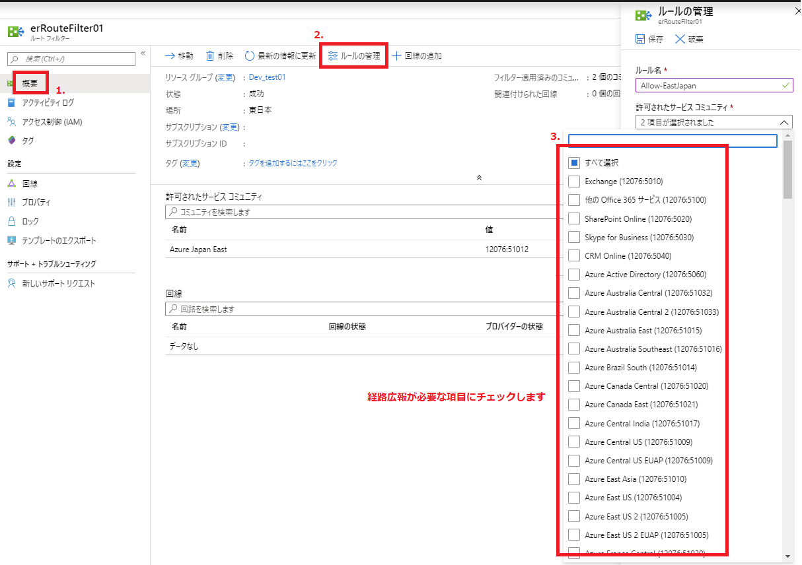

こんにちは、Azure サポートチームの山崎です。
今回は対象の通信が Microsoft ピアリングを経由するかどうかの確認方法についてご紹介します。

## Microsoft ピアリングで広報される経路について

ExpressRoute の Microsoft ピアリングをご利用の場合、ルートフィルターの設定でどのような経路を広報するかを設定します。

**(ルートフィルターの設定画面 - Azure ポータル)**
 

**(実行コマンド)**
各サービスコミュニティで広報される経路については以下の PowerShell コマンドからご確認いただけます。

~~~
Get-AzBgpServiceCommunity
~~~

**(出力例)**
~~~
Name           : Exchange
Id             : /subscriptions//resourceGroups//providers/Microsoft.Network/bgpServiceCommunities/Exchange
Type           : Microsoft.Network/bgpServiceCommunities
BgpCommunities : [
                   {
                     "ServiceSupportedRegion": "Global",
                     "CommunityName": "Exchange",
                     "CommunityValue": "12076:5010",
                     "CommunityPrefixes": [
                       "13.107.6.152/31",
                       "13.107.18.10/31",
                       "13.107.128.0/22",
                       "23.103.160.0/20",
                       "40.92.0.0/15",
                       "40.96.0.0/13",
                       "40.104.0.0/15",
                       "40.107.0.0/16",
                       "52.96.0.0/14",
                       "52.100.0.0/14",
                       "52.238.78.88/32",
                       "104.47.0.0/17",
                       "131.253.33.215/32",
                       "132.245.0.0/16",
                       "150.171.32.0/22",
                       "191.234.140.0/22",
                       "204.79.197.215/32",
                       "13.107.128.0/24",
                       "13.107.129.0/24",
                       "150.171.32.0/24",
                       "150.171.34.0/24",
                       "150.171.35.0/24",
                       "52.96.38.0/24"
                     ],
                     "IsAuthorizedToUse": false,
                     "ServiceGroup": "O365"
                   }
                 ]

Name           : OtherOffice365Services
Id             : /subscriptions//resourceGroups//providers/Microsoft.Network/bgpServiceCommunities/OtherOffice365Servic
                 es
Type           : Microsoft.Network/bgpServiceCommunities
BgpCommunities : [
                   {
                     "ServiceSupportedRegion": "Global",
                     "CommunityName": "Other Office 365 Services",
                     "CommunityValue": "12076:5100",
                     "CommunityPrefixes": [
                       "13.80.125.22/32",
                       "13.91.91.243/32",
                       "13.106.4.128/25",
                       (... 省略)
~~~

## 宛先が FQDN の場合

通信対象が IP の場合、上記の手順で IP をご確認いただくことで対象のサービスコミュニティが確認可能で、ルートフィルターの設定状況により Microsoft ピアリングを経由するかどうかを確認することが可能です。また、各サービス毎に以下のようなドキュメントでも ExpressRoute の対応状況について記載がされています。

  [Office 365 の URL と IP アドレスの範囲]
  [https://docs.microsoft.com/ja-jp/office365/enterprise/urls-and-ip-address-ranges](https://docs.microsoft.com/ja-jp/office365/enterprise/urls-and-ip-address-ranges)

  [Azure ExpressRoute と Azure Site Recovery]
  [https://docs.microsoft.com/ja-jp/azure/site-recovery/concepts-expressroute-with-site-recovery](https://docs.microsoft.com/ja-jp/azure/site-recovery/concepts-expressroute-with-site-recovery)

ドキュメントに記載がなく、対象が FQDN の場合には個別に調査が必要となります。Microsoft ピアリング観点としては IP を特定いただくことで経由、非経由が判断出来ますため、調査としては対象の FQDN に紐づく IP 情報についてご確認いただく必要がございます。

> 対象の FQDN に紐づく IP アドレスの調査については FQDN が利用されるサービス毎に調査が必要となりますので、ご利用サービス宛てにお問い合わせをお願いします。

対象の FQDN によっては IP が固定でわかる場合もあれば、情報公開されておらず不定の場合もあります。IP が明確に特定できないような場合には Internet 経由で通信できるようネットワークを構成いただければ幸いです。

以上、ご参考になれば幸いです。

