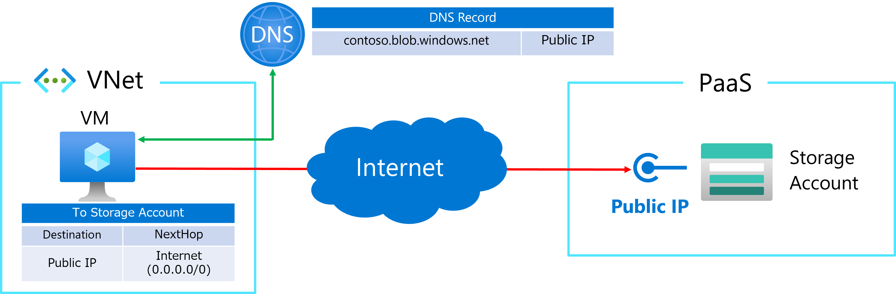
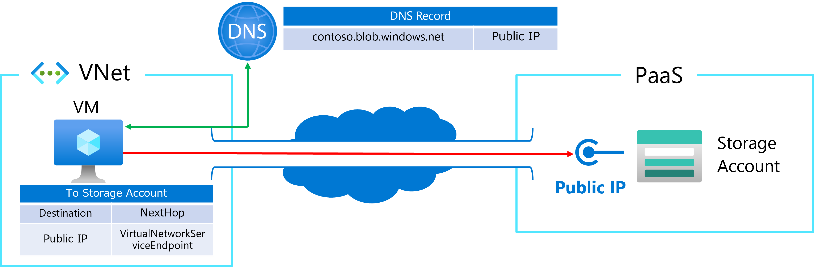
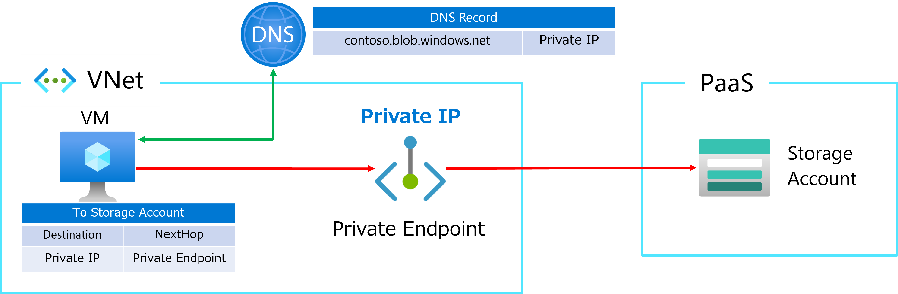

こんにちは、Azure テクニカル サポート チームの箕輪です。
今回はお問い合わせを多くいただくサービス エンドポイントとプライベート エンドポイントの違いについてご紹介します。

<!-- more -->

## 機能の違いについて
サービス エンドポイントとプライベートエンドポイントを端的に紹介すると、サービス エンドポイントは「Azure PaaS のパブリック IP アドレスに対する接続を最適化する」機能であり、プライベート エンドポイントは「プライベート IP アドレスで Azure PaaS に接続する」機能です。 
サービス エンドポイントとプライベート エンドポイントの機能差分については下記の通りです。 
 
|  | サービス エンドポイント (SE) | プライベート エンドポイント (PE) |
| :------------------: | :---------------------------- | :-------------------------------- | 
| 接続対象のリソース | Azure PaaS | Azure PaaS と PLS (*1)|
| 構成方法 | サブネット単位で有効化 | PE リソースの構成 |
| 利用可能な送信元リソース | SE を有効化したサブネット上のリソース | PE に IP 疎通性があるリソース |
| 接続先の IP アドレス | Azure PaaS のパブリック IP アドレス | PE のプライベート IP アドレス |
| 接続制限 | Azure PaaS の設定でサブネット単位の指定 (*2) | PE のサブネットの NSG で指定 (*3) |
| 接続元の IP アドレス(*4) | サブネット上のリソースのプライベート IP アドレス | PE に接続するリソースの IP アドレス |

※ 上記の表にあるサブネットは、Azure の仮想ネットワーク上のサブネットを指します。 

(*1)PLS は Private Link Service を指す。Azure 内部ロードバランサーに対して関連付けする機能。 
[Azure Private Link サービスとは](https://learn.microsoft.com/ja-jp/azure/private-link/private-link-service-overview) 
(*2)接続制限の設定については、接続先の Azure PaaS に依存する。 
(*3)PE が構成された VNet のサブネット上におけるネットワーク ポリシー設定が必要 
[プライベート エンドポイントのネットワーク ポリシーを管理する](https://learn.microsoft.com/ja-jp/azure/private-link/disable-private-endpoint-network-policy?tabs=network-policy-portal) 
(*4)接続先の Azure PaaS によって出力されるログの形態によって異なります。 

## 接続構成について
サービス エンドポイントとプライベート エンドポイントは、Azure PaaS に対する接続を提供する機能であり、どちらのエンドポイントを利用するかは接続元のリソース (クライアント) の動作に依存します。 
複数のシナリオにおける接続イメージについてご紹介します。 
なお、シナリオの例として、Storage Account の Azure Blob (contoso.database.windows.net) に対して接続する構成とします。 
 
<u>**シナリオ 1 : サービス エンドポイントとプライベート エンドポイントが構成されていない**</u> 
この構成では、仮想マシンから Blob に対して、インターネット経由で接続します。 
接続元のクライアントは、接続先の FQDN に対して名前解決の結果として Blob のパブリック IP アドレスが応答されます。 
接続元のクライアントは、Blob のパブリック IP アドレスに対して、Azure の既定の経路 (0.0.0.0/0) に従って、インターネット経由で接続します。 
 

 
※ 上記の図は便宜上インターネットに接続していますが、Azure の仮想マシンから Azure PaaS へ接続は Azure バックボーン ネットワークを経由して接続するため、パブリック インターネットを経由しません。 

[参考:マイクロソフトのグローバル ネットワーク](https://learn.microsoft.com/ja-jp/azure/networking/microsoft-global-network) 
(抜粋) 最適なパフォーマンスと整合性を保証するために、Microsoft Azure 内のデータセンター間、または Virtual Machines、Microsoft 365、Xbox、SQL DB、Storage、仮想ネットワークなどの Microsoft サービス間のあらゆるトラフィックはこのグローバル トラフィック内でルーティングされ、決してパブリック インターネットを経由しません。 
 
<u>**シナリオ 2 : サービス エンドポイントを有効化**</u> 
この構成では、仮想マシンから Blob に対して、サービス エンドポイントを介して接続します。 
接続元のクライアントは、接続先の FQDN に対して名前解決の結果として Blob のパブリック IP アドレスが応答されます。 
接続元のクライアントは、Blob のパブリック IP アドレスに対して、サービス エンドポイントで追加された内部経路情報 (VirtualNetworkServiceEndpoint) に従って、Azure 内部で最適化された経路で接続します。 
 

 
<u>**シナリオ 3 : プライベート エンドポイントを有効化**</u> 
この構成では、仮想マシンから Blob に対して、プライベート エンドポイントを介して接続します。 
接続元のクライアントは、接続先の FQDN に対して名前解決の結果として Blob 接続用のプライベート エンドポイントの IP アドレス (プライベート IP アドレス) が応答されます。 
接続元のクライアントは、プライベート エンドポイントの IP アドレスに対して Blob に接続します。 
なお、下記の図では便宜上、簡略していますが、プライベート DNS ゾーンを利用している構成を前提としています。 
 

## 使い分けについて
上記の通り、サービス エンドポイントとプライベート エンドポイントでは、接続元のクライアントからの接続先 IP アドレスが異なります。 
そのため、サービス エンドポイントとプライベート エンドポイントを同時に構成することは可能で、接続先 IP アドレスを DNS レイヤーで切り替えることで接続を切り替えます。 
サービス エンドポイントとプライベート エンドポイントの使い分けの一例としては、下記の点をご参考にしていただければ幸いです。 
 
サービス エンドポイントは対象の仮想ネットワークのサブネットに対してのみ適用可能な機能となるため、ExpressRoute や VPN で接続されたオンプレミスのリソースはサービス エンドポイントを利用できません。 
しかし、強制トンネリング構成において特定の Azure PaaS に対してのパブリック エンドポイントへのアクセスを構成できることや、Azure PaaS 側でサービス エンドポイントを有効化した仮想ネットワーク上のサブネットからの接続に制限できること、これらの機能が追加費用なくご利用いただくことが特徴として挙げられます。 
プライベートエンドポイントでは、プライベート エンドポイントのプライベート IP アドレスに接続性があれば利用可能なため、ExpressRoute や VPN で接続されたオンプレミスのリソースから Azure PaaS に接続するシナリオでご利用いただくことが可能です。 
しかし、サービス エンドポイントとは異なり、プライベート エンドポイントは費用が発生する点にはご留意ください。 
 
Azure Private Link の価格 
[https://azure.microsoft.com/ja-jp/pricing/details/private-link/](https://azure.microsoft.com/ja-jp/pricing/details/private-link/)

## 公開情報について
サービス エンドポイントとプライベート エンドポイントの概要や、構成の手順などについては下記の公開情報に記載がございますので併せてご確認ください。 

仮想ネットワーク サービス エンドポイント 
[https://learn.microsoft.com/ja-jp/azure/virtual-network/virtual-network-service-endpoints-overview](https://learn.microsoft.com/ja-jp/azure/virtual-network/virtual-network-service-endpoints-overview)
 
Azure Private Link とは 
[https://learn.microsoft.com/ja-jp/azure/private-link/private-link-overview?toc=%2Fazure%2Fvirtual-network%2Ftoc.json](https://learn.microsoft.com/ja-jp/azure/private-link/private-link-overview?toc=%2Fazure%2Fvirtual-network%2Ftoc.json)
 
クイックスタート: Azure portal を使用してプライベート エンドポイントを作成する 
[https://learn.microsoft.com/ja-jp/azure/private-link/create-private-endpoint-portal?tabs=dynamic-ip](https://learn.microsoft.com/ja-jp/azure/private-link/create-private-endpoint-portal?tabs=dynamic-ip)

## よくいただくご質問 
**・プライベート エンドポイントに対してプライベート IP アドレスでアクセスしても接続できません** 
Azure PaaS はホスト名を用いて通信を識別しています。プライベート エンドポイントは Azure PaaS への接続経路を提供する機能のみであり、実際のリクエストにはホスト名を含めた FQDN が必要です。 
 
**・サービス エンドポイントとプライベート エンドポイントのどちらを選択しているかわかりません** 
Azure の機能では明確に確認することはできませんが、接続元のクライアント上で、対象の FQDN に対する名前解決を実行し、パブリック IP アドレスが応答されればサービス エンドポイント、プライベート IP アドレスが応答されればプライベート エンドポイント経由で接続していると判断できます。 
 
**・Azure PaaS から仮想ネットワークへの接続にサービス エンドポイントやプライベート エンドポイントは使えますか** 
いいえ、ご利用いただけません。サービス エンドポイントとプライベート エンドポイントは、仮想ネットワークから Azure PaaS への接続時に利用可能なサービスです。Azure PaaS から仮想ネットワークの接続については、各サービスによって機能の有無がありますが、VNet 統合等の機能で利用できます。 

以上、ご参考になれば幸いです。

---
