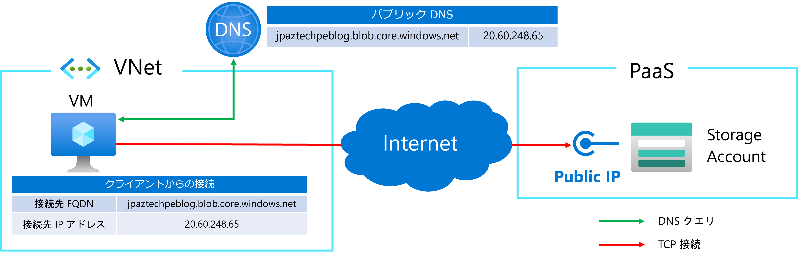
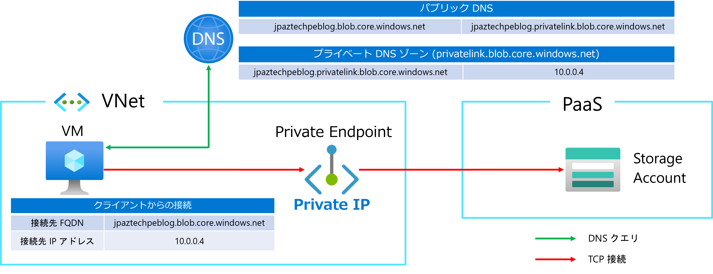

こんにちは、Azure テクニカル サポート チームの箕輪です。Azure のプライベート エンドポイントは Azure PaaS へのプライベート接続を実現できることから、多くのお客様にご利用いただいています。
Azure サポート担当でプライベート エンドポイントに関してお問い合わせいただく中で、プライベート エンドポイントをご利用いただく上でのポイントや、よくあるお問い合わせや情報採取についての内容を 2 回に分けてご紹介します。

1. プライベート エンドポイントをご利用いただく上でのポイント  (今回のご紹介)
2. [プライベート エンドポイントのよくあるお問い合わせ](/articles/network/pe-troubleshooting.md)

<!-- more -->

## 概要

プライベート エンドポイントは主に Azure PaaS に対して、仮想ネットワーク上のアドレス空間のプライベート IP アドレスを用いて接続を提供するサービスです。
プライベート エンドポイントをご利用いただけば、Azure PaaS に対して、ExpressRoute や VPN で接続されたオンプレミスからもインターネット経由ではなく仮想ネットワーク経由で接続が可能です。
またこのブログでは紹介しませんが、Azure Load Balancer に対して適用できる [Private Link Service](https://learn.microsoft.com/ja-jp/azure/private-link/private-link-service-overview) をご利用いただけば、アドレス空間が重複した仮想ネットワーク間でも接続が可能です。
類似機能のプライベート エンドポイントとサービス エンドポイントの違いについては、[別のブログ](/articles/network/pe-difference-se.md) で紹介していますのでご参照いただければと思います。

## 基本動作

Azure PaaS は基本的にパブリック インターネットからの接続を前提としています。また、ほとんどの Azure PaaS がマルチテナント構成となり、ご利用時に接続する際は、対象の Azure PaaS に該当する FQDN で接続します。
プライベート エンドポイントは仮想ネットワーク上にエンドポイントを構成することで、Azure PaaS にプライベート IP アドレスで接続する機能を提供していますが、クライアントが接続する際の FQDN は変わりません。
プライベート エンドポイントは、あくまで Azure PaaS への接続点を仮想ネットワーク上に構成するものであり、Azure PaaS へのプライベート接続は DNS レイヤーのルーティングで実現しています。
この時、DNS レイヤーのルーティングを privatelink サブドメインが付与された FQDN を用いて実施します。
つまり、プライベート エンドポイントをご利用いただく上で、DNS レイヤーの構成が大変重要な要素になります。

## DNS レコードの遷移

Azure PaaS のプライベート エンドポイントを有効化することで、具体的にどのような変化が発生するのかをご紹介します。
ここでは東日本リージョンの Azure Blob Storage の FQDN (jpaztechpeblog.blob.core.windows.net) の DNS レコードの遷移をご紹介します。
なお説明の便宜上、dig コマンドで応答された ANSWER SECTION の表示を基にご紹介します。

まず、プライベート エンドポイントが有効化されていない Azure Blob Storage の FQDN を名前解決した時、下記のような DNS レコードが応答されます。下記の応答結果から、Azure Blob Storage に接続時の FQDN が、Azure Blob Storage のエンドポイントに CNAME レコードで変換され、その後 A レコードでパブリック IP アドレスが応答されることが確認できます。

>jpaztechpeblog.blob.core.windows.net. 60 IN CNAME blob.tyo20prdstr07a.store.core.windows.net.
>blob.tyo20prdstr07a.store.core.windows.net. 60 IN A 20.60.248.65

次に、Azure Blob Storage に対して、プライベート エンドポイントを有効化した時の DNS レコードの応答を確認します。
下記の応答結果から、プライベート エンドポイントが有効化された後に、**privatelink サブドメイン**が付与された FQDN が追加されたことが確認できます。

>jpaztechpeblog.blob.core.windows.net. 60 IN CNAME jpaztechpeblog.**privatelink**.blob.core.windows.net.
>jpaztechpeblog.**privatelink**.blob.core.windows.net. 60 IN CNAME blob.tyo20prdstr07a.store.core.windows.net.
>blob.tyo20prdstr07a.store.core.windows.net. 60 IN A 20.60.248.65

上記の DNS レコードの遷移や応答結果は、ご利用いただくリージョンや各 Azure PaaS によっては細部が異なりますが、基本的には上記の例が大多数となっています。
各 Azure PaaS の FQDN がどのように遷移するかは[プライベート エンドポイントの公開情報](https://learn.microsoft.com/ja-jp/azure/private-link/private-endpoint-dns) でご紹介しています。
なお、Azure PaaS によってはすべてのユーザーに同一の FQDN でエンドポイントを提供している下記のようなサービスもあり、この場合既定で privatelink サブドメインが付与されています。

・Azure Virtual Desktop : rdweb.wvd.microsoft.com / <foo>www</foo>.wvd.microsoft.com / client.wvd.microsoft.com  
・Azure Synapse : web.azuresynapse.net  
・Azure Data Factory : adf.azure.com  

## DNS ルーティング

Azure PaaS への接続をパブリック エンドポイントからプライベート エンドポイントに切り替えるには、DNS レイヤーの構成が重要になります。
この DNS レイヤーのルーティングについてご紹介します。
ここでは Azure の仮想ネットワーク上に仮想マシンをデプロイし、Azure Blob Storage に接続するシナリオを例に挙げて、DNS ルーティングについて説明します。

通常の Azure Blob Storage に接続する場合、下記の構成図のように接続時の FQDN に対してパブリック IP アドレスが応答され、クライアントは該当のパブリック IP アドレスに接続を試行します。

プライベート エンドポイントを有効化した際に、既定の設定では対象の Azure PaaS に対応するプライベート DNS ゾーンが構成されます。プライベート DNS ゾーンは仮想ネットワークとリンクすることで、Azure 既定の DNS (168.63.129.16) を参照しているクライアントに、構成したゾーンの DNS レコードを応答するサービスです。
Azure Blob Storage の場合、privatelink.blob.core.windows.net が該当ゾーンとしてデプロイされ、対象のホスト名に対して設定された A レコードが応答されます。これにより、仮想マシンはプライベート エンドポイントに対して Azure Blob Storage の FQDN の接続を試行します。
このように、プライベート DNS ゾーンを用いて privatelink サブドメインの DNS レコードをオーバーライドすることで、DNS ルーティングを実現します。

なお、プライベート エンドポイントの利用にあたり、プライベート DNS ゾーンの利用は必須ではありません。DNS レコードのオーバーライドができれば hosts ファイル、カスタム DNS、オンプレミスの DNS などでも DNS ルーティングが実現可能です。
例えば、仮想マシンの OS 上の hosts ファイルで、接続先の FQDN に対して、プライベート エンドポイントの IP アドレスを指定することでも構成可能です。

以上がプライベート エンドポイントの仕組みとなります。実際にご利用いただく中で、よくお問い合わせいただく内容や情報採取については、[こちら](/articles/network/pe-troubleshooting.md) をご覧ください。　

以上、ご参考になれば幸いです。
