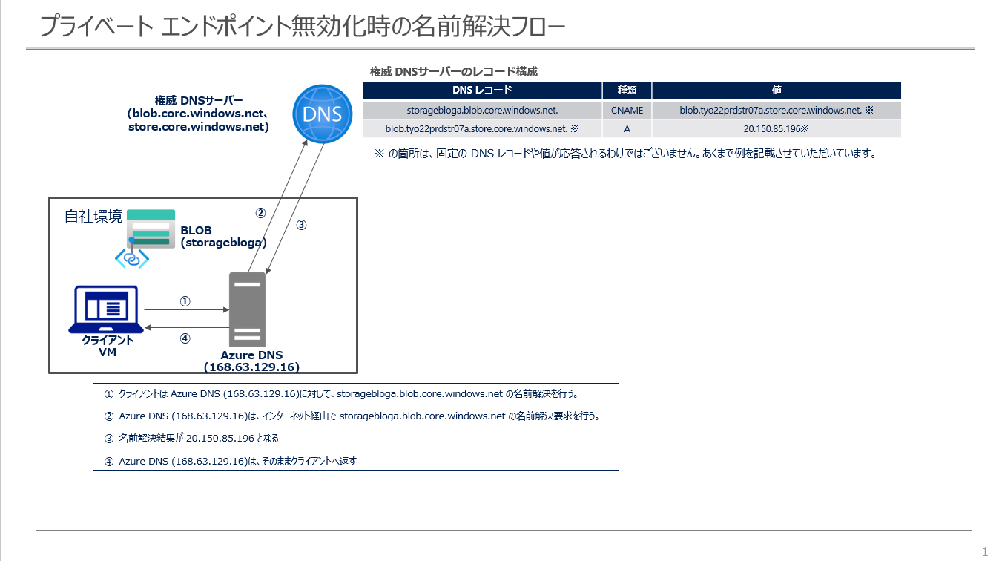
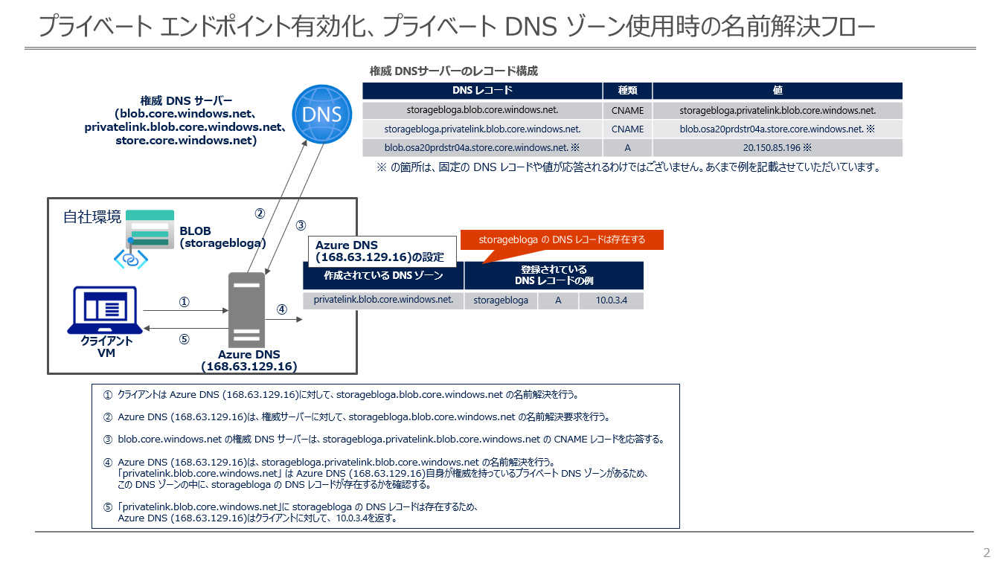
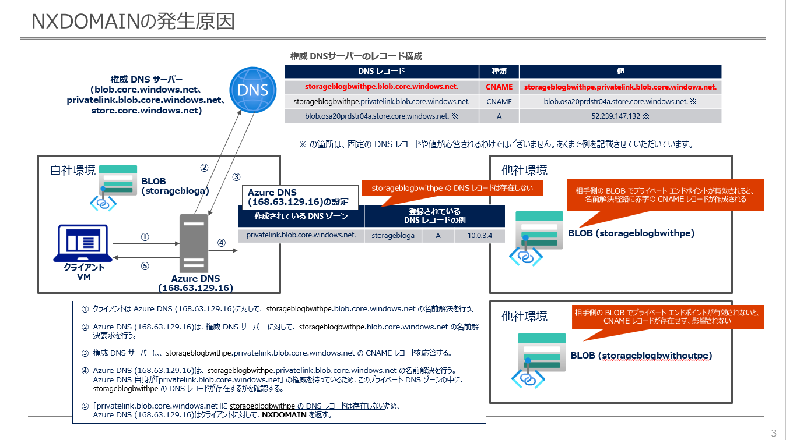
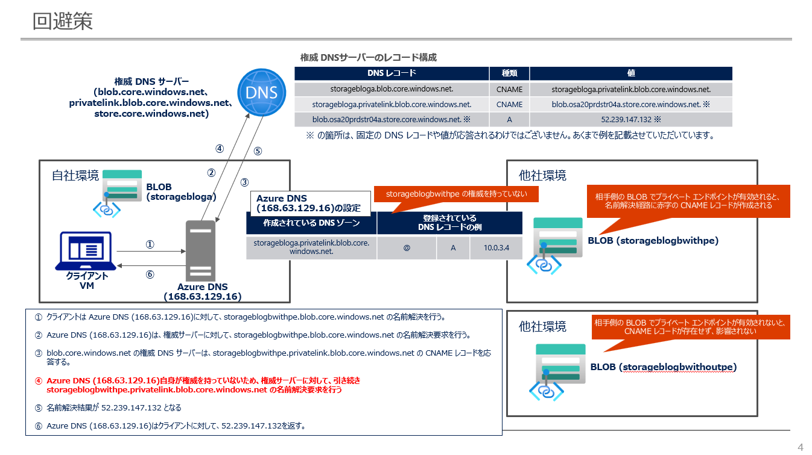

こんにちは、Azure テクニカル サポート チームの杜です。

Azure DNS では、仮想ネットワーク内の名前解決結果を上書きできる[プライベート DNS ゾーン](https://learn.microsoft.com/ja-jp/azure/dns/private-dns-privatednszone)というサービスをご提供しており、
[プライベート エンドポイント](https://learn.microsoft.com/ja-jp/azure/private-link/private-endpoint-overview)の名前解決などと併用する場合が多いです。

このブログでは、プライベート DNS ゾーンのベスト プラクティス、及びよく頂いているお問い合わせをご紹介させて頂きます。

> [!NOTE] プライベート DNS ゾーンのプレビュー機能として、privatelink のプライベート DNS ゾーンを対象に、自ゾーンに存在しない DNS レコードを [パブリック DNS にフォールバックする機能 (resolution policy)](https://learn.microsoft.com/ja-jp/azure/dns/private-dns-fallback) が実装されたため、本ブログの「回避策」に追記しました。

<!-- more -->

---

# ベスト プラクティス
### シナリオ
- 仮想ネットワーク上のリソース (VM) がプライベート エンドポイント経由でストレージ アカウントに接続する
- 仮想ネットワークでは Azure 既定の DNS (168.63.129.16) を DNS サーバーとして指定している
- プライベート エンドポイント経由でストレージ アカウント`storagebloga`へアクセスするために、プライベート DNS ゾーン `privatelink.blob.core.windows.net` をクライアント VM の仮想ネットワークにリンクした
- プライベート DNS ゾーン `privatelink.blob.core.windows.net` に `storagebloga IN A ＜プライベート エンドポイント IP＞` のレコードを登録し、プライベート エンドポイントの名前解決が成功している
- ただし、それ以外の一部ストレージ アカウントの名前解決を行ったところ、空の結果 (NXDOMAIN) が返されてしまい、接続も失敗している
- すべてストレージ アカウントの名前解決が失敗するわけではなく、問題なく接続できる場合もある
- ストレージ アカウントの他に、AppService や Azure SQL Database など他の Azure PaaS サービスにも類似の事象がある

### 原因分析
発生原因を理解するために、まず全体的な名前解決フローを説明させて頂きます。

ストレージ アカウントなどの Azure PaaS サービスでは、プライベート エンドポイントの有効化状況により、名前解決フローが異なります。
プライベート エンドポイントが無効化されているリソースでは、名前解決フローが以下となります。`privatelink.blob.core.windows.net` のドメインを経由しません。

```
※プライベート エンドポイント無効化時の名前解決フロー

;; QUESTION SECTION:
;storagebloga.blob.core.windows.net. IN A

;; ANSWER SECTION:
storagebloga.blob.core.windows.net. 20 IN CNAME blob.tyo22prdstr07a.store.core.windows.net.
blob.tyo22prdstr07a.store.core.windows.net. 60 IN A 20.150.85.196
```
プライベート エンドポイントを有効化すると、`storagebloga.blob.core.windows.net` の CNAME 先が `privatelink.blob.core.windows.net` ドメインに変更される動作となります。
クライアントが存在する仮想ネットワークがプライベート DNS ゾーンにリンクしていない場合、名前解決結果は変わりません。
```
※プライベート エンドポイント有効化時の名前解決フロー (プライベート DNS ゾーンのリンクなし)

;; QUESTION SECTION:
;storagebloga.blob.core.windows.net. IN A

;; ANSWER SECTION:
storagebloga.blob.core.windows.net. 60 IN CNAME storagebloga.privatelink.blob.core.windows.net.
storagebloga.privatelink.blob.core.windows.net. 60 IN CNAME blob.tyo22prdstr07a.store.core.windows.net.
blob.tyo22prdstr07a.store.core.windows.net. 17 IN A 20.150.85.196
```

プライベート エンドポイントへ接続させるには、お客様側にプライベート DNS ゾーン `privatelink.blob.core.windows.net` に A レコードを作成し、仮想ネットワークにリンクすることで、該当 CNAME 先を上書きして意図した名前解決が実現できています。

```
※プライベート エンドポイント有効化、プライベート DNS ゾーン使用時の名前解決フロー
※10.0.3.4 がプライベート エンドポイントの IP アドレスとなります。

;; QUESTION SECTION:
;storagebloga.blob.core.windows.net. IN A

;; ANSWER SECTION:
storagebloga.blob.core.windows.net. 60 IN CNAME storagebloga.privatelink.blob.core.windows.net.
storagebloga.privatelink.blob.core.windows.net. 60 IN A 10.0.3.4
```

プライベート DNS ゾーンをリンクすると、Azure DNS が該当 DNS ゾーン `privatelink.blob.core.windows.net` の権威サーバーとなります。
そのドメインへの名前解決要求を受信した時に、インターネット経由で再帰的問い合わせを行わずに、プライベート DNS ゾーンに登録されているレコードを権威結果として応答するようになります。
その場合、プライベート DNS ゾーンに `storagebloga` 以外のレコードが登録されていないため、以下のように、NXDOMAIN が応答されてしまいます。

```
※プライベート エンドポイント有効化、プライベート DNS ゾーン使用時に、別のリソース（プライベート エンドポイント有効化）の名前解決フロー

;; QUESTION SECTION:
;storageblogbwithpe.blob.core.windows.net. IN	A

;; ANSWER SECTION:
storageblogbwithpe.blob.core.windows.net. 60 IN CNAME	storageblogbwithpe.privatelink.blob.core.windows.net.
```

また、各ストレージ アカウントの構成次第で、プライベート エンドポイントが有効化されていない場合があります。
その場合の名前解決フローでは `privatelink.blob.core.windows.net` のドメインが存在しないため、プライベート DNS ゾーン `privatelink.blob.core.windows.net` をリンクしても影響がありません。
```
※プライベート エンドポイント有効化、プライベート DNS ゾーン使用時に、別のリソース（プライベート エンドポイント無効化）の名前解決フロー

;; QUESTION SECTION:
;storageblogcwithoutpe.blob.core.windows.net. IN A

;; ANSWER SECTION:
storageblogcwithoutpe.blob.core.windows.net. 20 IN CNAME blob.tyo22prdstr07a.store.core.windows.net.
blob.tyo22prdstr07a.store.core.windows.net. 60 IN A 20.150.85.196
```

### 回避策
> [!NOTE] プライベート DNS ゾーンのプレビュー機能として、privatelink のプライベート DNS ゾーンを対象に、自ゾーンに存在しない DNS レコードを [パブリック DNS にフォールバックする機能 (resolution policy)](https://learn.microsoft.com/ja-jp/azure/dns/private-dns-fallback) が実装されたことで、回避策が追加されました。

#### 回避策 1
プレビュー提供中の[パブリック DNS にフォールバックする機能 (resolution policy)](https://learn.microsoft.com/ja-jp/azure/dns/private-dns-fallback)を有効化することで、上述したシナリオを回避します。
プライベート DNS ゾーンのパブリック DNS にフォールバックする機能は、プライベート エンドポイントを対象とした priavatelink サブドメインを対象に動作します。
この機能は、プライベート DNS ゾーンを仮想ネットワークとリンクする時に選択が可能です。また、既存の privatelink サブドメインのプライベート DNS ゾーンにおいても、リンク設定を変更することで有効化可能です。

この機能の動作としては、プライベート DNS ゾーンが自ゾーンに存在しないレコードを確認した際に NXDOMAIN を応答しますが、この機能が有効化されていると、Azure の DNS はパブリック DNS に DNS クエリを再試行します。この動作により上述したシナリオが回避できます。


#### 回避策 2
特定のストレージ アカウントの名前解決のみをプライベート DNS ゾーンで実現し、それ以外の名前解決への影響を回避したい場合は、`privatelink.blob.core.windows.net` ではなく、
`storagebloga.privatelink.blob.core.windows.net` のプライベート DNS ゾーンを作成し、頂点（APEX）レコード `@ IN A ＜プライベート エンドポイント IP＞` を構成すれば実現できます。
そうしますと、Azure DNS の権威ドメインが `storagebloga.privatelink.blob.core.windows.net` のみとなり、それ以外 `storageblogcwithpe.privatelink.blob.core.windows.net` の名前解決要求を受けると、
インターネット経由で再帰的問い合わせを行い、プライベート DNS ゾーンに影響されなくなります。


この回避策 2 を選択した場合、対象となる複数のストレージ アカウントが存在する場合は、ストレージ アカウントの名前ごとにプライベート DNS ゾーンを用意する必要がありますので、ご注意ください。

# FAQ
## プライベート DNS ゾーンのレコードを変更する時に、リンク先の仮想ネットワークの名前解決が影響されるのでしょうか。
変更対象以外のレコードには影響がなく、該当プライベート DNS ゾーンで一時的に名前解決ができなくなるといった事象は発生しませんので、ご安心ください。

## 東日本リージョンに本番環境を構築しており、プライベート DNS ゾーンをリンクし、仮想ネットワークに仮想マシンなどを運用しています。リージョン レベルの冗長化を取るために、西日本リージョンに同じ構成を取りたいですが、プライベート DNS ゾーンもリージョンごとに作成する必要がありますでしょうか。
プライベート DNS ゾーンを含め、Azure DNS は 100% の [SLA](https://azure.microsoft.com/ja-jp/updates/azuredns100sla/) でご提供しているため、冗長化の観点ではリージョンごとに作成する必要はありません。

ただし、もし各リージョンの IP アドレス構成が異なり、同じ FQDN に対し、リージョンごとに名前解決結果を分けたい場合は、１つのプライベート DNS ゾーンでは実現できませんので、各リージョンごとにリソース グループを作成し、複数のプライベート DNS ゾーンの構成をご検討ください。

****
