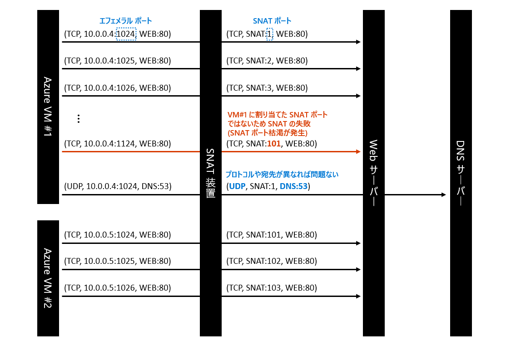
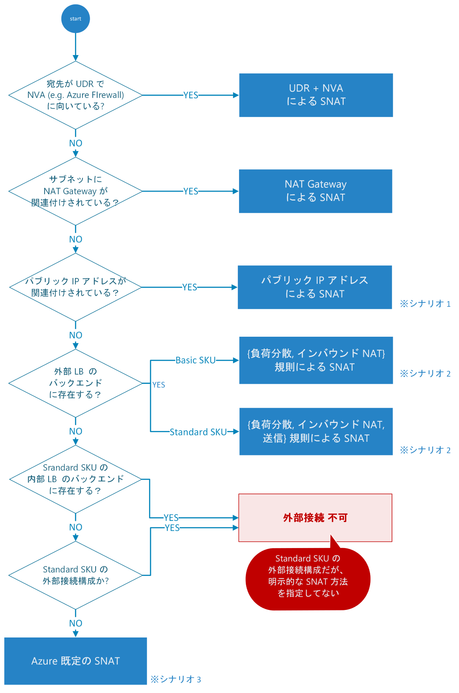
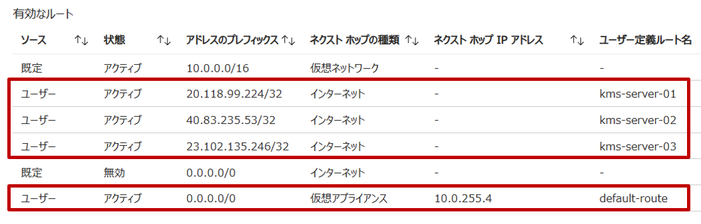
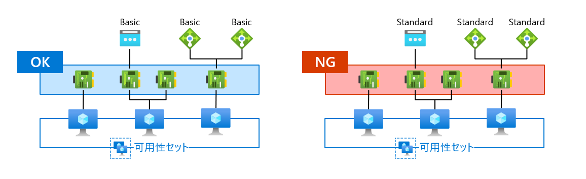
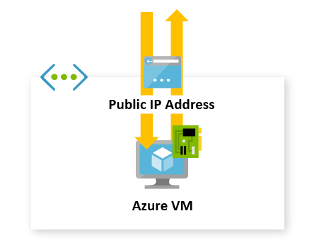

Azure Networking テクニカル サポート チームの山口です。

Azure では、インターネット宛てのアウトバウンド方向の接続 (送信接続) をいくつかの方法で実装できます。選択の幅があることは喜ばしいですが、一方で内容の把握のが難しい側面も否めません。そこで本記事では、Azure VM に使える送信接続の構成をまとめて説明します。また、ある Azure VM がどの構成に該当しているか判定するためのフローチャートや、各構成の特徴についても併せて紹介します。

> [!NOTE]
> 2023 年 9 月、送信接続の構成の一つである[既定の送信アクセス](https://learn.microsoft.com/ja-jp/azure/virtual-network/ip-services/default-outbound-access)の提供終了がアナウンスされました。
>
> これは、2025 年 9 月 30 日以降に作成された Azure VM は、後述の Azure 既定の SNAT が廃止され、明示的な外部接続ポリシーを設定しない限り、Azure 仮想ネットワークからの外部送信が行えなくなるという内容です。廃止アナウンスに関する補足については、当ブログサイトの以下の記事をご参照の上、技術的な内容については併せて本記事をご確認いただけますと幸いでございます。
>
> [Azure 既定の送信アクセスの動作変更のアナウンスに関する補足 (Tracking ID:3T84-PZZ)](https://jpaztech.github.io/blog/network/default-outbound-access-for-vms-will-be-retired/)
<!-- more -->

## はじめに

Azure VM をはじめとする仮想ネットワーク (VNet) のコンピューティング リソースは、必要に応じてインターネット上のサーバーにアクセスします。たとえば、Web ブラウザが TLS/SSL 証明書の失効を検証する場合や、外部の権威 DNS サーバーに再帰問い合わせを実施する場合などです。この接続は、Azure から外部に出ていくように見えることから、アウトバウンド方向の接続あるいは **送信接続** と呼ばれます。

インターネット上のホストと通信するために、パケットの送信元と宛先 IP アドレスは共にパブリック IP アドレス (グローバル IP アドレス) である必要があります。特に、送信接続の文脈では、宛先はパブリック IP アドレスであることが確定しているため、送信元のパブリック IP アドレスをいかにして確保するかが重要となります。

一般に、これを実現する方法は大きく２つあります。

1. 送信元のホスト (オペレーティング システムのネットワーク インターフェイス) に、パブリック IP アドレスを割り当てます。これで送信元ホストはグローバル アドレス帯のセグメントに参加している状態となり、インターネットを介して宛先ホストとエンド・ツー・エンドな通信が行えます。
2. 送信元のホストには、プライベート IP アドレスのみを割り当てます。その代わり、送信元ホストの外部にあるネットワーク装置で、送信元 IP アドレスをパブリック IP アドレスに変換します。

このうち、Azure でサポートされているのは 2 番目の方法です。これは、ネットワークのアドレス変換 (Network Address Translation; NAT) と呼ばれる技術を使っています。特に送信元を変換するので送信元 NAT (Source NAT; SNAT) と呼ばれることもあります。Azure では、仮想化基盤に実装された仮想的なルーター (各サブネットの最初のユーザブル アドレスでホストされるデフォルトゲートウェイ) が、Azure VM のパケットに対して SNAT を実施します。このようなルーターを NAT 装置と呼びます。

SNAT の実現方法は、さらに 2 つの方式に細分化できます。

- **Basic NAT**: 2 つの IP アドレスを 1 対 1 の関係で変換する NAT です。狭義の NAT と呼ばれることもあります。NAT 装置上では、単純にアドレスの対応付けを覚えておくだけで良いので、それ以上のステート管理が不要です。
- **NAPT (Network Address Port Translation)**: プロトコルやポート番号の情報を利用することで、アドレスを 1 対多の関係で変換できる NAT です。たとえば、複数のクライアントに同じパブリック IP アドレスでの SNAT を提供できます。NAT 装置は、5 タプル (プロトコル、送信元アドレス、送信元ポート番号、宛先アドレス、宛先ポート番号) でフローを一意に識別し、フローごとのアドレスの対応付けを NAT テーブルと呼ばれるデータベースに記録します。

特に、後者の NAPT による SNAT では**SNAT ポート枯渇**に留意する必要があります。

NAPT を使用して複数のクライアントに共通の SNAT アドレスを割り当てると、当然 SNAT 後の送信元アドレスは同じものになります。さらに、通信先のエンドポイント (プロトコル、宛先アドレス、宛先ポート番号) が同じである場合は、フローを識別できる情報は 5 タプルのうち送信元ポート番号 (SNAT ポート) だけです。したがって、同一エンドポイント宛ての接続が発生するたびに SNAT ポートを割り当てる (消費する) 必要があり、ポート番号を使い切るとそれ以降の送信接続が失敗します。

SNAT ポートがどのように消費されるかを示すため、次のようなシナリオを考えます。SNAT 装置が、あるパブリック IP アドレス (`SNAT`) を使って、プライベート IP アドレスだけが割り当てられた Azure VM #1 (`10.0.0.4`) と #2 (`10.0.0.5`) に対して NAPT による SNAT を提供します。VM 間で SNAT ポートの奪い合いが発生しないよう、各 VM に 100 個ずつ SNAT ポートを事前に割り当てることにします。

ここで、VM から Web サーバー (`WEB`) に対する大量の HTTP アクセスを発生させました。この通信は、[プロトコル、宛先 IP アドレス、宛先ポート] がすべて同一 (`TCP, WEB:80`) であることに留意してください。コネクションを識別しなければならない SNAT 装置は、SNAT ポートをコネクションごとに消費していきながら SNAT を行います。

そして、VM #1 からの 101 個目の接続を受け付けた時、使える SNAT ポートが存在しないことに気が付きます。なぜなら、VM #1 には 100 個の SNAT ポートのみを割り当てたからです。これが SNAT ポートが枯渇した状態です。一度消費した SNAT ポートを再利用するには、既存のコネクションを VM か WEB サーバーが FIN/RST で終了するか、SNAT 装置上のアイドルタイムアウトで強制切断するのを待つ必要があります。

ただし、SNAT ポート枯渇が発生したからと言って、他のプロトコルや宛先の通信に影響がでるわけではありません。あくまで SNAT ポートはコネクションを識別するための一要素にすぎず、5 タプルの他の値で識別できれば SNAT ポートが重複しても問題ないためです。たとえば、この状況でも VM #1 から DNS サーバー (`DNS:53`) に対する UDP の接続要求は成功します。

SNAT ポート枯渇は、同じエンドポイントへのアクセスを繰り返すワークロードで発生する可能性が高まります。たとえば次のようなシナリオです。

- 外部の DNS サーバーへの問い合わせ
- インターネット上のプロキシ サーバーの利用
- コネクションプーリングを使わないデータベース アクセス
- ファイル共有 サーバーとの連携

枯渇を防止するためには、SNAT ポート数の十分な確保だけでなく、アプリケーションでコネクションを再利用したり不要なコネクションをこまめに切断することが効果的です。

## 構成パターンの一覧

それでは、具体的にどのような構成を取れば、送信接続 (SNAT) が可能になるのでしょうか。2023 年 9 月現在、Azure VM の送信接続に使える構成パターンは次の通りです。

- サブネットに NAT ゲートウェイを関連付ける
- NIC にパブリック IP アドレスを関連付ける
- パブリック ロードバランサーで送信規則を定義する
- パブリック ロードバランサーで自動アウトバウンド NAT が有効な負荷分散規則を定義する
- 既定の送信アクセスを利用する ※ 2025 年 9 月で廃止、非推奨

## 判定フローチャート

ここでは、ある Azure VM がどの構成パターンで送信接続を実現しているか判定するためのフローチャートを示します。

より厳密に言えば、これは NIC に対しての判定チャートです。なぜなら、同一 Azure VM にアタッチされた NIC であっても、NIC ごとに異なる送信接続を構成できるためです。たとえば、異なる二つのサブネットに足を出す Azure VM に対し、片方のサブネットでは NAT ゲートウェイを使った送信接続を、もう一方のサブネットでは Azure Firewall を使った送信接続を構成することが可能です。

また、構成間の優先度も考慮して作成されています。たとえば、ある NIC に対して NAT ゲートウェイとインスタンス レベルのパブリック IP アドレスが両方構成された場合、NAT ゲートウェイによる SNAT で送信接続が行われます。当該のフローチャートを使うと、このような依存関係を判断できます。

### 各ステップの詳細

#### ルートのネクストホップがインターネット？

本ステップは、トラフィックが SNAT の対象であるか判定します。

Azure では、パブリック IP アドレスに宛てた通信が必ずしもパブリック IP アドレスで SNAT されるとは限りません。ルートテーブル上でインターネットにルーティングされる通信だけが、SNAT の対象です (SNAT の対象であることと SNAT に成功することは別である点に注意してください。フローチャートの接続不可に相当する構成であれば SNAT に失敗します)。一方で、SNAT の対象にならないパブリック IP アドレス宛てのトラフィックは、次のような状況で発生します。

- VNet のアドレス範囲にパブリック IP アドレスを使用している場合
- 強制トンネリング (オンプレミス拠点にインターネット トラフィックを引き込むネットワーク構成) を採用している場合
- Azure Firewall などのネットワーク仮想アプライアンスをインターネット ゲートウェイとして利用している場合
- サービス エンドポイントを利用している場合

こうしたシナリオの判断は、Azure VM に設定された[有効なルート](https://learn.microsoft.com/ja-jp/azure/virtual-network/diagnose-network-routing-problem#diagnose-using-azure-portal)で確認できます。具体的には、ルートのネクストホップが [インターネット] となっている場合は  SNAT の対象で、そうでない場合は対象外です。

初期状態では、デフォルトルート (0.0.0.0/0) のネクストホップが [インターネット] に向けられているため、仮想ネットワークやオンプレミス拠点のアドレス範囲以外に宛てられたトラフィック、つまりほとんどのトラフィックが SNAT の対象です。当該ステップの判定では、この既定のデフォルトルートを無効化あるいは上書きするようなルートが定義されていないかを重点的に確認していただくのが良いでしょう。

たとえば、次のような状況について考えてみます。

- 既定のデフォルトルートが無効となり、代わりにネクストホップが [仮想アプライアンス] のユーザー定義ルートが設定されています。したがって、Azure VM では SNAT を試みず、仮想アプライアンス側でインターネット トラフィックを処理 (フィルタリングや SNAT) する構成だと判断できます。
- ただし、[KMS サーバーをホストする 3 つのアドレス](https://jpaztech.github.io/blog/vm/azure-kms-update/) のネクストホップが [インターネット] に設定されています。これらのエンドポイントに関しては、仮想アプライアンスを使わず Azure VM 側で SNAT することが意図されているようです。

したがって、この例での当該ステップへの回答は次の通りです。

- KMS サーバー宛てのトラフィック: はい (SNAT の対象)
- それ以外のインターネット宛てのトラフィック: いいえ (SNAT の対象外)

#### NAT ゲートウェイがサブネットに関連付けられている？

本ステップでは、NAT ゲートウェイによる SNAT 構成であるか判定します。これは、NIC がデプロイされているサブネットのプロパティで確認できます。以下に、Azure Portal での確認方法の例を示します。

1. 対象の Azure VM の [ネットワーク] メニューで、 NIC がデプロイされている仮想ネットワーク/サブネットを確認する
2. 対象の仮想ネットワークの [サブネット] メニューから、対象サブネットを開く
3. [NAT ゲートウェイ] の項目に NAT ゲートウェイの名前が存在すれば、本ステップの回答は「はい」です

#### パブリック IP が NIC に関連付けられている？

本ステップでは、NIC に関連付けたパブリック IP アドレス (インスタンス レベルのパブリック IP アドレス) による SNAT 構成であるか判定します。NIC プロパティを見て、プライマリ IP 構成にパブリック IP アドレスが紐づけられているか確認してください。

Azure Portal で確認する場合は。[パブリック IP アドレスの関連付けの手順](https://learn.microsoft.com/ja-jp/azure/virtual-network/ip-services/associate-public-ip-address-vm?tabs=azure-portal)を参考に、次のような手順で実行します。

1. 対象の NIC の [IP 構成] メニューで、プライマリの IP 構成を確認する
2. パブリック IP アドレスの欄にアドレスが表示されていれば、本ステップの回答は「はい」です

#### 送信規則を定義している？

本ステップでは、送信規則を使った SNAT 構成であるか判定します。送信規則は Standard SKU のパブリック ロードバランサーでのみ利用できる機能で、送信接続を定義したバックエンド プールの VM に対して SNAT を提供します。Azure Portal での確認方法の例は次の通りです。

1. 対象の Azure VM の [ネットワーク] メニューで、対象の NIC を確認します
2. [負荷分散] タブを開き、所属しているロードバランサーとバックエンド プールの一覧を確認します。
3. 種別がパブリックで SKU が Standard であるロードバランサーのみを抽出します。
4. 対象のロードバランサーの [送信規則] メニューを開き、対象のバックエンド プールに関連付けられた送信規則がある場合、本ステップの回答は「はい」です

#### 自動アウトバウンド NAT が有効な負荷分散規則を定義している？

本ステップでは、アウトバウンド NAT の自動プログラミングが有効な負荷分散規則による SNAT 構成であるか判定します。

パブリック ロードバランサーでは、負荷分散規則を定義すると同時に送信接続を有効化できます。この暗黙的な SNAT は、自動アウトバウンド NAT などと呼ばれます。Azure Portal での確認方法の例は次の通りです。

1. 対象の Azure VM の [ネットワーク] メニューで、対象の NIC を確認します
2. [負荷分散] タブを開き、所属しているロードバランサーとバックエンド プールの一覧を確認します。
3. 種別がパブリックであるロードバランサーのみを抽出します。
4. 対象のロードバランサーの [負荷分散規則] メニューを開き、対象のバックエンド プールに定義された負荷分散規則が次のいずれかに該当していれば本ステップの回答は「はい」です
  - Basic SKU のパブリック ロードバランサーの負荷分散規則が定義されている
  - Standard SKU のパブリックロードバランサーの負荷分散規則が定義されており、その負荷分散規則で自動アウトバウンド NAT が有効化されている

#### 既定の送信アクセスの条件を満たしている？

本ステップでは、[既定の送信アクセス](https://learn.microsoft.com/ja-jp/azure/virtual-network/ip-services/default-outbound-access) が有効なシナリオであるか確認します。

既定の送信アクセスとは、明示的に送信接続の設定をしていない Azure VM に最低限の送信接続を提供する Azure プラットフォームの SNAT 機能です。次の 2 つの条件をすべて満たす Azure VM は、既定の送信アクセスでの送信接続が有効です。

- **条件1**: 同一の可用性セット(※) に含まれるすべての NIC が、Standard SKU のパブリック IP アドレス、ロードバランサーのいずれにも関連付けられていない。
- **条件2**: フレキシブル オーケストレーション モードで動作する VMSS のインスタンスではない。

※ 可用性セットを作成していない場合は、「可用性セット」と「Azure VM」を置き替えてください (遺体台の Azure VM だけが所属する疑似的な可用性セットを考える)。同様に、VMSS のインスタンスの場合は、「可用性セット」と「VMSS」を置き替えてください。

#### 送信接続 不可

最後に「送信接続 不可」のシナリオについて補足します。

フローチャートからもわかるように、Azure では多くの SNAT オプションがあり、多くの状況で送信接続が可能です。特に、まったく SNAT の構成を意識せず、Azure VM をデプロイするだけで送信接続が勝手にできるようになる「既定の送信アクセス」は、特筆すべき機能です。それだけに、いざ送信接続ができなくなった時にパニックに陥ってしまうという、諸刃の剣としての側面もあります。

実際、技術サポートでも「Azure VM が送信接続できない、できなくなった」という類のお問い合わせは、頻繁に目にするシナリオのひとつです。中でも、ロードバランサーの構成変更作業を契機として事象が発生するケースが多く、過去にロードバランサー関連の TIPS としてブログ記事を公開しています。

> ロードバランサーのバックエンドプールに追加したら外部へ接続できなくなった
> こちらの事象についてよくある原因としては以下があります。
> 
> 1. Standard SKU の内部ロードバランサーのバックエンドプールに所属している
>
> 引用: [Azure ロードバランサー利用時の注意点 > ロードバランサーのバックエンドプールに追加したら外部へ接続できなくなった](https://jpaztech.github.io/blog/archive/azurelb-tips/)

もし、送信接続ができない場合や、あるタイミングを境に送信接続できない状況になってしまった場合は、以下のような対応で事象が緩和するかご確認ください。

* NAT ゲートウェイを Azure VM が配置されているサブネットに関連付ける
* パブリック IP アドレスを Azure VM の NIC に関連付ける
* Standard SKU のパブリック ロードバランサーを利用して送信規則を構成する

## 構成の比較

次の表は、各構成にどのような特性があるかを示したものです。詳細は後述のセクションで確認していただければと思いますが、横ぐしで比較する際に参考となれば幸いです。

|| NAT ゲートウェイ | インスタンスレベル パブリック IP アドレス | 送信規則 | 負荷分散規則 | 既定の送信アクセス |
|:----|:----|:----|:----|:----|:----|
| 構成単位 | サブネット | NIC | バックエンド プール | バックエンド プール | 可用性セット |
| アドレスの割り当て | 固定 | 固定 | 固定 | 固定 | ランダム |
| NAT 方式 |  NAPT | Basic NAT | NAPT | NAPT | NAPT |
| 最大 SNAT ポート数 | ~64,512*16 | | 64,000 | 1,024 | 1,024 |
| アイドル タイムアウト[分] |  4~120 | 4 | 4~100 | 4 | 4 |
| プロトコル | TCP/UDP | TCP/UDP/ICMP/ESP | TCP/UDP | TCP/UDP | TCP/UDP |
| インバウンド接続 | なし | あり | なし | あり | なし |

- **構成単位**: 同じ送信接続が構成されるスコープです。たとえば、サブネットが構成単位である場合、サブネット内のすべての NIC は同じ方法で送信接続されます。
- **アドレスの割り当て**: "固定" の構成では、特定の SNAT アドレス プールから送信元 IP アドレスが払い出されることを保証できます。これにより、宛先側のホストで送信元を使った ACL を利用できます。"ランダム" の構成では、SNAT アドレスを限定できません。Azure VM の割り当てを停止すると、パブリック IP アドレスが変化します。
- **NAT 方式**: "Basic NAT" は、1対1 のステートレス NAT によって実装されていることを表します。これが採用されているのは、インスタンスレベルのパブリック IP アドレスだけです。"NAPT" は、NAPT を利用した SNAT であることを表します。この方式では、SNAT ポートを使い切ると同じ宛先ホストへの同時接続が制限される「ポート枯渇」の問題が発生する可能性があります。
- **最大 SNAT ポート数**: NIC が利用できる最大の SNAT ポート数を表します。NAT ゲートウェイでは、利用状況に応じて SNAT ポートを動的に分配するため、他の Azure VM の稼働状況にも左右されます。理論上、NAT ゲートウェイ全体で最大 64,512 * 16 = 1,032,192 個の SNAT ポートが確保できます。
- **アイドルタイムアウト**: TCP コネクションをアウトバウンド向けに確立した時のアイドル タイムアウト値 (分) です。タイムアウト値よりも長くアイドル状態が続くコネクションに関しては、それ以降の接続が保証されません。範囲が記載されているものに関しては、設定により変動できます。ロードバランサーの場合、タイムアウト時に RST を通知する機能があります。
- **プロトコル**: 送信接続でサポートされているプロトコルです。すべてのオプションで TCP/UDP はサポートされています。ICMP が利用できないオプションもあるので、外部サーバーへの ping 監視のシナリオでは注意してください。
- **インバウンド接続**: 「なし」の場合、送信接続のためだけにパブリック IP アドレスが使用されます。「あり」の場合、外部からの接続エンドポイントとしてもパブリック IP アドレスが利用されます。

また、送信接続の構成を選択する際は、以下の公式ドキュメントも併せてご確認ください。

- [Azure でのミッション クリティカルなワークロードのネットワークと接続 - Microsoft Azure Well-Architected Framework | Microsoft Learn](https://learn.microsoft.com/ja-jp/azure/well-architected/mission-critical/mission-critical-networking-connectivity#internet-egress)
- [アウトバウンド接続の送信元ネットワーク アドレス変換 (SNAT) - Azure Load Balancer | Microsoft Learn](https://learn.microsoft.com/ja-jp/azure/load-balancer/load-balancer-outbound-connections)

## 構成の詳細

ここからは、送信接続の構成ごとに特徴・ユースケース・注意事項を紹介していきます。

### NAT ゲートウェイ

NAT ゲートウェイは、送信接続の SNAT を主な目的として設計されたネットワーク サービスです。専門的なサービスなだけあって、送信元アドレスの固定化はもちろん、動的なポート確保によりるポート資源の有効活用など、他の SNAT 方式にはない機能を有します。

**特徴**

- フルマネージドな PaaS サービスで、高い可用性を有します。最新の SLA では、可用性が 99.99% を下回ると一部料金の返金 (サービス クレジット) を受け取ることができます。
- 複数の VM で SNAT ポート プールを共有し、動的に SNAT ポートを確保できるのは NAT ゲートウェイだけです。[[参考](https://learn.microsoft.com/ja-jp/azure/nat-gateway/nat-gateway-snat)]
- NAT ゲートウェイに追加できるパブリック IP アドレスの最大数は 16 個です。パブリック IP アドレスあたり 64,152 の SNAT ポートが確保されるため、NAT ゲートウェイ全体で最大 64,512 * 16 = 1,032,192 の SNAT ポートを確保できます。[[参考](https://learn.microsoft.com/ja-jp/azure/nat-gateway/nat-gateway-resource#snat-ports)]
- 送信接続の TCP アイドル タイムアウトを 4 分から最大 120 分まで伸ばせます。[[参考](https://learn.microsoft.com/ja-jp/azure/nat-gateway/nat-gateway-resource#tcp-idle-timeout)]
- Azure Monitor のメトリックで NAT ゲートウェイで処理されたデータサイズ、パケット数、現在の接続数を確認することができます。[[参考](https://learn.microsoft.com/ja-jp/azure/nat-gateway/nat-metrics)]
 

**構成方法**

1. NAT ゲートウェイ リソースを作成する。
2. 対象のサブネットに NAT ゲートウェイを関連付ける。

**ユースケース**

- 一般的な送信接続のシナリオ全般
- 大量のインターネットへの接続が必要となる場合
- 複数の Azure VM で SNAT 用のパブリック IP アドレス (SNAT ポート) を共有したい場合

**注意事項**
 
- NAT ゲートウェイを使用する NIC は、Basic SKU のインスタンス レベル パブリック IP アドレスを関連付けたり、Basic SKU のロードバランサーのバックエンドに配置できません。
- 仮想ネットワーク内の通信に対する一般的な NAT 装置として利用できません。あくまで、インターネットへの送信接続における SNAT 機能だけを提供します。
- インバウンド方向のインターネット接続を受け付けることはできません。インバウンド接続性が必要な場合、Application Gateway やロードバランサーなどの利用を検討してください。
- NAT ゲートウェイの可用性オプションは、特定可用性ゾーンへの固定 (zonal) または非ゾーン (regional) のいずれかです。可用性ゾーン レベルの冗長性が必要なシステムに組み込む場合は、可用性ゾーンごとにサブネットを作成し、複数の NAT ゲートウェイを各サブネットに関連付けるようにします。[[参考](https://learn.microsoft.com/ja-jp/azure/nat-gateway/nat-availability-zones)]
- ICMP プロトコルはサポートされません。

**参考文献**

* [Azure NAT Gateway とは | Microsoft Learn](https://learn.microsoft.com/ja-jp/azure/nat-gateway/nat-overview)
* [Azure NAT Gateway リソース | Microsoft Learn](https://learn.microsoft.com/ja-jp/azure/nat-gateway/nat-gateway-resource)
* [Azure NAT Gateway のトラブルシューティング - Azure Virtual Network | Microsoft Learn](https://learn.microsoft.com/ja-jp/azure/nat-gateway/troubleshoot-nat)

### インスタンス レベルのパブリック IP アドレス

Azure VM の NIC にパブリック IP アドレス (インスタンス レベルのパブリック IP アドレス) を関連付けると、そのパブリック IP アドレスで通信が SNAT されるようになります。1 対 1 のステートレス NAT (Basic NAT) として実装されるため、基盤側では SNAT ポートを管理しません。

**特徴**

* 基盤に備わる SNAT 機能の中で、唯一 NAPT を利用しない (SNAT ポートを使わない) 方式による SNAT です。SNAT ポートの枯渇を心配する必要はありません。
* SNAT アドレスが一つの VM に占有され、他の VM に使われないことを保証できます。
* 構成が非常にシンプルです。

**構成方法**

1. パブリック IP アドレス リソースを作成する。
2. 対象の Azure VM の NIC に関連付ける。

**ユースケース**

* 単一の Azure VM に対する送信接続の確保 (NAT ゲートウェイなどを導入するまでの一時的な対策)
* 送信接続だけでなく、Azure VM へのインバウンド接続も確保したい場合

**注意事項**

- Basic SKU だと NAT Gateway と共存出来ない等、SKU 依存の制限が存在します。可用性ゾーンへの対応も考慮すると、基本的には Standard SKU の使用が推奨されます。
- SNAT ポートの消費を気にしなくて済む反面、OS のネットワーク スタックでエフェメラル ポートが枯渇する可能があります。エフェメラルポートの枯渇が疑われる場合は、次のような情報を参考にしてください。
[TCP/IP ポート枯渇のトラブルシューティング - Windows Client | Microsoft Learn](https://learn.microsoft.com/ja-jp/troubleshoot/windows-client/networking/tcp-ip-port-exhaustion-troubleshooting)

**参考文献**

- [アウトバウンド接続の送信元ネットワーク アドレス変換 (SNAT) - Azure Load Balancer | Microsoft Learn](https://learn.microsoft.com/ja-jp/azure/load-balancer/load-balancer-outbound-connections)
- [Azure パブリック IP アドレスを作成、変更、または削除する - Azure Virtual Network | Microsoft Learn](https://learn.microsoft.com/ja-jp/azure/virtual-network/ip-services/virtual-network-public-ip-address)

### 送信規則

送信規則は Standard SKU のパブリック ロードバランサーで利用可能な送信接続構成です。バックエンド プールに Azure VM を配置して送信規則を定義すると、フロントエンドのパブリック IP アドレスを使った SNAT が提供されます。

NAT の方式には NAPT が利用されています。バックエンド プール内の Azure VM に対して、各々どの程度の SNAT ポート数を割り与えるか、予め設定しておきます。パブリック IP アドレスあたり 64,000 の SNAT ポートを持つので、これをバックエンド プール内の Azure VM で分配する形になります。たとえば、8 台なら 8,000 ポートずつ割り振ることができます。

**特徴**

* バックエンド プールの単位で構成されるため、サブネットをまたいで複数の Azure VM を同じ方法で SNAT できる。
* 送信規則で制御できるパラメータが豊富。
  * バックエンド プール (どの Azure VM を対象とするか)
  * フロントエンド IP 構成 (どのパブリック IP アドレスで SNAT するか)
  * SNAT ポート数の割り当て (各 Azure VM へ自動的に均等に割り当てる方式か、明示的に値を入力する方式が選択できます)
  * SNAT の対象とするプロトコル (TCP、UDP、または両方)
  * TCP アイドルタイムアウト (4 分から最大 100 分まで)
  * アイドル タイムアウト時の TCP リセット送信の有無
* インバウンド接続性も、負荷分散規則やインバウンド NAT 規則を作成すれば確保できる。作成しなければ、単に送信接続のみを行う SNAT 装置として使うことも可能。

**構成方法**

1. パブリック IP アドレスをフロントエンドに付与したパブリック ロードバランサーを作成する。
2. バックエンド プールに対象の Azure VM の NIC を追加する。
3. 送信規則を作成する。

**ユースケース**

* SNAT と同時に、インバウンド方向の負荷分散も同時に構成したい場合 (例: 外部への DB アクセスが必要となるアプリケーション サーバー)
* サブネット以外の単位で、複数の Azure VM の送信接続を制御したい場合 (例: サブネット内の一部の Azure VM に、まとめてインターネット接続を許可する)

**注意事項**

* 複数のパブリック IP アドレス (フロントエンド IP 構成) をまとめて指定すると、バックエンド プール全体としては 64,000 x <IP アドレスの数> だけ SNAT ポートが用意されます。しかし、どれだけパブリック IP アドレスを追加しても、各 Azure VM に割り当てられる最大の SNAT ポート数は 64,000 までです。
* 負荷分散規則には、既定の送信アクセスによって SNAT を構成するオプションがあります。これを有効化すると、同じバックエンドプールには送信規則が作成できなくなります。

**参考文献**

* [アウトバウンド接続の送信元ネットワーク アドレス変換 (SNAT) - Azure Load Balancer | Microsoft Learn](https://learn.microsoft.com/ja-jp/azure/load-balancer/load-balancer-outbound-connections)
* [Azure Load Balancer のアウトバウンド規則 | Microsoft Learn](https://learn.microsoft.com/ja-jp/azure/load-balancer/outbound-rules)
* [送信専用のロード バランサーの構成 - Azure Load Balancer | Microsoft Learn](https://learn.microsoft.com/ja-jp/azure/load-balancer/egress-only)

### 自動アウトバウンド NAT が有効な負荷分散規則

パブリック ロードバランサーの負荷分散規則で自動アウトバウンド NAT が有効な場合、バックエンド プールに配置している Azure VM に対して送信接続の機能が提供されます。SNAT アドレスは、負荷分散規則に紐づいたフロントエンド IP 構成 (フロントエンドのパブリック IP アドレス) です。

Basic SKU のロードバランサーでは、負荷分散規則の自動アウトバウンド NAT は必ず有効です。一方で、Standard SKU のロードバランサーの場合、自動アウトバウンド NAT の ON/OFF を設定するフラグ項目が負荷分散規則に存在します。具体的には、`disableOutboundSnat` パラメータを false に設定すると自動アウトバウンド NAT が有効となります。

**特徴**

* 負荷分散規則と合わせて構成する性質上、インバウンドとアウトバウンド両方の接続性を確保できます。
* NAT ゲートウェイや送信規則より古くから存在する送信接続構成の一つです。歴史的な経緯から、現在でもこの構成を利用して SNAT を実施している Azure VM は少なくありません。

**構成方法**

* パブリック ロードバランサーを作成する
* バックエンド プールを作成し、対象の Azure VM を配置する
* バックエンド プールに負荷分散規則を定義する (Standard SKU の場合、自動アウトバウンド NAT を有効化するオプションを指定する)

**ユースケース**

* 負荷分散規則と同時に簡易的な送信接続を構成する場合

**注意事項**

* Standard SKU の場合、送信規則との併用はできません。つまり、負荷分散規則の自動アウトバウンド NAT を使用しているバックエンド プールには、送信規則を定義することが出来ません。
* SNAT ポートの割り当ては、バックエンド プール内の Azure VM のサイズに応じて、自動で 32 から 1,024 まで変化します。[[参考](https://learn.microsoft.com/ja-jp/azure/load-balancer/load-balancer-outbound-connections#preallocatedports)]
* 最大 SNAT ポートが 1,024 であるため、容易にポート枯渇が発生する可能性があります。

**参考文献**

* [Azure Load Balancer のアウトバウンド規則 | Microsoft Learn](https://learn.microsoft.com/ja-jp/azure/load-balancer/outbound-rules#preventoutbound)

### Azure 既定の送信アクセス

 本記事の冒頭で追記している通り、2025 年 10 月 1 日以降、新規 Azure VM に対して既定の送信アクセスは無効化されます。具体的な内容や対応方法は、追記部分をご参照下さい。

これまでの送信接続の構成は、明示的にリソースを作成したり、関連付けることで SNAT をプログラミングするものでした。しかし、Azure には送信接続の方法をユーザーが指定していない場合でも、Azure VM がインターネット接続できるようにする仕組みが存在します。これを Azure 既定の送信アクセスと呼びます。

具体的には、Azure プラットフォーム上で使われていないパブリック IP アドレスを一時的に借りて SNAT を行います。そのため、Azure VM を割り当て解除 & 起動するたびに、SNAT に利用されるパブリック アドレスが変動します。

なお、割り当てられる可能性のある IP アドレスはある程度絞り込むことができます。なぜなら、Azure リージョンで使用されているパブリック IP アドレスの一覧が、以下のダウンロード サイトから提供されているためです。対象の Azure VM が存在するリージョンを確認し、`AzureCloud.<リージョン名>` で検索すると候補の IP アドレスを取得できます。

* [Download Azure IP Ranges and Service Tags – Public Cloud from Official Microsoft Download Center](https://www.microsoft.com/en-us/download/details.aspx?id=56519)

**特徴**

* 唯一パブリック IP アドレス リソースを作らずに SNAT が出来る送信接続の構成です。
* NAPT により実現されており、確保される SNAT ポート数は NIC (Azure VM) あたり 1024 で固定されています。

**構成方法**

典型的には、次のような状況で既定の送信アクセスが利用されます。条件の詳細は、判定フローチャートの「既定の送信アクセスの条件を満たしている？」をご覧ください。

* NAT ゲートウェイ、インスタンス レベルのパブリック IP アドレス、パブリック ロードバランサーの送信規則を使わず、スタンドアロンな Azure VM をデプロイしている。
* Azure VM を Basic SKU の内部ロードバランサーのバックエンド プールに配置している。

**ユースケース**

* テスト/開発用の Azure VM で送信接続が必要になる場合

**注意事項**

* 既定の送信アクセスでは最大でも 1024 までしか SNAT ポートが確保されず、SNAT ポート枯渇の問題が顕在化しやすい問題があります。
* また、明示的な SNAT 方法の指定がないことが、セキュリティや管理上の問題となることもあります。
* 以上のような背景から、本番環境での利用は推奨されていません。

**参考文献**

* [Azure での既定の送信アクセス - Azure Virtual Network | Microsoft Learn](https://learn.microsoft.com/ja-jp/azure/virtual-network/ip-services/default-outbound-access)
* [アウトバウンド接続の送信元ネットワーク アドレス変換 (SNAT) - Azure Load Balancer | Microsoft Learn](https://learn.microsoft.com/ja-jp/azure/load-balancer/load-balancer-outbound-connections)

## 最後に

今回の記事では、インターネット送信を実現する SNAT の仕組みと、Azure で利用できる SNAT の方式を紹介しました。

「判定フローチャート」を使うと、対象の Azure VM (NIC) がどの方式の送信接続で構成されているのか簡単に調べられます。送信接続できない時のトラブルシューティングにも、ぜひこのフローチャートを活用していただければと思います。

また、各送信接続構成の比較には「機能の比較」で示した表もご利用ください。それぞれのオプションのすべての側面を映し出しているわけではありませんが、大まかにどのような違いがあるのかを把握するための参考にしていただければ幸いです。

---

