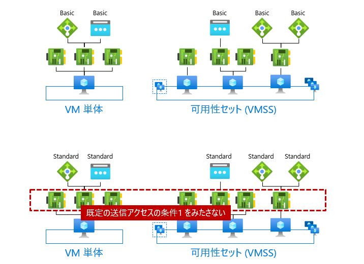

Azure Networking テクニカル サポート チームの山口です。

Azure では、インターネット宛てのアウトバウンド方向の接続 (送信接続) をいくつかの方法で実装できます。選択の幅があることは喜ばしいですが、一方で内容の把握のが難しい側面も否めません。そこで本記事では、Azure VM に使える送信接続の構成を説明します。また、ある Azure VM がどの構成に該当しているか判定するためのフローチャートや、各構成の特徴についても併せて紹介します。

> [!NOTE]
> 2023 年 9 月、[Azure 既定の送信アクセス](https://learn.microsoft.com/ja-jp/azure/virtual-network/ip-services/default-outbound-access)が廃止予定であることがアナウンスされました (Tracking ID: 3T84-PZZ)。
>
> 
> **通知内容と影響範囲**
> 2025 年 9 月 30 日を過ぎると、Azure 既定の送信アクセス (既定の SNAT) で送信接続している Azure VM は、インターネットへのアウトバウンド通信ができない状態になります。以降、既存で利用されている Azure VM も含め、Azure VM からの送信接続には明示的な設定が必要となります。
>
> 既定の送信アクセスとは、送信接続の方法をユーザーが指定していない場合でも、Azure VM がインターネット接続できるようにする仕組みです。具体的には、Azure プラットフォーム上で使われていないパブリック IP アドレスを一時的に借りて SNAT を行います。
> 
> つまり、当変更の影響を受けるのは、明示的な送信接続を構成していない Azure VM です。以下に示す明示的な送信接続の構成の**いずれにも該当しない**場合は、影響対象であると判断することができます (反対に一つでも当てはまるものがあれば対象ではありません)。
>
> 明示的な送信接続の構成：
>
> - デフォルト ルート (0.0.0.0/0) のネクストホップが NVA や Azure Firewall に向いている (確認方法: [ネットワーク インターフェイスの有効なルート](https://learn.microsoft.com/ja-jp/azure/virtual-network/diagnose-network-routing-problem#diagnose-using-azure-portal))
> - VM のサブネットに NAT Gateway を関連付けている
> - VM の NIC にパブリック IP アドレスを関連付けている
> - 外部ロードバランサー (Standard SKU) の送信規則を構成している
>
> 本記事で説明している[判定フローチャート](#%E5%88%A4%E5%AE%9A%E3%83%95%E3%83%AD%E3%83%BC%E3%83%81%E3%83%A3%E3%83%BC%E3%83%88)でも Azure VM がどの送信接続を利用しているか判定できるので、併せてご確認ください。
>
> **対応方法** 
> 影響を受ける Azure VM が 2025 年 9 月 30 日以降もインターネットへの送信接続を必要とする場合、明示的な送信接続にネットワーク構成を変更すること対応が可能です。後述の[機能比較](#%E6%A9%9F%E8%83%BD%E6%AF%94%E8%BC%83) などで各方法の比較を行った後、以下のいずれかのアクションを実施します。
>
> - Azure Firewall (または送信接続をサポートするサードパーティ製の NVA) をデプロイし、デフォルトルートのネクストホップを Azure Firewall に向ける ([参考](https://learn.microsoft.com/ja-jp/azure/firewall/tutorial-firewall-deploy-portal))
> - VM のサブネットに NAT Gateway を関連付ける ([参考](https://learn.microsoft.com/ja-jp/azure/nat-gateway/tutorial-migrate-outbound-nat))
> - VM に NIC にパブリック IP アドレスを関連付ける ([参考](https://learn.microsoft.com/ja-jp/azure/virtual-network/ip-services/associate-public-ip-address-vm?tabs=azure-portal))
> - 外部ロードバランサーの送信規則を構成する ([参考](https://learn.microsoft.com/ja-jp/azure/load-balancer/egress-only))
>
> **補足事項**
> 今後作成する予定の Azure VM に関しても、原則として既定の送信アクセスを利用しないようお願い致します。将来的にリタイアが決まっていることも大きな理由の一つですが、そもそも暗黙的にインターネット トラフィックを許可することはセキュリティ リスクを高めるためです。また、既定の送信アクセスには次のような問題点もあります。
> 
> - 送信元 IP アドレスを固定化できない
> - SNAT ポート枯渇が発生しやすい
> 
> インターネットへのアウトバウンド接続が必要な場合は、「対応方法」で示した明示的な送信接続のいずれかを採用ください。

<!-- more -->

## はじめに

Azure VM をはじめとする仮想ネットワーク (VNet) のコンピューティング リソースは、必要に応じてインターネット上のサーバーにアクセスします。たとえば、Web ブラウザが TLS/SSL 証明書の失効を検証する場合や、外部の権威 DNS サーバーに再帰問い合わせを実施する場合などです。この接続は、Azure から外部に出ていくように見えることから、アウトバウンド方向の接続あるいは **送信接続** と呼ばれます。

インターネット上のホストと通信するために、パケットの送信元と宛先 IP アドレスは共にパブリック IP アドレス (グローバル IP アドレス) である必要があります。特に、送信接続の文脈では、宛先はパブリック IP アドレスであることが確定しているため、送信元のパブリック IP アドレスをいかにして確保するかが重要となります。

一般に、これを実現する方法は大きく２つあります。

1. 送信元のホスト (オペレーティング システムのネットワーク インターフェイス) に、パブリック IP アドレスを割り当てます。これで送信元ホストはグローバル アドレス帯のセグメントに参加している状態となり、インターネットを介して宛先ホストとエンド・ツー・エンドな通信が行えます。
2. 送信元のホストには、プライベート IP アドレスのみを割り当てます。その代わり、送信元ホストの外部にあるネットワーク装置で、送信元 IP アドレスをパブリック IP アドレスに変換します。

このうち、Azure でサポートされているのは 2 番目の方法です。これは、ネットワークのアドレス変換 (Network Address Translation; NAT) と呼ばれる技術を使っています。特に送信元を変換するので送信元 NAT (Source NAT; SNAT) と呼ばれることもあります。Azure では、仮想化基盤に実装された仮想的なルーター (各サブネットの最初のユーザブル アドレスでホストされるデフォルトゲートウェイ) が、Azure VM のパケットに対して SNAT を実施します。このようなルーターを NAT 装置と呼びます。

SNAT の実現方法は、さらに 2 つの方式に細分化できます。

- **Basic NAT**: 2 つの IP アドレスを 1 対 1 の関係で変換する NAT です。狭義の NAT と呼ばれることもあります。NAT 装置上では、単純にアドレスの対応付けを覚えておくだけで良いので、それ以上のステート管理が不要です。
- **NAPT (Network Address Port Translation)**: ポート番号を利用することで、アドレスを 1 対多あるいは多対多の関係で変換できる NAT です。5 タプル (L4 プロトコル、送信元アドレス、送信元ポート、宛先アドレス、宛先ポート) で一意にフローを識別しながら、どのフローをどのように NAT したか記録しておく必要があります。フロー管理のデータベースを NAT テーブルと呼びます。

後者の NAPT による SNAT では、**SNAT ポート枯渇**に留意する必要があります。

SNAT ポートとは、SNAT 後のパケットの送信元ポート番号です。1 ~ 65535 の値が利用できますが、重要なのは有限なリソースである点です。[プロトコル、宛先 IP、宛先ポート] の組が同一のコネクションが発生するたびに SNAT ポートを一つづつ消費するため、有限な SNAT ポートを消費しきってしまう可能性があるのです。

SNAT ポートがいかに消費されるかを示すため、次のようなシナリオを考えます。SNAT 装置が、あるパブリック IP アドレス (`SNAT`) を使って、プライベート IP アドレスだけが割り当てられた Azure VM #1 (`10.0.0.4`) と #2 (`10.0.0.5`) に対して NAPT による SNAT を提供します。VM 間で SNAT ポートの奪い合いが発生しないよう、各 VM に 100 個ずつ SNAT ポートを事前に割り当てることにします。

ここで、VM から Web サーバー (`WEB`) に対する大量の HTTP アクセスを発生させました。この通信は、[プロトコル、宛先 IP アドレス、宛先ポート] がすべて同一 (`TCP, WEB:80`) であることに留意してください。コネクションを識別しなければならない SNAT 装置は、SNAT ポートをコネクションごとに消費していきながら SNAT を行います。

そして、VM #1 からの 101 個目の接続を受け付けた時、使える SNAT ポートが存在しないことに気が付きます。なぜなら、VM #1 には 100 個の SNAT ポートのみを割り当てたからです。これが SNAT ポートが枯渇した状態です。一度消費した SNAT ポートを再利用するには、既存のコネクションを VM か WEB サーバーが FIN/RST で終了するか、SNAT 装置上のアイドルタイムアウトで強制切断するのを待つ必要があります。

SNAT ポート枯渇が発生したからと言って、他のプロトコルや宛先の通信に影響がでるわけではありません。あくまで SNAT ポートはコネクションを識別するための一要素にすぎず、5 タプルの他の値で識別できれば SNAT ポートが重複しても問題ないためです。たとえば、VM #1 から DNS サーバー (`DNS:53`) に対する UDP の接続要求は成功します。

ポート枯渇が発生しやすいのは、同じエンドポイントに対して送信接続を繰り返す状況です。たとえば次のようなシナリオが挙げられます。

- 外部の DNS サーバーへの問い合わせ
- インターネット上のプロキシ サーバーの利用
- コネクションプーリングを使わないデータベース アクセス
- ファイル共有 サーバーとの連携

## 構成パターンの一覧

それでは、具体的にどのような構成を取れば、送信接続 (SNAT) が可能になるのでしょうか。2023 年 9 月現在、Azure VM の送信接続に使える構成パターンは次の通りです。

1. デフォルトルートのネクストホップを仮想アプライアンスに向ける
2. サブネットに NAT ゲートウェイを関連付ける
3. NIC にパブリック IP アドレス (インスタンス レベルのパブリック IP アドレス) を関連付ける
4. 外部ロードバランサーの送信規則を構成する
5. 既定の送信アクセスを利用する ※ 2025 年 9 月で廃止、非推奨

なお、このうち Azure 基盤に備わっている SNAT 機能を利用しているのはパターン 2-5 です。パターン 1 については、(パターン 2-5 のいずれかの SNAT 機能を利用している) 仮想アプライアンスに送信接続を肩代わりしてもらうことによって成り立っています。したがって、基盤側で準備されている SNAT オプションを比較したい場合は、パターン 2-5 を重点的に確認するのが良いでしょう。

## 判定フローチャート

ここでは、ある Azure VM がどの構成パターンで送信接続を実現しているか判定するためのフローチャートを示します。

より厳密に言えば、これは NIC に対しての判定チャートです。なぜなら、同一 Azure VM にアタッチされた NIC であっても、NIC ごとに異なる送信接続を構成できるためです。たとえば、異なる二つのサブネットに足を出す Azure VM に対し、片方のサブネットでは NAT ゲートウェイを使った送信接続を、もう一方のサブネットでは Azure Firewall を使った送信接続を構成することが可能です。

また、構成間の優先度も考慮して作成されています。たとえば、ある NIC に対して NAT ゲートウェイとインスタンス レベルのパブリック IP アドレスが両方構成された場合、NAT ゲートウェイによる SNAT で送信接続が行われます。当該のフローチャートを使うと、このような依存関係を判断できます。

### 各ステップの詳細

#### ルートのネクストホップは？

本ステップは、仮想アプライアンスでインターネット トラフィックを処理する構成か確認するものです。

要件に応じて、インターネット通信が必ず通るネットワーク仮想アプライアンス (NVA) をデプロイし、ログの記録やトラフィック制御を実施することがあります。マネージドな仮想アプライアンス サービスとしては Azure Firewall が提供されていますが、他にも多くのサードパーティ製品が存在します。こうした構成の場合、インターネット宛てエグレス トラフィックの SNAT は、Azure VM ではなく NVA 側で実施されます。

具体的には、Azure VM の[有効なルート](https://learn.microsoft.com/ja-jp/azure/virtual-network/diagnose-network-routing-problem#diagnose-using-azure-portal)を見て、ネクストホップが NVA に向けられているか確認します。**既定のデフォルトルート (0.0.0.0/0) を無効化/上書きするユーザー定義ルートがあるか**を重点的に確認していただくのが良いでしょう。

たとえば、次のような状況について考えてみます。

- 既定のデフォルトルートが [無効] になっており、ネクストホップが [仮想アプライアンス] に向いていることが確認できます。たまたま Azure Firewall のプライベート IP アドレスが 10.0.255.4 だっただけで、ネクストホップのアドレスは NVA に割り当てたアドレス次第です。
- [KMS サーバーをホストする 3 つのアドレス](https://jpaztech.github.io/blog/vm/azure-kms-update/) のネクストホップが [インターネット] に設定されていることも分かります。これらのエンドポイントに関しては、NVA を使わず Azure VM 側で SNAT することが意図されているようです。

したがって、この例での当該ステップへの回答は次の通りです。

- KMS サーバー宛てのトラフィックだけは仮想アプライアンスで処理しない
- それ以外のインターネット宛てのトラフィックは仮想アプライアンスで処理する

#### サブネットに NAT ゲートウェイが関連付けられている？

本ステップでは、Azure VM の NIC がデプロイされているサブネットのプロパティを確認します。様々な方法で確認できますが、Azure Portal での確認方法の一例を以下に示します。

1. 対象の Azure VM の [ネットワーク] メニューで、 NIC がデプロイされている仮想ネットワーク/サブネットを確認する
2. 対象の仮想ネットワークの [サブネット] メニューから、対象サブネットを開く
3. [NAT ゲートウェイ] の項目に NAT ゲートウェイの名前が存在すれば、本ステップの回答は YES です (「なし」の場合は NO)

回答が YES の場合、Azure VM の送信接続は NAT ゲートウェイを使った SNAT で実施されます。

#### NIC にパブリック IP アドレスが関連付けられている？

本ステップでは、Azure VM の NIC にパブリック IP アドレスが関連付けられているか確認します。このようなパブリック IP アドレスはインスタンス レベル IP アドレスとも呼ばれます。[パブリック IP アドレスの関連付けの手順](https://learn.microsoft.com/ja-jp/azure/virtual-network/ip-services/associate-public-ip-address-vm?tabs=azure-portal)を参考に、次のように確認してください。

1. 対象の NIC の [IP 構成] メニューで、プライマリの IP 構成を確認する
2. パブリック IP アドレスの欄にアドレスが表示されていれば、本ステップの回答は YES です (空欄なら NO)

回答が YES の場合、Azure VM の送信接続はこのパブリック IP アドレスを使って SNAT されます。

#### パブリック ロードバランサーの送信規則が構成されている？

本ステップでは、パブリック ロードバランサーの送信規則を使って SNAT 構成が組まれているか確認します。

1. 対象の Azure VM の [ネットワーク] メニューで、対象の NIC を確認します
2. [負荷分散] タブを開き、所属しているロードバランサーとバックエンド プールの一覧を確認します。
3. 種別がパブリックで SKU が Standard であるロードバランサーのみを抽出します。
4. 対象のロードバランサーの [送信規則] メニューを開き、対象のバックエンド プールに関連付けられた送信規則がある場合、本ステップの回答は YES です (それ以外の場合は NO)

回答が YES の場合、当該の送信規則に紐づくフロントエンドのパブリック IP アドレスで SNAT が実施されます。

#### 既定の送信アクセスに該当する？

本ステップでは、[Azure での規定の送信アクセス](https://learn.microsoft.com/ja-jp/azure/virtual-network/ip-services/default-outbound-access) が有効なシナリオであるか確認します。

既定の送信アクセスとは、特に何も構成していない Azure VM に対して、最低限の SNAT 機能を担保することを目的とした Azure 基盤の SNAT 機能です。以下の条件を満たせば、既定の送信アクセスによる SNAT が機能します。

**条件1**: 同じ可用性セットに含まれるすべての NIC が、以下のいずれにも該当しない。

- Standard SKU のパブリック IP アドレスを NIC に関連付ける
- Standard SKU のロードバランサー (内部/パブリック) のバックエンドプールに NIC を配置する

可用性セットを作成していない場合、単一の Azure VM からなる可用性セットを考えるか、あるいは単に可用性セットを Azure VM と読み替えていただいて大丈夫です。同様に、VMSS のインスタンスの場合は、可用性セットを VMSS と読み替えてください。

> [!NOTE]
> この条件には、Azure 基盤が持つリソース保護機能が関係しています。
>
> Azuer VM が Standard SKU のパブリック IP アドレスやロードバランサーを使用すると、内部的にセキュリティが強化された保護モードに切り替わります。保護のスコープは可用性セットであり、その中のすべての NIC に同じ保護モードが適用されます。なお、可用性セットが組まれていなければ、単一の Azure VM で構成された可用性セットが内部的に作成されます (ユーザーには見えない)。
>
> 保護モードでは、明示的に NSG のセキュリティ規則で通信許可するまでインターネット通信ができないようになります。そして、この保護モードの特徴の一つが、既定の送信アクセスを無効にすることです。
> 
> したがって、Azure VM が既定の送信アクセスの対象となるためには、保護モードの対象になっていないことを確認する必要があるのです。

条件1 を満たさない場合でも、例外的に既定の送信アクセスを有効化できます。それが、Standard SKU パブリックロードバランサーの負荷分散規則にある「既定の送信アクセスを有効化する」機能です。したがって、以下の条件を満たす場合でも既定の送信アクセスが適用されます (条件その１と２は同時に満たす必要はありません)。

**条件2**: Standard SKU のパブリック ロードバランサーに「既定の送信アクセス」を有効化した負荷分散規則が存在し、その規則のバックエンド プールに NIC が存在する。

#### 送信接続 不可

最後に「送信接続 不可」のシナリオについて補足しておきます。

フローチャートからもわかるように、Azure では多くの SNAT オプションがあり、多くの状況で送信接続が可能です。特に、まったく SNAT の構成を意識せず、Azure VM をデプロイするだけで送信接続が勝手にできるようになる「既定の送信アクセス」は、特筆すべき機能です。それだけに、いざ送信接続ができなくなった時にパニックに陥ってしまうという、諸刃の剣としての側面もあります。

実際、技術サポートでも「Azure VM が送信接続できない、できなくなった」という類のお問い合わせは、頻繁に目にするシナリオのひとつです。中でも、ロードバランサーの構成変更作業を契機として事象が発生するケースが多く、過去にロードバランサー関連の TIPS としてブログ記事を公開しています。

> ロードバランサーのバックエンドプールに追加したら外部へ接続できなくなった
> こちらの事象についてよくある原因としては以下があります。
> 
> 1. Standard SKU の内部ロードバランサーのバックエンドプールに所属している
>
> 引用: [Azure ロードバランサー利用時の注意点 > ロードバランサーのバックエンドプールに追加したら外部へ接続できなくなった](https://jpaztech1.z11.web.core.windows.net/Azure%E3%83%AD%E3%83%BC%E3%83%89%E3%83%90%E3%83%A9%E3%83%B3%E3%82%B5%E3%83%BC%E5%88%A9%E7%94%A8%E6%99%82%E3%81%AE%E6%B3%A8%E6%84%8F%E7%82%B9.html#outbound-cannot-connect)

もし、送信接続できない場合、あるタイミングを境に送信接続できない状況になってしまった場合、まずは以下のような対応で事象が緩和するかご確認ください。

* Azure Firewall などのアプライアンス装置をデプロイし、デフォルトルート (0.0.0.0/0) のネクストホップをアプライアンス装置に向ける
* NAT ゲートウェイを Azure VM が配置されているサブネットに関連付ける
* Standard SKU のパブリック IP アドレスを Azure VM の NIC に関連付ける
* Standard SKU の外部ロードバランサーを送信規則を構成する

## 構成の比較

次の表は、各構成にどのような特性があるかを示したものです。詳細は後述のセクションで確認していただければと思いますが、横ぐしで比較する際に参考となれば幸いです。

|| NVA | NATGW | ILPIP | パブリック LB | 既定の送信アクセス |
|:----|:----|:----|:----|:----|:----|
| 構成単位 | サブネット | サブネット | NIC | バックエンド プール | VM / 可用性セット |
| アドレスの割り当て | NVA 依存* | 固定 | 固定 | 固定 | ランダム |
| NAT 方式 | NVA 依存* | NAPT | Basic NAT | NAPT | NAPT |
| 最大 SNAT ポート数 | NVA 依存* | ~64,512*16 | | 64,000 | 1,024 |
| アイドル タイムアウト[分] | NVA 依存* | 4~120 | 4 | 4~100 | 4 |
| プロトコル | NVA 依存* | TCP/UDP | TCP/UDP/ICMP/ESP | TCP/UDP |  TCP/UDP/ICMP |
| インバウンド接続 | NVA 依存* | なし | あり | 選択可能 | なし |

*: 仮想アプライアンス (NVA) による送信接続も、究極的には Azure 基盤が提供する SNAT 機能 (NAT ゲートウェイ、インスタンス レベルのパブリック IP アドレス、パブリック ロードバランサー、Azure 既定の送信アクセスのいずれか) を利用しています。仮想アプライアンス側で採用している SNAT 方式と、アプライアンス固有の機能制約やパフォーマンス限界などを総合的に加味してご検討ください。

- **構成単位**: 同じ送信接続が構成されるスコープです。たとえば、サブネットが構成単位である場合、サブネット内のすべての NIC は同じ方法で送信接続されます。
- **アドレスの割り当て**: "固定" の構成では、特定の SNAT アドレス プールから送信元 IP アドレスが払い出されることを保証できます。これにより、宛先側のホストで送信元を使った ACL を利用できます。"ランダム" の構成では、SNAT アドレスを限定できません。Azure VM の割り当てを停止すると、パブリック IP アドレスが変化します。
- **NAT 方式**: "Basic NAT" は、1対1 のステートレス NAT によって実装されていることを表します。これが採用されているのは、インスタンスレベルのパブリック IP アドレスだけです。"NAPT" は、NAPT を利用した SNAT であることを表します。この方式では、SNAT ポートを使い切ると同じ宛先ホストへの同時接続が制限される「ポート枯渇」の問題が発生する可能性があります。
- **最大 SNAT ポート数**: NIC が利用できる最大の SNAT ポート数を表します。NAT ゲートウェイでは、利用状況に応じて SNAT ポートを動的に分配するため、他の Azure VM の稼働状況にも左右されます。理論上、NAT ゲートウェイ全体で最大 64,512 * 16 = 1,032,192 個の SNAT ポートが確保できます。
- **アイドルタイムアウト**: TCP コネクションをアウトバウンド向けに確立した時のアイドル タイムアウト値 (分) です。タイムアウト値よりも長くアイドル状態が続くコネクションに関しては、それ以降の接続が保証されません。範囲が記載されているものに関しては、設定により変動できます。ロードバランサーの場合、タイムアウト時に RST を通知する機能があります。
- **プロトコル**: 送信接続でサポートされているプロトコルです。すべてのオプションで TCP/UDP はサポートされています。ICMP が利用できないオプションもあるので、外部サーバーへの ping 監視のシナリオでは注意してください。
- **インバウンド接続**: この構成を取ることで、同時にインターネット上のクライアントからのインバウンド接続が出来るようになるかを表したものです。インスタンス レベルのパブリック IP アドレス構成では、必ずインバウンド接続性が確保されます (そのため NSG でのコントロールが必須)。パブリック ロードバランサーの送信規則を使う場合、あわせて負荷分散規則を作成すればインバウンド接続性が確保されます。

また、以下の公式ドキュメントも、送信接続の構成を選択するのに役立ちます。併せてご確認ください。

- [Azure でのミッション クリティカルなワークロードのネットワークと接続 - Microsoft Azure Well-Architected Framework | Microsoft Learn](https://learn.microsoft.com/ja-jp/azure/well-architected/mission-critical/mission-critical-networking-connectivity#internet-egress)
- [アウトバウンド接続の送信元ネットワーク アドレス変換 (SNAT) - Azure Load Balancer | Microsoft Learn](https://learn.microsoft.com/ja-jp/azure/load-balancer/load-balancer-outbound-connections)

## 構成の詳細

ここからは、各送信接続の構成ついて、主な特徴・ユースケース・注意事項を紹介していきます。ただし、仮想アプライアンスの送信接続構成は次の理由により省略しています。

- 仮想アプライアンスによる送信接続も、究極的には Azure 基盤が提供する SNAT 機能を利用しています。Azure の送信接続を理解する上で最も重要となるのは、この基盤が提供するネイティブの SNAT 機能を把握することです。
- 仮想アプライアンスごとに機能制約やパフォーマンス限界が異なるため、一概に紹介することが難しい側面があります。

なお、アプライアンスとして Azure Firewall を利用する場合は、以下のような情報を参考としていただければと思います。

- [Azure Firewall のパフォーマンス | Microsoft Learn](https://learn.microsoft.com/ja-jp/azure/firewall/firewall-performance)
- [Azure NAT ゲートウェイを使用した SNAT ポートのスケーリング | Microsoft Learn](https://learn.microsoft.com/ja-jp/azure/firewall/integrate-with-nat-gateway)
- [Azure Firewall を使用した App Service 送信トラフィック制御 - Azure App Service | Microsoft Learn](https://learn.microsoft.com/ja-jp/azure/app-service/network-secure-outbound-traffic-azure-firewall)

### NAT ゲートウェイ (NATGW)

NAT ゲートウェイ (NAT Gateway) は、複数あるパターンの中で唯一、送信接続の SNAT を主な目的として設計されたネットワーク サービスです。専門的なサービスなだけあって、送信元アドレスの固定化はもちろん、動的なポート確保によりるポート資源の有効活用など、他の SNAT 方式にはない機能を有します。

**特徴**

- フルマネージドな PaaS サービスで、高い可用性を有します。最新の SLA では、可用性が 99.99% を下回ると一部料金の返金 (サービス クレジット) を受け取ることができます。
- 複数の VM で SNAT ポート プールを共有し、動的に SNAT ポートを確保できるのは NAT ゲートウェイだけです。[[参考](https://learn.microsoft.com/ja-jp/azure/nat-gateway/nat-gateway-snat)]
- NAT ゲートウェイに追加できるパブリック IP アドレスの最大数は 16 個です。パブリック IP アドレスあたり 64,152 の SNAT ポートが確保されるため、NAT ゲートウェイ全体で最大 64,512 * 16 = 1,032,192 の SNAT ポートを確保できます。[[参考](https://learn.microsoft.com/ja-jp/azure/nat-gateway/nat-gateway-resource#snat-ports)]
- 送信接続の TCP アイドル タイムアウトを 4 分から最大 120 分まで伸ばせます。[[参考](https://learn.microsoft.com/ja-jp/azure/nat-gateway/nat-gateway-resource#tcp-idle-timeout)]
- Azure Monitor のメトリックで NAT ゲートウェイで処理されたデータサイズ、パケット数、現在の接続数を確認することができます。[[参考](https://learn.microsoft.com/ja-jp/azure/nat-gateway/nat-metrics)]
 

**基本的な構成方法**

1. NAT ゲートウェイ リソースを作成する。
2. 対象のサブネットに NAT ゲートウェイを関連付ける。

**ユースケース**

- 一般的な送信接続のシナリオ全般
- 大量のインターネットへの接続が必要となる場合
- 複数の Azure VM で SNAT 用のパブリック IP アドレス (SNAT ポート) を共有したい場合

**注意事項**
 
- NAT ゲートウェイを使用する NIC は、Basic SKU のインスタンス レベル パブリック IP アドレスを関連付けたり、Basic SKU のロードバランサーのバックエンドに配置できません。
- 仮想ネットワーク内の通信に対する一般的な NAT 装置として利用できません。あくまで、インターネットへの送信接続における SNAT 機能だけを提供します。
- インバウンド方向のインターネット接続を受け付けることはできません。インバウンド接続性が必要な場合、Application Gateway やロードバランサーなどの利用を検討してください。
- NAT ゲートウェイの可用性オプションは、特定可用性ゾーンへの固定 (zonal) または非ゾーン (regional) のいずれかです。可用性ゾーン レベルの冗長性が必要なシステムに組み込む場合は、可用性ゾーンごとにサブネットを作成し、複数の NAT ゲートウェイを各サブネットに関連付けるようにします。[[参考](https://learn.microsoft.com/ja-jp/azure/nat-gateway/nat-availability-zones)]
- ICMP プロトコルはサポートされません。

**参考文献**

* [Azure NAT Gateway とは | Microsoft Learn](https://learn.microsoft.com/ja-jp/azure/nat-gateway/nat-overview)
* [Azure NAT Gateway リソース | Microsoft Learn](https://learn.microsoft.com/ja-jp/azure/nat-gateway/nat-gateway-resource)
* [Azure NAT Gateway のトラブルシューティング - Azure Virtual Network | Microsoft Learn](https://learn.microsoft.com/ja-jp/azure/nat-gateway/troubleshoot-nat)

### インスタンス レベルのパブリック IP アドレス (ILPIP)

Azure VM の NIC にパブリック IP アドレス (インスタンス レベルのパブリック IP アドレス) を関連付けると、そのパブリック IP アドレスで通信が SNAT されるようになります。1 対 1 のステートレス NAT (Basic NAT) として実装されるため、基盤側では SNAT ポートを管理しません。

**特徴**

* 基盤に備わる SNAT 機能の中で、唯一 NAPT を利用しない (SNAT ポートを使わない) 方式による SNAT です。SNAT ポートの枯渇を心配する必要はありません。
* SNAT アドレスが一つの VM に占有され、他の VM に使われないことを保証できます。
* 構成が非常にシンプルです。

**基本的な構成方法**

1. パブリック IP アドレス リソースを作成する。
2. 対象の Azure VM の NIC に関連付ける。

**ユースケース**

* 単一の Azure VM に対する送信接続の確保 (NAT ゲートウェイなどを導入するまでの一時的な対策)
* 送信接続だけでなく、Azure VM へのインバウンド接続も確保したい場合

**注意事項**

- Basic SKU だと NAT Gateway と共存出来ない等、SKU 依存の制限が存在します。可用性ゾーンへの対応も考慮すると、基本的には Standard SKU の使用が推奨されます。
- SNAT ポートの消費を気にしなくて済む反面、OS のネットワーク スタックでエフェメラル ポートが枯渇する可能があります。エフェメラルポートの枯渇が疑われる場合は、次のような情報を参考にしてください。
[TCP/IP ポート枯渇のトラブルシューティング - Windows Client | Microsoft Learn](https://learn.microsoft.com/ja-jp/troubleshoot/windows-client/networking/tcp-ip-port-exhaustion-troubleshooting)

**参考文献**

- [アウトバウンド接続の送信元ネットワーク アドレス変換 (SNAT) - Azure Load Balancer | Microsoft Learn](https://learn.microsoft.com/ja-jp/azure/load-balancer/load-balancer-outbound-connections)
- [Azure パブリック IP アドレスを作成、変更、または削除する - Azure Virtual Network | Microsoft Learn](https://learn.microsoft.com/ja-jp/azure/virtual-network/ip-services/virtual-network-public-ip-address)

### パブリック ロードバランサーの送信規則

パブリック ロードバランサーのバックエンド プールに Azure VM を配置し、送信規則を構成すると、フロントエンドのパブリック IP アドレスで送信接続が SNAT される動作となります。なお、送信規則は Standard SKU のパブリック ロードバランサーでのみサポートされる機能です。

NAT の種類には NAPT が利用されています。バックエンド プール内の Azure VM に対して、各々どの程度の SNAT ポート数を割り与えるか、予め設定しておきます。パブリック IP アドレスあたり 64,000 の SNAT ポートを持つので、これをバックエンド プール内の Azure VM で分配する形になります。たとえば、8 台なら 8,000 ポートずつ割り振ることができます。

**特徴**

* バックエンド プールの単位で構成されるため、サブネットをまたいで複数の Azure VM を同じ方法で SNAT できる。
* 送信規則で制御できるパラメータが豊富。
  * バックエンド プール (どの Azure VM を対象とするか)
  * フロントエンド IP 構成 (どのパブリック IP アドレスで SNAT するか)
  * SNAT ポート数の割り当て (各 Azure VM へ自動的に均等に割り当てる方式か、明示的に値を入力する方式が選択できます)
  * SNAT の対象とするプロトコル (TCP、UDP、または両方)
  * TCP アイドルタイムアウト (4 分から最大 100 分まで)
  * アイドル タイムアウト時の TCP リセット送信の有無
* インバウンド接続性も、負荷分散規則やインバウンド NAT 規則を作成すれば確保できる。作成しなければ、単に送信接続のみを行う SNAT 装置として使うことも可能。

**基本的な構成方法**

1. パブリック IP アドレスをフロントエンドに付与したパブリック ロードバランサーを作成する。
2. バックエンド プールに対象の Azure VM の NIC を追加する。
3. 送信規則を作成する。

**ユースケース**

* SNAT と同時に、インバウンド方向の負荷分散も同時に構成したい場合 (例: 外部への DB アクセスが必要となるアプリケーション サーバー)
* サブネット以外の単位で、複数の Azure VM の送信接続を制御したい場合 (例: サブネット内の一部の Azure VM に、まとめてインターネット接続を許可する)

**注意事項**

* 送信規則で、複数のパブリック IP アドレス (フロントエンド IP 構成) をまとめて指定すると、バックエンド プール全体としては 64,000 x (IP アドレスの数) だけ SNAT ポートが用意されます。しかし、どれだけパブリック IP アドレスを追加しても、各 Azure VM に割り当てられる最大の SNAT ポート数は 64,000 までです。
* 負荷分散規則には、既定の送信アクセスによって SNAT を構成するオプションがあります。これを有効化すると、同じバックエンドプールには送信規則が作成できなくなります。

**参考文献**

* [アウトバウンド接続の送信元ネットワーク アドレス変換 (SNAT) - Azure Load Balancer | Microsoft Learn](https://learn.microsoft.com/ja-jp/azure/load-balancer/load-balancer-outbound-connections)
* [Azure Load Balancer のアウトバウンド規則 | Microsoft Learn](https://learn.microsoft.com/ja-jp/azure/load-balancer/outbound-rules)
* [送信専用のロード バランサーの構成 - Azure Load Balancer | Microsoft Learn](https://learn.microsoft.com/ja-jp/azure/load-balancer/egress-only)

### Azure 既定の送信アクセス

 本記事の冒頭で追記している通り、2025 年 9 月 30 日を以て Azure 既定の送信アクセスは利用できなくなります。具体的な内容や対応方法は、追記部分をご参照下さい。

これまでの送信接続の構成は、明示的にリソースを作成したり、関連付けることで SNAT をプログラミングするものでした。しかし、Azure には送信接続の方法をユーザーが指定していない場合でも、Azure VM がインターネット接続できるようにする仕組みが存在します。これを Azure 既定の送信アクセスと呼びます。

具体的には、Azure プラットフォーム上で使われていないパブリック IP アドレスを一時的に借りて SNAT を行います。そのため、Azure VM を割り当て解除 & 起動するたびに、SNAT に利用されるパブリック アドレスが変動します。

なお、割り当てられる可能性のある IP アドレスはある程度絞り込むことができます。なぜなら、Azure リージョンで使用されているパブリック IP アドレスの一覧が、以下のダウンロード サイトから提供されているためです。対象の Azure VM が存在するリージョンを確認し、`AzureCloud.<リージョン名>` で検索すると候補の IP アドレスを取得できます。

* [Download Azure IP Ranges and Service Tags – Public Cloud from Official Microsoft Download Center](https://www.microsoft.com/en-us/download/details.aspx?id=56519)

> [!NOTE]
> 例外的に、Standard SKU パブリック ロードバランサーの負荷分散規則を使用することでも、既定の送信アクセスを実現することができます。この場合、SNAT のアドレスはロードバランサーのフロントエンド IP 構成に紐づくパブリック IP アドレスとなります。条件の詳細は、判定フローチャートの「既定の送信アクセスに該当する？」をご覧ください。

**特徴**

* 唯一パブリック IP アドレス リソースを作らずに SNAT が出来る送信接続の構成です。
* NAPT により実現されており、確保される SNAT ポート数は NIC (Azure VM) あたり 1024 で固定されています。

**基本的な構成方法**

典型的には、次のような状況で既定の送信アクセスが利用されます。条件の詳細は、判定フローチャートの「既定の送信アクセスに該当する？」をご覧ください。

* NAT ゲートウェイ、インスタンス レベルのパブリック IP アドレス、パブリック ロードバランサーの送信規則を使わず、スタンドアロンな Azure VM をデプロイしている。
* Azure VM を Basic SKU のロードバランサーのバックエンド プールに配置している。
* Standard SKU のロードバランサーで、「既定の送信アクセス」を有効にした負荷分散規則を作成している。

**ユースケース**

* テスト/開発用の Azure VM で送信接続が必要になる場合

**注意事項**

* 本記事の冒頭で追記している通り、2025 年 9 月 30 日を以て Azure 既定の送信アクセスは利用できなくなります。具体的な内容や対応方法は、追記部分をご参照下さい。
* 既定の送信アクセスでは最大でも 1024 までしか SNAT ポートが確保されず、SNAT ポート枯渇の問題が顕在化しやすいです。
* 明示的な SNAT 方法の指定がないことが、管理上の問題となることがあります。

**参考文献**

* [Azure での既定の送信アクセス - Azure Virtual Network | Microsoft Learn](https://learn.microsoft.com/ja-jp/azure/virtual-network/ip-services/default-outbound-access)
* [アウトバウンド接続の送信元ネットワーク アドレス変換 (SNAT) - Azure Load Balancer | Microsoft Learn](https://learn.microsoft.com/ja-jp/azure/load-balancer/load-balancer-outbound-connections)
* [Azure VM の SNAT の話 – Made in container](https://www.syuheiuda.com/?p=5074)

## 最後に

今回の記事では、インターネット送信を実現する SNAT の仕組みと、Azure で利用できる SNAT の方式を紹介しました。

「判定フローチャート」を使うと、対象の Azure VM (NIC) がどの方式の送信接続で構成されているのか簡単に調べられます。送信接続できない時のトラブルシューティングにも、ぜひこのフローチャートを活用していただければと思います。

また、各送信接続構成の比較には「機能の比較」で示した表もご利用ください。それぞれのオプションのすべての側面を映し出しているわけではありませんが、大まかにどのような違いがあるのかを把握するための参考にしていただければ幸いです。

---

