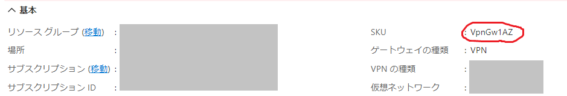

こんにちは、Azure サポートチームです。

Azure の仮想ネットワーク ゲートウェイ (以下「ゲートウェイ」) を用いたサイト間 VPN 接続について、2022 年 2 月 24 日以降に、強制トンネリングに関する一部の動作の変更が行われることがアナウンスされました。

影響が生じる可能性のあるお客様には通知がすでに送信されているか、近日中に送信されることが想定されます。しかしながら、通知に含まれる説明は要点のみとなっているため、本記事にてその補足をさせていただきます。

<!-- more -->

  

## 本記事の内容

本記事では、動作変更の影響を受ける条件やその合致確認の方法、動作変更の内容および変更の影響を受けないようにする対処方法ついてまとめております。本記事を参考に影響有無を確認するとともに、影響が想定される場合は 2 月 24 日までにあらかじめ対処を実施いただければと思います。

なお、以下の説明はリソース マネージャー モデル、クラシック モデルの両方に適用されますが、手順の説明はリソース マネージャー モデルを対象としています。クラシック モデルを対象とした手順は近日中に追記いたしますので、いましばらくお待ちいただけますようお願いいたします。

  

## 今回の動作変更の背景

Azure のゲートウェイには、「SKU」と呼ばれるパラメーターがあり、ゲートウェイの性能や冗長構成を指定することができます。ゲートウェイの SKU には、大きくわけて以下の 2 種類があります。

- 末尾に AZ がつく SKU: VpnGw1AZ、VpnGw2AZ、VpnGw3AZ、VpnGw4AZ、VpnGw5AZ 
- 末尾に AZ がつかない SKU: VpnGw1、VpnGw2、VpnGw3、VpnGw4、VpnGw5、Basic、Standard、HighPerformance

AZ がつく SKU とつかない SKU では、冗長性確保のためのデータセンター内部の配置が少し違うのみで、そのほかに機能面での基本的な違いはありません。

しかし今回、特定の条件下において、AZ がつく SKU と AZ がつかない SKU で強制トンネリングに関する一部の動作 (詳細は後述) に差異があることが判明しました。AZ がつかない SKU を対象に動作変更を行い、AZ がつく SKU の動作を正として動作を揃えるというのが、今回のアナウンスの内容です。

  

## 動作変更の内容

### 強制トンネリングを実現する 2 種類の方法
Azure のサイト間 VPN においては、Azure 仮想ネットワークから送信されるすべての通信を、データセンターのバックボーンネットワークではなく、VPN にルーティングする「強制トンネリング」という構成が可能です。サイト間 VPN で強制トンネリングを構成するためには、以下の 2 種類の方法があります。

- 方法 1. 対向のルーターと BGP で経路交換を行い、対向のルーターからデフォルト ルート 0.0.0.0/0 (を広報する)
- 方法 2. BGP は利用せず、ゲートウェイに DefaultSite の設定を行う

### 動作が変更される対象となる方法
このうち、方法 2 を利用している場合は、SKU によって強制トンネリングのために必要な作業が少し異なります。SKU に AZ がつく場合は、DefaultSite の設定を行うだけで、仮想ネットワーク内の全てのサブネットに対して、デフォルト ルートを VPN に向けるルートが反映されます。

しかし AZ がつかない場合は、DefaultSite の設定を行うだけでは強制トンネリングのためのルートが適用されません。DefaultSite の設定に加えて、0.0.0.0/0 のネクストホップをゲートウェイにしたユーザー定義ルート (UDR) を各サブネットに適用することで、はじめて強制トンネリングがそのサブネットで有効になります。

今回の動作変更では、この動作を AZ がつく SKU に合わせます。つまり、DefaultSite の設定がされている環境では、0.0.0.0/0 をゲートウェイに向ける UDR が適用されていなくても、強制トンネリングが有効になります。対象の環境においては、強制トンネリングが現状有効になっていないサブネットで、2 月 24 日以降に突然強制トンネリングが有効になる、ということが起こり得ます。

※ 方法 1 (BGP) を利用している場合は、今回の動作変更による影響はありません。

  

## 動作変更による影響が生じる条件

以下の 5 つの条件に **すべて** 合致した場合に、今回の動作変更の影響を受けます。

- A. VPN 用の仮想ネットワーク ゲートウェイがある
- B. ゲートウェイの SKU は末尾に AZ がつかないものである
- C. サイト間 VPN を利用している
- D. BGP でデフォルト ルートを 0.0.0.0/0 を受信していない
- E. DefaultSiteの設定がされている

それぞれの条件についての合致確認の方法は、本記事の末尾にまとめております。

  

## 条件にすべて合致した場合の対応

上記の 5 つの条件に **すべて** 合致した場合、動作変更の影響が生じる可能性があります。つまり、0.0.0.0/0 をゲートウェイに向けるユーザー定義ルートが適用されていなくても、2 月 24 日以降の動作変更によって、強制トンネリングがそのサブネットで有効になります。

予期せず強制トンネリングが有効になることを防ぐためには、あらかじめ 0.0.0.0/0 のネクストホップをインターネットに向ける UDR を適用することが有効です。2 月 24 日よりも前にこの UDR を適用しておくことで、その UDR が適用されたサブネットでは、動作変更によって強制トンネリングが突然有効になる状況を回避することができます。

（したがって、現状ですでに 0.0.0.0/0 のネクストホップをインターネットに設定する UDR が適用されているサブネットについては、影響を受けません）

### 対応手順の例
具体的な手順の一例は以下のとおりです。各パラメーターについてはお客様の環境に合わせて確認および決定してください。

1) <b>Azure ポータルを開きます。 </b>
https://portal.azure.com/

2) <b>すでに対象のサブネットにルート テーブルが適用されている場合は、手順 5) までスキップします。</b>

3) <b>[ルート テーブル] を開き、[+作成] をクリックします。</b>

4) <b>以下のパラメーターを入力し、[確認および作成] をクリックします。(詳細なパラメーターは環境に合わせてください)</b> 
　リソース グループ: 任意 
　リージョン: ルート テーブルの適用対象の仮想ネットワークと合わせる 
　名前: ルート テーブルの任意の名前 
　ゲートウェイのルートを伝達する: Yes

5) <b>4) で作成したルート テーブルか、既存のルート テーブルを開きます。</b>

6) <b>[ルート] メニューをクリックし、[+追加] をクリックします。</b>

7) <b>以下のパラメーターでルートを追加して [OK] をクリックします。</b> 
　ルート名: 任意の名前 
　アドレス プレフィックス: 0.0.0.0/0 
　ネクスト ホップの種類: インターネット 

8) <b>すでに対象のサブネットにルート テーブルが適用されている状態で作業を行った場合は、これで終了です。</b>

9) <b>[サブネット] メニューをクリックし、[+関連付け] をクリックします。</b>

10) <b>ルート テーブルの適用対象の仮想ネットワークとサブネットを選択して、[OK] をクリックします。</b>

※ ルート テーブルの設定手順は [公開資料](https://docs.microsoft.com/ja-jp/azure/virtual-network/manage-route-table) でも説明されておりますので、あわせてご覧ください。

 

-----

 

## 補足: 条件に合致しているかどうかを確認するための詳細手順
A～E それぞれの条件について、合致しているかどうかを確認するための手順の一例をご紹介いたします。

### A. VPN 用の仮想ネットワーク ゲートウェイがあることの確認
Azure ポータルで [仮想ネットワーク ゲートウェイ] メニューを開き、[ゲートウェイの種類] が [Vpn] のものがあれば、この条件に合致しています。

### B. ゲートウェイの SKU は末尾に AZ がつかないものであることの確認
A. でみつけたゲートウェイをクリックし、[SKU] 欄を確認して「AZ」が含まれていれば、この条件に合致しています。

### C. サイト間 VPN を利用していることの確認
A. でみつけたゲートウェイをクリックし、[接続] メニューをクリックします。

[接続] オブジェクトが表示されれば、この条件に合致しています。

### D. BGP でデフォルト ルートを 0.0.0.0/0 を受信していないことの確認
A. でみつけたゲートウェイをクリックし、[BGP ピア] メニューをクリックします。

[学習したルート] に 0.0.0.0/0 が含まれて **いなければ**、この条件に合致しています。（0.0.0.0/0 が含まれていたら、この条件に合致しませんので今回の変更の影響も受けません。少し紛らわしいのでご注意ください）

### E. DefaultSiteの設定がされていることの確認
この確認は PowerShell での作業が必要になります。

1) <b>Azure PowerShell を起動するか、[Cloud Shell](https://shell.azure.com/) (PowerShell を選択) を開きます。</b>

2) <b>Azure PowerShell の場合、以下のコマンドを実行してサインインします。</b> 
Login-AzAccount

3) <b>A. でみつけたゲートウェイが構築されているサブスクリプション ID を確認し、以下のコマンドを実行して操作対象のサブスクリプションを指定します。</b> 
Select-AzSubscription -SubscriptionId <確認したサブスクリプション ID>

4) <b>以下のコマンドを実行し、対象のゲートウェイの構成情報を取得・表示します。</b> 
Get-AzVirtualNetworkGateway -Name <ゲートウェイの名前> -ResourceGroupName <ゲートウェイのリソース グループ名>

5) <b>出力結果の中から、GatewayDefaultSite という行を探します。サイト名の情報が入っている場合は、この条件に合致します。「null」となっている場合は合致しません。
