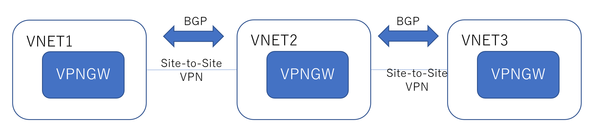

Azure VPNGW に関して、たびたびお問合せ頂く内容をご紹介させていただきます。

# VPNGW 全般的な FAQ
### メンテナンスの事前通知
VPNGW ではサービスを健全に運用するため定期的(月に 1, 2 回程度 )のメンテナンスを実施いたします。  
メンテナンスでは数十秒程度の通信断が発生することがございますが、メンテナンスの __事前通知は行っておりません__

### 事後にメンテナンス有無を確認する方法
メンテナンス実施時に診断ログにメンテナンス実行を示すイベントが記録されます。
ログを確認することで、過去に発生した IPsec セッションの断がメンテナンスによるものかを確認することが可能です。
複数種類のメンテナンスがあり、全メンテナンスでログが出力されるわけではございません。
ログ上、メンテナンスとして記録されていない、意図せぬ申告なサービス断が発生した場合には Azure サポートにて調査をいたしますので、ケースオープンをしてお問い合わせ下さい。

# Site-to-Site に関する FAQ
### Azure GW で静的パブリック IP アドレスを使う方法
かねてより VPNGW に静的パブリック IP アドレスを割り当てたいというご要望を頂いておりましたが対応しておりませんでした。
2020年9月現在でも、VpnGwX 等の通常の VPNGW SKU では静的 IP アドレスを使用することはできませんが、__ゾーン冗長 SKU VpnGwXAZ__ を選択いただくことで実現が可能です。

### VPNGW をトランジットした通信
VPNGW では Site-to-Site VPN 経由で接続された複数のサイト間の通信を行うことが可能です。  
この場合、 サイト と Azure 間の接続には必ず __BGP__ が必要になります。  
スタティック構成( BGP を使用しない構成 )での VPNGW トランジット構成はサポートされませんのでご注意下さい。

### VPNGW, ExpressRoute 共存環境のデザイン
同一 VNET 内に ExpressRoute と VPNGW を配置することが可能です。
しかし、VPNGW Site-to-Site 接続で接続された拠点 A と ExpressRoute 接続されたた拠点 B 間は、Azure 経由で通信を行うことはできません (__共存環境でのトランジット通信はできません__)

# Point-to-Site に関する FAQ
### Azure VPN Client のインストール方法
Azure VPN Client をローカルファイルにダウンロードし、 PC にインストールしたいというご相談をいただきますが、 Azure VPN Client は ユニバーサル Windows プラットフォームアプリケーションとして開発しているため、必ず __Microsoft Store からのインストールが必要__ です。

### VPN クライアントを使用する際の管理者権限
Windows クライアントの Point-To-Site 接続では、3種類の VPN クライアント アプリケーションをサポートしております。各クライアントの使用にあたり以下のタイミングで管理者権限( Administrator )が必要となります。

admin 権限が必要な処理
| クライアントの種類 | クライアント app インストール時 | VPN 接続時 |
| --- | --- | --- | 
|Windows 標準の VPN クライアント (SSTP, IKE) | 標準インストール | 必要 |
|OpenVPN クライアント( OpenVPN )|必要|__不要__|
|Azure VPN クライアント( OpenVPN )|__不要__|__不要__|

VPN 接続する際に使用するユーザアカウントに管理者権限が付与できない場合、 OpenVPN クライアント、もしくは Azure VPN クライアントを使用することで問題を回避できることがあります。

### P2S クライアントにおけるフルトンネル設定の可否
一般的に VPN クライアントが、全トラフィックを VPN 経由で行う設定をフルトンネル、一部トラフィックのみ VPN 経由で行う設定をスプリットトンネルと呼ばれておりますが、 Azure VPNGW 接続では __スプリットトンネルのみサポート__ します。
もしフルトンネルで Azure VNET と接続する必要がある場合には、サードパーティ製の NVA をご使用下さい。

### P2S 経由でのインターネット、 Azure PaaS サービスへのアクセス
P2S クライアントは Azure VPNGW を経由させて、インターネット, PaaS サービスにダイレクトにアクセスすることはできません。  
  
もし、P2S クライアントから Azure VPNGW 経由でインターネットアクセスする場合には、 Azure 上に Proxy サーバを構築し、 Proxy を経由させることでインターネットにアクセスさせる必要がございます。