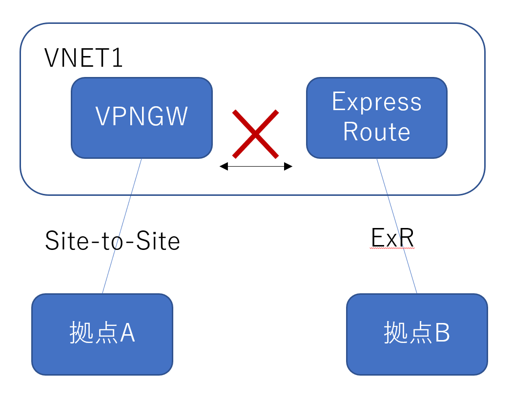
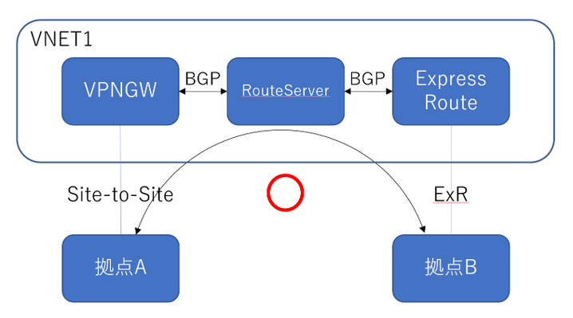

Azure VPN Gateway に関して、たびたびお問合せ頂く内容をご紹介させていただきます。  

# VPN Gateway 全般的な FAQ
### メンテナンスの事前通知
VPN Gateway ではサービスを健全に運用するため定期的(月に 1, 2 回程度 )のメンテナンスを実施いたします。  
メンテナンスでは数十秒程度の通信断が発生することがございますが、メンテナンスの __事前通知は行っておりません__  

### 事後にメンテナンス有無を確認する方法
メンテナンス実施時に診断ログにメンテナンス実行を示すイベントが記録されます。  
ログを確認することで、過去に発生した IPsec セッションの断がメンテナンスによるものかを確認することが可能です。  
複数種類のメンテナンスがあり、全メンテナンスでログが出力されるわけではございません。  
ログ上、メンテナンスとして記録されていない、意図せぬ申告なサービス断が発生した場合には Azure サポートにて調査をいたしますので、ケースオープンをしてお問い合わせ下さい。  

### ゲートウェイ共存環境における、ユーザ定義ルートの使用時の注意事項
VPN Gateway と ExpressRoute Gateway は同一仮想ネットワーク( 同一ゲートウェイ サブネット ) 配置できますが、__この環境ではユーザ定義ルートにてネクストホップ "仮想ネットワークゲートウェイ" とする経路は使用できません。__  
  
上記制限に該当するよくあるシナリオといたしましては次のようなものがあります。  
VPN Gateway を使用した site-to-site VPN ＋ 強制トンネリングの環境では、 ユーザ定義ルート 0.0.0.0/0 ネクストホップ 仮想ネットワークゲートウェイ の経路を設定いたします。  
しかし、この環境に ExpressRoute Gateway  を追加作成した場合、上記の制限に該当するため、強制トンネリングが無効となりますのでご注意ください。

# Site-to-Site に関する FAQ
### VPN Gateway で静的パブリック IP アドレスを使う方法
かねてより VPN Gateway に静的パブリック IP アドレスを割り当てたいというご要望を頂いておりましたが対応しておりませんでした。  
2020年9月現在でも、VpnGwX 等の通常の VPN Gateway SKU では静的 IP アドレスを使用することはできませんが、__ゾーン冗長 SKU VpnGwXAZ__ を選択いただくことで実現が可能です。  
  
非ゾーン冗長 SKU （VpnGwX ）から ゾーン冗長 VpnGwX SKU への変更には、VPN Gateway の再作成が必要となるため、VPN Gateway のアドレス変更が発生いたします。  

### VPN Gateway をトランジットした通信
VPN Gateway では Site-to-Site VPN 経由で接続された複数のサイト間の通信を行うことが可能です。  
この場合、 サイト と Azure 間の接続には必ず __BGP__ が必要になります。  
スタティック構成( BGP を使用しない構成 )での VPN Gateway トランジット構成はサポートされませんのでご注意下さい。  
  

### VPN Gateway, ExpressRoute 共存環境のデザイン
同一 VNET 内に ExpressRoute と VPN Gateway を配置することが可能です。  
しかし、VPN Gateway Site-to-Site 接続で接続された拠点 A と ExpressRoute 接続された拠点 B 間は、Azure 経由で通信を行うことはできません (__共存環境では GW 間のトランジット通信はできません__)  
  

__※追記__  
2021 年 9 月 より Route Server と呼ばれるサービスがリリースされました。  
Route Server の登場によって、ExpressRoute Gateway と VPN Gateway が BGP で学習した経路を双方の Gateway に広報することができるようになったため、ExpressRoute と S2S VPN 間のトランジット通信が可能となりました。  
Route Server の詳細および、ExpressRoute と S2S VPN 間のトランジットルーティングの詳細については、以下の公式ドキュメントをご参照下さい。

ExpressRoute と Azure VPN に対する Azure Route Server のサポートについて  
https://docs.microsoft.com/ja-jp/azure/route-server/expressroute-vpn-support

### BGP によるトラフィック制御方法
VPN Gateway では IPsec 上で BGP を使用してオンプレミスサイトと経路交換をすることができます。  
構成によっては複数の BGP Peer から同一のプレフィックスを受信することがございますが、その場合にはロードバランス( BGP multipath )の動作をいたします。  
特定の経路を優先させたい場合には、 AS-PATH プリペンド( AS-PATH 長が最も短い経路が優先 )をご使用頂けます。  
  
### VPN Gateway Active / Standby から Active / Active に変更した場合のコストについて
VPN Gateway Site-to-Site 接続 では以下のコストが発生いたします。  
  
1. VPN Gateway SKU   
2. Site-to-Site トンネル数( 11本以上のトンネルを作成する場合 )  
3. 送信トラフィック  
  
ご参考. VPN Gateway 価格表  
https://azure.microsoft.com/ja-jp/pricing/details/vpn-gateway/  
  
VPN Gateway Active / Active 構成では、 Active / Standby 構成と比較して、オンプレミスサイトとのトンネル数が2倍になります。  
接続オンプレミスサイトが多く、 Site-to-Site トンネル数が 10 を超える場合にはトンネル数に応じた課金(Site-to-Site トンネル数)が発生いたしますので、ご注意ください。  
  
合計トンネル数が 10 以下の環境では、 Active / Active と Active / Standby 構成で料金の差はございません。  
  
### IKE バージョン、トンネルモードの推奨設定について
VPN Gateway サービスでは、ゲートウェイ機器ベンダーと接続検証を実施しており、検証済ゲートウェイデバイスについては、以下サイトにてサンプルコンフィグをご提供しております。  
  
ご参考. 検証済みの VPN デバイスとデバイス構成ガイド  
https://docs.microsoft.com/ja-jp/azure/vpn-gateway/vpn-gateway-about-vpn-devices#validated-vpn-devices-and-device-configuration-guides  
  
検証済デバイスであっても、サンプルコンフィグに無い設定の組み合わせ( IKE バージョン, モード( ポリシーベース、ルートベース ) )では、接続性に問題が発生することがございます。  
オンプレミス ゲートウェイを設定の際には、__必ずサンプルコンフィグで使用している設定の組み合わせをご使用下さい__。  

未検証デバイス、未検証設定を用いて発生した不具合については、 Azure サポート窓口では解決のご支援ができないため、各 ゲートウェイ機器ベンダーにお問合せ下さい。  
Azure VPN Gateway では IKEv2 ルートベース設定が最も実績の多い組み合わせとなります。  
やむを得ず未検証デバイスを使用する場合には、IKEv2 ルートベースを第一候補として設定をお試いただくことを推奨いたします。  

# Point-to-Site に関する FAQ
### Azure VPN Client のインストール方法
Azure VPN Client をローカルファイルにダウンロードし、 PC にインストールしたいというご相談をいただきますが、 Azure VPN Client は ユニバーサル Windows プラットフォームアプリケーションとして開発しているため、必ず __Microsoft Store からのインストールが必要__ です。  

### VPN クライアントを使用する際の管理者権限
Windows クライアントの Point-To-Site 接続では、3種類の VPN クライアント アプリケーションをサポートしております。各クライアントの使用にあたり以下のタイミングで管理者権限( Administrator )が必要となります。  
  
admin 権限が必要な処理

| クライアントの種類 | クライアント app インストール時 | VPN 接続時 |
| --- | --- | --- | 
|Windows 標準の VPN クライアント (SSTP, IKE) | 標準インストール | 必要 |
|OpenVPN クライアント( OpenVPN )|必要|__不要__|
|Azure VPN クライアント( OpenVPN )|__不要__|__不要__|
  
VPN 接続する際に使用するユーザアカウントに管理者権限が付与できない場合、 OpenVPN クライアント、もしくは Azure VPN クライアントを使用することで問題を回避できることがあります。  

### P2S クライアントにおけるフルトンネル設定の可否
一般的に VPN クライアントが、全トラフィックを VPN 経由で行う設定をフルトンネル、一部トラフィックのみ VPN 経由で行う設定をスプリットトンネルと呼ばれておりますが、 Azure VPN Gateway 接続では __スプリットトンネルのみサポート__ します。  
もしフルトンネルで Azure VNET と接続する必要がある場合には、サードパーティ製の NVA をご使用下さい。  

### P2S 経由でのインターネット、 Azure PaaS サービスへのアクセス  
P2S クライアントは Azure VPN Gateway を経由させて、インターネット, PaaS サービスにダイレクトにアクセスすることはできません。  
  
もし、P2S クライアントから Azure VPN Gateway 経由でインターネットアクセスする場合には、 Azure 上に Proxy サーバを構築し、 Proxy を経由させることでインターネットにアクセスさせる必要がございます。  
