# Active / Active で構成された VPN Gateway における Basic SKU の Public IP アドレスのマイグレーションについて

こんにちは、Azure テクニカル サポート チームです。

先日、Basic SKU の Public IP アドレスを利用している Azure VPN Gateway のマイグレーションについて、当ブログにて公開させていただきました。

[Basic SKU の Public IP アドレスを使用している Azure VPN Gateway のマイグレーションについて（Basic SKU VPN Gatewayは除く）](https://jpaztech.github.io/blog/network/vpngw-basicip-migration/)

Basic SKU の Public IP アドレスを利用している Azure VPN Gateway のマイグレーションは、以下の 3 つのパターンが存在いたしますので、VPN Gateway の構成をご確認の上、どのパターンのマイグレーションを行う必要があるかご確認ください。

A. Active / Standby 構成\
B. Active / Active 構成 + ポイント対サイト VPN（P2S VPN）構成無し\
C. Active / Active 構成 + ポイント対サイト VPN（P2S VPN）構成有り

A. Active / Standby 構成および B. Active / Active 構成 + ポイント対サイト VPN（P2S VPN）構成無しのパターンにつきましては、上述のブログを参照いただくことでマイグレーションが可能でございますが、
C. Active / Active 構成で、且つポイント対サイト VPN（P2S VPN）が構成された VPN Gateway では、作業時にいくつか考慮する点があるため、手順をご紹介いたします。

Active / Active 構成かつ P2S VPN が設定されている VPN Gateway の Public IP アドレスを Basic から Standard SKU に切り替える手順でも、作業は大きく分けて、以下の 3 つの工程になります。
 
1. Prepare（準備）
2. Migrate（移行実行）
3. Commit（確定）
 
各工程の詳細な手順について以下におまとめいたします。

## 事前準備

### Standard SKU の Public IP アドレスの作成

Prepare（準備）の手順にて、P2S 接続で利用する Standard SKU の Public IP アドレス を指定します。
指定する Public IP アドレス は<mark>必ずゾーン冗長の設定がされていない Public IP アドレス を作成</mark>する必要があります。
 
なお、現在、ゾーン冗長構成がされていない Public IP アドレス は Azure ポータル上では作成することができないため、コマンドを用いて作成します。

下記に、PowerShell のコマンド例を添付いたしますので、移行作業の前に予め Public IP アドレス の準備をお願いします。
 
 ``` Powershell
New-AzPublicIpAddress -Name <Public IP アドレスのリソース名> -ResourceGroupName <リソース グループ名> -Location <VPN Gateway のリージョン> -Sku Standard -AllocationMethod Static
```

### P2S 接続における "cloudapp.net" FQDN の使用有無の確認

P2S 接続に "cloudapp.net" で終わる FQDN を使用して VPN Gateway へ接続されているかを事前にご確認ください。  
確認方法については、下記の公開ドキュメントをご参照ください。

- [P2S 構成で FQDN が使用されているかどうかを確認する - Azure VPN Gateway](https://learn.microsoft.com/ja-jp/azure/vpn-gateway/basic-public-ip-migrate-howto?tabs=portal#check-if-your-p2s-configuration-uses-fqdn)

"cloudapp.net" の FQDN を使用している場合は、Prepare（準備）完了後に追加の手順が必要となりますので、事前にご確認をお願いいたします。

## 1. Prepare（準備）
マイグレーション ツール画面を開くには、Azure ポータルで対象の VPN Gateway リソースを選択し、［構成］→［Migrate to Standard IP］をクリックしてください。

移行ツールを開くと、自動的に構成の検証が実行されます。

問題がなければ「Succeeded」と表示され、「検証」は完了となります。
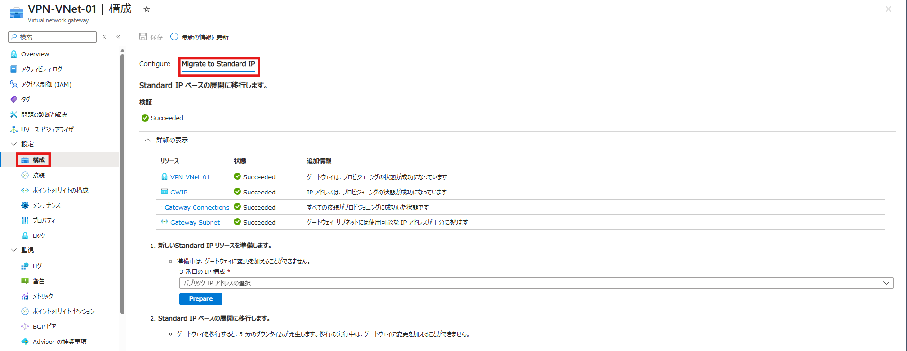
 
"1. 新しいStandard IP リソースを準備します。" の項目に、事前準備で作成した Standard SKU の Public IP アドレス を選択し [Prepare] をクリックすると、マイグレーションの準備が開始され、移行先の VPN Gateway が作成されます。

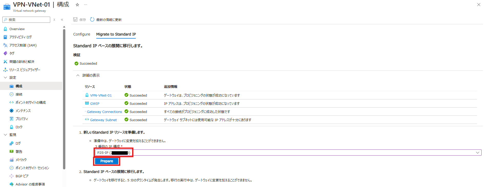
 
なお、上記作業を実施すると通知で 「移行の準備に失敗しました」 といった下記のような表示がされる場合があります。  
こちらについては、Azure ポータル上での表示上の事象であり、内部的には失敗していないため、そのまま作業を継続してください。

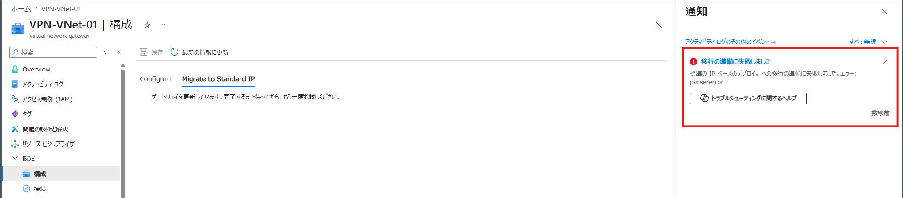
 
[Overview] をクリックしていただき、上部に 「更新中」 と表示されいることを確認し、移行の準備が進行中であることをご確認ください。  
なお、[Overview] をクリックする際に下記のポップアップが表示されますが、[OK] を選択してください。(移行処理は引き続き行われますのでご安心ください。)

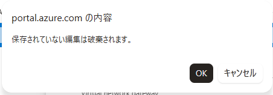
 
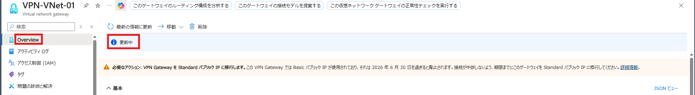
 
上記画面の [最新の情報に更新] をクリックして 「更新中」 が消えていることを確認します。

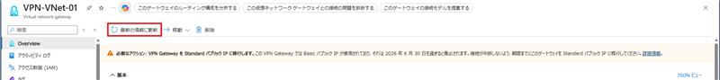

「更新中」 が消えたら [構成] から [Migrate to Standard IP] をクリックして移行画面へ移動します。

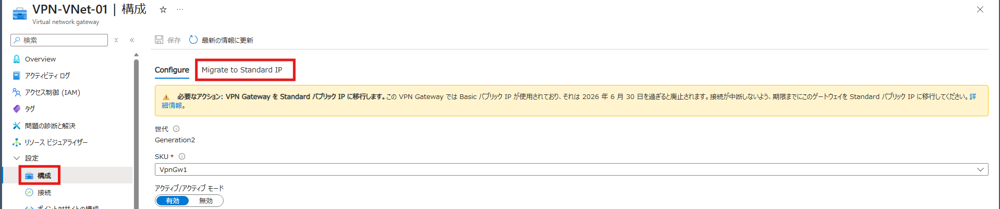
 
準備が完了すると、次のステップである［Migrate］および［Abort］が表示されます。

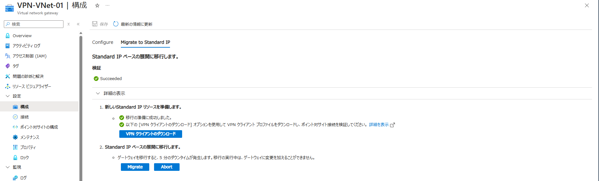
 
なお、P2S 接続に “cloudapp.net” で終わる FQDN を使用して VPN Gatewayへ接続されている場合は、準備完了後に [VPN クライアントのダウンロード] を選択し、更新された VPN クライアント プロファイル（ZIP ファイル）をダウンロードしてください。  
※ “cloudapp.net” の FQDN を利用されていない場合は、VPN クライアント プロファイル（ZIP ファイル）のダウンロードは不要です。

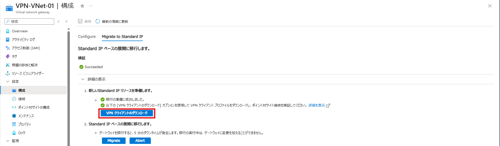
 
その後、ダウンロードしたプロファイルを使用して再接続を行い、ポイント対サイト（P2S）接続が可能であることを確認してください。
 
## 2.  Migrate（移行実行）
作業を進める場合は、［Migrate］をクリックします。  
※この段階で作業をキャンセルする場合は、［Abort］をクリックしていただくことで、準備ステップで作成されたリソースが削除され、作業開始前の状態に戻ります。

本ステップにて、実際の Public IP アドレスの SKU 移行作業が実行され、最大で約 5 分程度の通信断が発生する可能性があります。

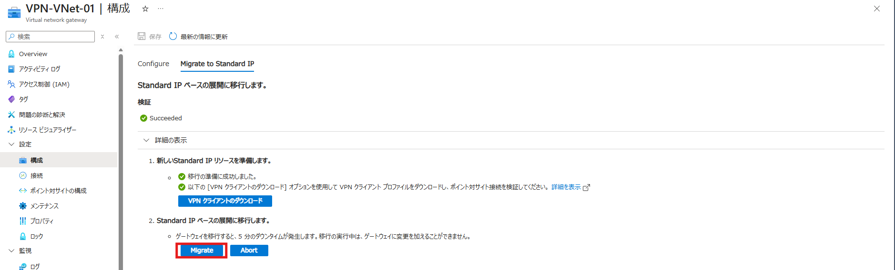

なお、SKU を変更しても、VPN Gatewayで使用されている Public IP アドレス自体は変更されませんのでご安心ください。

移行が完了すると、最後のステップとして［Commit］および［Abort］のボタンが表示されます。

ツール上には新しい Gateway でのトラフィック処理状況が表示されますので、トラフィックが正常に流れていることをご確認ください。

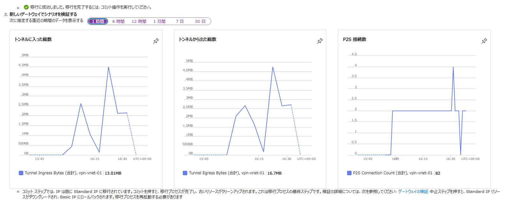
 
## 3. Commit（確定）
Migrate の作業後にトラフィックが正常に流れていることを確認できましたら、［Commit］をクリックしてください。  
※ [Commit] を選択せずに、[Abort] を選択いただくことで、切り戻しが可能です。

なお、［Commit］実行後は切り戻しができませんので、ご注意ください。

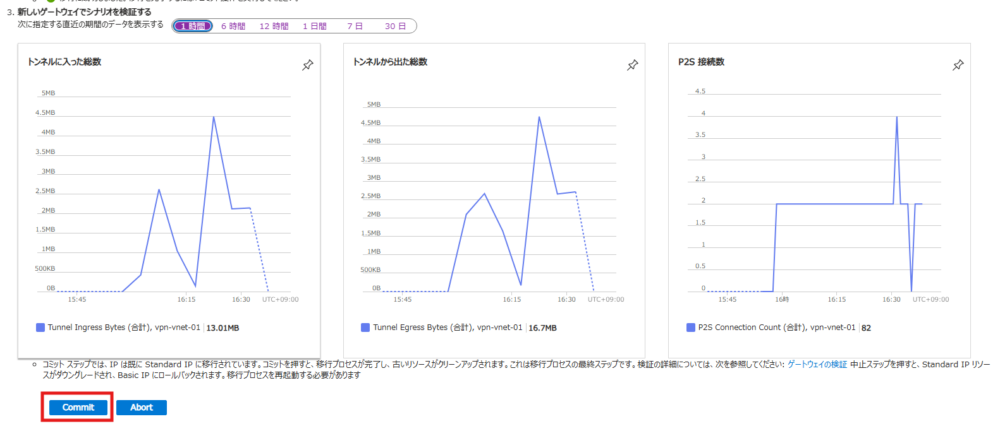

このステップでは、移行により不要となったリソースのクリーンアップ処理が実行されます。
 
下記のよう 「コミットされた移行」 の通知が出て、「コミットが成功しました。」 と表示されていれば移行作業完了です。

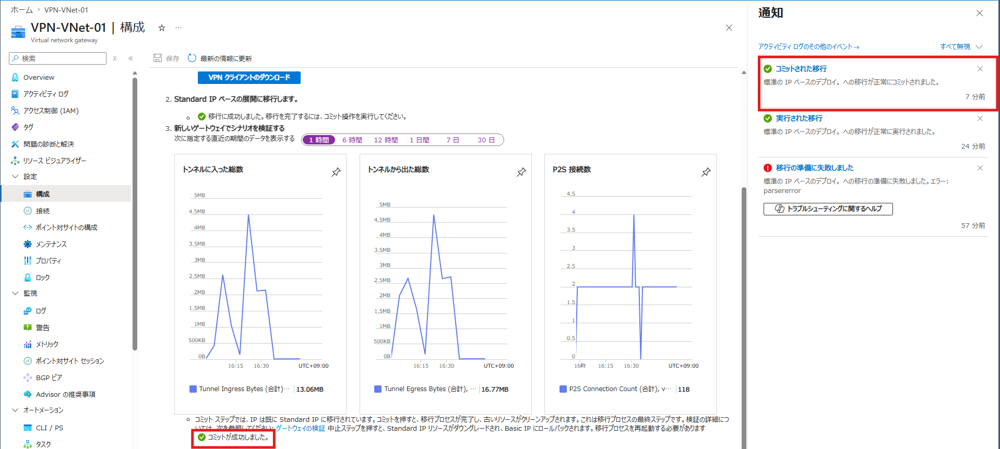
 
コミットが完了しましたら、[プロパティ] の項目の ”最初のパブリック IP アドレス” および ”2 番目のパブリック IP アドレス” のリンクを選択し、


Public IP アドレス の SKU が Standard になっていることをご確認ください。


---

以上、Active / Active 構成の VPN Gateway における Basic SKU Public IP アドレスのマイグレーション手順のご紹介でした。  
本記事が少しでも皆様のお役に立てれば幸いです。