こんにちは、Azure テクニカル サポート チームです。 
この記事では、Azure VPN Gateway において Basic SKU の Public IP アドレスを使用している場合の標準的なマイグレーション手順と作業時の注意点をご紹介します。 
また、この記事でご紹介する内容は動画でもご紹介しております。 
動画では Azure Portal を使用して実際に移行する手順をご確認いただけますので、こちらも併せてご活用ください。 

<video src="./vpngw-basicip-migration/[VPN Gateway] About the Basic Public IP Migration 8.mp4" controls="true" width="640" height="400"></video>

<!-- more -->

# Azure Public IP アドレス リソースの SKU
Azure の Public IP アドレス リソースには、Basic および Standard の 2 種類の SKU が用意されています。 
Azure VPN Gatewayにおいては、環境によって Basic SKU の Public IP アドレスが利用されているケースがあります。 
Basic SKU の Public IP アドレスは順次サービス終了が予定されているため、Basic SKU から Standard SKU へのマイグレーション作業が必要となります。 

 

# 1. マイグレーションの対象となるGatewayの条件
マイグレーションの対象となるGatewayの条件は、下記の表のとおりです。 

| VPN Gateway SKU                              | 本マイグレーション作業 要/不要 |
|---------------------------------------------|-------------------------------|
| Basic SKU                                   | 別の対応が必要 ※ 商用ワークロードの使用は非推奨 |
| Standard SKU                                | **必要** |
| High Performance SKU                        | **必要** |
| VpnGw [1–5] SKU + Basic SKU Public IP       | **必要** |
| VpnGw [1–5] SKU + Standard SKU Public IP    | 不要 |
| VpnGw [1–5] AZ SKU                          | 不要 |

 

VPN Gatewayの SKU は、Azure ポータルで対象のGateway リソースを選択し、［概要］画面からご確認いただけます。 
また、Public IP アドレスの SKU については、Public IP アドレスのリンクをクリックし、［概要］画面からご確認いただけます。 
これらをご確認のうえ、ご利用中のGatewayがマイグレーション対象に該当するかをご確認ください。 

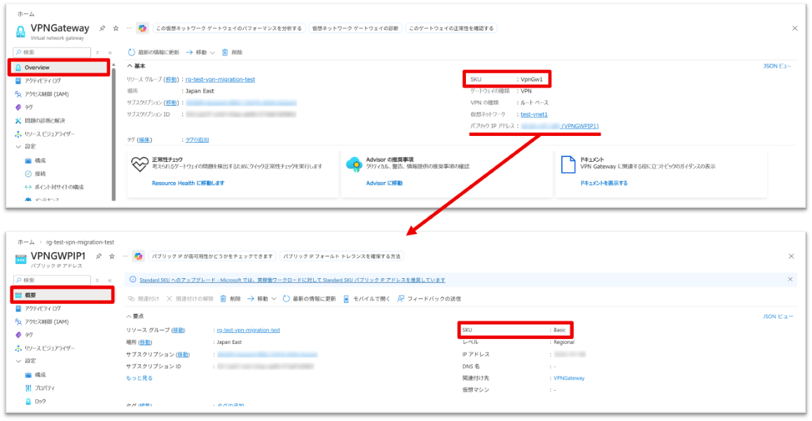

 

# 2. マイグレーションの手順
## 2-1. マイグレーションの流れ - 検証
実際のマイグレーション作業の流れについてご案内いたします。 
マイグレーションは、「検証」「準備」「移行」「コミット」の 4 つのステップで進行します。 
マイグレーション ツール画面を開くには、Azure ポータルで対象の VPN Gateway Gateway リソースを選択し、［構成］→［Migrate to Standard IP］をクリックしてください。 
移行ツールを開くと、自動的に構成の検証が実行されます。 
問題がなければ「Succeeded」と表示され、「検証」は完了となります。 

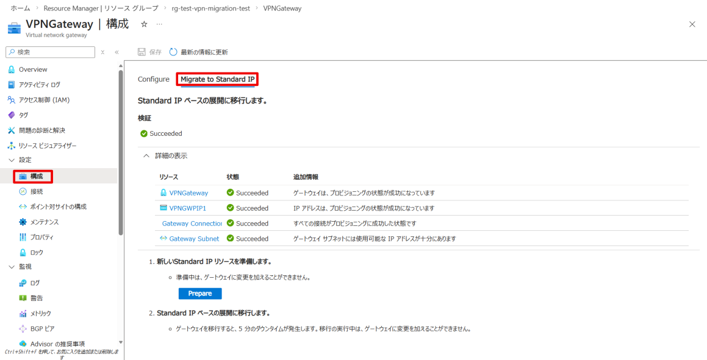

 

## 2-2. マイグレーションの流れ - 準備
次に［Prepare］をクリックすると、マイグレーションの準備が開始され、移行先の VPN Gatewayが作成されます。 

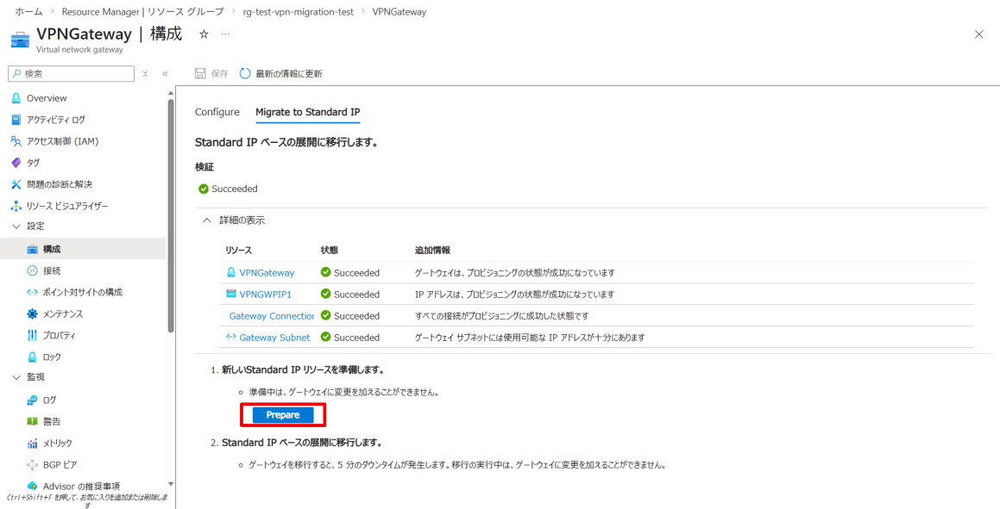

このステップの完了にはおおよそ 30 分程度かかりますが、本ステップ中に通信影響は発生しません。 

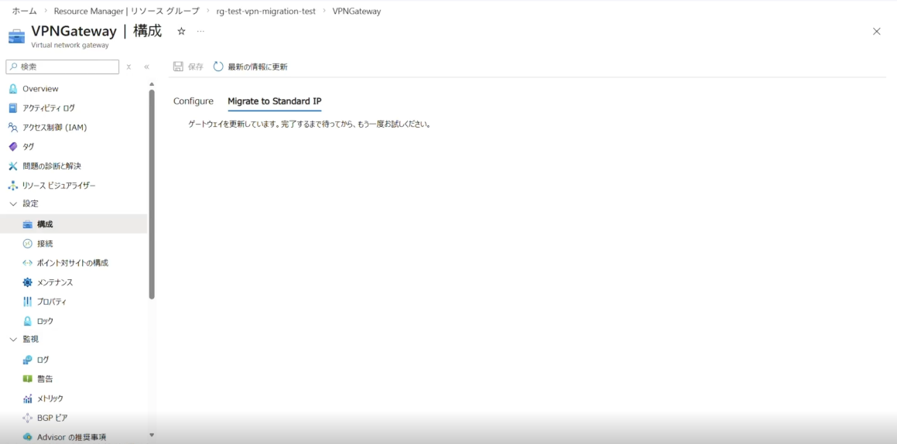

準備が完了すると、次のステップである［Migrate］および［Abort］が表示されます。 

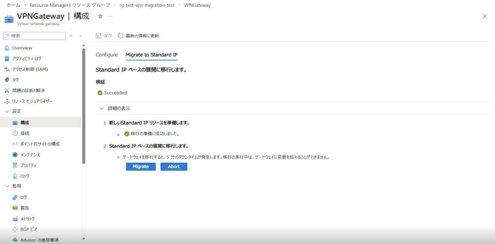

 

なお、P2S 接続に "cloudapp.net" で終わる FQDN を使用して VPN Gatewayへ接続されている場合は、準備完了後に [VPN クライアントのダウンロード] を選択し、 
更新された VPN クライアント プロファイル（ZIP ファイル）をダウンロードしてください。 

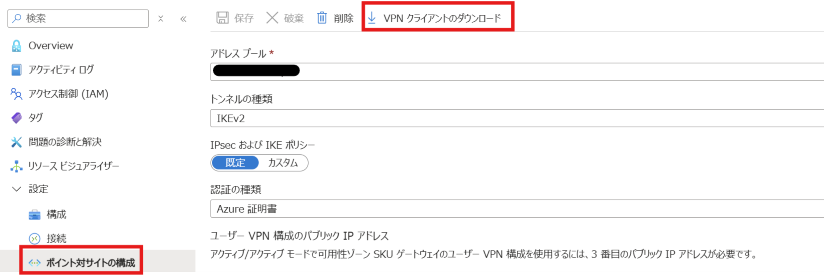

その後、ダウンロードしたプロファイルを使用して再接続を行い、ポイント対サイト（P2S）接続が可能であることを確認してください。 
*(※ご利用中の VPN Gatewayが対象であるかどうかの確認方法は [Gatewayでレガシ DNS が使用されているかどうかを確認する](https://learn.microsoft.com/ja-jp/azure/vpn-gateway/basic-public-ip-migrate-howto?tabs=portal#check-if-your-gateway-uses-legacy-dns) をご参照ください。

 

## 2-3. マイグレーションの流れ - 移行
次のステップは「Migration」です。
この段階で作業をキャンセルする場合は、［Abort］をクリックしてください。 
これにより、準備ステップで作成されたリソースが削除され、作業開始前の状態に戻ります。 
作業を進める場合は、［Migration］をクリックします。 
本ステップにて、実際の Public IP アドレスの SKU 移行作業が実行され、<strong>最大で約 5 分程度の通信断が発生する可能性があります。</strong> 

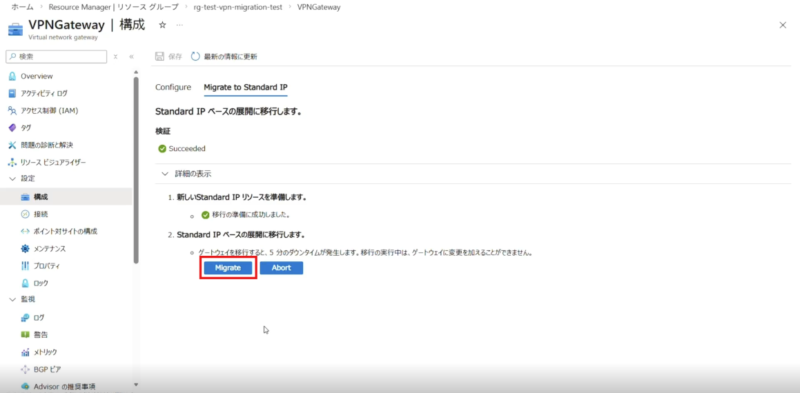

<strong>※移行を行っている途中で VPNGateway の状態が Failed で表示されることがございますが、完了時には Succeeded に変わりますのでご安心ください。</strong> 

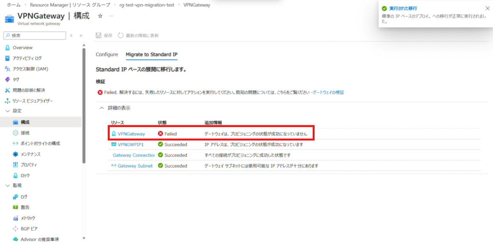

なお、SKU を変更しても、VPN Gatewayで使用されている Public IP アドレス自体は変更されませんのでご安心ください。 
移行が完了すると、最後のステップとして［Commit］および［Abort］のボタンが表示されます。 
ツール上には新しいGatewayでのトラフィック処理状況が表示されますので、トラフィックが正常に流れていることをご確認ください。 

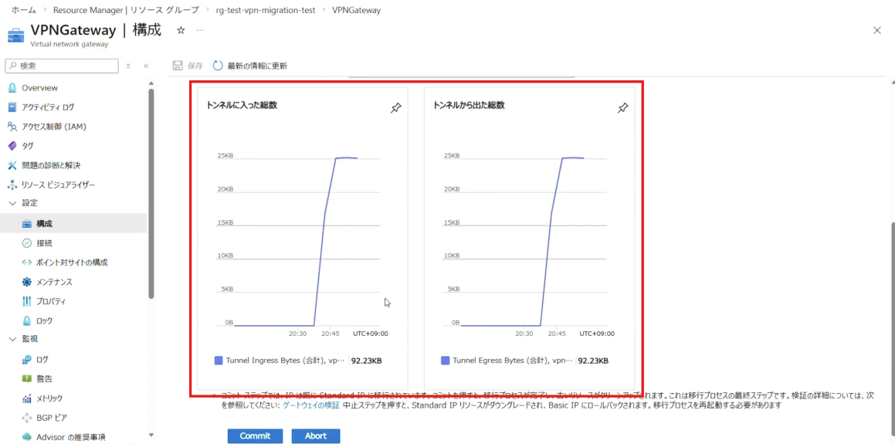

*（※ P2S 接続のみの環境ではトラフィック処理状況は表示されないため、クライアントから移行後の VPN Gatewayへ P2S 接続が可能か確認してください。）*  
万一、問題が確認された場合は、［Abort］を選択することで作業前の状態に戻すことが可能です。

 

## 2-4. マイグレーションの流れ - コミット
トラフィックが正常に流れていることを確認できましたら、［Commit］をクリックしてください。 
なお、［Commit］実行後は切り戻しができませんので、ご注意ください。 

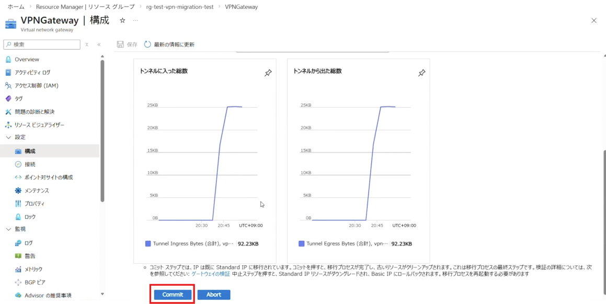

このステップでは、移行により不要となったリソースのクリーンアップ処理が実行されます。 
本処理にはおよそ 15 分程度かかります。 

［Commit］が完了すると、VPN Gatewayで使用されている Public IP アドレスの SKU が Standard に変更され、マイグレーション作業は完了となります。 

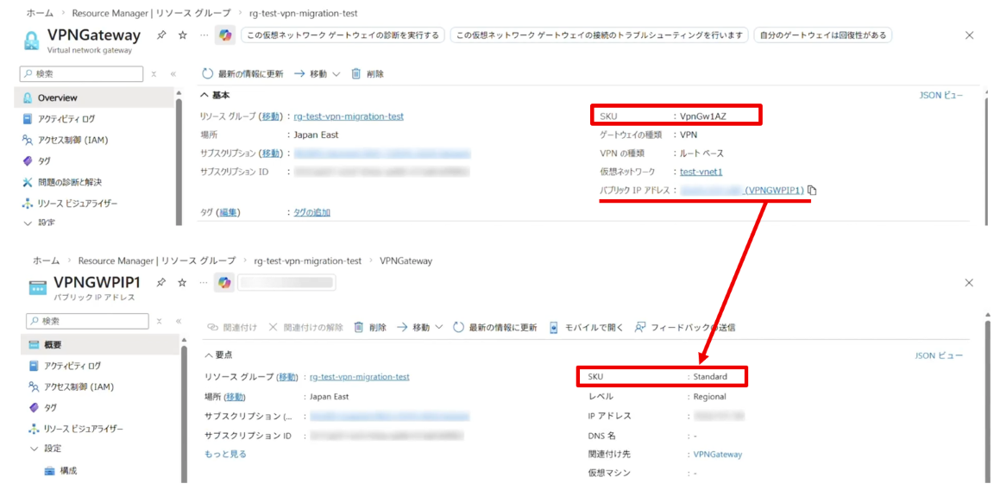

 

# 3. まとめ
VPN Gatewayで Basic SKU の Public IP アドレスを使用している場合のマイグレーション手順についてご紹介しました。 
本マイグレーション作業は、すべて Azure Portalから実行可能です。 
公式ドキュメントには、より詳細な情報や補足事項も記載されていますので、作業を実施される前にあわせてご確認ください。 
[Basic SKU パブリック IP アドレスを VPN Gateway 用に Standard SKU に移行する方法](https://learn.microsoft.com/ja-jp/azure/vpn-gateway/basic-public-ip-migrate-howto?tabs=portal)
