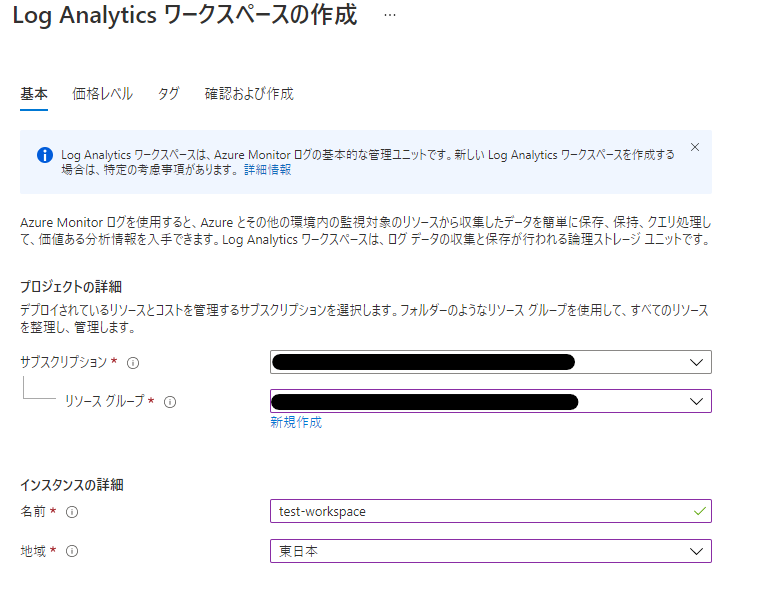
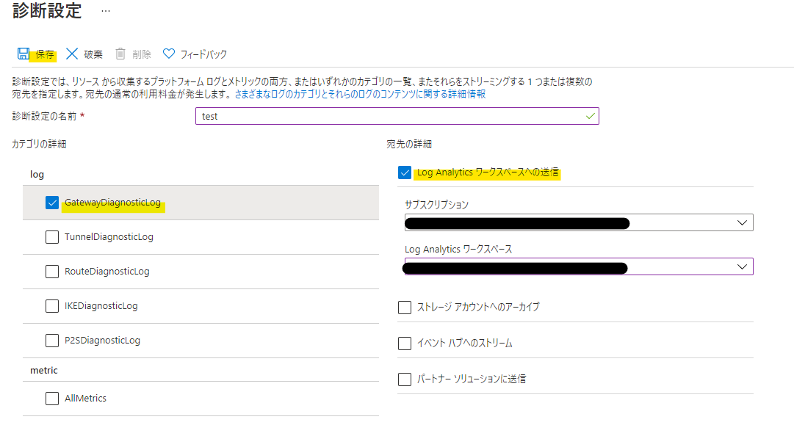
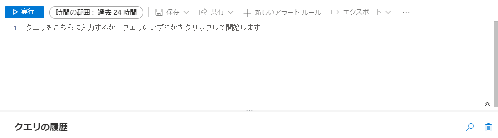
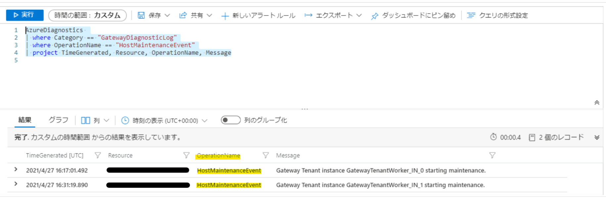

こんにちは、Azure サポートチームです。
今回は、Azure でお使いいただいている VPN ゲートウェイにおいて、メンテナンスが行われていたことを事後確認する方法をご紹介します。  
今回ご紹介する内容については以下の前提条件の下記載されておりますので予めご了承ください。
 
**前提**
- メンテナンスの日時を事前に確認する方法ではなく、あくまで事後に確認する方法になります。
- VPN ゲートウェイに対する全てのメンテナンスを対象としてはおらず、種類によってはお客様自身でメンテナンスの形跡をご確認をいただけない場合もあります。


**目次**  
- はじめに  
- 診断ログとは  
- 診断ログ設定の事前準備  
- 診断ログの設定方法  
- 診断ログよりメンテナンスの形跡を確認する方法  
- 最後に  

## はじめに  
Azure の サイト間 VPN (S2S VPN) をご利用いただいているお客様より、一時的に S2S VPN の切断が発生したというお問い合わせをいただくことがあります。  
インターネットを経由して接続される S2S VPN の切断は様々な要因によって発生致しますが、VPN ゲートウェイに対して行われるメンテナンスもその主たる要因の一つです。  
VPN ゲートウェイでは健全なサービス運用及び品質維持のため、不定期にメンテナンスが行われ、この作業は数十秒から数分程度の一時的な S2S VPN の切断を伴う場合があります。  
VPN ゲートウェイに対するメンテナンスについては事前通知が行われておらず、残念ながら計画された予定を把握いただくことはできません。  
一方で、ご利用いただいている S2S VPN において一時的な切断を検知する度に、それがメンテナンスによるものか否かをサポートにお問い合わせいただくのは、大変お手間かと思います。  
 
そこで今回は、お客様自身で VPN ゲートウェイにメンテナンスが行われたことを確認する方法をご紹介いたします。  
VPN ゲートウェイのメンテナンスには多岐にわたる種類があり、全てのメンテナンスを事後確認できるわけではないのですが、一部でもお客様自身でご確認をいただければご負担も減ると思いますのでご一読ください。

## 診断ログとは
VPN ゲートウェイのメンテナンスの形跡を確認するためには、対象のリソースに対して診断ログという機能を有効にします。  
診断ログは Azure で提供される様々なサービスにおいて利用することが可能で、主に特定のリソースに関わるイベントや、そのリソースの状態を表す情報をログとして取得する機能です。  
VPN ゲートウェイで取得できる診断ログには下記の様に複数の種類があり、欲しい情報に応じてどのログを取得するかを選択できます(複数種類のログを取得することも可能です)。  

* **GatewayDiagnosticLog**  
ゲートウェイ構成イベント、主要な変更、メンテナンス イベントのリソース ログが含まれています。
* **TunnelDiagnosticLog**  
トンネルの状態変更イベントが含まれています。 トンネルの接続/切断イベントには、状態変更の理由の概要があります (該当する場合)。
* **RouteDiagnosticLog**  
ゲートウェイで発生する静的ルートへの変更および BGP イベントがログに記録されます。
* **IKEDiagnosticLog**  
ゲートウェイ上の IKE コントロールのメッセージおよびイベントがログに記録されます。
* **P2SDiagnosticLog**  
ゲートウェイ上のポイント対サイト コントロールのメッセージおよびイベントがログに記録されます。 接続ソース情報は IKEv2 接続に対してのみ提供されます。
 
(ご参考)   
[VPN Gateway からのリソース ログ イベントにアラートを設定する](https://docs.microsoft.com/ja-jp/azure/vpn-gateway/vpn-gateway-howto-setup-alerts-virtual-network-gateway-log)
 
ご覧の通り VPN ゲートウェイ自身や S2S VPN / P2S VPN接続に関する様々な情報を取得できる診断ログですが、今回の主題であるメンテナンスの確認には、 "GatewayDiagnosticLog" という種類のログを使用します。
 
## 診断ログ設定の事前準備
診断ログは、設定時に指定したサービスに出力され、その内容を確認することができます。  
出力先には、Log Analytics ワークスペース、ストレージアカウント、及びイベントハブが指定可能です。  
これらの出力先を複数指定する(例えば Log Analytics ワークスペースに診断ログを出力しつつ、ストレージアカウントにも保存する)ことも可能ですが、今回は検索のし易さや出力結果の可読性を考慮して Log Analytics ワークスペースを出力先に指定する手順をご紹介します。
 
診断ログを設定する前に、出力先として指定する Log Analytics ワークスペースを作成しておく必要があります。
Log Analytics ワークスペースの作成方法は、以下の通りです。
 
1. Azure ポータルより「すべてのサービス」を選択します。
2. 「モニター」のカテゴリより、「Log Analytics ワークスペース」という項目を選択します。
3. 「Log Analytics ワークスペース」の画面で「＋ 追加」を選択します。
4.  Log Analytics ワークスペースの作成画面にて、サブスクリプションとリソースグループ、リソースの名称及びリージョンを指定します。
 
(Log Analytics ワークスペース作成画面例)


 
上記の手順はこちらのドキュメントで紹介されている手順 1 から手順 3 までの部分に該当致しますので、併せてご確認ください。

(ご参考)  
[Azure portal でアラートを設定する](https://docs.microsoft.com/ja-jp//azure/vpn-gateway/vpn-gateway-howto-setup-alerts-virtual-network-gateway-log#set-up-alerts-in-the-azure-portal)
 
 
## 診断ログの設定方法  
Log Analytics ワークスペースの作成が完了しましたので、次に仮想ネットワークゲートウェイの診断ログを設定します。  
具体的な診断ログの設定方法は、以下の通りです。  

1. Azure ポータルより「すべてのサービス」を選択します。
2. 「モニター」のカテゴリより、「モニター」という項目を選択します。
3. 「モニター」の画面で左側のペインより「診断設定」を選択します。
4. 「診断設定」の画面にて、サブスクリプションとリソースグループを指定し、対象の VPN ゲートウェイ(仮想ネットワークゲートウェイ)を選択します。
5. 「+ 診断設定を追加する」を選択します。
6. 診断ログ設定自体の名称を設定し、取得したいログ(今回は最低限 "GatewayDiagnosticLog" )にチェックを入れ、出力先を指定し保存します。
 
(診断ログ設定画面例)

 
上記の手順はこちらのドキュメントで紹介されている手順 4 から手順 6 までの部分に該当致します。  
Azure ポータルのスクリーンショット情報もあるので、よこちらもご参照ください。  
 
(ご参考)  
[Azure portal でアラートを設定する](https://docs.microsoft.com/ja-jp//azure/vpn-gateway/vpn-gateway-howto-setup-alerts-virtual-network-gateway-log#set-up-alerts-in-the-azure-portal)
 
なお、診断ログは設定を行った以後より取得が行われるため、設定を行う以前のログを遡って確認することはできない点予めご了承ください。  
また、診断ログの設定後、実際にログの情報が取得開始されるまでには数時間程度かかる場合がございます。
 
## 診断ログよりメンテナンスの形跡を確認する方法
診断ログを有効化したら、 VPN ゲートウェイにおけるメンテナンスの形跡を確認する準備が整いました。  
ここで、先の手順で診断ログの出力先に指定した Log Analytics ワークスペースより、メンテナンスの形跡を含む内容があるかを確認してみます。
 
1. Azure ポータルより「すべてのサービス」を選択します。
2. 「モニター」のカテゴリより、「Log Analytics ワークスペース」という項目を選択します。
3. 診断ログの出力先として指定した Log Analytics ワークスペースを選択します。
4. 「Log Analytics ワークスペース」の画面で左側のペインより「ログ」を選択します。
5. クエリの入力欄診断ログの内容を検索するクエリを入力の上、「時間の範囲」を S2S VPN 切断を検知した時間帯を含む値に設定し「実行」を押下します。
 
(Log Analytics ワークスペース　クエリ実行画面例)

 
入力するクエリの具体例として、下記を Log Analytics ワークスペース上で実行いただくことで、メンテナンスの情報を含む "GatewayDiagnosticLog" の内容を検索することが可能です。  
このクエリで条件として指定している OperationName == "HostMaintenanceEvent" という部分が、メンテナンスの形跡を示すものです。
 
```
AzureDiagnostics 
| where Category == "GatewayDiagnosticLog"
| where OperationName == "HostMaintenanceEvent"
| project TimeGenerated, Resource, OperationName, Message
```
 
上記クエリの実行結果に該当する診断ログが見られる場合、メンテナンスが発生したと判断できます。  
その場合、以下の画像のように "OperationName " フィールドが "HostMaintenanceEvent" である実行結果が確認できます。  

(Log Analytics ワークスペース　クエリ実行結果画面例)


なお、診断ログの内容を検索するためのクエリについては、お客様自身で適宜カスタマイズいただくことができます。  
例えば複数の VPN ゲートウェイで診断ログを取得しているような環境で、リソース名で対象をフィルターしたい場合には、下記のように "Resource" フィールドを追加してください。  
```
AzureDiagnostics 
| where Category == "GatewayDiagnosticLog"
| where OperationName == "HostMaintenanceEvent"
| where Resource == "VPNGW01"
| project TimeGenerated, Resource, OperationName, Message
```
 
その他、診断ログを検索する期間については Azure ポータル上からも設定できますが、クエリで日付や時間帯を指定したい場合は "TimeGenerated" フィールドでフィルターすることも可能です。
```
AzureDiagnostics 
| where TimeGenerated > datetime("2021/04/27T04:00:00") and TimeGenerated < datetime("2021/04/27T06:00:00")
| where Category == "GatewayDiagnosticLog"
| where OperationName == "HostMaintenanceEvent"
| project TimeGenerated, Resource, OperationName, Message
```

このように、 S2S VPN の接続断を検知した時間帯付近の診断ログの内容を確認することで、お客様ご自身で迅速にメンテナンスの形跡を確認できますので是非ご活用ください。  
もし今回ご紹介した方法を用いてもメンテナンスの形跡を確認できず、なおかつ S2S VPN の対向側となるお客様環境にも問題が見受けられない場合には、お気兼ねなく Azure サポートまでお問い合わせください。  

## 最後に
最後に、メンテナンスの事後確認とは別の観点でございますが、メンテナンスによる S2S VPN への影響を最小化するために、VPN ゲートウェイを  Active / Active で運用する構成についてもご紹介いたします。

VPN ゲートウェイは内部的に 2 台インスタンスを所有しており、デフォルトではうち 1 台が Active として稼働している Active /Standby の状態で構成されます。  
VPN ゲートウェイのメンテナンスはこの 2 台のインスタンスに対して順番に行われ、それに伴いフェイルオーバーが生じます。  

一方 Active / Active でVPN ゲートウェイを構成した場合、 2 台のインスタンスが同時に Active で稼働するため、常時 2 本の VPN トンネルが構成可能です。  
片方のインスタンスにメンテナンスが行われている間も、もう片方のインスタンスと構成している VPN トンネルが維持されることから、メンテナンス時におけるエンドツーエンドの接続性への影響を軽減できます。  

VPN ゲートウェイの Active / Active 構成については以下ドキュメントにも記載がございますので、ご参照ください。  

(ご参考)  
[高可用性のクロスプレミス接続および VNet 間接続](https://docs.microsoft.com/ja-jp/azure/vpn-gateway/vpn-gateway-highlyavailable)
