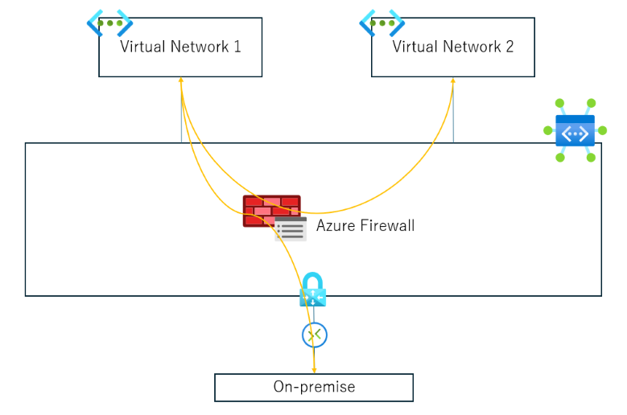
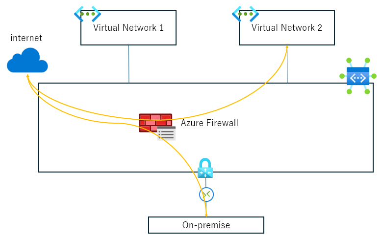
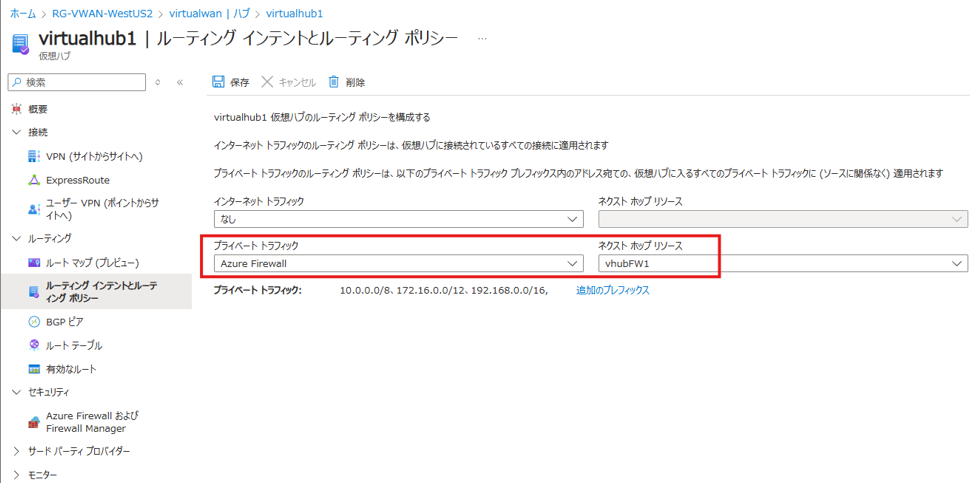
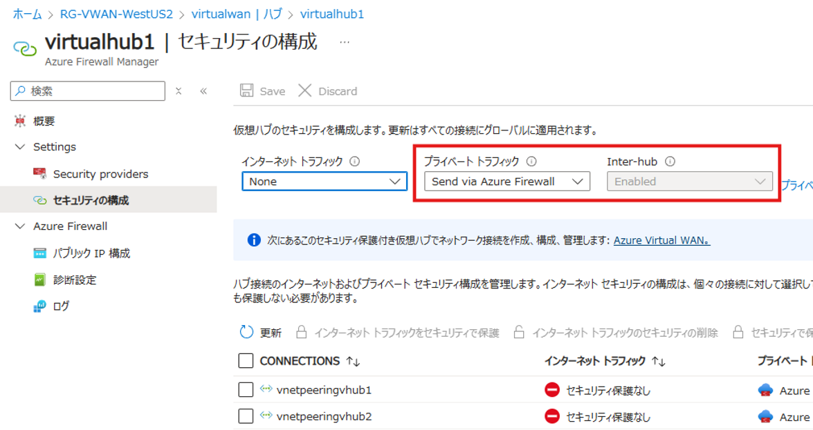
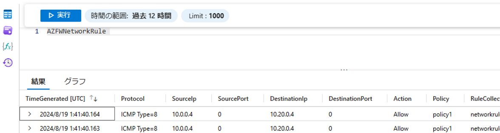

こんにちは、Azure テクニカル サポート チームです。  
Virtual WAN では、仮想ハブと接続されている仮想ネットワーク、および各ブランチ (サイト間  VPN (S2S VPN)、ExpressRoute、およびユーザー VPN (P2S VPN)) 間の接続が可能になります。  
(以下、この仮想ネットワークや各ブランチと仮想ハブとの接続を、「接続」と表記します。)  
この接続において、仮想ハブ内にデプロイした Azure Firewall を経由させることができますので、ご紹介させていただきます。  

**目次**  
- はじめに - セキュリティ保護付き仮想ハブとは -
- セキュリティ保護付き仮想ハブをご利用いただくメリット
- ルーティング インテントとルーティング ポリシーの構成方法について
- ルーティング インテントとルーティング ポリシーを構成した後の通信確認例 
- 最後に  

## はじめに - セキュリティ保護付き仮想ハブとは -
Virtual WAN においては、上述したとおり複数の接続間で通信が可能となる反面、例えば、  
- ある Vnet は他の Vnet とは接続させたいがブランチとは接続させたくない  
- ある Vnet は他の Vnet とは接続させたくないがブランチとは接続したい  

といった、お互いに接続したい要件と接続させたくない要件が両立する場合など、仮想ハブを介した接続同士で通信制御を行いたい場合は考慮が必要となります。  
また、各接続からインターネットに接続するにあたり、一度 Azure Firewall を経由させることで、通信のフィルターを行いたい、というご要件もあるかと存じます。  
 
上述したようなご要件に対応する方法として、Virtual WAN をご利用いただき、かつ仮想ハブとしてセキュリティ保護付き仮想ハブをご利用いただけます。  
セキュリティ保護付き仮想ハブとは、ハブとスポークの構成を提供する仮想ハブとしての機能に加え、Azure Firewall の機能、
および Azure Firewall や Network Virtual Appliance (NVA) を経由するためのルーティング機能がセットになっている仮想ハブとなります。  

## セキュリティ保護付き仮想ハブを用いた構成例
ひとつの Virtual WAN に一つのセキュリティ保護付き仮想ハブのみをご利用いただく場合、以下のような接続形態を提供します。  
なお、複数の仮想ハブをまたがる構成においてご利用いただくことも可能ですが、ここでは一つのセキュリティ保護付き仮想ハブのみをご利用いただいている場合を例にご説明します。  
 
### 構成例 1. プライベートな通信間を Azure Firewall にてフィルター  
 
以下のような接続形態になります。  
> (各接続) - (仮想ハブ内の Azure Firewall) - (各接続)  

■構成例 1 の図  

具体的には、以下のような各通信が該当します。  
・仮想ネットワーク間の接続 (V2V)  
・ブランチ間の接続 (B2B)  
・ブランチと仮想ネットワーク (B2V)  
 
### 構成例 2. インターネットへの通信を Azure Firewall にてフィルター  

以下のような接続形態になります。  
> (各接続) - (仮想ハブ内の Azure Firewall) - (インターネット)  

■構成例 2 の図  

具体的には、以下の通信が該当します。  
・仮想ネットワークからインターネットに向けた接続 (V2I)  
・ブランチからインターネットに向けた通信において Azure Firewall を通したい場合 (B2I) (*ご参考)  

> (*ご参考)  
> こちらの構成は、以下弊サポート発行 Blog の項目「1）Virtual WAN を利用する」に記載がございますのでご参考になさってください。  
> [オンプレミスからのインターネット宛ての通信を Azure 経由にする方法](https://jpaztech.github.io/blog/network/forcetunneling-azure-to-onpre-configuration/#1%EF%BC%89Virtual-WAN-%E3%82%92%E5%88%A9%E7%94%A8%E3%81%99%E3%82%8B)

## セキュリティ保護付き仮想ハブをご利用いただくメリット
上記のような接続形態は、セキュリティ保護付き仮想ハブをご利用いただかない Virtual WAN、または Virtual WAN そのものをご使用いただかなくても、ご要件次第ではありますが実現可能です。  
では、セキュリティ保護付き仮想ハブをご利用いただくメリットは何か、というと、
一つ一つの接続に対してルーティングを独自に設定する必要がない、という点が挙げられます。  

セキュリティ保護付き仮想ハブをご利用いただく際、ルーティング インテントとルーティング ポリシーを構成いただくことで、ルーティング制御も自動的に行われます。  
この構成時にご指定いただくのは、仮想ハブがひとつの構成においては  

・プライベート トラフィックを保護するか (上記 <形態 1> が該当します)  
・インターネット トラフィックを保護するか (上記 <形態 2> が該当します)  

のいずれかとなりますが、この際にルーティングをお客様で別途設定いただく必要はなく、ルーティングの制御も含めて自動的に行われます。  
もし、ルーティング インテントとルーティング ポリシーをご利用いただかない場合、Azure Firewall で保護したい通信はすべてお客様でルーティングの設定をしていただくことになり、構成次第では複雑な制御が必要になり、また接続が増える等の要件変更のたびに設定が必要となります。  

 
## ルーティング インテントとルーティング ポリシーの構成方法について
ルーティング インテントとルーティング ポリシーの構成方法としては二通りの方法があり、Azure portal を介して、Virtual WAN ポータルまたは Azure Firewall Manager を使って構成できます。  
仮想ハブ内に Azure Firewall をデプロイされている場合、どちらで実施いただいても同等となります。  

Azure Firewall が仮想ハブにデプロイされている環境において、Virtual WAN ポータルからプライベート トラフィックを構成する際の図例は以下となります。  
対象の仮想ハブを選択し、[ルーティング] の [ルーティング ポリシー] を選択し、[プライベート トラフィック] で [Azure Firewall]、[ネクスト ホップ リソース] で、当該の Azure Firewall のリソースを選択します。  

■Virtual WAN ポータルからの構成図例  

上記、Virtual WAN ポータルからの構成後に Azure Firewall Manager を確認すると、プライベート トラフィックが Azure Firewall を経由する構成となっていることがわかります。(Send via Azure Firewall)  
併せて、仮想ハブ間 (Inter-hub) の通信も Azure Firewall を経由することがわかります。  

■Azure Firewall Manager における表示例  

 
## ルーティング インテントとルーティング ポリシーを構成した後の通信確認例 
試しに Vnet 間の通信を行ってみると、仮想ハブ内の Azure Firewall を経由していることがわかります。  
仮想ハブ内の Azure Firewall を経由していることの確認方法は何点か考えられますが、Azure Firewall の診断ログを確認いただけます。  
ログを確認するには、事前に診断ログを記録するように設定いただく必要はございますが、運用管理上の観点からも推奨となります。  

■診断ログ確認画面例  

## 最後に
今回は、Virtual WAN をご利用いただき Any to Any の接続を実現しつつ、かつ Azure Firewall を経由させて通信のフィルターを実現するにあたってのセキュリティ保護付き仮想ハブの概要、およびルーティング インテントとルーティング ポリシーについてご説明いたしました。  
今回は概要ご説明のため、比較的簡易な仮想ハブ 1 つの構成についてご説明いたしましたが、さらに複雑な構成を含む、ルーティング インテントとルーティング ポリシーについての詳細は以下公開文書をご確認ください。  

[Virtual WAN ハブのルーティング インテントとルーティング ポリシーの構成方法](https://learn.microsoft.com/ja-jp/azure/virtual-wan/how-to-routing-policies)
