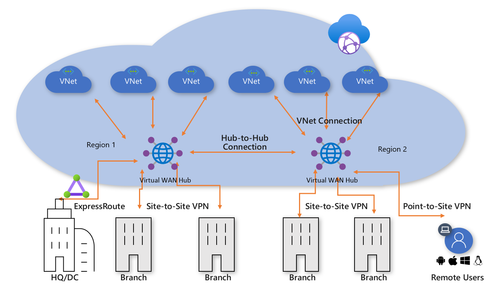

こんにちは、Azure テクニカル サポート チームです。  
この記事では Azure VirtualWAN を効果的に利用いただくためのアイデアをご提供させていただきます。

# **1. VirtualWAN ( 以降 VWAN ) の特徴**

VWAN はハブ＆スポーク VNET 構成を手軽にかつ、大規模に実現することができるサービスです。
複数の仮想ネットワークをハブ＆スポークで接続するだけでなく、 ExpressRoute や Site-to-Site 接続によるオンプレミス接続、Point-to-Site 接続によるクライアントアクセスだけでなく、Azure Firewall や NVA を配置する等の高機能を提供することもできる、 Azure Network の最終形のようなサービスです。

VWAN は高機能で様々なユースケースに対応することができる柔軟性がある反面、機能面、設定面が複雑でわかりにくいというご意見もございました。今回のドキュメントでは、シンプルな構成であっても VWAN を有効に活用できるケースをご紹介いたします。

## **1.1 VWAN アーキテクチャと特徴**
VWAN standard は１つ以上の仮想ハブ( vHUB ) を含みます。vHUB を作成すると内部的に仮想ネットワークと vHUB ルータが配置されます。その他、必要に応じて以下のリソースを配置して機能を拡張することができ、オンプレミスサイトへの接続や、セキュリティソリューションを vHUB 内にデプロイが可能です。

1. ExpressRoute ゲートウェイ
2. Site-to-Site ゲートウェイ
3. Point-to-Site ゲートウェイ
4. Azure Firewall ( 以降 AzFW )
5. NVA ( Network Virtual Appliance ) 

vHUB は複数作成することができ、vHUB には VM などリソースを配置されたスポークVNET を接続します。同一 vHUB に接続する異なる VNET 上のリソースは vHUB ルータ経由で通信することができます ( VNet 間のトランジット接続 )

また、 同一 VWAN リソース内の vHUB リソース同士はデフォルト状態で接続されており、明示的な設定なしに異なる vHUB に接続するスポーク VNET 上のリソース間で通信ができます。

VWAN を活用することで簡単に実現できる構成例
１．VNET ハブ＆スポーク構成
通常、VNET でハブ＆スポーク 構成ではハブ VNET に AzFWもしくは NVA を配置し、スポーク VNET 側では UDR を設定する必要がありますが、設定・管理の手間が発生いたします。
VWAN を使用する場合には vHUB がハブ VNET + AzFW/NVA の代わりとなるため、簡単かつシンプルにハブ&スポーク構成を実現できます。

# **2. VWAN 活用例**
## **2.1  大規模 VNET 構成例**
一般的に複数 VNET 間で通信が必要になる環境では、 VNET 間をメッシュで VNET Peering するか、ハブ＆スポーク構成をとる必要があります。
しかしながら、どちらの方法でも設定工数が多く、また VNET 追加が発生した場合の作業が多いなど設定管理面で課題があります。

### **構成** 1. VNET をフルメッシュで VNET Peering する

課題点 VNET ピアリング数が多く、新たに VNET を追加する場合にも設定工数がかかる

### **構成 2. ハブ VNET を作成して AzFW, NVA を配置し、ハブ＆スポーク構成を作る**

課題点 ハブ VNET 上に AzFW, NVA が必須となり、またスポークVNET 側にはそれぞれユーザ定義ルートを設定、管理する必要がある

VirtualWAN を使用することでこれらの課題点を解決し、シンプルな運用が可能です。
VirtualWAN ( Standard SKU ) では標準で仮想ハブに仮想ハブルータが配置されるため、ユーザが AzFW, NVA を仮想ハブに配置する必要がなく、
またスポーク VNET にユーザ定義ルート設定も不要であるため、 VNET 数が多い環境への対応も容易です。

## **2.2. ExpressRoute, Site-to-Site, Point-to-Site 間のトランジットルーティング**
非 VirtualWAN 環境でも 1 VNET に ExpressRoute GW, VPNGW を配置し、 ExpressRoute, サイト間接続, ポイント対サイト接続することができますが、
ExpressRoute, サイト間接続/ポイント対サイト接続の相互接続( トランジット接続 ) はできません。
Azure Route Server を追加することで ExpressRoute ⇔ サイト間接続の相互接続は可能になりますが、それでも ExpressRoute ⇔ ポイント対サイト間の接続はできません。

ご参考. [ExpressRoute と Azure VPN のサポート - Azure Route Server](https://learn.microsoft.com/ja-jp/azure/route-server/expressroute-vpn-support)

## **2.3. スポーク VNET  間、オンプレミスサイト間の通信を強制的に AzFW 経由させる**
しばしば通信セキュリティ要件として、オンプレミスサイトと VNET 間の通信や、VNET 間の通信を AzFW を経由させたい、という要件がございます。
非 VirtualWAN 環境でもハブ＆スポーク VNET 構成を組むことで、通信をハブ VNET 上の AzFW を経由させることは可能ではありますが、
前述の通り、 スポーク VNET にユーザ定義ルート設定が必要になり煩雑な運用が発生いたします。

VirtualWAN では、セキュリティ付き仮想ハブ機能を有効にするだけで、
仮想ハブ上に AzFW や、その他認定された NVA を配置することができます

ご参考. [セキュリティ保護付き仮想ハブとは](https://learn.microsoft.com/ja-jp/azure/firewall-manager/secured-virtual-hub?toc=%2Fazure%2Fvirtual-wan%2Ftoc.json&bc=%2Fazure%2Fvirtual-wan%2Fbreadcrumb%2Ftoc.json)

## **2.4 複数リージョンにまたがる大規模 VNET 構成**
VirtualWAN を使用しない場合、複数ハブ VNET を接続・運用する際のルーティング設計は非常に難しくなります。
一方、VirtualWAN では複数 vHUB を配置することができ、ハブ間を簡単に自動で接続する機能が標準で準備されております。
これにより、 VirtualWAN ユーザーはスポーク VNET やハブ VNET のルーティングを意識することなく、スポークVNET間の通信が行えます。
vHUB はどのリージョンにも配置することができ、ハブごとにゲートウェイを配置することが可能です。
これにより下記２つのメリットが期待できます。

- オンプレミスサイトとの通信品質の改善
オンプレミスサイトとの通信でも、地理的に近いリージョンの vHUB に接続ポイントを設けることで通信遅延を低減が可能です。

- リージョン障害への耐性向上
リージョン障害が発生し　vHUB の一つが支障した場合でも別リージョン　vHUB がオンプレミスサイトへの接続を持っていれば、
自動的に通信が迂回し、サービス継続させることができます。
例としては vHUB A, B, C が存在し、vHUB C 配下にスポーク VNET C が接続。vHUB A, B がオンプレミスサイトへの接続を持っている構成を想定します。
このとき vHUB A が大規模障害により停止した場合でも、スポーク VNET C は vHUB B 経由でオンプレイスサイトとの通信を継続できます。
  
# **3. まとめ**
この記事では VirtualWAN を使用するだけで簡単に実現ができる構成についてご紹介をいたしました。
VirtualWAN は高機能なサービスではございますが、シンプルに使用するだけでも強力なソリューションとなります。
今後、ご活用の機会がありましたらご検討をお願いいたします。
