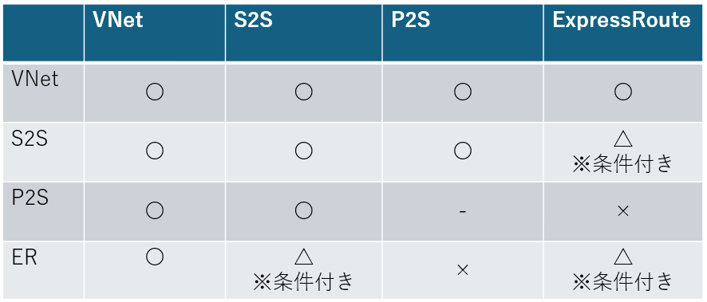
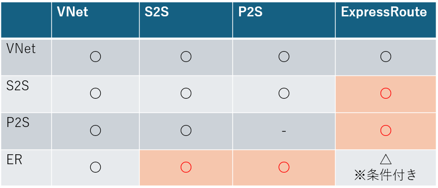
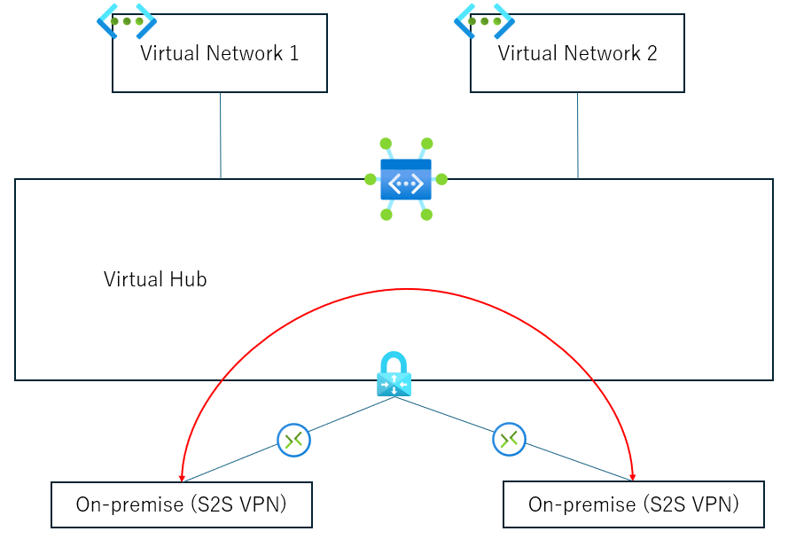
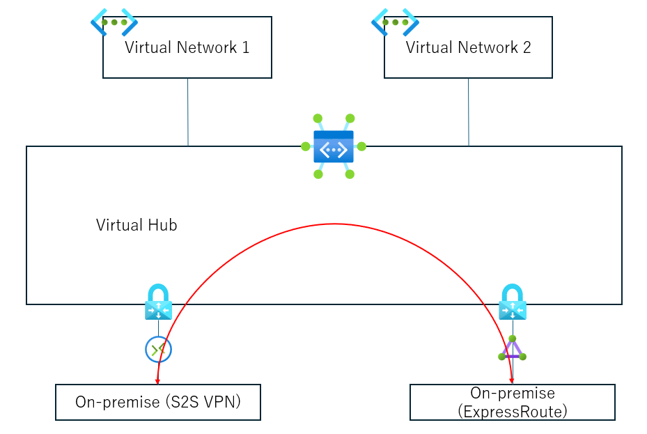
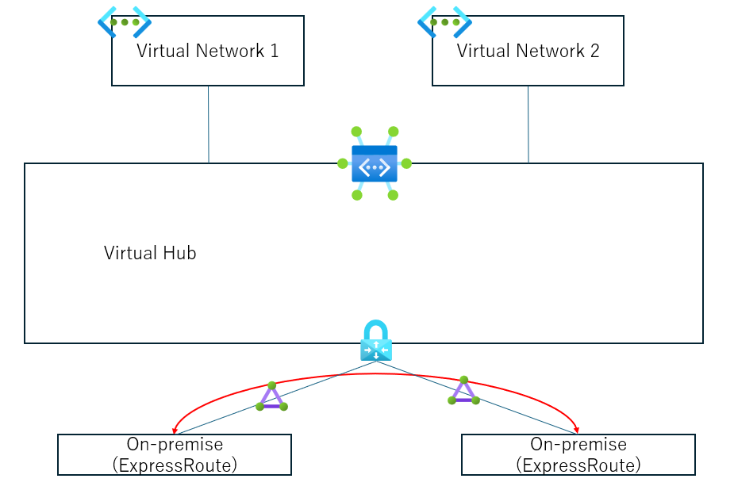
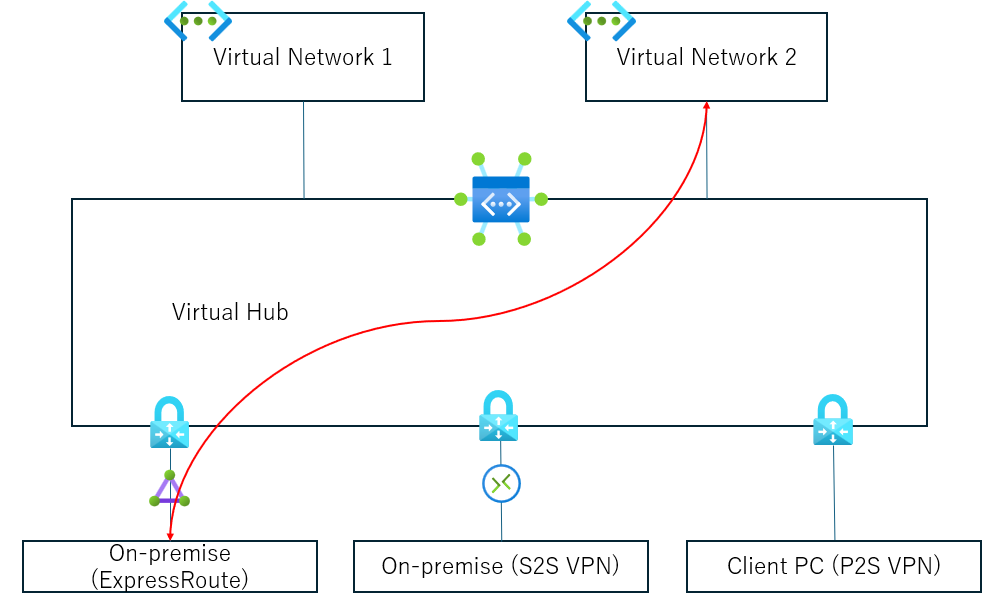

こんにちは、Azure テクニカル サポート チームです。  
この記事では、Virtual WAN の仮想ハブに接続した各環境 (VNet/ブランチ (サイト間 VPN、ポイント対サイト VPN、ExpressRoute)) における相互接続について紹介いたします。  
従来の仮想ネットワーク環境と比べ、どのようなケースに Virtual WAN の導入が適しているか、ご判断の助けになれば幸いです。

## Virtual WAN の相互接続性について

Virtual WAN は仮想ハブというコンポーネントを中心としており、この仮想ハブに対して様々な環境を接続することができます。  
仮想ハブに対して接続する主な環境は、仮想ネットワークと、ブランチと呼ばれるオンプレミス環境です。  
この "ブランチ" については、Virtual WAN 内の仮想ハブに接続するオンプレミス環境をまとめた総称であり、具体的な接続パターンは以下の様なものがあります。  
- サイト間 VPN (S2S VPN)
- ポイント対サイトユーザー VPN (P2S VPN)
- ExpressRoute

※ その他、仮想ハブと Vnet 上の仮想アプライアンス間で直接 BGP ピアを構成したり、仮想ハブ上に所定のパートナーが提供するアプライアンス製品やサービスをデプロイし SD-WAN 環境を構成するといったことも可能ですが、今回の記事ではよくご利用いただく、仮想ネットワークとブランチ (サイト間 VPN、ポイント対サイト VPN、ExpressRoute) 接続のパターンにフォーカスしたいと思います。

Virtual WAN では、仮想ネットワークやブランチを仮想ハブに接続することで、複雑な操作を伴わずにそれぞれの環境間を相互接続させるということをコンセプトにしております。  
上述したような仮想ネットワーク/ブランチ (サイト間 VPN、ポイント対サイト VPN、ExpressRoute) の接続については、一部条件付きのケースもございますが、基本的に Virtual WAN によって相互接続させることが可能です。  
Virtual WAN の相互接続性については、以下の公式ドキュメントにも言及がありますので、併せてご参照ください。

(参考)
[グローバル トランジット ネットワーク アーキテクチャと Virtual WAN](https://learn.microsoft.com/ja-jp/azure/virtual-wan/virtual-wan-global-transit-network-architecture)

## 各接続パターンについて
Virtual WAN 環境と仮想ネットワーク環境における相互接続性の差をわかりやすく示すため、まずは概要として簡単な表を以下に記載しております。

この表では、縦軸と横軸に記載された環境間での相互接続可否を示しており、記号はそれぞれ以下の意味を表します。  
- 〇については相互接続が可能となるよう構成可能  
- ×については相互接続が可能となる構成が非サポート  
- △については相互接続可能となるよう構成可能であるが、特定のオプションや別サービスの利用が伴うため考慮が必要  

※ 本記事では詳細な構成及び設定の方法については割愛いたしますが、〇と表記しているケースでも構成によっては相互接続が可能とならないケースもある点ご了承ください。

また、縦軸と横軸において省略して記載している各表記は、以下を示しております。
- VNet = 仮想ネットワーク環境
- S2S = サイト間 VPN で接続されたオンプレミス拠点
- P2S =  ポイント対サイト VPN で接続されたクライアント端末
- ExpressRoute = ExpressRoute 回線で接続されたオンプレミス拠点

#### 仮想ネットワーク環境の場合  

#### Virtual WAN 環境の場合  

以下では、各接続パターンにおいてどのような相互接続が可能となるか、通常の仮想ネットワーク環境とも比較しながらもう少し詳しく見ていこうと思います。

### S2S to S2S
仮想ハブ上の VPN ゲートウェイには複数のサイト間 VPN を接続可能ですが、サイト間 VPN で接続された拠点同士で相互接続ができるように構成することが可能です。  

従来の仮想ネットワーク環境でも、同様に複数のサイト間 VPN で接続された拠点間の相互接続 (トランジット接続) ができるように構成することが可能です。

(参考)
[VPN Gateway に関する FAQ - Azure VPN Gateway では、BGP トランジット ルーティングをサポートしていますか。](https://learn.microsoft.com/ja-jp/azure/vpn-gateway/vpn-gateway-vpn-faq#does-azure-vpn-gateway-support-bgp-transit-routing)

### P2S to S2S
ポイント対サイトユーザー VPN のクライアントから、サイト間 VPN の接続先拠点にアクセスすることが可能です。  

従来の仮想ネットワーク環境でも、ポイント対サイト VPN のクライアントからサイト間 VPN の接続先拠点にアクセスできるよう構成することは可能です。

(ご参考)
[ポイント対サイト VPN ルーティングについて](https://learn.microsoft.com/ja-jp/Azure/vpn-gateway/vpn-gateway-about-point-to-site-routing)  
※ ポイント対サイトユーザー VPN で利用するプロトコルや、接続端末の OS 種別によっては、カスタムルートの構成やゲスト OS 内でのルート設定といった追加作業が必要になる場合もございます。

### S2S to ExpressRoute
このシナリオは、通常の仮想ネットワーク環境と比較し、Virtual WAN 環境で容易に構成できることが大きな特徴です。  
まず、Virtual WAN 環境では、サイト間 VPN と ExpressRoute 回線を仮想ハブに接続するのみで、相互に疎通させることが可能です。  

従来の仮想ネットワーク環境でも、サイト間 VPN と ExpressRoute 用の仮想ネットワークゲートウェイを同じ仮想ネットワークに共存させて同時にオンプレミス拠点と接続することはできますが、既定の構成のままでは各拠点間の相互接続を行うことはできません。  
仮想ネットワーク環境でサイト間 VPN と ExpressRoute に接続された拠点間でトランジット通信を実現したい場合、Azure Route Server という別のリソースを追加で構成し、各仮想ネットワークゲートウェイと BGP による経路交換を行う必要があります。

(参考)
[ExpressRoute と Azure VPN に対する Azure Route Server のサポート](https://learn.microsoft.com/ja-jp/azure/route-server/expressroute-vpn-support)

このように、通常の仮想ネットワーク環境では更に別のサービスを構成してトランジット通信を実現する必要があるほか、VPN 用仮想ネットワークゲートウェイの構成やパラメーター、ゲートウェイサブネットのサイズ等に一定の制約が生じるなど、様々な考慮事項が生じます。  
Virtual WAN 環境では上記のような別リソースの構成は伴わず、仮想ハブ上のゲートウェイにサイト間 VPN と ExpressRoute 回線の接続を構成すれば、基本的には既定の構成で拠点間の相互通信を実現することができます。

### P2S to ExpressRoute
OpenVPN プロトコルで接続したポイント対サイトユーザー VPN のクライアントから、ExpressRoute の接続先拠点にアクセスすることも可能です。  

従来の仮想ネットワーク環境では、前述の Azure Route Server を利用したとしても、P2S VPN の接続クライアントから ExprsesRoute 接続先拠点へのトランジット接続は非サポートとなります。  

(参考)[Azure Route Server に関してよく寄せられる質問 (FAQ)](https://learn.microsoft.com/ja-jp/azure/route-server/route-server-faq#can-azure-route-server-provide-transit-between-expressroute-and-a-point-to-site-p2s-vpn-gateway-connection-when-enabling-the-branch-to-branch)

### ExpressRoute to ExpressRoute

複数の ExpressRoute 回線で接続された拠点間のトランジット通信は、Virtual WAN 環境であっても既定の状態では不可能です。  
以下のうちいずれかのオプション機能を利用することで、実現が可能となります。

- Global Reach の利用 (仮想ハブを経由することなく各 ExpressRoute 回線間で直接トラフィックが転送されます)
- プライベート ルーティング ポリシーの有効化(仮想ハブに Azure Firewall を伴う、セキュリティ保護付き仮想ハブの利用が必要となります。また、有効化の際にサポートリクエストによる依頼が必要となります。) 

(参考)
[ルーティング インテントを使用した ExpressRoute 回線間のトランジット接続](https://learn.microsoft.com/ja-jp/azure/virtual-wan/how-to-routing-policies#expressroute)

従来の仮想ネットワーク環境でも同様に、既定の状態では複数の ExpressRoute 回線で接続された拠点間のトランジット通信ができません。  
実現する場合には、Global Reach を利用する必要がございます。

### VNet to Branch (S2S, P2S, ExpressRoute)
Virtual WAN 環境では、仮想ネットワーク環境と各ブランチ (サイト間、ポイント対サイト、ExpressRoute) で接続された環境間の疎通が可能です。  

同様に、従来の仮想ネットワーク環境でも、サイト間、ポイント対サイト、ExpressRoute で接続された環境との通信は可能です。  
複数の仮想ネットワークを接続する場合は、ハブ用の仮想ネットワークを用意して各スポークと VNet ピアリングを構成した上で、ゲートウェイ転送オプションを有効化しておく必要がございます。  
Virtual WAN 環境であれば、仮想ハブに複数の仮想ネットワークを順次接続していけば、自動的にブランチ環境との接続性を確保することができます。

### VNet to VNet
Virtual WAN 環境では、仮想ハブに接続した仮想ネットワーク同士の疎通も可能です。  
たくさんの仮想ネットワーク間で相互接続性を確保したい時には、それぞれの仮想ネットワークを仮想ハブに接続していくことで、自動的に相互通信ができるようになります。  

従来の仮想ネットワーク環境では、複数の仮想ネットワーク間は基本的に VNet ピアリングによって接続します。  
もちろん、VNet ピアリングによって仮想ネットワーク間の通信は可能となりますが、VNet ピアリングでは基本的に直接ピアリングした先の仮想ネットワークにしかアクセスすることができません。  
相互接続したい仮想ネットワークの数が多くなる場合、メッシュ状に VNet ピアリングを構成するか、ハブ用の仮想ネットワークを用意してルーティング用の NVA を配置するといった対処が必要となります。  

## おわりに 
この記事では、Virtual WAN 環境における各環境間の相互接続についてご紹介いたしました。  
通常の仮想ネットワーク環境を用いるパターンと比較しますと、実現できることの違いや、同じようなトラフィックフローが実現できたとしても構成の難度や複雑性が異なってくる点がご理解いただけたのではないかと思います。  
Virtual WAN 環境の利用をご検討いただく一助となれば幸いです。