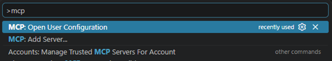
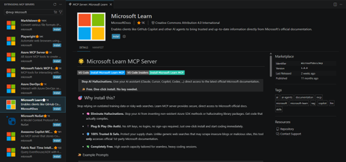

こんにちは、Azure テクニカル サポート チームの濱崎です。 今回はドキュメントの調査に有用な Microsoft ドキュメントの MCP サーバーの利用方法についてTipsとしてご紹介します。

こちらの方法をご活用いただくことで、Azure や Microsoft 製品の疑問点などについて、自己解決できる場面も増えるかと思いますので、参考となりましたら幸いでございます。

<!-- more -->

---

## MCP とは

MCP（Model Context Protocol、モデル・コンテキスト・プロトコル）は、AI アプリケーションを外部のシステムやツールに接続するためのオープンソースの標準化されたプロトコルです。

簡単なイメージとしてはAI と外部ツールをつなぐ USBケーブルのような接続ハブとして機能し、AI 単体では扱えないドキュメントやデータの検索、ファイル・ツールの操作 などを実行できるようにします。

---

## Microsoft Learn 公式が提供する MCP

Microsoft Learn では、膨大なドキュメント情報を AI に検索・取得させるための MCP サーバーが用意されています。

この MCP ではドキュメント検索、指定ページの取得、コードサンプルの検索ができるツールが用意されており、AI に Microsoft 公式ドキュメントを直接参照させることが可能です。

そのため、現在公開されている公式ドキュメントにもとづいた回答を AI にさせることができ、誤回答（ハルシネーション）を軽減するのに役立ちます。

### 提供されているエンドポイント

> https://learn.microsoft.com/api/mcp

なお、このエンドポイントは MCP クライアント接続用です。ブラウザーから直接アクセスすると 405 が返されます。

---

## Visual Studio Code で MCP サーバーを利用する方法

MCP は基本 mcp.json という設定ファイルを通じて、Visual Studio Code から利用できます。 mcp.json に上記のエンドポイントを追加することで、Visual Studio Code から Microsoft Learn MCP サーバーを利用できます。

Visual Studio Code で Ctrl + Shift + P を同時に押してコマンドパレットを開き、「MCP: Open User Configuration」を選択すると、mcp.json が展開され MCP サーバーのエンドポイント一覧が表示されます。



ここに Microsoft Learn MCP のエンドポイントを追加することで、Visual Studio Code から Microsoft Learn MCP サーバーを利用できます。

mcp.json

```json
{
     "servers": {
                "microsoftdocs/mcp": {
                      "type": "http",
                    "url": "https://learn.microsoft.com/api/mcp",
                        "gallery": "https://api.mcp.github.com",
                    "version": "1.0.0"
 },
   },
  "inputs": []
}
```

また、別の手順としてVisual Studio Code の拡張機能ビュー（Extensions）で「@mcp microsoftdocs」と検索し、MCP サーバーをインストールすることでも利用可能です。



インストールの確認としては、Visual Studio Code のコマンドパレットで「MCP: Open User Configuration」を選択し、mcp.json に "microsoftdocs/mcp" の設定が追加されているか、GitHub Copilot Chat で #microsoft_docs_search などのツールを呼び出せるかを確認してください。

これで、GitHub Copilot Chat では、#microsoftdocs/mcp を指定して Microsoft Learn MCP のツールを呼び出せます。

### 注意事項

- Microsoft Learn MCP サーバーは無料で利用できます。ただし、AI モデルの利用にはクレジットが消費されます。

### 参考リンク

- [Microsoft Learn MCP Server の概要 | Microsoft Learn](https://learn.microsoft.com/ja-jp/training/support/mcp)

---

## 日本マイクロソフト サポート情報の MCP を利用する方法

Microsoft Learn 公式以外にも、日本マイクロソフトでは各製品のサポート情報などをまとめたブログを更新しています。

- [日本マイクロソフト サポート情報](https://cssjpn.github.io/)

これらのブログには、Microsoft Learn だけでは扱いきれない製品固有のトラブルシューティングや詳細なサポート情報が掲載されています。Microsoft Learn MCP と併用することで、必要な情報をより幅広く参照できます。

ブログ専用の MCP サーバーは提供されていませんが、多くのブログは GitHub で管理されています。そこで GitHub 公式の MCP サーバーを利用し、リポジトリ内の情報を検索・参照する方法を紹介します。

### 導入手順（GitHub MCP Server）

- **Visual Studio Code を開く**

Ctrl + Shift + X で拡張機能ビューを開きます。

- 検索バーに @mcp github と入力し、GitHub MCP サーバーを見つけます。
- GitHub MCP Server をインストール
- GitHub にサインインし、Visual Studio Code を認可します。

### GitHub MCP Server が提供する主なツール

GitHub MCP Server では、コード・ファイル・履歴・Issue・Pull Request を横断して検索できます。

| ツール名 | 説明 |
| --- | --- |
| search_code | GitHub 上のコードを検索します。関数名、クラス名、変数名、キーワードなどを指定してリポジトリを横断的に調べられます。 |
| get_file_contents | 指定したファイルの内容を取得します。ソースコード、設定ファイル、README などを確認できます。 |
| get_repository_tree | リポジトリのディレクトリ構成とファイル一覧を取得します。 |
| search_commits | コミット履歴を検索し、変更内容や特定のキーワードを含むコミットを調べます。 |

ブログの URL を GitHub Copilot Chat に渡して内容を参照することもできますが、GitHub MCP Server を使えばリポジトリ内を横断的に検索できます。

対象リポジトリをあらかじめ指定したプロンプトや Skill を用意しておくと、毎回 URL を入力しなくても、GitHub MCP Server を使った追加のリファレンスチェックを依頼できます。さらに Microsoft Learn MCP と組み合わせることで、公式ドキュメントとサポート情報を横断的に検索し、より正確な回答を得ることが可能です。

---

## 利用例

### プロンプトとして利用する方法

次の例では、Microsoft Learn MCP と GitHub MCP Server を併用し、jpaztech/blog の記事を検索対象に限定しています。

```text
Microsoft Learn MCP と GitHub MCP Server を使い、ユーザーの質問に対して正確な情報を提供してください。

GitHub MCP Server で参照するリポジトリは、次の 1 件に限定します。
- `jpaztech/blog`（https://github.com/jpaztech/blog）

## 回答方針

- Microsoft Learn の公式ドキュメントと、指定リポジトリ内の記事を横断して検索する。
- 回答には、確認できた根拠と参照先を示す。
- 該当する情報がない場合は、推測で記事を作らず「該当なし」と回答する。

## 記事を紹介する場合の出力形式

■ 参考:
<記事タイトル>
<公開記事 URL>

- URL が推定の場合は、その旨を明記する。
- 既定ブランチは `master` とし、リポジトリのリンクは `blob/master/...` 形式で示す。
- リポジトリへの書き込み、Pull Request の作成、コメントの投稿は行わない。読み取り専用で利用する。
```

### Skill として定義する方法

上記のプロンプトを毎回貼り付けず、特定の調査で繰り返し利用したい場合は、Copilot の Skill として定義できます。Copilot は Skill の説明をもとに、質問に応じて必要な Skill を読み込みます。

以下は Microsoft Learn の公式ドキュメントに加えて jpaztech/blog を参照対象に限定する Skill の例です。 そのままコピーして GitHub Copilot に貼り付け、このスキルを作成するよう指示を出すと、Skill として登録できます。

````markdown
---
name: microsoft-learn-jpaztech-research
description: "Use when: Microsoft 製品、Azure、Windows、または運用トラブルについて、Microsoft Learn の公式情報と jpaztech/blog の日本語サポート記事を横断して調査・回答する。Trigger phrases: Microsoft Learn MCP、Azure サポート記事、jpaztech、公式ドキュメントとブログを調べて。"
---

# Microsoft Learn と Japan Azure Support Blog の横断調査

ユーザーの質問に対し、Microsoft Learn MCP と GitHub MCP Server を使って根拠を確認し、正確な回答を作成する。

## 検索対象

- Microsoft Learn の公式ドキュメント
- GitHub リポジトリ `jpaztech/blog` のみ
  - https://github.com/jpaztech/blog

`jpaztech/blog` 以外の GitHub リポジトリは検索・参照しない。

## 手順

1. 質問から対象となる Microsoft 製品、機能、エラー、構成を整理する。
2. Microsoft Learn MCP で公式ドキュメントを検索する。
3. GitHub MCP Server で `jpaztech/blog` を検索する。
4. 検索結果から、質問に直接関係する内容だけを抽出する。
5. 公式ドキュメントとブログ記事の情報を区別して回答する。
6. 根拠が確認できない内容は推測しない。

## 回答ルール

- Microsoft Learn の公式ドキュメントを優先して結論を示す。
- `jpaztech/blog` の記事は、運用上の注意点、トラブルシューティング、具体例を補う目的で利用する。
- 公式ドキュメントとブログ記事の内容が異なる場合は、差異を明記し、公式ドキュメントを優先する。
- 該当する情報を確認できなかった場合は、「該当なし」と明記する。
- 利用できる MCP ツールがない場合は、未確認の情報を事実として補わない。

## 出力形式

### 回答

質問に対する結論を簡潔に記載する。

### 根拠

- Microsoft Learn: <ドキュメント名>
  <URL>
- Japan Azure Support Blog: <記事タイトル>
  <公開記事 URL>

記事を紹介する場合は、必ず次の形式も使用する。

■ 参考:
<記事タイトル>
<公開記事 URL>

## URL のルール

- GitHub の既定ブランチは `master` として扱う。
- GitHub 上のファイルを示す場合は、次の形式を使用する。

  `https://github.com/jpaztech/blog/blob/master/<path>`

- 公開記事 URL を確定できず GitHub のパスから推定した場合は、「URL は推定です」と明記する。

## 制約

- GitHub リポジトリへの書き込みを行わない。
- Pull Request、Issue、コメントを作成・変更しない。
- 読み取り専用の検索・参照だけを行う。
````

Skill を配置した後は、/microsoft-learn-jpaztech-research のように呼び出して質問を投げるだけで、Microsoft Learn MCP と GitHub MCP Server を併用した調査が可能になります。

なお、単発の調査であれば前述の「参考プロンプト」をチャットに貼り付けるだけで十分活用いただけます。 繰り返し利用する調査ルールは Skill、1 回限りの依頼はプロンプトとして使い分けると管理しやすくなります。

### 注意事項

- プロンプトや Skill に「読み取り専用」と記載しても、ツールの実行権限そのものが技術的に制限されるわけではありません。読み取り用途に限定する場合は、VS Code のツール設定で書き込み系ツールを無効化し、GitHub 側でも必要最小限の権限を持つアカウントや認証設定を使用してください。ツールの実行確認が表示された場合は、操作内容を確認してから承認してください。

---

## サポートブログ一覧と GitHub リポジトリ

今回は Japan Azure IaaS Core Support Blog を検索対象としておりましたが、日本マイクロソフトでは現在、多くの製品カテゴリごとにサポートブログを公開しております。

また、これらのブログの多くは GitHub リポジトリで管理されているため、同様に GitHub MCP Server を利用して検索対象に追加することが可能です。

そのため、プロンプトで検索対象を指定する際は、各製品の GitHub リポジトリ URL をご記載ください。

なお、サポートブログ一覧の確認は以下のサイトから確認可能です。

[日本マイクロソフト サポート情報](https://cssjpn.github.io/)

GitHub リポジトリ URL につきましては、対象となるサポートブログのサイト URL からご確認いただき、検索対象としたい GitHub リポジトリの URL に適宜置き換えてご利用ください。

**例： Japan Azure IaaS Core Support Blog の場合**

サポートブログ URL
> [https://**jpaztech**.github.io/blog/](https://jpaztech.github.io/blog/)

GitHub リポジトリのURL
> [https://github.com/**jpaztech**/blog](https://github.com/jpaztech/blog)

### 注意事項

- すべてのブログが GitHub リポジトリで管理されているわけではないことをご留意ください。

---

開発や調査に是非 Microsoft Learn MCP や GitHub MCP Server を活用していただければ幸いです。