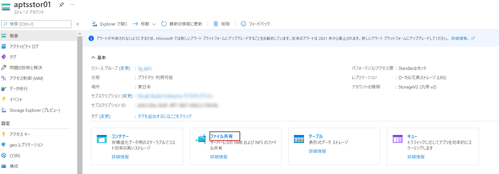
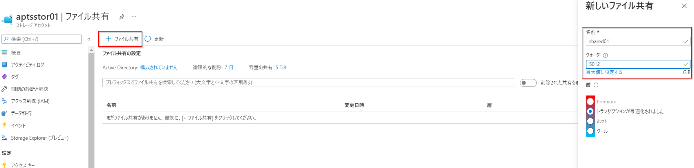

こんにちは、Azure テクニカル サポート チームの木下です。

Azure ファイル共有をマウントする場合、認証方法にはストレージ アカウント キーを使用した認証方法と ID ベース (Active Directory Domain Services / Azure Active Directory Domain Services)の認証方法があります。
その中でも今回はお問い合わせのよくある、オンプレ AD DS (Active Directory Domain Services) 認証によるファイル共有のマウント方法とアクセスについてご紹介いたします。
<!-- more -->

---

## 前提条件
Azure ファイル共有のオンプレ AD DS 認証をご使用いただく場合、以下の前提条件を満たしている必要があります。

**・Azure AD Connect**  

オンプレ AD は [Azure AD Connect](https://docs.microsoft.com/ja-jp/azure/active-directory/hybrid/how-to-connect-install-roadmap) を使って Azure AD と同期している必要があります。

以下は Azure AD Connect により オンプレ AD と Azure AD が同期した状態の一例となります。


**・ドメイン参加**  

Azure ファイル共有 にアクセスするクライアント端末はドメイン参加またはドメインサーバーと通信できる必要があります。

**・ポート 445 の開放**  

また、前提条件の詳細に関しては以下の公開情報を必ずご確認ください。

□参考：[概要 - SMB を使用した Azure ファイル共有へのオンプレミスの Active Directory Domain Services 認証 > 前提条件](https://docs.microsoft.com/ja-jp/azure/storage/files/storage-files-identity-auth-active-directory-enable#prerequisites)

---

それでは、さっそくオンプレ AD DS 認証を有効化し、Windows Server へファイル共有をマウントしアクセスする手順をご紹介いたします。

## ▼作業手順

### (1) Azure ファイル共有の作成
(※すでに Azure ファイル共有を作成されている場合はこの手順は不要です。(2) へ進みます)

1-1. 対象のストレージアカウント「ファイル共有」へを押下


1-2. 「+ファイル共有」を押下し、「名前」「クォータ」「層」を入力し新しいファイル共有を作成


### (2) Azure ファイル共有に対するオンプレ AD DS 認証の有効化
2-1. AzFilesHybrid モジュールをダウンロードし解凍

https://github.com/Azure-Samples/azure-files-samples/releases

2-2. Azure ファイル共有のオンプレ AD DS 認証を有効化するスクリプトを実行

□参考：[Join-AzStorageAccountForAuth を実行する](https://docs.microsoft.com/ja-jp/azure/storage/files/storage-files-identity-ad-ds-enable#run-join-azstorageaccountforauth)

Join-AzStorageAccountForAuth コマンドレット例 
```shell
Set-ExecutionPolicy -ExecutionPolicy Unrestricted -Scope CurrentUser

.\CopyToPSPath.ps1 

Import-Module -Name AzFilesHybrid

Connect-AzAccount

$SubscriptionId = "<サブスクリプション ID>"
$ResourceGroupName = "<リソースグループ名>"
$StorageAccountName = "<ストレージアカウント名>"

Select-AzSubscription -SubscriptionId $SubscriptionId 

Join-AzStorageAccountForAuth `
        -ResourceGroupName $ResourceGroupName `
        -StorageAccountName $StorageAccountName `
        -DomainAccountType "<ComputerAccount/ServiceLogonAccount>" `
        -OrganizationalUnitDistinguishedName "<ストレージアカウント用 OU 名>" `
        -EncryptionType "<AES256/RC4/AES256,RC4>"

Update-AzStorageAccountAuthForAES256 -ResourceGroupName $ResourceGroupName -StorageAccountName $StorageAccountName
```
実行例


2-3. 機能が有効になったことを確認

□参考：[機能が有効になっていることを確認する](https://docs.microsoft.com/ja-jp/azure/storage/files/storage-files-identity-ad-ds-enable#confirm-the-feature-is-enabled)

実行例


### (3)ファイル共有レベルのアクセス権限を付与
□参考：[共有レベルのアクセス許可](https://docs.microsoft.com/ja-jp/azure/storage/files/storage-files-identity-ad-ds-assign-permissions#share-level-permissions)

| Azure RBAC |     説明      | 
| --- | ----------- | 
| ストレージファイルデータの SMB 共有の管理者特権の共同作成者 | SMB による Azure Storage ファイル共有に対する読み取り、書き込み、削除、および NTFS アクセス許可の変更のアクセスを許可します |
| 記憶域ファイルデータの SMB 共有の共同作成者 | SMB による Azure Storage ファイル共有に対する読み取り、書き込み、削除のアクセスを許可します |
| 記憶域ファイルデータの SMB 共有の閲覧者 | SMB による Azure ファイル共有に対する読み取りアクセスを許可します |

3.1 対象の Azure ファイル共有 > 「アクセス制御(IAM)」より上記必要なロールを付与


3-2. ロールが付与されたことを確認
(※ここでは例としてユーザー testuser0[1|2] に **ストレージファイルデータの SMB 共有の管理者特権の共同作成者** を付与しています)


### (4) Azure ファイル共有マウント用コマンドをコピー

Azure ファイル共有 [接続] より接続方法 [Active Directory] を選択し、表示されているコマンドをコピー


### (5) 手順(4) でロールを付与したユーザーでサインイン

ここでは例としてユーザー testuser01 でサインインしています。


### (6) 手順(4) でコピーしたコマンドを実行


### (7) マウントならびに Azure ファイル共有へアクセスできることを確認


---

ここまではドメインコントローラーに昇格した Windows Server にて Azure ファイル共有に対する AD DS 認証を有効化を実施し、ファイル共有のマウントならびにアクセスを行いました。
次は、上述のドメインに参加している Windows 10 端末にてファイル共有をマウントしアクセスが可能であるか確認します。

ドメイン参加している Windows 10 端末にサインイン


Azure ファイル共有マウント用コマンドをコピーし実行

ファイル共有へアクセスができることを確認できました。

---

また、オンプレ AD DS 認証ではファイル共有へのアクセス元の端末がドメイン参加していない場合でも、オンプレ AD DS に参加しているドメインサーバーと通信できている状態であれば、認証時にオンプレ AD DS のユーザー資格情報を入力することで利用することも可能ですのでご参考としていただけますと幸いです。

>□参考：[概要 - SMB を使用した Azure ファイル共有へのオンプレミスの Active Directory Domain Services 認証 > 前提条件](https://docs.microsoft.com/ja-jp/azure/storage/files/storage-files-identity-auth-active-directory-enable#prerequisites)
>
><一部抜粋>
>
>オンプレミス マシンまたは Azure VM をオンプレミスの AD DS にドメイン参加させます。 ドメインに参加させる方法については、「コンピューターをドメインに参加させる」を参照してください。
>マシンが AD DS にドメイン参加していない場合でも、マシンで AD ドメイン コントローラーが認識されていれば、認証に AD 資格情報を利用することはできます。

オンプレ AD DS に参加しているドメインサーバー


ドメイン参加していない Windows 10 端末


エクスプローラーに UNC (\\\\<ストレージアカウント名>.file.core.windows.net\\<ファイル共有名>) を入力すると資格情報入力画面が表示されるので、オンプレ AD DS のユーザー情報を入力しアクセスを行ってください。


ファイル共有へアクセスができることを確認できました。

---

本稿は以上となりますが、いかがでしたでしょうか。 本稿が皆様のお役に立てれば幸いです。
