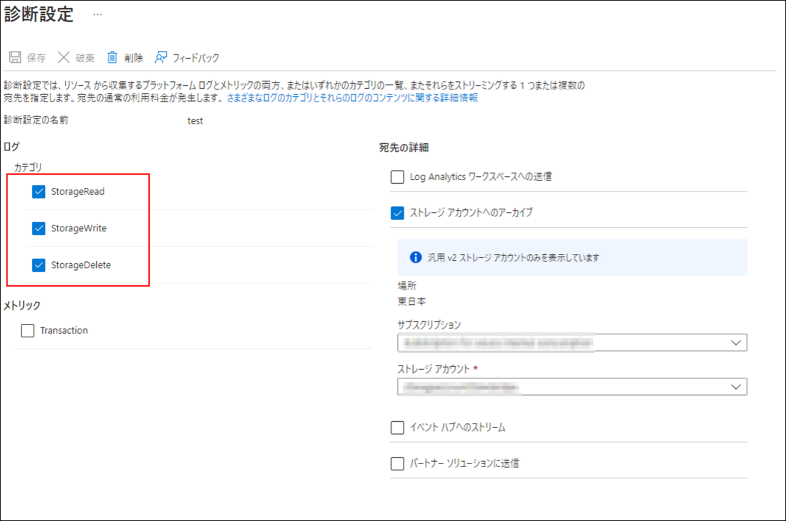
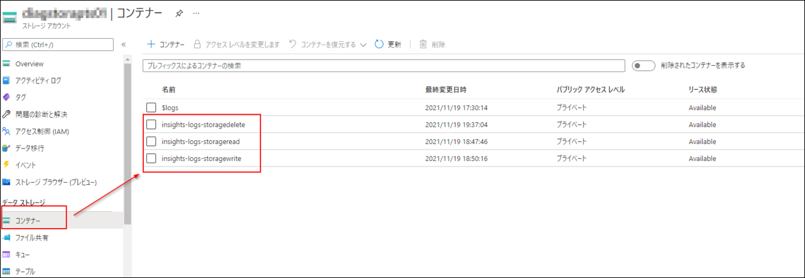

この記事は [Microsoft Azure Tech Advent Calendar 2021](https://qiita.com/advent-calendar/2021/microsoft-azure-tech) の 22 日目の記事になります。

こんにちは、Azure テクニカル サポート チームの木下です。
今回は Azure Files の診断設定機能を紹介いたします。
Azure Files へのアクセスについて、「いつ、誰が、どのオブジェクトに、どのような操作を行ったか」という情報を取得したいというお問い合わせをいただくことがございます。
Azure Files へアクセスした際のログは、Azure Files の診断設定機能を使用することで、アクセス要求元や操作内容を大まかに把握することができます。
この記事では Azure Files 診断設定機能の設定方法とどのようなログを取得することができるのかを紹介していきます。

---

## 概要

1. Azure Files 診断設定の設定手順
2. 診断ログ内容を確認

## 1. Azure Files 診断設定の設定手順

1-1. Azure Portal > 対象のストレージ アカウントに移動します。

1-2. [監視] > [診断設定] をクリックします。


1-3. 診断設定を有効にする種類として [file] を選択します。


1-4. [診断設定を追加する]をクリックします。


1-5. [診断設定]ページにて、「診断設定の名前」、取得するログ操作の「カテゴリ」と「宛先の詳細」を選択します。

- 診断設定の名前：任意の名前
- ログ：取得するログ操作のカテゴリ (StorageRead(読み取り)、StorageWrite(書き込み)、削除(StorageDelete))
- 宛先の詳細：ログの送信先 ※ここではログの送信先としてストレージ アカウントを選択しています。



これで Azure Files の診断設定が完了です。

## 2. 診断ログ内容を確認

1 の手順にて診断ログの送信先をストレージ アカウントへ設定した場合、以下の画像のように送信先ストレージ アカウント内の各コンテナーにログが格納されることとなります。


※ログは定期的に収集されますので、タイムラグが発生する可能性がございます。

| カテゴリ | 説明 | 送信先ストレージ アカウント内コンテナー名 |
|----|----|----|
| StorageRead | オブジェクトに対する読み取り操作。 | insights-logs-storageread|
| StorageWrite | オブジェクトに対する書き込み操作。 | insights-logs-storagewrite |
| StorageDelete | オブジェクトに対する削除操作。 |insights-logs-storagedelete |

- 参考：収集とルーティング
https://docs.microsoft.com/ja-jp/azure/storage/files/storage-files-monitoring?tabs=azure-portal#collection-and-routing

Azure Files 内のオブジェクトに対して、「いつ、誰が、どのオブジェクトに、どのような操作を行ったか」を把握するために、Azure Files の診断設定にて取得したログを確認してみましょう。

| プロパティ | 説明 |把握したい情報 |
|----|----|----|
| time | ストレージで要求が受信された協定世界時 (UTC) での時刻。 (例: 2018/11/08 21:09:36.6900118)。日本時間の場合は UTC +9 時間。 |いつ|
|category|要求された操作のカテゴリ。 例: StorageRead、StorageWrite、またはStorageDelete。 | 操作内容 |
|operationName| 実行された REST 操作の種類。| 操作内容 |
| callerIpAddress |ポート番号を含む要求元の IP アドレス (例: 192.XXX.X.XXX:4362)。 |誰が|
|smbPrimarySID |要求元の SID  |誰が|
| uri | 要求された Uniform Resource Identifier | 対象オブジェクト|
|properties |要求された操作の詳細  |対象オブジェクト|

上記のように、各プロパティを確認することで、「いつ、誰が、どのオブジェクトに、どのような操作を行ったか」の情報を得ることができます。
ただし、Azure Files へアクセスいただく際に使用されるプロトコルや認証方法により取得できるリソース ログのプロパティは異なります。

Azure Files にて使用可能なプロトコルや認証方法については以下をご参照ください。

<参考>
- Azure Files とは
https://docs.microsoft.com/ja-jp/azure/storage/files/storage-files-introduction
- ソリューション 4 - REST API ベースのツール (Storage Explorer や Powershell など) を使用する
https://docs.microsoft.com/ja-jp/azure/storage/files/storage-troubleshoot-windows-file-connection-problems#solution-4---use-rest-api-based-tools-like-storage-explorerpowershell
- SMB アクセスの Azure Files ID ベース認証オプションの概要
https://docs.microsoft.com/ja-jp/azure/storage/files/storage-files-active-directory-overview
- ストレージ アカウント アクセス キーを管理する
https://docs.microsoft.com/ja-jp/azure/storage/common/storage-account-keys-manage?tabs=azure-portal

それでは、プロトコル、認証方法別にリソース ログのサンプルを見ていきます。
以下は取得されたログの一例であり、すべてのログが網羅されているものではございませんのでご了承ください。

### 2-1.SMB プロトコル・ストレージ アカウントキー認証の場合
SMB プロトコルを使用し Azure Files をストレージ アカウントキー認証でマウント後、Azure Files 配下のオブジェクトを操作した際のログとなります。
操作の要求元に関ましてアクセス元の IP アドレスの取得は可能ですが、詳細なユーザー情報の特定までは叶いません。

category: StorageRead
```shell
例
{ 
"time": "2021-11-19T09:48:37.8138026Z", ★いつ
"resourceId": "<リソース ID>", 
"category": "StorageRead", ★操作内容
"operationName": "Read", ★操作内容
"operationVersion": "0x311", 
"schemaVersion": "1.0", 
"statusCode": 0, 
"durationMs": 1, 
"callerIpAddress": "192.XXX.X.XXX", ★誰が
"correlationId": "XXXXXXXXXXXXXXXXXXXXXXXXXX", 
"identity": {"type":"NTLMv2"}, 
"location": "Japan East", 
"properties": 
{
"accountName":"<ストレージ アカウント名>",
"etag":"XXXXXXXXXXXXXX",
"serviceType":"file",
"objectKey":"\\\\<ストレージ アカウント名>.file.core.windows.net\\shared01\\test.txt",★対象オブジェクト
"lastModifiedTime":"2021/11/19 09:41:48.2315339",
"serverLatencyMs":1,
"operationCount":0,
"requestHeaderSize":64,
"requestBodySize":49,
"responseHeaderSize":64,
"responseBodySize":118,
"contentLengthHeader":50,
"smbSessionId":XXXXXXXXXXXXX,
"smbTreeConnectID":5,
"smbPersistentHandleID":XXXXXXXXXXXXX,
"smbVolatileHandleID":XXXXXXXXXXXXX,
"smbCreditsConsumed":1,
"smbMessageID":275,
"smbCommandMajor":8,
"smbCommandDetail":
"Bytes=0x32 Offset=0x0 ExtentReads=1",
"smbFileId":XXXXXXXXXXXXX}, 
"uri": "\\\\<ストレージ アカウント名>.file.core.windows.net\\shared01\\test.txt", ★対象オブジェクト
"protocol": "SMB", 
"resourceType": "Microsoft.Storage/storageAccounts/fileServices"
}
```

category:StorageWrite
```shell
例
{ 
"time": "2021-11-19T10:21:21.5491188Z", ★いつ
"resourceId": "<リソース ID>", 
"category": "StorageWrite", ★操作内容
"operationName": "Create", ★操作内容
"operationVersion": "0x311", 
"schemaVersion": "1.0", 
"statusCode": 0, 
"durationMs": 8, 
"callerIpAddress": "192.XXX.X.XXX", ★誰が
"correlationId": "XXXXXXXXXXXXXXXXXXXXXXXXXX", 
"identity": {"type":"NTLMv2"}, 
"location": "Japan East", 
"properties": 
{
"accountName":"<ストレージ アカウント名>",
"etag":"XXXXXXXXXXXXXX",
"serviceType":"file",
"objectKey":"\\\\<ストレージ アカウント名>.file.core.windows.net\\shared01\\",★対象オブジェクト
"lastModifiedTime":"2021/11/19 08:37:14.3501386",
"serverLatencyMs":6,
"operationCount":0,
"requestHeaderSize":64,
"requestBodySize":208,
"responseHeaderSize":64,
"responseBodySize":168,
"smbSessionId":XXXXXXXXXXXXX,
"smbTreeConnectID":1,
"smbPersistentHandleID":XXXXXXXXXXXXX,
"smbVolatileHandleID":XXXXXXXXXXXXX,
"smbCreditsConsumed":1,
"smbMessageID":4,
"smbCommandMajor":5,
"smbCommandMinor":"FileReOpen"
}, 
"uri": "\\\\<ストレージ アカウント名>.file.core.windows.net\\shared01\\", ★対象オブジェクト
"protocol": "SMB", 
"resourceType": "Microsoft.Storage/storageAccounts/fileServices"
}
```

category: StorageDelete
```shell
例
{ 
"time": "2021-11-19T10:35:39.3706377Z", ★いつ
"resourceId": "<リソース ID>", 
"category": "StorageDelete", ★操作内容
"operationName": "Close", ★操作内容
"operationVersion": "0x311", 
"schemaVersion": "1.0", 
"statusCode": 0, 
"durationMs": 3, 
"callerIpAddress": "192.XXX.X.XXX", ★誰が
"correlationId": "XXXXXXXXXXXXXXXXXXXXXXXXXX", 
"identity": {"type":"NTLMv2"}, 
"location": "Japan East", 
"properties": 
{
"accountName":"<ストレージ アカウント名>",
"etag":"XXXXXXXXXXXXXXXX",
"serviceType":"file",
"objectKey":"\\\\<ストレージ アカウント名>.file.core.windows.net\\shared01\\testcopy.txt",★対象オブジェクト
"lastModifiedTime":"2021/11/19 10:32:03.4499784",
"serverLatencyMs":3,
"operationCount":0,
"requestHeaderSize":64,
"requestBodySize":24,
"responseHeaderSize":64,
"responseBodySize":112,
"smbSessionId":XXXXXXXXXXXXX,
"smbTreeConnectID":1,
"smbPersistentHandleID":XXXXXXXXXXXXX,
"smbVolatileHandleID":XXXXXXXXXXXXX,
"smbCreditsConsumed":1,
"smbMessageID":147,
"smbCommandMajor":6,
"smbCommandMinor":"FileCloseAndDelete",
"smbCommandDetail":"Detail=Client",
"smbFileId":XXXXXXXXXXXXX}, 
"uri": "\\\\<ストレージ アカウント名>.file.core.windows.net\\shared01\\testcopy.txt", 
"protocol": "SMB", 
"resourceType": "Microsoft.Storage/storageAccounts/fileServices"
}
```

### 2-2.SMB プロトコル・ID ベース認証の場合
SMB プロトコルを使用し Azure Files を ID ベース認証でマウント後、Azure Files 配下のオブジェクトを操作した際のログとなります。
ID ベース認証を使用したアクセスの場合、リソース ログに SID が出力されるため、SID よりユーザーを特定することができます。

例として使用した 2 つのユーザーの SID は以下となります。
```
User Name          SID
================== ==============================================
contoso\testuser01 S-1-5-21-XXXXXXXXXX-XXXXXXXXXX-XXXXXXXXXX-1103
contoso\testuser02 S-1-5-21-XXXXXXXXXX-XXXXXXXXXX-XXXXXXXXXX-1104
```

category: StorageRead
```shell
例
{ 
"time": "2021-11-26T04:53:47.0548913Z", ★いつ
"resourceId": "<リソース ID>", 
"category": "StorageRead", ★操作内容
"operationName": "Read",★操作内容
"operationVersion": "0x311", 
"schemaVersion": "1.0", 
"statusCode": 0, 
"durationMs": 6, 
"callerIpAddress": "10.X.X.X", ★誰が
"correlationId": "XXXXXXXXXXXXXXXXXXXXXXXXXX", 
"identity": {"type":"Kerberos",
"requester":{"smbPrimarySID":"S-1-5-21-XXXXXXXXXX-XXXXXXXXXX-XXXXXXXXXX-1103"}}, ★誰が (ユーザー contoso\testuser01 であることを特定できます)
"location": "Japan East", 
"properties": 
{
"accountName":"<ストレージ アカウント名>",
"etag":"XXXXXXXXXXXXXXXXXXXXXXXXXX",
"serviceType":"file",
"objectKey":"\\\\<ストレージ アカウント名>.file.core.windows.net\\shared01\\oldtestuser03\\test01.txt",★対象オブジェクト
"lastModifiedTime":"2021/11/26 04:53:39.1662456",
"serverLatencyMs":6,
"operationCount":0,
"requestHeaderSize":64,
"requestBodySize":49,
"responseHeaderSize":64,
"responseBodySize":71,
"contentLengthHeader":3,
"smbSessionId":XXXXXXXXXXXXX,
"smbTreeConnectID":5,
"smbPersistentHandleID":XXXXXXXXXXXXX,
"smbVolatileHandleID":XXXXXXXXXXXXX,
"smbCreditsConsumed":1,
"smbMessageID":226,
"smbCommandMajor":8,
"smbCommandDetail":"Bytes=0x3 Offset=0x0 ExtentReads=1",
"smbFileId":XXXXXXXXXXXXX
}, 
"uri": "\\\\<ストレージ アカウント名>.file.core.windows.net\\shared01\\oldtestuser03\\test01.txt", ★対象オブジェクト
"protocol": "SMB", 
"resourceType": "Microsoft.Storage/storageAccounts/fileServices"
}

{ 
"time": "2021-11-26T10:16:12.1669701Z", ★いつ
"resourceId": "<リソース ID>", 
"category": "StorageRead", ★操作内容
"operationName": "ChangeNotify", ★操作内容
"operationVersion": "0x311", 
"schemaVersion": "1.0", 
"statusCode": -1073741536, 
"durationMs": 0, 
"callerIpAddress": "10.X.X.X", ★誰が
"correlationId": "XXXXXXXXXXXXXXXXXXXXXXXXXX", 
"identity": {"type":"Kerberos",
"requester":{"smbPrimarySID":"S-1-5-21-XXXXXXXXXX-XXXXXXXXXX-XXXXXXXXXX-1104"}}, ★誰が (ユーザー contoso\testuser02 であることを特定できます)
"location": "Japan East", 
"properties": 
{
"accountName":"<ストレージ アカウント名>",
"serviceType":"file",
"objectKey":"\\\\<ストレージ アカウント名>.file.core.windows.net\\shared01\\",
"lastModifiedTime":"1601/01/01 00:00:00.0000000",
"operationCount":0,
"responseHeaderSize":64,
"responseBodySize":61,
"smbSessionId":XXXXXXXXXXXXX,
"smbTreeConnectID":5,
"smbPersistentHandleID":XXXXXXXXXXXXX,
"smbVolatileHandleID":XXXXXXXXXXXXX,
"smbCreditsConsumed":1,
"smbMessageID":284,
"smbCommandMajor":15,
"smbCommandDetail":"Filter=0x2"
}, 
"uri": "\\\\<ストレージ アカウント名>.file.core.windows.net\\shared01\\", ★操作対象
"protocol": "SMB", 
"resourceType": "Microsoft.Storage/storageAccounts/fileServices"
}
```

category: StorageWrite
```shell
例
{ 
"time": "2021-11-26T10:17:22.9734137Z", ★いつ
"resourceId": "<リソース ID>", 
"category": "StorageWrite", ★操作内容
"operationName": "Close", ★操作内容
"operationVersion": "0x311", 
"schemaVersion": "1.0", 
"statusCode": 0, 
"durationMs": 8, 
"callerIpAddress": "10.X.X.X", ★誰が
"correlationId": "XXXXXXXXXXXXXXXXXXXXXXXXXX", 
"identity": {"type":"Kerberos",
"requester":{"smbPrimarySID":"S-1-5-21-XXXXXXXXXX-XXXXXXXXXX-XXXXXXXXXX-1103"}}, ★誰が (ユーザー contoso\testuser01 であることを特定できます)
"location": "Japan East", 
"properties": 
{
"accountName":"<ストレージ アカウント名>",
"etag":"XXXXXXXXXXXXXXXXXXXXXXXXXX",
"serviceType":"file",
"objectKey":"\\\\<ストレージ アカウント名>.file.core.windows.net\\shared01\\",★対象オブジェクト
"lastModifiedTime":"2021/05/17 16:12:01.7491068",
"serverLatencyMs":8,
"operationCount":0,
"smbSessionId":XXXXXXXXXXXXX,
"smbTreeConnectID":1,
"smbPersistentHandleID":XXXXXXXXXXXXX,
"smbVolatileHandleID":XXXXXXXXXXXXX,
"smbCreditsConsumed":1,
"smbCommandMajor":6,
"smbCommandMinor":"DirectoryClose",
"smbCommandDetail":"Detail=Closing master session"
}, 
"uri": "\\\\aptsstor01.file.core.windows.net\\shared01\\", ★対象オブジェクト
"protocol": "SMB", 
"resourceType": "Microsoft.Storage/storageAccounts/fileServices"
}
```

category: StorageDelete
```shell
{ 
"time": "2021-11-26T10:09:26.9040113Z", ★いつ
"resourceId": "<リソース ID>", 
"category": "StorageDelete", ★操作内容
"operationName": "Close", ★操作内容
"operationVersion": "0x311", 
"schemaVersion": "1.0", 
"statusCode": 0, 
"durationMs": 4, 
"callerIpAddress": "10.X.X.X", ★誰が
"correlationId": "XXXXXXXXXXXXXXXXXXXXXXXXXX", 
"identity": {"type":"Kerberos",
"requester":{"smbPrimarySID":"S-1-5-21-XXXXXXXXXX-XXXXXXXXXX-XXXXXXXXXX-1104"}}, ★誰が (ユーザー contoso\testuser02 であることを特定できます)
"location": "Japan East", 
"properties": 
{
"accountName":"<ストレージ アカウント名>",
"etag":"XXXXXXXXXXXXXXXXXXXXXXXXXX",
"serviceType":"file",
"objectKey":"\\\\<ストレージ アカウント名>.file.core.windows.net\\shared01\\newtestuser03\\test.txt",★対象オブジェクト
"lastModifiedTime":"2021/11/22 15:51:37.8846765",
"serverLatencyMs":3,
"operationCount":0,
"requestHeaderSize":64,
"requestBodySize":24,
"responseHeaderSize":64,
"responseBodySize":112,
"smbSessionId":XXXXXXXXXXXXX,
"smbTreeConnectID":5,
"smbPersistentHandleID":XXXXXXXXXXXXX,
"smbVolatileHandleID":XXXXXXXXXXXXX,
"smbCreditsConsumed":1,
"smbMessageID":66,
"smbCommandMajor":6,
"smbCommandMinor":"FileCloseAndDelete",
"smbCommandDetail":"Detail=Client",
"smbFileId":XXXXXXXXXXXXX
}, 
"uri": "\\\\aptsstor01.file.core.windows.net\\shared01\\newtestuser03\\test.txt", ★対象オブジェクト
"protocol": "SMB", 
"resourceType": "Microsoft.Storage/storageAccounts/fileServices"
}
```

### 2-3.NFS プロトコルの場合
NFS プロトコルを使用し Azure Files をマウント後、Azure Files 配下のオブジェクトを操作した際のログとなります。
なお、NFS プロトコルでの操作の場合、操作日時、操作内容までの確認はできますが、要求元の IP アドレスや対象オブジェクトの特定は叶いません。

category: StorageRead
```shell
例
{ 
"time": "2021-11-19T12:13:43.2858440Z", ★いつ
"resourceId": "<リソース ID>", 
"category": "StorageRead", ★操作内容
"operationName": "Nfs4ReadDir", ★操作内容
"operationVersion": "4.1", 
"schemaVersion": "1.0", 
"statusCode": 0, 
"durationMs": 0, 
"callerIpAddress": "fde4:XXXX:XXXX:XXXX:XXXX:XXX:XXX:X", ★誰が (現状特定不可)
"correlationId": "XXXXXXXXXXXXXXXXXXXXXXX", 
"identity": {"type":"VNetPolicy"}, 
"location": "Japan East", 
"properties": 
{
"accountName":"<ストレージ アカウント名>",
"serviceType":"file",
"lastModifiedTime":"1601/01/01 00:00:00.0000000",
"operationCount":2,
"requestHeaderSize":4,
"requestBodySize":36,
"responseHeaderSize":4,
"responseBodySize":16
}, 
"protocol": "NFS", 
"resourceType": "Microsoft.Storage/storageAccounts/fileServices"
}
```

category:StorageWrite
```shell
例
{
"time": "2021-11-19T12:13:57.6016724Z", ★いつ
"resourceId": "<リソース ID>", 
"category": "StorageWrite", ★操作内容
"operationName": "Nfs4Write", ★操作内容
"operationVersion": "4.1", 
"schemaVersion": "1.0", 
"statusCode": 0, 
"durationMs": 11, 
"callerIpAddress": "fde4:XXXX:XXXX:XXXX:XXXX:XXX:XXX:X", ★誰が (現状特定不可)
"correlationId": "XXXXXXXXXXXXXXXXXXXXXXX", 
"identity": {"type":"VNetPolicy"}, 
"location": "Japan East", 
"properties": 
{
"accountName":"<ストレージ アカウント名>",
"serviceType":"file",
"lastModifiedTime":"1601/01/01 00:00:00.0000000",
"serverLatencyMs":11,
"operationCount":2,
"requestHeaderSize":4,
"requestBodySize":40,
"responseHeaderSize":4,
"responseBodySize":20,
"contentLengthHeader":5
}, 
"protocol": "NFS", 
"resourceType": "Microsoft.Storage/storageAccounts/fileServices"
}
```

### 2-4.HTTPS プロトコルの場合
Azure Portal より Azure Files 配下のオブジェクトを操作した際のログとなります。
操作の要求元に関ましてアクセス元の IP アドレスの取得は可能ですが、詳細なユーザー情報の特定までは叶いません。

category: StorageRead
```shell
例
{ 
"time": "2021-11-25T02:35:57.6382029Z", ★いつ
"resourceId": "<リソース ID>", 
"category": "StorageRead",★操作内容 
"operationName": "GetFileServiceProperties", ★操作内容
"operationVersion": "2020-06-12", 
"schemaVersion": "1.0", 
"statusCode": 200, 
"statusText": "Success", 
"durationMs": 12, 
"callerIpAddress": "10.XX.XX.XX:33801", ★誰が
"correlationId": "XXXXXXXXXXXXXXXXXXXXXX", 
"identity": {"type":"AccountKey","tokenHash":"system-1(XXXXXXXXXXXXXXXXXXXXXXXXXX)"}, 
"location": "Japan East", 
"properties": 
{
"accountName":"<ストレージ アカウント名>",
"serviceType":"file",
"objectKey":"/<ストレージ アカウント名>",★対象オブジェクト
"serverLatencyMs":12,
"requestHeaderSize":338,
"responseHeaderSize":152,
"responseBodySize":514,
"tlsVersion":"TLS 1.2"
}, 
"uri": "https://<ストレージ アカウント名>.file.core.windows.net/?restype=service&comp=properties&sk=system-1", 
"protocol": "HTTPS", 
"resourceType": "Microsoft.Storage/storageAccounts/fileServices"
}
```

category:StorageWrite
```shell
{ 
"time": "2021-11-25T03:50:51.5869028Z", ★いつ
"resourceId": "<リソース>", 
"category": "StorageWrite", ★操作内容
"operationName": "CreateFile", ★操作内容
"operationVersion": "2015-02-21", 
"schemaVersion": "1.0", 
"statusCode": 201, 
"statusText": "Success", 
"durationMs": 18, 
"callerIpAddress": "192.XXX.X.XXX:59292", ★誰が
"correlationId": "XXXXXXXXXXXXXXXXXXXXXX", 
"identity": 
{
"type":"SAS",
"tokenHash":"key1(XXXXXXXXXXXXXXXXXXXXXX),SasSignature(XXXXXXXXXXXXXXXXXXXXXXXXXXXXXXXXXXXXXXXXXXXX)"
}, 
"location": "Japan East", 
"properties": 
{
"accountName":"<ストレージ アカウント名>",
"userAgentHeader":"Mozilla/X.X (Windows NT XX.X; Win64; x64) XXXXXXXXXXXXXXXXXXXXXX",
"referrerHeader":"https://portal.azure.com/",
"clientRequestId":"XXXXXXXXXXXXXXXXXXXXXX",
"etag":"\"XXXXXXXXXXXXXXXXXXXXXX\"",
"serviceType":"file",
"objectKey":"/<ストレージ アカウント名>",
"lastModifiedTime":"11/25/2021 3:50:51 AM",
"serverLatencyMs":18,
"requestHeaderSize":954,
"responseHeaderSize":330,"tlsVersion":"TLS 1.2"
}, 
"uri": "https://<ストレージ アカウント名>.file.core.windows.net/shared01/test.jpg<SAS>", 
"protocol": "HTTPS", 
"resourceType": "Microsoft.Storage/storageAccounts/fileServices"
}
```

category: StorageDelete
```shell
{ 
"time": "2021-11-25T04:41:44.7852905Z", ★いつ
"resourceId": "<リソース ID>", 
"category": "StorageDelete",★操作内容 
"operationName": "DeleteFile", ★操作内容
"operationVersion": "2020-02-10", 
"schemaVersion": "1.0", 
"statusCode": 202, 
"statusText": "Success", 
"durationMs": 45, 
"callerIpAddress": "192.XXX.X.XXX:46997", 
"correlationId": "XXXXXXXXXXXXXXXXXXXXXX", 
"identity": 
{
"type":"SAS",
"tokenHash":"key1(XXXXXXXXXXXXXXXXXXXXXX),SasSignature(XXXXXXXXXXXXXXXXXXXXXXXXXXXXXXXXXXXXXXXXXXXX)"
}, 
"location": "Japan East", 
"properties": 
{
"accountName":"<ストレージ アカウント名>",
"userAgentHeader":"Mozilla/X.X (Windows NT XX.X; Win64; x64) XXXXXXXXXXXXXXXXXXXXXX",
"serviceType":"file",
"objectKey":"/<ストレージ アカウント名>",
"serverLatencyMs":45,
"requestHeaderSize":705,
"responseHeaderSize":246,
"tlsVersion":"TLS 1.2"
}, 
"uri": "https://<ストレージ アカウント名>.file.core.windows.net/shared01/test.jpg<SAS>", 
"protocol": "HTTPS", 
"resourceType": "Microsoft.Storage/storageAccounts/fileServices"
}
```

> [!NOTE]
>より詳細なプロパティと説明に関しては、下記公開情報におまとめしておりますので併せてご参照ください。
>-参考：
>リソース ログ
>https://docs.microsoft.com/ja-jp/azure/storage/files/storage-files-monitoring-reference#resource-logs
>StorageFileLogs
>https://docs.microsoft.com/ja-jp/azure/azure-monitor/reference/tables/storagefilelogs

---

本稿は以上となりますが、いかがでしたでしょうか。 本稿が皆様のお役に立てれば幸いです。
