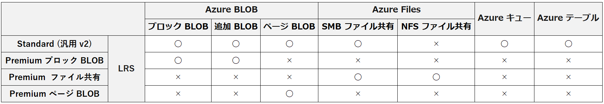
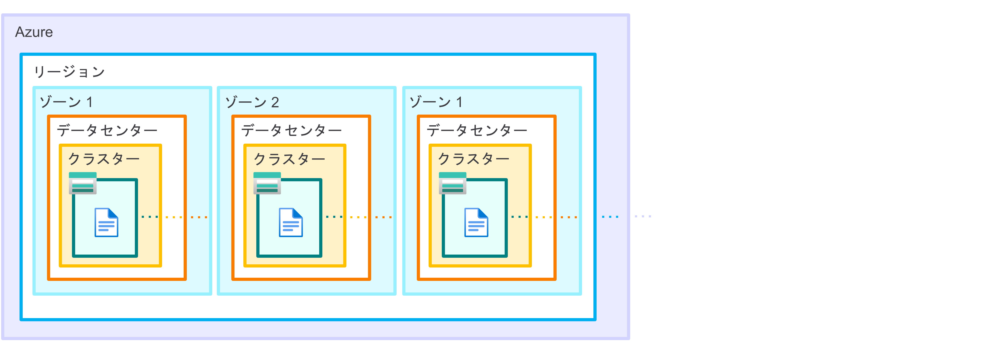
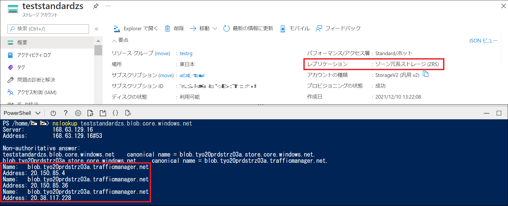
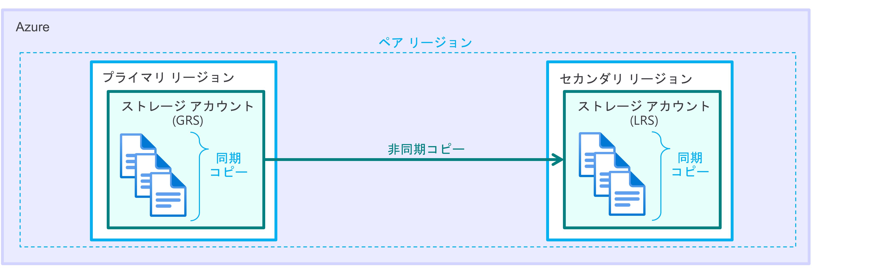
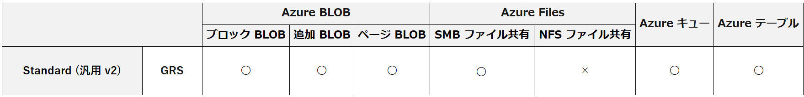
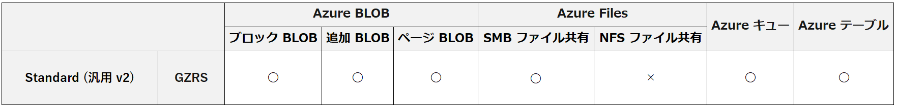
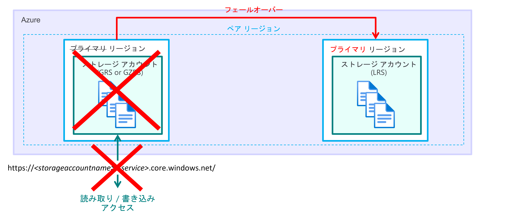
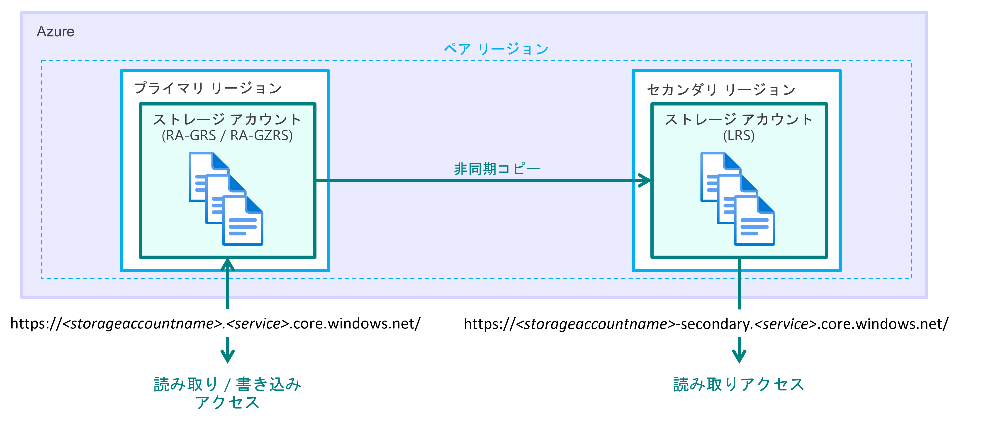
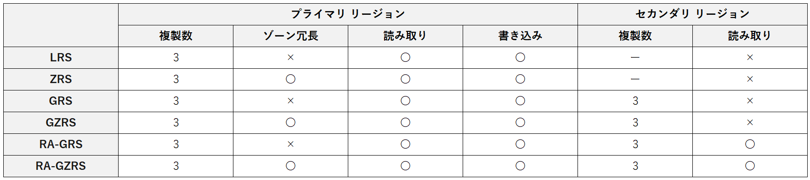
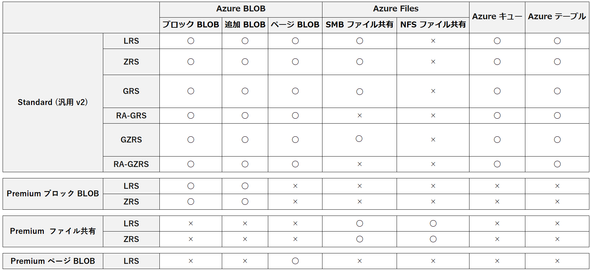

こんにちは。Azure テクニカル サポート チームの重田です。

Azure Storage では、4 つのデータ サービスが提供されており、日々多くのお客様にご利用いただいています。
各データ サービスにはストレージ アカウントを通じてアクセスするため、お客様にてご要件に併せたストレージ アカウントの種類や冗長性 (データのレプリケート方法) の種類を選択いただく必要があります。

本記事では、Azure Storage として提供している 4 つのデータ サービスやストレージ アカウントの概要について説明した上で、レプリケートされたデータがどのように配置されているのかを図を用いてご紹介します。

<!-- more -->

---

## Azure Storage と 4 つのデータ サービス

Azure では、お客様のデータを Azure 上に格納するために提供されている方法のうち、4 つのデータ サービス (Azure BLOB、Azure Files、Azure キュー、Azure テーブル) を Azure Storage という名前で呼んでいます。
各データ サービスの詳細につきましては、以下の公開情報に記載がありますのでご確認ください。

> ご参考) コア Azure Storage サービスの概要
> [https://docs.microsoft.com/ja-jp/azure/storage/common/storage-introduction](https://docs.microsoft.com/ja-jp/azure/storage/common/storage-introduction)
>
>> - **[Azure BLOB](https://docs.microsoft.com/ja-jp/azure/storage/common/storage-introduction#blob-storage)**:
>>   テキストおよびバイナリ データのための高度にスケーラブルなオブジェクト ストア。
>>   - [ブロック BLOB](https://docs.microsoft.com/ja-jp/rest/api/storageservices/understanding-block-blobs--append-blobs--and-page-blobs#about-block-blobs):
>>     大量のデータを効率的にアップロードするための最適化されています。
>>   - [追加 BLOB](https://docs.microsoft.com/ja-jp/rest/api/storageservices/understanding-block-blobs--append-blobs--and-page-blobs#about-append-blobs):
>>     ブロックで構成され、追加操作用に最適化されています。
>>   - [ページ BLOB](https://docs.microsoft.com/ja-jp/rest/api/storageservices/understanding-block-blobs--append-blobs--and-page-blobs#about-page-blobs):
>>     ランダムな読み取りと書き込みの操作用に最適化されています。
>> - **[Azure Files](https://docs.microsoft.com/ja-jp/azure/storage/common/storage-introduction#azure-files)**:
>>   クラウドまたはオンプレミスのデプロイ用のマネージド ファイル共有。
>>   1 つの　Azure ファイル共有に対して、SMB と NFS の両方のプロトコルを使用したアクセスはサポートされませんが、同じストレージ アカウント内に SMB と NFS のファイル共有を作成することは可能です。
>>   - [SMB ファイル共有](https://docs.microsoft.com/ja-jp/azure/storage/files/files-smb-protocol?tabs=azure-portal)
>>   - [NFS ファイル共有](https://docs.microsoft.com/ja-jp/azure/storage/files/files-nfs-protocol)
>> - **[Azure キュー](https://docs.microsoft.com/ja-jp/azure/storage/common/storage-introduction#queue-storage)**:
>>   アプリケーション コンポーネント間の信頼性の高いメッセージングのためのメッセージング ストア。
>> - **[Azure テーブル](https://docs.microsoft.com/ja-jp/azure/storage/common/storage-introduction#table-storage)**:
>>   構造化データのスキーマレス ストレージのための NoSQL ストア。

公開情報にて、コア Azure Storage サービスとして、Azure ディスクが記載されております。
これは、Azure 管理ディスクの実態が、仮想ハード ディスク (VHD ファイル) であり、Microsoft で管理しているストレージ アカウント上にページ BLOB (Azure BLOB で利用できる 3 種類の BLOB の 1 つ) として格納されているためになります。

>> - **[Azure ディスク](https://docs.microsoft.com/ja-jp/azure/storage/common/storage-introduction#disk-storage)**:
>>   Azure VM のためのブロック レベルのストレージ ボリューム。

---

## ストレージ アカウントとは

ストレージ アカウントとは、グローバルな一意な名前をもって、Azure Storage データ オブジェクト (BLOB、ファイル、キュー、テーブル) をグループ化するためのコンテナー (論理的な区画) です。
ストレージ アカウント内のデータには、 HTTP または HTTPS 経由などでアクセスすることが可能です。

Azure Storage データ オブジェクトは、ストレージ アカウント作成時にご指定いただいたリージョンのデータセンター内の物理サーバー群 (ストレージ クラスターまたはスタンプと呼びます) に格納されております。

---

## ストレージ アカウントの種類

ストレージ アカウントには、パフォーマンスや用途によって複数の種類があります。
※ 本記事では、クラシック環境のストレージ アカウントおよび ARM 環境のレガシ ストレージ アカウントについては扱いません。

> ご参考) ストレージ アカウントの概要
> [https://docs.microsoft.com/ja-jp/azure/storage/common/storage-account-overview](https://docs.microsoft.com/ja-jp/azure/storage/common/storage-account-overview)
>
>> - **Standard 汎用 v2**
>>   BLOB、ファイル共有、キュー、テーブル用の Standard タイプのストレージ アカウント。
>>   Azure Storage を使用するほとんどのシナリオにお勧めします。
>> - **Premium ブロック BLOB**
>>   ブロック BLOB と追加 BLOB 用の Premium タイプのストレージ アカウント。
>>   トランザクション レートが高く、比較的小さなオブジェクトが使用されるシナリオ、またはストレージ待ち時間が一貫して短いことが要求されるシナリオに推奨されます。
>> - **Premium ファイル共有**
>>   ファイル共有専用の Premium タイプのストレージ アカウント。
>>   エンタープライズまたはハイ パフォーマンス スケール アプリケーションにお勧めします。
>>   SMB ファイル共有と NFS ファイル共有の両方をサポートするストレージアカウントが必要な場合は、このタイプのアカウントを使用します。
>> - **Premium ページ BLOB**
>>   ページ BLOB に特化した Premium Storage アカウントの種類。

各ストレージ アカウントの種類にてサポートされている Azure Storage のデータサービスは、下記の通りとなります。

---

## 冗長性 (データのレプリケート方法) の種類と各データ サービスのご利用可否

Azure Storage では、ユーザー データを Azure 基盤側の計画されたイベント (メンテナンス) / 計画外のイベント (一時的なハードウェア障害、ネットワークの障害、災害など) から保護するため、常に複数 (構成によっては 3 つ以上) のコピーを実施しています。

データのレプリケート方法としては、LRS、ZRS、GRS、GZRS の 4 種類と GRS、GZRS のセカンダリ リージョンへ読み取りアクセスが可能となった RA-GRS、RA-GZRS の計 6 種類があります。

> ご参考) Azure Storage の冗長性
> [https://docs.microsoft.com/ja-jp/azure/storage/common/storage-redundancy#supported-azure-storage-services](https://docs.microsoft.com/ja-jp/azure/storage/common/storage-redundancy#supported-azure-storage-services)

それぞれについて説明します。

---

### ローカル冗長ストレージ (LRS)

LRS は、ストレージ アカウントを作成したリージョンの単一のデータ センター内で、データを同期的に 3 回複製します。

最も安価なレプリケーション オプションですが、データセンター単位の障害が発生した場合には、回復不能となるリスクがあり、高可用性を必要とするアプリケーションには推奨されません。

> ご参考) ローカル冗長ストレージ
> [https://docs.microsoft.com/ja-jp/azure/storage/common/storage-redundancy#locally-redundant-storage](https://docs.microsoft.com/ja-jp/azure/storage/common/storage-redundancy#locally-redundant-storage)

なお、LRS で利用可能な Azure Storage データ サービスは以下の通りです。

---

### ゾーン冗長ストレージ (ZRS)

ZRS は、可用性ゾーン対応リージョンでご利用いただけるレプリケーション オプションであり、ストレージ アカウントを作成したリージョンの 3 つの Azure 可用性ゾーン間で、データを同期的に複製します。

可用性ゾーン対応リージョンの場合では、それぞれ異なる電源・ネットワーク・冷却装置を持つ物理的に分離された場所を 3 つに分け、複数のゾーンにデータをレプリケートすることで、ゾーン単位の障害が発生した場合でも別のゾーンからデータが利用できることを実現しています。

> ご参考) リージョンと可用性ゾーン
> [https://docs.microsoft.com/ja-jp/azure/availability-zones/az-overview?context=/azure/virtual-machines/context/context](https://docs.microsoft.com/ja-jp/azure/availability-zones/az-overview?context=/azure/virtual-machines/context/context)

ZRS では、ゾーンごとにデータがレプリケートされているため、データセンター単位の障害やゾーン単位の障害が発生した場合でも、影響を受けていないゾーンに保管されているデータにアクセスすることが可能となります。

リージョン単位の障害が発生した場合には回復不能となるリスクがあるため、さらに高可用性を必要とするアプリケーションをご利用の場合には、セカンダリ リージョンにもデータをレプリケートする Geo 冗長をご検討ください。

> ご参考) ゾーン冗長ストレージ
> [https://docs.microsoft.com/ja-jp/azure/storage/common/storage-redundancy#zone-redundant-storage](https://docs.microsoft.com/ja-jp/azure/storage/common/storage-redundancy#zone-redundant-storage)

なお、ZRS で利用可能な Azure Storage データ サービスは以下の通りです。

> [!NOTE]
> **コラム：ゾーンごとにデータがレプリケートされている場合はどこにアクセスしているのか**
> 　
> ストレージ アカウント名は DNS ホスト名の一部となっており、エンドポイント (**<ストレージ アカウント名>.<サービス>.core.windows.net**) をご指定いただくことで、DNS 経由でデータが保存されている場所にアクセスします。
> ZRS をご利用の場合、データはゾーンごとに複製されておりますため、ストレージ アカウントのエンドポイントは 3 つの IP アドレスに紐づけられています。
> 　
> 
> 　
> ZRS の保管されているデータに書き込みを行った場合には、リクエストを投げた際に一番応答の早いゾーンの IP アドレスに解決が行われ、そのゾーンに保存されているデータに対して書き込み操作が実施されます。
> 残りのゾーンについては、バックエンドで書き込み操作を実施した変更が同期されます。
> 　
> ゾーンが使用できなくなった場合には、Azure 側で DNS の再指定などのネットワークの更新が実施されますので、お客様における切り替え作業は発生いたしません。
> 　
> なお、ストレージ アカウントに紐づく IP アドレスを固定化することは叶いませんので、ストレージ アカウント内のデータにアクセスする際はエンドポイントとして提供されている **<ストレージ アカウント名>.<サービス>.core.windows.net** をご利用ください。

---

### Geo 冗長ストレージ (GRS)

Geo 冗長は、プライマリ リージョンのデータをセカンダリ リージョンにもレプリケートする構成です。
セカンダリ リージョンは、プライマリ リージョンのペア リージョンになります。

> ご参考) すべての地域の Azure リージョン間レプリケーションのペアリング
> [https://docs.microsoft.com/ja-jp/azure/availability-zones/cross-region-replication-azure#azure-cross-region-replication-pairings-for-all-geographies](https://docs.microsoft.com/ja-jp/azure/availability-zones/cross-region-replication-azure#azure-cross-region-replication-pairings-for-all-geographies)

GRS は、プライマリ リージョンで LRS を使用してデータを同期的に 3 回複製した後、データをセカンダリ リージョンに非同期的に複製します。セカンダリ リージョンでは LRS を利用して、単一のデータ センター内でデータを同期的に 3 回複製します。

> ご参考) geo 冗長ストレージ
> [https://docs.microsoft.com/ja-jp/azure/storage/common/storage-redundancy?toc=/azure/storage/blobs/toc.json#geo-redundant-storage](https://docs.microsoft.com/ja-jp/azure/storage/common/storage-redundancy?toc=/azure/storage/blobs/toc.json#geo-redundant-storage)

> [!WARNING]
> 非同期の複製に関して、プライマリ リージョンに障害が発生した場合にも、最新の変更がセカンダリ リージョンに同期できておらず、最新の変更分に関してはデータが失われる可能性があります。
> 非同期的に行う複製の間隔 (回復ポイントの目標 / RPO) に関する SLA はありませんが、Azure Storage における RPO 目安としては 15 分未満となります。

なお、GRS で利用可能な Azure Storage データ サービスは以下の通りです。

---

### geo ゾーン冗長ストレージ (GZRS)

GZRS は、プライマリ リージョンで ZRS を使用してデータを同期的に 3 回複製した後、データをセカンダリ リージョンに非同期的に複製します。セカンダリ リージョンでは LRS を利用して、単一のデータ センター内でデータを同期的に 3 回複製します。

> ご参考) geo ゾーン冗長ストレージ
> [https://docs.microsoft.com/ja-jp/azure/storage/common/storage-redundancy?toc=/azure/storage/blobs/toc.json#geo-zone-redundant-storage](https://docs.microsoft.com/ja-jp/azure/storage/common/storage-redundancy?toc=/azure/storage/blobs/toc.json#geo-zone-redundant-storage)

なお、GRS で利用可能な Azure Storage データ サービスは以下の通りです。

---

### GRS、GZRS と RA-GRS、RA-GZRS の違い

GRS、GZRS と RA-GRS、RA-GZRS の違いは、セカンダリ リージョンのデータへのアクセス状況です。
それぞれについて説明します。

なお、RA-GRS および RA-GZRS で利用可能な Azure Storage データ サービスは以下の通りです。

#### GRS、GZRS

GRS、GZRS の場合は、エンドポイントによって、プライマリ リージョンのデータへの読み取り/書き込みが実施できます。

セカンダリ リージョン上のデータについては、フェールオーバーによってエンドポイントに関連付いている IP アドレスが切り替わることで、アクセスが可能になります。
フェールオーバー中はプライマリ リージョンでの読み取り/書き込みアクセスができなくなり、フェールオーバー完了後に新しいプライマリ リージョン (元セカンダリ リージョン) にて読み取り/書き込みが実施できるようになります。

#### RA-GRS、RA-GZRS

RA-GRS、RA-GZRS では、プライマリ リージョンのデータへの読み取り/書き込みとセカンダリ リージョンのデータに対して読み取りが実施できます。

フェールオーバーを実施した場合、フェールオーバー中はプライマリ リージョンでの読み取り/書き込みアクセスができなくなりますが、セカンダリ リージョンの読み取りアクセスは継続してご利用いただけることが想定されています。
フェールオーバー完了後には、新しいプライマリ リージョン (元セカンダリ リージョン) にて読み取り/書き込みが実施できるようになります。

---

## まとめ

本記事でご紹介した内容のまとめは、以下の通りです。

### 冗長性 (データのレプリケート方法) の種類

### ストレージ アカウントの種類およびレプリケーションの種類に対するデータ サービスのサポート状況

> [!NOTE]
> Update: 2022/9/29 - **Azure Files で RA-GRS / RA-GZRS を選択した場合について**
> 　
> Azure Files については、RA-GRS におけるセカンダリ リージョンの読み取りアクセスがサポートされていません。
> ストレージ アカウントのレプリケーションの種類にて RA-GRS / RA-GZRS を選択いただいた場合、Azure Files では GRS / GZRS の機能がご利用いただけます。
> 　
> ご参考) Azure Files のデプロイの計画
> https://learn.microsoft.com/ja-jp/azure/storage/files/storage-files-planning
> 抜粋：
>> 汎用バージョン 2 (GPv2) のストレージ アカウントでは、Azure Files ではサポートされていない 2 つの追加の冗長オプションが提供されています。
>> 読み取りアクセス geo 冗長ストレージ (RA-GRS と呼ばれることもあります) と、読み取りアクセス geo ゾーン冗長ストレージ (RA-GZRS と呼ばれることもあります) です。
>> これらのオプション セットを使用して、ストレージ アカウントで Azure ファイル共有をプロビジョニングできますが、Azure Files ではセカンダリ リージョンからの読み取りはサポートされていません。
>> 読み取りアクセス geo 冗長ストレージ アカウントまたは読み取りアクセス geo ゾーン冗長ストレージ アカウントにデプロイされた Azure ファイル共有は、それぞれ、geo 冗長ストレージまたは geo ゾーン冗長ストレージとして課金されます。

本記事の内容が皆様のお役に立てれば幸いです。
