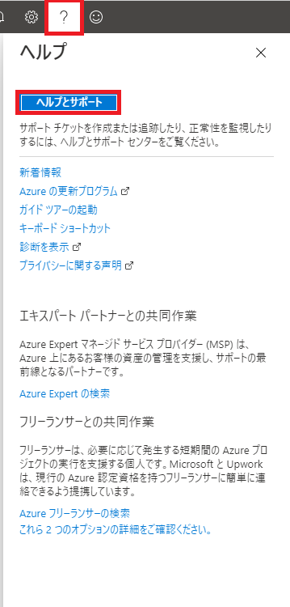
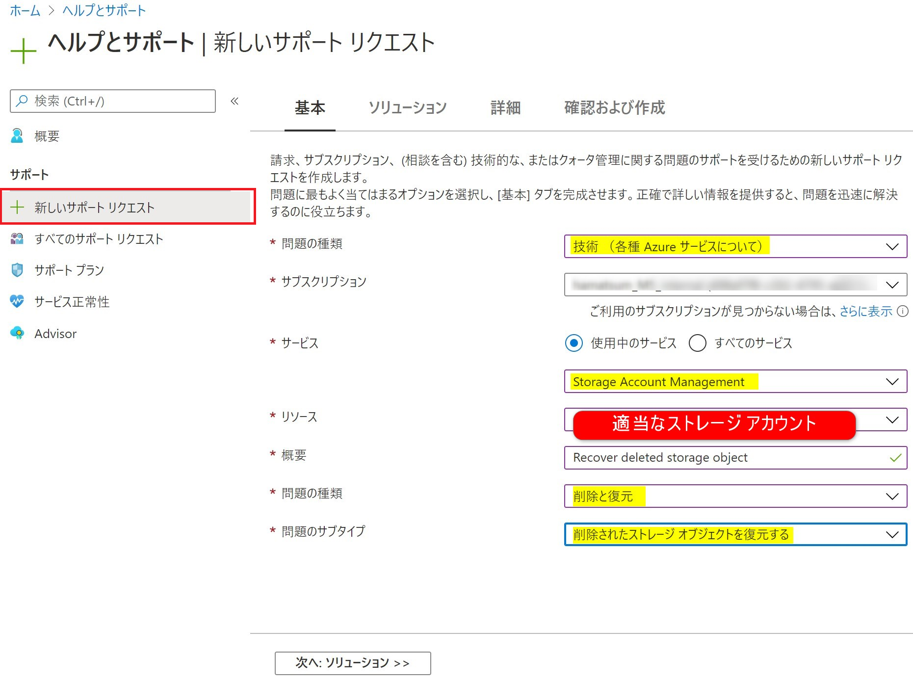
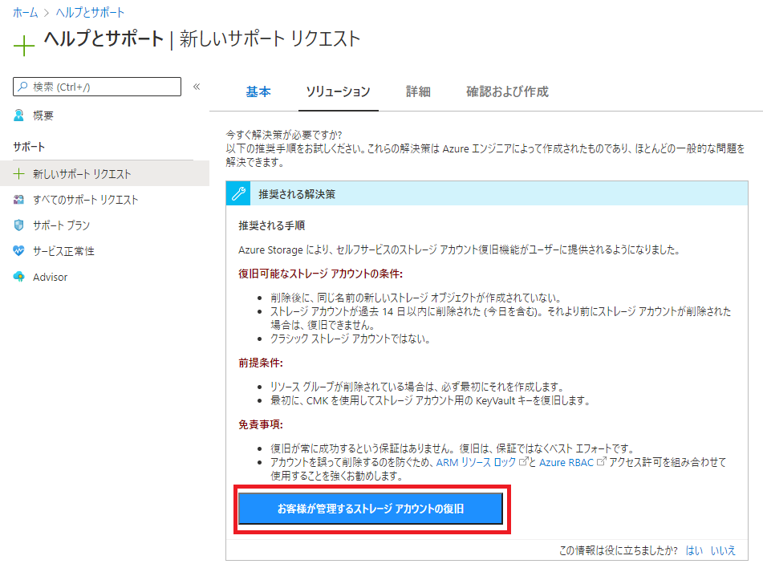
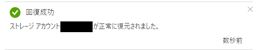

# 誤って削除してしまったストレージ アカウントを復旧する

こんにちは、Azure サポートチームの安田です。

今回は誤って削除してしまったストレージ アカウントの復元を行う方法をご案内します。以前までは弊サポート部門にお問い合わせいただき、数営業日かけて復旧するという流れでしたが、最近のアップデートにてお客様にて迅速に復元を行うことができるようになりました。ただし、本手順を用いても復元が叶わない場合もありますので、予めご了承ください。

<!-- more -->

また、本手順は現段階ではプレビューの機能となりますので、ポータルの UI 等が変更される可能性があります。こちらも予めご了承ください。
#本情報の内容（添付文書、リンク先などを含む）は、作成日時点でのものであり、予告なく変更される場合があります。

## ストレージ アカウント復元時の注意点について

前提として復元を行うには、以下の項目を満たしている必要があります。下記の条件を満たしていない場合には、残念ながら復旧は叶わないこととなりますので、予めご留意ください。

・削除後に、同じ名前の新しいストレージ アカウントが作成されていない。

・ストレージ アカウントが過去 14 日以内に削除された。

・クラシック ストレージ アカウントではない。

また、リソースグループ毎削除してしまった場合には、予め同名のリソースグループを作成しておく必要あるため、事前に用意ください。

## ストレージ アカウント復元の手順

1. Azure ポータルにアクセスし、右上の ? マークから、 "ヘルプとサポート" を選択します。

2. 右側のタブから "新しいサポート リクエスト" を選択し、下記画像のように各項目を選択します。

\#ストレージ アカウントについては表示された任意のものを選択ください。

\#(この選択されたアカウントは利用しませんのでご安心ください。)

\#"概要" の項目を適当に記載した場合、次の画面に正しく遷移しない可能性があるため、

\#下記のように "Recover deleted storage object " と入力ください。

記載が完了したら "次へ" を選択し、ソリューションの画面に推移します。

3. "推奨される解決策" 内の "お客様が管理するストレージ アカウントの復旧" を選択します。

4. 復旧対象のストレージ アカウントを選択し、"回復" を押下します。

暫くすると復元が完了の通知が発生します。

本手順で復旧が完了しない場合、または復旧についてご不明な点がある場合は、お気兼ねなく弊サポート部門へお問い合わせください

## 予期せぬリソースの削除を防ぐために

残念ながら上記方法では復元をお約束することは叶いません。こういった不慮の事故を未然に防ぐため、Azure のリソースには "リソースロック機能"、BLOB ファイルには "Soft Delete 機能" という誤削除防止の機能が用意されています。以前の記事で紹介しているため、詳細については "リソースの誤削除を未然に防ぐ方法について（リソースロック機能のご紹介）" と "BLOB ファイルの誤削除を未然に防ぐ方法について（Soft Delete 機能のご紹介）" の項目をご確認ください。

>Azure リソースの意図しない削除について
>[https://jpaztech.github.io/blog/vm/resource-delete/](https://jpaztech.github.io/blog/vm/resource-delete/)

以上、ご参考となれば幸いです。

