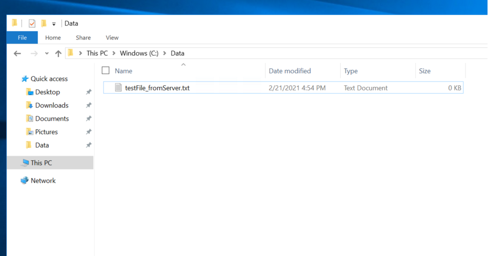
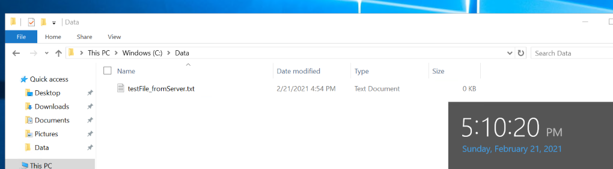
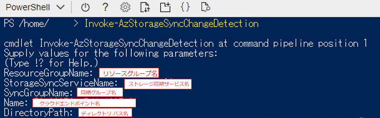
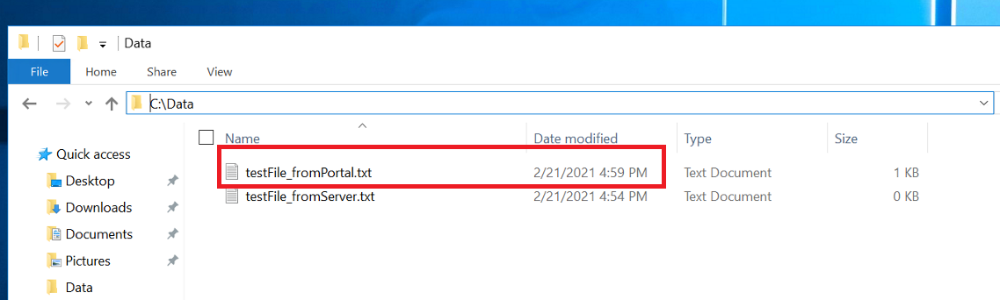
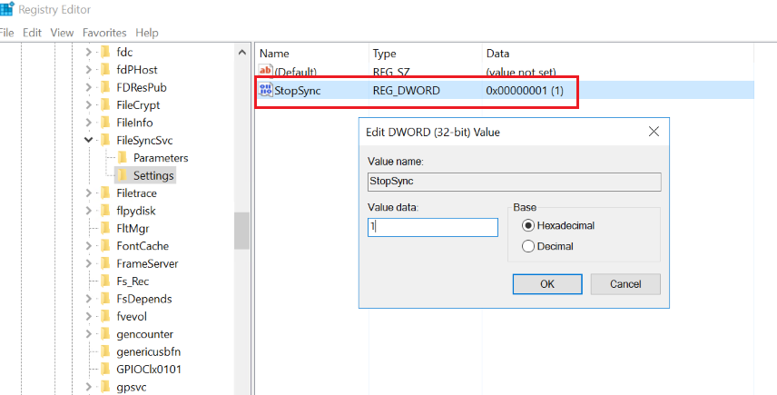
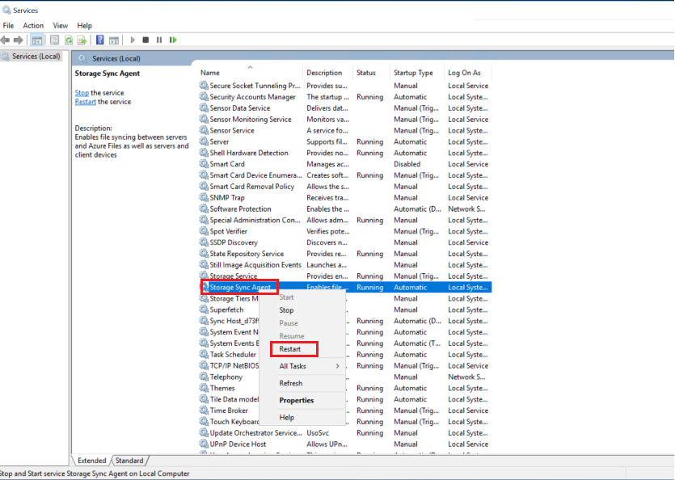
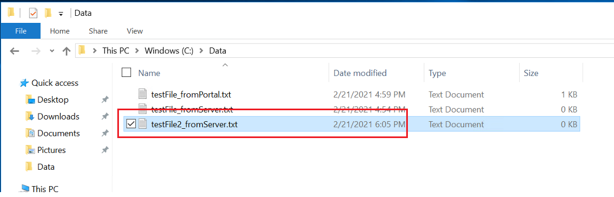
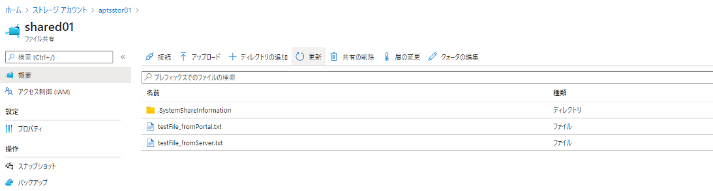
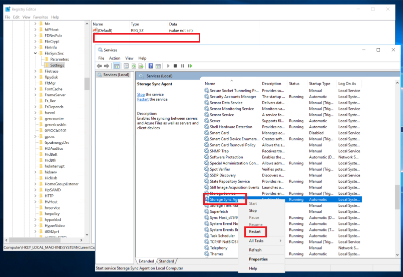

こんにちは、Azure テクニカル サポート チームの木下です。

Azure File Sync に関して、たびたびお問合せいただくことがございます。
今回は、よくあるお問い合わせのうち下記 2 つの項目についてご紹介いたします。

**・ファイルの同期周期に関する FAQ**
**・同期の一時停止に関する FAQ**

<!-- more -->
## ファイルの同期周期に関する FAQ

**Q1.** 
Azure Portal から ファイルをアップロードしましたが
サーバーエンドポイントに反映されません。原因を教えてください。

**A1.** 
Azure Portal または SMB を使用して Azure ファイル共有に加えられた
変更は**即時反映されません**。Azure File Sync には、"変更検出ジョブ" 
という 24 時間ごとに実行するようスケジュールされたジョブがあります。

その "変更検出ジョブ" によって Azure ファイル共有上のファイルに変更が
加えられていることが検出された場合に、Azure File Sync が同期セッション
を開始し、サーバーエンドポイントへ反映されることとなります。

>参考 ) 
>□SMB またはポータルで Azure ファイル共有に直接ファイルを作成しました。
>このファイルが同期グループのサーバーに同期されるまでどのくらいの時間がかかりますか。
>https://docs.microsoft.com/ja-jp/azure/storage/files/storage-files-faq

サーバーエンドポイントおよびクラウドエンドポイントでの同期周期は以下の通りです。

| ファイル操作元   |     同期周期      | 
| --- | ----------- | 
| サーバーエンドポイント | 即時 |
| クラウドエンドポイント (Azure Portal または SMB) | 約 24 時間ごと |

サーバーエンドポイント、クラウドエンドポイントから各々ファイルを
アップロードした際の同期グループへの反映状況を確認してみます。

**■サーバーエンドポイントでファイルをアップロードした場合**

サーバーエンドポイント でファイルを追加します。


サーバーエンドポイントで作成したファイルは Azure Portal 上の 
ファイル共有 内に即時反映されたことが確認できます。


**■クラウドエンドポイント (Azure Portal)でファイルをアップロードした場合**

Azure Portal > ファイル共有 よりファイルをアップロードします。


サーバーエンドポイント側にはファイルが即時反映されていません。


**Q2.** 
Azure Portal または SMB を使用して Azure ファイル共有に加えられた
変更に関しては、24 時間ごとの変更検出ジョブを待つしかないのでしょうか。

**A2.**
いいえ、手動にはなりますが Azure ファイル共有上で変更されたファイルを即時で
サーバーエンドポイントへ同期したい場合は、**Invoke-AzStorageSyncChangeDetection**
PowerShell コマンドレットを使用いただくことで変更検出ジョブの実行を待つことなく、
同期グループ上のサーバーエンドポイントへ反映させることが可能です。

例)
PowerShell より Invoke-AzStorageSyncChangeDetection を実行

```shell
Invoke-AzStorageSyncChangeDetection 
 -ResourceGroupName "リソースグループ名" 
 -StorageSyncServiceName "ストレージ同期サービス名" 
 -SyncGroupName "同期グループ名" 
 -CloudEndpointName "クラウドエンドポイント名" 
 -DirectoryPath "ディレクトリパス名"
```
サーバーエンドポイントへ反映されたことを確認します。


><ご参考>
>□Invoke-AzStorageSyncChangeDetection
>https://docs.microsoft.com/ja-jp/powershell/module/az.storagesync/invoke-azstoragesyncchangedetection?view=azps-5.5.0
>□Get-AzStorageSyncCloudEndpoint
>https://docs.microsoft.com/ja-jp/powershell/module/az.storagesync/get-azstoragesynccloudendpoint?view=azps-5.5.0

## 同期の一時停止に関する FAQ

**Q.** 
Azure File Sync の同期を一時停止させることはできますか。

**A.** 
はい、同期グループ内のサーバーエンドポイント側で設定を行って
いただくことで一時的に同期を停止させることが可能です。

**■サーバーエンドポイントにて同期を一時停止する手順**
1. 対象のサーバーエンドポイント側のレジストリで以下の値を作成します。
#既定では "Settings" はないため手動で作成してください。




```shell
Key: [HKLM(HKEY_LOCAL_MACHINE)]\SYSTEM\CurrentControlSet\Services\FileSyncSvc\Settings
Type: REG_DWORD
Value name: StopSync
Value: 1
```

2. サービスから "Storage Sync Agent" を再起動します。


3. サーバーエンドポイント側でアップロードしたファイルが 
Azure Portal 上へ反映されていないことを確認します。



>注意)
>この操作では同期のみが停止され、ファイルの変更検出や
>階層化の呼び戻しは実行されますのでご留意ください。

同期を再開いただく場合には、レジストリより "StopSync" を削除のうえ
再度サービスより "Storage Sync Agent" の再起動を行ってください。


StopSync を削除しStorage Sync Agent の再起動を行うと Azure Portal 上へファイルの同期が再開されます。


>注意)
>サーバーエンドポイントの削除、Storage Sync Agent の停止は基本的に推奨されない手順となります。
>上記一時停止がご要望に沿わない場合、まずは対応方針について弊社サポート部門までお問い合わせください。

本稿は以上となりますが、いかがでしたでしょうか。 本稿が皆様のお役に立てれば幸いです。


