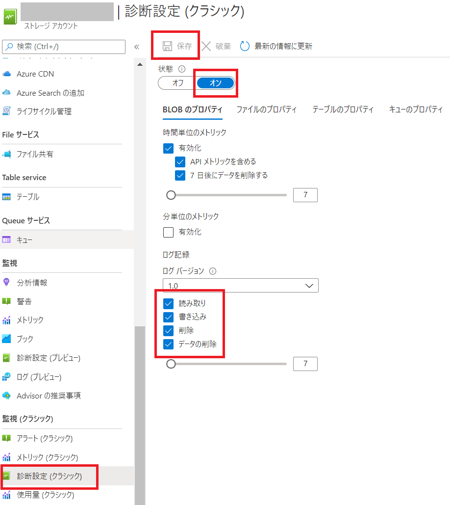
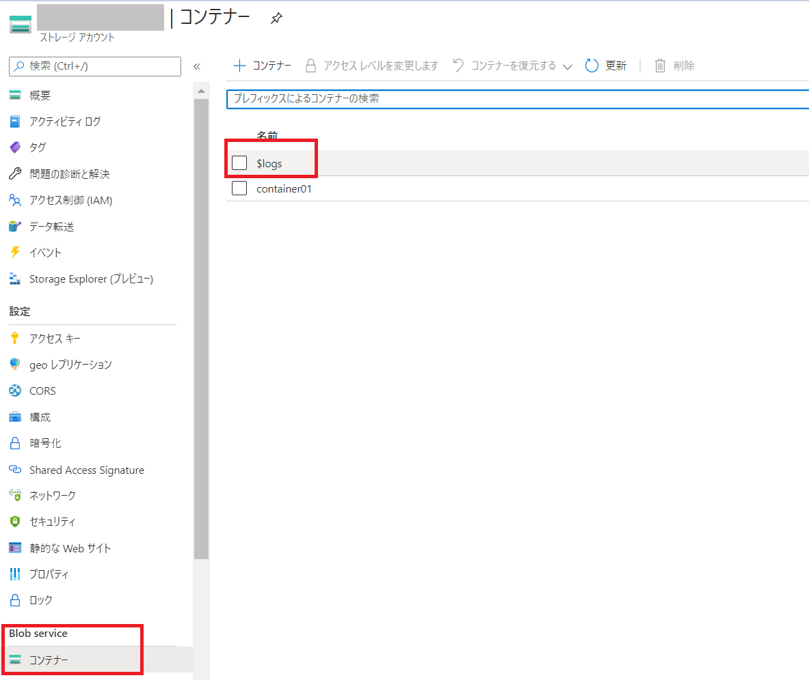
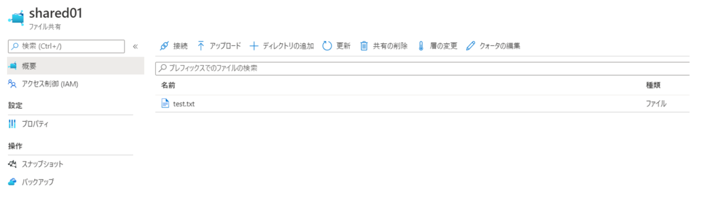
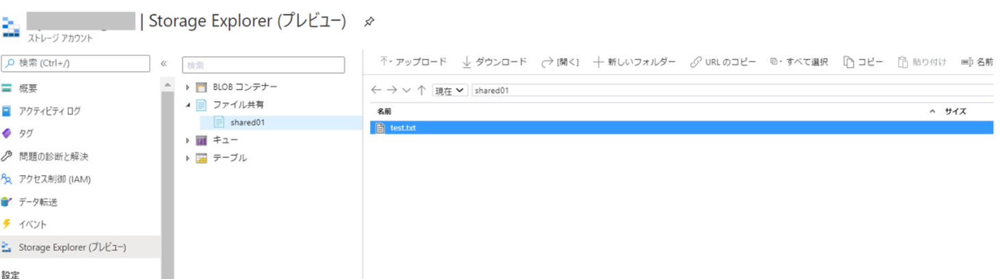
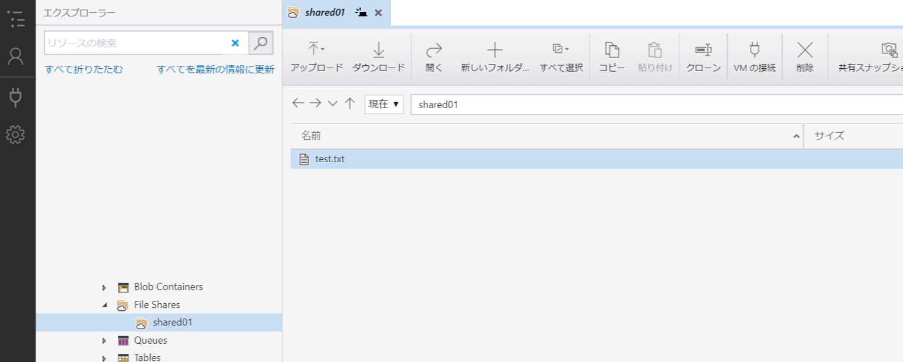
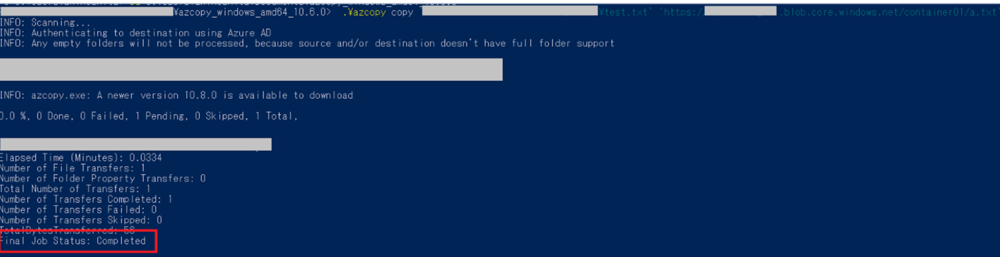
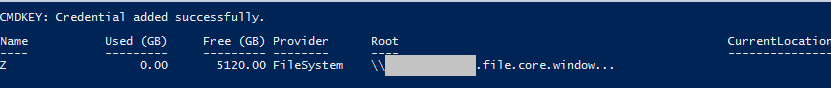

こんにちは、Azure テクニカル サポート チームの木下です。


今回は Azure ストレージ アカウント内コンテンツへのアクセス時に 403 エラーが発生した
場合の対処法をストレージファイアウォール観点でエラー事例とともにご紹介いたします。


<!-- more -->

まずは 403 エラー発生時の事例を 5 つご紹介いたします。

**事例1)**
Azure ストレージ アカウント > ファイル共有 画面でのアクセスエラー


**事例2)**
Azure ストレージ アカウント > Storage Explorer (プレビュー) 画面でのアクセスエラー


**事例3)**
Azure Storage Explorer ツール画面でのアクセスエラー


**事例4)**
AzCopy コマンドにてオンプレミス / Azure VM から Azure Storage Blob コンテナーへのファイルコピー時のエラー


**事例5)**
オンプレミス / Azure VM からファイル共有をマウントした時のアクセスエラー


事例1-5 のエラーの場合、ストレージファイアウォールが有効化されており設定に不備不足が
ある可能性が考えられます。原因がストレージファイアウォールであるか切り分けるため、
ストレージファイアウォールを一度無効にしエラーが解消されるかを確認します。

<font color="LightSalmon">

## ■ストレージファイアウォール無効化の手順
</font>

1. 対象のストレージアカウント「ネットワーク」をクリックします。
2. 「ファイアウォールと仮想ネットワーク」より「すべてのネットワーク」を選択し「保存」します。


「すべてのネットワーク」が選択されている場合、ストレージファイアウォールの設定は<b>無効</b>状態となります。
>参考 )
>□Azure Storage ファイアウォールおよび仮想ネットワークを構成する
>https://docs.microsoft.com/ja-jp/azure/storage/common/storage-network-security#azure-portal

「すべてのネットワーク」が選択されている状態に変更が完了したら、事例1-5 の状態が解消されるか確認してください。
事例1-5 の状態が解消されていれば、ストレージファイアウォールの設定に問題があると判断できます。

もし、このままストレージファイアウォールを無効としても運用上差し支えなければ無効の状態でご利用ください。
アクセス元を制限したい場合は、以下に沿ってファイアウォール有効化の設定をご確認ください。

<font color="LightSalmon">

## ■ストレージファイアウォール有効化の手順
</font>

### (1) インターネットまたはオンプレミスのネットワークからのアクセスを許可する

事例1-3 と 事例4-5 (※オンプレミス からの実施の場合のみ) はいずれもインターネットまたはオンプレミスからの
アクセスになりますが、ストレージファイアウォール側でアクセス元のパブリック IP アドレスが許可されていないことにより
エラーが出ている状態になります。そのため、アクセス元のクライアント端末のグローバル IP アドレスを追加してください。

1. 対象のストレージアカウント「ネットワーク」をクリックします。
2. 「ファイアウォールと仮想ネットワーク」のクライアント端末の IP アドレスを追加し「保存」します。


>注意)
>Express Route をご利用されており、Microsoft Peering または Public Peering を用いて Azure ストレージに接続する構成の場合、
>Azure ストレージに側の接続元の IP アドレスはオンプレミスのプライベート IP アドレスではなく、Microsoft Peering または 
>Public Peering で構成したパブリック IP アドレスとなります。そのため、Express Route 経由後のパブリック IP アドレスを追加
>していただく必要があることをあらかじめご留意ください。

アクセス許可を行いたいアクセス元の IP アドレスが分からない状態の場合、Azure ストレージの
診断ログを取得し、403 エラーを検知しているログより IP アドレスを特定します。

#### ・Azure ストレージの診断ログの設定およびアクセス元 IP アドレスの特定

1. Azure ポータル ( https://portal.azure.com/ ) にログインし、ストレージアカウントを選択します。
2. 「監視 (クラシック)」内 「診断設定 (クラシック)」を選択します。
3. 「BLOBのプロパティ」を選択します。
4. 状態を「オン」にし、「ログ記録」にて、「読み取り」「書き込み」「削除」のすべてにチェックを入れ「保存」します。




>注意 ) 
>上記設定を有効化いただくと、BLOB サービスに対するリクエストごとの診断ログが
>ストレージ内に保持され、その BLOB ファイルに応じた料金が発生いたします。
>
>また Azure Files は診断ログの記録は現在サポートされておりませんのでご了承ください。
>□ログの構成
>https://docs.microsoft.com/ja-jp/azure/storage/common/storage-monitor-storage-account#configure-logging

対象ストレージアカウントのコンテナー内に $logs が作成されるため、取得されたログよりアクセスに失敗した時刻を
対象に 403 エラーが記録されているログを探し、該当のログ内にある IP アドレスを特定します。
※診断ログに表記される時刻は UTC となりますのでご留意ください。

下記ログは、192.100.0.102 からのアクセスが失敗した例となります。
ストレージファイアウォールにて 192.100.0.102 を許可しアクセスが可能となるかご確認ください。
例)
```shell
1.0;202Y-MM-DDTHH:MM:SS.ZZZZZZZ;PutBlob;OAuthIpAuthorizationError;403;XX;XX;bearer;XXXXXXXXX;XXXXXXXXX;blob;
"https://XXXXXXXXX.blob.core.windows.net:443/XXXXXXXXX/XXXXXXXXX.txt?timeout=901";"/";XXXXXXXXXXXXXXXXXX;0;
192.100.0.102:4362;202Y-MM-DD;XXXX;0;XXX;XXX;XX;;;;;;"AzCopy/10.6.0 Azure-Storage/0.10 (go1.13; Windows_NT)";;"XXXXXXXXXXXXXXXXXX"

※ OAuthIpAuthorizationError : ID 認証を使用してアクセスした際のステータスメッセージ
```
```shell
1.0;202Y-MM-DDTHH:MM:SS.ZZZZZZZ;PutBlob;SASIpAuthorizationError;403;X;X;sas;;XXXXXXXXX;blob;
"https://XXXXXXXXX.blob.core.windows.net:443/XXXXXXXXX/XXXXXXXXX.txt?XXXXXXXXX;timeout=901";"/";XXXXXXXXX;0;
192.100.0.102:4362;202Y-MM-DD;XXXX;0;XXX;XXX;XX;;;;;;"AzCopy/10.6.0 Azure-Storage/0.10 (go1.13; Windows_NT)";;"XXXXXXXXXXXXXXXXXX"

※ SASIpAuthorizationError : SAS を使用してアクセスした際のステータスメッセージ
```

>参考 ) 
>□ストレージ アカウントの監視の設定
>https://docs.microsoft.com/ja-jp/azure/storage/common/storage-monitor-storage-account#configure-monitoring-for-a-storage-account
>□バージョン 1.0 のサンプル ログ エントリ
>https://docs.microsoft.com/ja-jp/rest/api/storageservices/storage-analytics-log-format#sample-log-entries-for-version-10
>□ログに記録される要求ステータス メッセージ
>https://docs.microsoft.com/ja-jp/rest/api/storageservices/storage-analytics-logged-operations-and-status-messages#logged-request-status-messages

### (2) 特定の仮想ネットワークおよびサブネットからのアクセスを許可する

事例4-5 (※ Azure VM からの実施の場合のみ) はいずれもストレージファイアウォール側で Azure VM が
所属している仮想ネットワークからのアクセスが許可されていないことによりにエラーが発生している状態です。
そのため、対象の Azure VM が所属している仮想ネットワークおよびサブネットを追加する必要があります。

1. 対象のストレージアカウント「ネットワーク」をクリックします。
2. 「ファイアウォールと仮想ネットワーク」の「仮想ネットワーク」に許可する仮想ネットワークおよびサブネットを追加します。


　#すでに利用したい仮想ネットワークがある場合は「既存の仮想ネットワークを追加する」から追加します。
　 仮想ネットワークが未作成の場合は「新しい仮想ネットワークを追加する」より作成追加してください。

　#異なるサブスクリプションの仮想ネットワークを追加する場合は、「サブスクリプション」項目のプルダウンより
　 対象のサブスクリプション内の仮想ネットワークおよびサブネットを選択し有効化します。
　 (有効化が完了するまで最大 15 分かかる場合があります) 有効化が完了したら「追加」をクリックします。

　 
3. 追加した仮想ネットワークおよびサブネットが表示されエンドポイントの状態が有効となっていることを確認し「保存」します。


仮想ネットワークおよびサブネットの追加が完了しましたら、許可したアクセス元よりアクセスし、
事例4-5  (※ Azure VM からの実施の場合のみ) の状態が解消されるかご確認ください。
解消されない場合は追加した仮想ネットワークやサブネットの範囲が正しいかご確認をお願いします。

>注意)
>ストレージファイアウォール設定で「すべてのネットワーク」と「選択されたネットワーク」の切り替えを行う場合や
>登録しているサブネットが仮想ネットワーク上で一度削除され、新たに同名でサブネットが作成された場合などにより
>古い情報が残存した状態となりエンドポイントの状態が「見つかりません」というようなエラーが表示されることがあります。
>
>その場合は、一度ストレージファイアウォール「仮想ネットワーク」項目からエラーが表示されているサブネットを削除し、
>上述の手順で仮想ネットワークおよびサブネットの追加をお試しいただきますようお願いいたします。


ストレージファイアウォール設定を有効化し、許可したいアクセス元の追加が完了しますと、
各々エラーが解消し Azure ストレージ内コンテンツへのアクセスが可能となります。

**事例1)**

**事例2)**

**事例3)**

**事例4)**

**事例5)**


本手順でエラーが解消しない場合、ストレージファイアウォール以外の設定に問題がある可能性もございます。
ストレージ内コンテンツへのアクセス権限は不足していないか等含めご確認くださいませ。

本稿が皆様のお役に立ちましたら幸いでございます。
