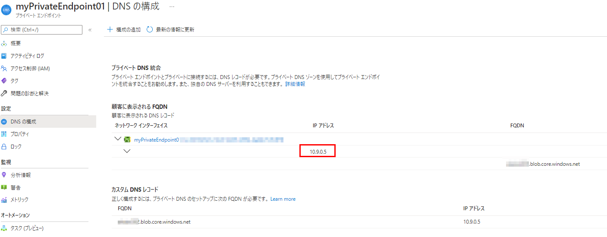
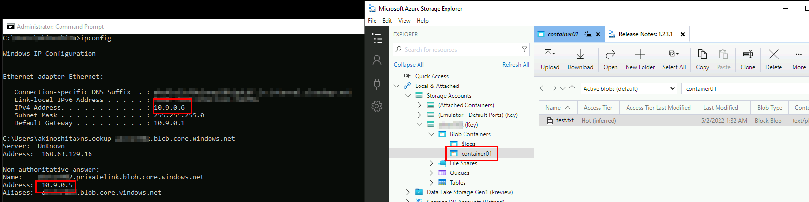
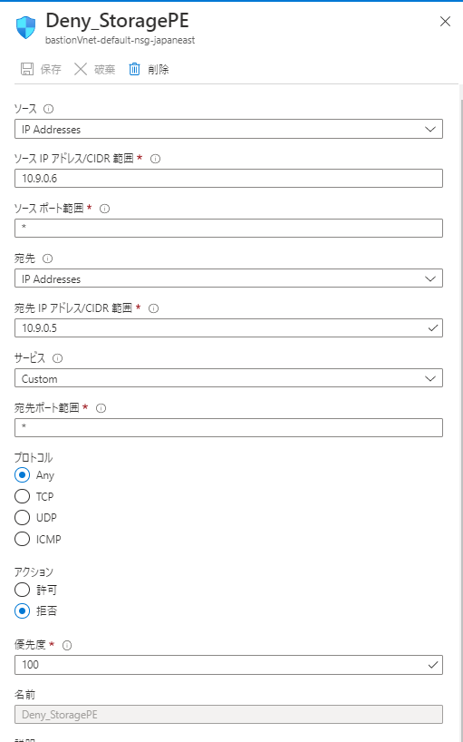
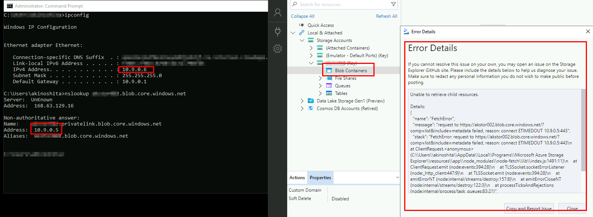

こんにちは、Azure サポートチームの木下です。
今回は、Azure VM からストレージ アカウントへアクセスする際の挙動とアクセス元制御ついてご案内します。

<!-- more -->

## Azure VM からストレージ アカウントへアクセスする際の挙動

VM からストレージ アカウントへアクセスを行う場合、両者のリージョンが異なる場合と、同じ場合ではアクセス元の IP アドレスが異なる点に、ご注意ください。

### VM とストレージ アカウントが同一リージョンに存在する場合

**パブリック エンドポイント または サービス エンドポイントを使用**

VM からストレージ アカウントへアクセスすると、アクセス元 IP は VM のパブリック IP とならず、Azure 内部で使用しているプライベート IP となります。

### VM とストレージ アカウントが異なるリージョンに存在する場合

**パブリック エンドポイントを使用**

VM からストレージ アカウントへアクセスすると、アクセス元 IP は VM のパブリック IP となります。

**サービス エンドポイントを使用**

VM からストレージ アカウントへアクセスすると、アクセス元 IP は VM のパブリック IP とならず、Azure 内部で使用しているプライベート IP となります。

(ご留意)
サービス エンドポイントがある仮想ネットワークのリージョンがペア リージョンではない他のリージョンである場合、アクセス元 IP は VM のパブリック IP となります。
ただ、現在、プレビュー段階ではありますが、ペア リージョン以外の他のリージョンにある仮想ネットワークからのアクセスにおいてもサービス エンドポイントを利用することが可能となりましました。
つまり、サービス エンドポイントを有効化することで、他のリージョンからのアクセスの際にパブリック IP ではなく、Azure 内部で使用しているプライベート IP を利用することができるようになりました。

参考）すべての地域の Azure リージョン間レプリケーションのペアリング
https://docs.microsoft.com/ja-jp/azure/availability-zones/cross-region-replication-azure#azure-cross-region-replication-pairings-for-all-geographies
※ペア リージョン例: 東日本リージョンと西日本リージョン

参考）Azure Storage ファイアウォールおよび仮想ネットワークを構成する > 他のリージョンの仮想ネットワークへのアクセスを有効にする (プレビュー)
https://docs.microsoft.com/ja-jp/azure/storage/common/storage-network-security?tabs=azure-powershell#enabling-access-to-virtual-networks-in-other-regions-preview
> <抜粋>
>
>別のリージョンにある仮想ネットワークからのアクセスを有効にするには、仮想ネットワークのサブスクリプションに AllowGlobalTagsForStorage 機能を登録します。 ストレージ サービス エンドポイントを備えた他のリージョンにあるサブネットでは、ストレージ アカウントとの通信にパブリック IP アドレスを使用しなくなりました。 トラフィックはすべてプライベート IP アドレスから送信され、それらのサブネットからのトラフィックを許可する IP ネットワーク ルールはいずれも影響を受けなくなりました。


### VM からストレージアカウントへのアクセス検証

・VM (東日本) から、ストレージ アカウント (東日本) に対して AzCopy を実施した結果

[ VM の構成 ]

パブリック IP : 40.115.XX.XX
プライベート IP : 10.1.0.4

[ ストレージ アカウントの診断ログ] ※1 、※2

サービス エンドポイント無効、パブリック エンドポイント経由のアクセス

>1.0;2022-05-01T09:19:01.3225693Z;GetBlobProperties;SASSuccess;200;4;4;sas;;storageaccountname;blob;"https://storageaccountname.blob.core.windows.net:443/container01/test.csv?sas";"/storageaccountname/container01/test.csv";d8bf55a9-601e-005f-583c-5d0abb000000;0;10.1.0.4:50100;2019-12-12;413;0;543;0;0;;;"&quot;0x8DXXXXXXXXXXXXX&quot;";Sunday, 01-May-22 09:19:01 GMT;;"AzCopy/10.6.0 Azure-Storage/0.10 (go1.13; Windows_NT)";;"XXXXXXXXXXXXXXXXXXXXXXXX"

アクセス元 IP は 10.1.0.4 であることが分かります。

サービス エンドポイント有効、サービス エンドポイント経由のアクセス
>1.0;2022-05-01T10:43:08.5058732Z;PutBlob;SASSuccess;201;12;12;sas;;akstor001;blob;"https://akstor001.blob.core.windows.net:443/container01/test.csv?sas";"/akstor001/container01/test.csv";188ffdda-b01e-002e-3c48-5dec90000000;0;10.1.0.4:50636;2019-12-12;624;806;337;0;806;;"XXXXXXXXXXXXXXXXXXXXXXXX";"&quot;0x8DXXXXXXXXXXXXX&quot;";Sunday, 01-May-22 10:43:08 GMT;;"AzCopy/10.6.0 Azure-Storage/0.10 (go1.13; Windows_NT)";;"XXXXXXXXXXXXXXXXXXXXXXXX"

アクセス元 IP は 10.1.0.4 であることが分かります。

・VM (西日本) から、ストレージ アカウント (東日本) に対して AzCopy を実施した結果

[ VM の構成 ]

パブリック IP : 20.89.XX.XX
プライベート IP : 10.4.0.4

[ ストレージ アカウントの診断ログ ] ※1 、※2

サービス エンドポイント無効、パブリック エンドポイント経由のアクセス

>1.0;2022-05-01T09:20:17.4989380Z;GetBlobProperties;SASSuccess;200;3;3;sas;;storageaccountname;blob;"https://storageaccountname.blob.core.windows.net:443/container02/test.csv?sas";"/storageaccountname/container02/test.csv";9eae8720-601e-00ab-693c-5dc14d000000;0;20.89.XX.XX:49842;2019-12-12;413;0;543;0;0;;;"&quot;0x8DXXXXXXXXXXXXX&quot;";Sunday, 01-May-22 09:20:17 GMT;;"AzCopy/10.6.0 Azure-Storage/0.10 (go1.13; Windows_NT)";;"XXXXXXXXXXXXXXXXXXXXXXXX"

アクセス元 IP は 20.89.XX.XX であることが分かります。

サービス エンドポイント有効、サービス エンドポイント経由のアクセス

>1.0;2022-05-01T10:42:56.2621284Z;PutBlob;SASSuccess;201;11;11;sas;;akstor001;blob;"https://akstor001.blob.core.windows.net:443/container02/test.csv?sas";"/akstor001/container02/test.csv";285feb24-101e-00b1-4b48-5da092000000;0;10.4.0.4:50461;2019-12-12;624;806;337;0;806;;"XXXXXXXXXXXXXXXXXXXXXXXX";"&quot;0x80x8DXXXXXXXXXXXXX&quot;";Sunday, 01-May-22 10:42:56 GMT;;"AzCopy/10.6.0 Azure-Storage/0.10 (go1.13; Windows_NT)";;"XXXXXXXXXXXXXXXXXXXXXXXX"

アクセス元 IP は 10.4.0.4 であることが分かります。

・VM (米国中部) から、ストレージ アカウント (東日本) に対して AzCopy を実施した結果

[ VM の構成 ]

パブリック IP :  40.122.XX.XX
プライベート IP : 10.3.0.4

[ ストレージ アカウントの診断ログ] ※1 、※2

サービス エンドポイント無効、パブリック エンドポイント経由のアクセス

>1.0;2022-05-01T09:19:12.0009834Z;GetBlobProperties;SASSuccess;200;4;4;sas;;akstor001;blob;"https://storageaccountname.blob.core.windows.net:443/container03/test.csv?sas";"/storageaccountname/container03/test.csv";20e6d4f9-401e-0067-363c-5dae7b000000;0;40.122.XX.XX:50144;2019-12-12;413;0;543;0;0;;;"&quot;0x8DXXXXXXXXXXXXX&quot;";Sunday, 01-May-22 09:19:11 GMT;;"AzCopy/10.6.0 Azure-Storage/0.10 (go1.13; Windows_NT)";;"XXXXXXXXXXXXXXXXXXXXXXXX"

アクセス元 IP は 40.122.XX.XX であることが分かります。

サービス エンドポイント有効、サービスエ ンドポイント経由のアクセス

>1.0;2022-05-01T12:10:54.1043116Z;GetBlobProperties;SASSuccess;200;5;5;sas;;akstor001;blob;"https://akstor001.blob.core.windows.net:443/container03/test.csv?sas";"/akstor001/container03/test.csv";21a919da-201e-002c-7e54-5d5228000000;0;10.3.0.4:51283;2019-12-12;413;0;543;0;0;;;"&quot;0x8DXXXXXXXXXXXXX&quot;";Sunday, 01-May-22 12:10:53 GMT;;"AzCopy/10.6.0 Azure-Storage/0.10 (go1.13; Windows_NT)";;"XXXXXXXXXXXXXXXXXXXXXXXX"

アクセス元 IP は 10.3.0.4 であることが分かります。

VM のリージョンとストレージ アカウントのリージョンがペア リージョンでない場合、サービス エンドポイントを利用する際は、以下公開ドキュメントの手順を実施する必要があります。

参考）他のリージョンの仮想ネットワークへのアクセスを有効にする (プレビュー)
https://docs.microsoft.com/ja-jp/azure/storage/common/storage-network-security?tabs=azure-powershell#enabling-access-to-virtual-networks-in-other-regions-preview

※1 ストレージ アカウントの診断ログは、BLOB コンテナーの $logs 配下に格納されます。
※2 ストレージ アカウントの診断ログ フォーマット

参考）Storage分析ログの形式
https://docs.microsoft.com/ja-jp/rest/api/storageservices/storage-analytics-log-format

### Azure VM からストレージ アカウントへアクセスする際の挙動についてのまとめ

ストレージ アカウントのアクセス制御について、現段階では、仮想ネットワーク/サブネット単位、もしくは外部からのパブリック IP 単位での制御のみが可能です。
そのため、VM とストレージ アカウントが同一リージョンである場合、パブリック エンドポイント、サービス エンドポイントいずれを使用する場合も仮想ネットワーク/サブネット単位での制御までとなります。
VM とストレージ アカウントが異なるリージョンにある場合、パブリックエンドポイントを使用する際は、パブリック IP 単位での制御、サービスエンドポイントを使用する際は、仮想ネットワーク/サブネット単位での制御となります。

## ストレージアカウントへのアクセス制御について

先述の通り、ストレージ アカウントのファイアウォールでは、仮想ネットワーク/サブネット単位、もしくは外部からのパブリック IP 単位での制御のみとなりますが、
「ストレージ アカウントへのアクセス制御を VM 単位で行う方法はあるか」というお問い合わせをいただくことがあります。
VM 単位でのアクセス元制御を行いたい場合、プレビュー段階の機能とはなりますが、プライベート エンドポイントに対する NSG を利用することで、プライベート エンドポイントの IP アドレスに対して NSG でアクセス制御を行うことが可能となります。

参考）プライベート エンドポイントのネットワーク ポリシーを管理する
https://docs.microsoft.com/ja-jp/azure/private-link/disable-private-endpoint-network-policy

> <抜粋>
>プライベート エンドポイントに対する NSG と UDR のサポートは、一部のリージョンでパブリック プレビュー段階です。 詳細については、「Private Link UDR のサポートのパブリック プレビュー」と「Private Link ネットワーク セキュリティ グループのサポートのパブリック プレビュー」を参照してください。 このプレビュー バージョンはサービス レベル アグリーメントなしで提供されています。運用環境のワークロードに使用することはお勧めできません。 特定の機能はサポート対象ではなく、機能が制限されることがあります。 詳しくは、Microsoft Azure プレビューの追加使用条件に関するページをご覧ください。

### VM 単位でのストレージアカウントへのアクセス制御検証

1.ストレージ アカウントに対して、プライベート エンドポイントを構成します。※3




2.プライベート エンドポイントのプレビュー機能 (AllowPrivateEndpointNSG) を有効化します。※4

プライベート エンドポイントのプレビュー機能の有効化状況の確認
```shell
Get-AzProviderFeature -ProviderNamespace Microsoft.Network -FeatureName AllowPrivateEndpointNSG
```

プライベート エンドポイントのプレビュー機能の有効化
```shell
Register-AzProviderFeature -FeatureName AllowPrivateEndpointNSG -ProviderNamespace Microsoft.Network
```

本機能の有効化には少しお時間を要しますが、RegistrationState が Registered となれば有効化完了です。

3.対象の仮想ネットワーク/サブネットに対してプライベート エンドポイントの NSG を有効にします。※5

```shell
$SubnetName = "default"
$VnetName = "myVNet"
$RGName = "myResourceGroup"

$virtualNetwork= Get-AzVirtualNetwork -Name $VnetName -ResourceGroupName $RGName
($virtualNetwork | Select -ExpandProperty subnets | Where-Object  {$_.Name -eq $SubnetName}).PrivateEndpointNetworkPolicies = "Enabled"  
$virtualNetwork | Set-AzVirtualNetwork
```

4.NSG を設定します。

ソース IP アドレス/CIDR 範囲：アクセス元 VM のプライベート IP を登録

宛先 IP アドレス/CIDR 範囲：ストレージ アカウントのプライベート エンドポイントが構成されている仮想ネットワークのアドレス空間から割り振られたプライベート IP を登録



5.アクセス拒否した端末よりストレージアカウント内コンテナ―へアクセスします。
NSG にてアクセス拒否した VM からストレージアカウント内コンテナ―へアクセスできないことを確認します。


上記のようにプライベート エンドポイントに対する NSG を利用することで VM 単位でのアクセス元制御を実現することは可能です。
ただし、公開ドキュメントに記載の通り、プライベート エンドポイントに対する NSG のサポートは現時点でプレビュー段階となり、商用環境での運用が正式にサポートされるものではございません。公開ドキュメント上の情報は予告なく変更される可能性がありますので、あらかじめご了承の上、ご利用をご検討くださいませ。

参考）
※3
チュートリアル:Azure プライベート エンドポイントを使用してストレージ アカウントに接続する
https://docs.microsoft.com/ja-jp/azure/private-link/tutorial-private-endpoint-storage-portal
Azure Storage のプライベート エンドポイントを使用する
https://docs.microsoft.com/ja-jp/azure/storage/common/storage-private-endpoints

※4
Public preview of Private Link Network Security Group Support
https://azure.microsoft.com/ja-jp/updates/public-preview-of-private-link-network-security-group-support/

※5
プライベート エンドポイントのネットワーク ポリシーを管理する
https://docs.microsoft.com/ja-jp/azure/private-link/disable-private-endpoint-network-policy#azure-powershell

---

本稿は以上となりますが、いかがでしたでしょうか。 本稿が皆様のお役に立てれば幸いです。

※本情報の内容（添付文書、リンク先などを含む）は、作成日時点でのものであり、予告なく変更される場合があります。
