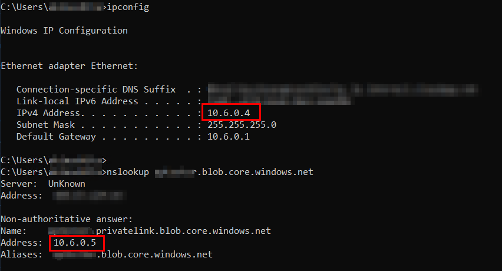
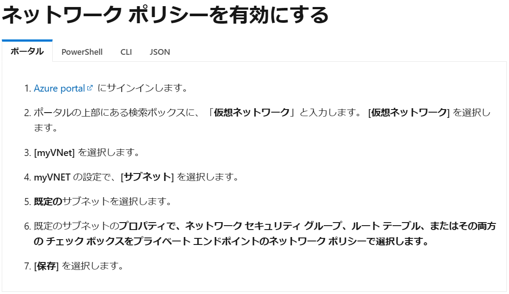
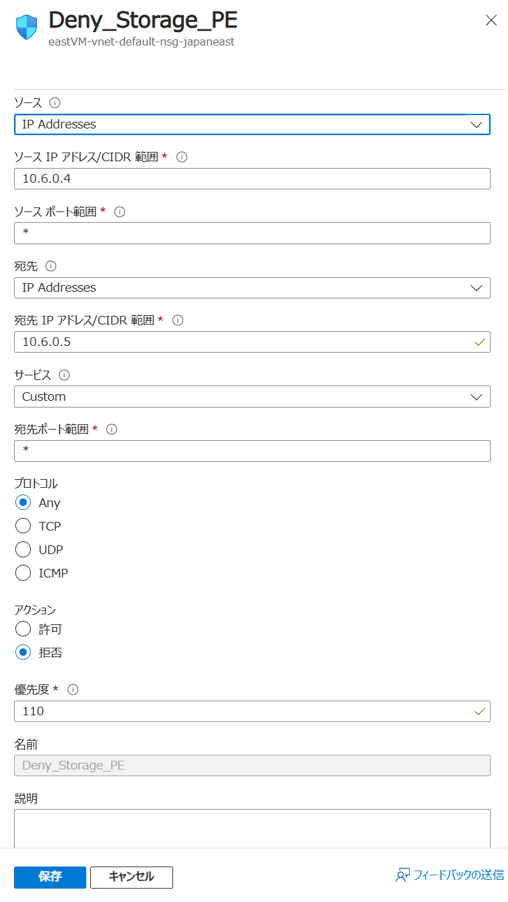
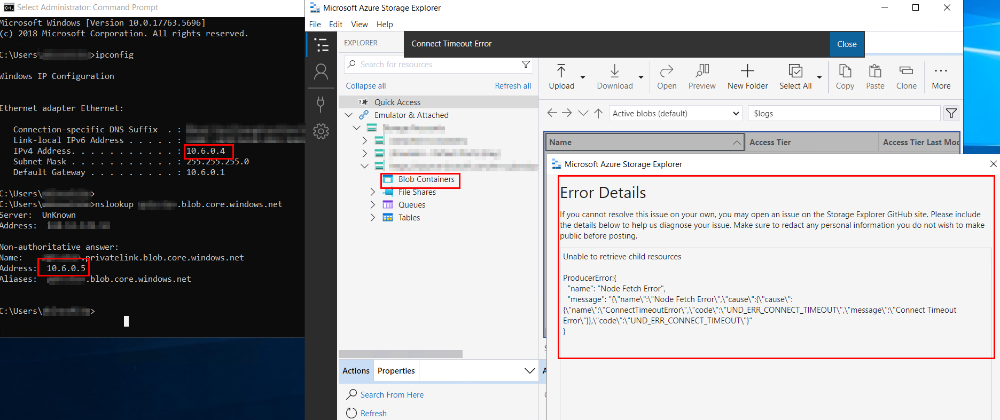

こんにちは、Azure テクニカル サポート チームの木下です。
今回は、Azure VM からストレージ アカウントへアクセスする際の挙動とアクセス元制御ついてご案内します。

<!-- more -->

## Azure VM からストレージ アカウントへアクセスする際の挙動

VM からストレージ アカウントへアクセスを行う場合、両者のリージョンが異なる場合と、同じ場合ではアクセス元の IP アドレスが異なる点に、ご注意ください。

### VM とストレージ アカウントが同一リージョンに存在する場合

**パブリック エンドポイント または サービス エンドポイントを使用**

VM からストレージ アカウントへアクセスすると、アクセス元 IP は VM のパブリック IP とならず、Azure 内部で使用しているプライベート IP アドレスとなります。

### VM とストレージ アカウントが異なるリージョンに存在する場合

**パブリック エンドポイントを使用**

VM からストレージ アカウントへアクセスすると、アクセス元 IP は VM のパブリック IP アドレスとなります。

**サービス エンドポイントを使用**

VM からストレージ アカウントへアクセスすると、アクセス元 IP は VM のパブリック IP とならず、Azure 内部で使用しているプライベート IP アドレスとなります。

### VM からストレージアカウントへのアクセス検証

・VM (東日本) から、ストレージ アカウント (東日本) に対して AzCopy を実施した結果

[ VM の構成 ]

パブリック IP : 172.207.XX.XX
プライベート IP : 10.6.0.4

[ ストレージ アカウントの診断ログ] ※1
サービス エンドポイント無効、パブリック エンドポイント経由のアクセス

>1.0;2024-05-03T05:04:52.4891056Z;PutBlob;SASSuccess;201;7;4;sas;;aptsstor;blob;"https://storageaccountname.blob.core.windows.net:443/con/test.txt?sas";"/aptsstor/con/test.txt";xxxxxxxxxxxxxxxxx;0;10.6.0.4:50031;2023-08-03;544;0;337;0;0;;"xxxxxxxxx";"&quot;xxxxxxxxxx;";Friday, 03-May-24 05:04:52 GMT;;"AzCopy/10.23.0 azsdk-go-service.Client/v1.2.0 (go1.19.12; Windows_NT)";;"xxxxxxxxxxxxxxxxxx"

アクセス元 IP は 10.6.0.4 であることが分かります。

サービス エンドポイント有効、サービス エンドポイント (Microsoft.Storage) 経由のアクセス

>1.0;2024-05-03T05:26:22.9853049Z;PutBlob;SASSuccess;201;6;3;sas;;aptsstor;blob;"https://storageaccountname.blob.core.windows.net:443/con/test2.txt?sas";"/aptsstor/con/test2.txt";xxxxxxx;0;10.6.0.4:50231;2023-08-03;545;0;337;0;0;;"xxxxxxxx";"&quot;xxxxxxxxx;";Friday, 03-May-24 05:26:22 GMT;;"AzCopy/10.23.0 azsdk-go-service.Client/v1.2.0 (go1.19.12; Windows_NT)";;"xxxxxxxx"

アクセス元 IP は 10.6.0.4 であることが分かります。

・VM (西日本) から、ストレージ アカウント (東日本) に対して AzCopy を実施した結果

[ VM の構成 ]

パブリック IP : 20.18.XX.XX
プライベート IP : 10.0.0.4

[ ストレージ アカウントの診断ログ ] ※1

サービス エンドポイント無効、パブリック エンドポイント経由のアクセス

>1.0;2024-05-03T05:13:11.4973284Z;PutBlob;SASSuccess;201;12;9;sas;;aptsstor;blob;"https://storageaccountname.blob.core.windows.net:443/con/test1.txt?sas";"/aptsstor/con/test1.txt";xxxxxxxxxxx;0;20.18.xx.xx:50131;2023-08-03;545;0;337;0;0;;"xxxxxxxx";"&quot;xxxxxxxxxxx;";Friday, 03-May-24 05:13:11 GMT;;"AzCopy/10.23.0 azsdk-go-service.Client/v1.2.0 (go1.19.12; Windows_NT)";;"xxxxxxxxxxxx"

アクセス元 IP は 20.18.XX.XX であることが分かります。

サービス エンドポイント有効、サービス エンドポイント (Microsoft.Storage) 経由のアクセス

>1.0;2024-05-03T05:26:59.6880782Z;PutBlob;SASSuccess;201;7;4;sas;;aptsstor;blob;"https://storageaccountname.blob.core.windows.net:443/con/test3.txt?sas";"/aptsstor/con/test3.txt";xxxxxxxxxx;0;10.0.0.4:50260;2023-08-03;545;0;337;0;0;;"xxxxxxxx;";Friday, 03-May-24 05:26:59 GMT;;"AzCopy/10.23.0 azsdk-go-service.Client/v1.2.0 (go1.19.12; Windows_NT)";;"xxxxxxxxxxxxxx"

アクセス元 IP は 10.0.0.4 であることが分かります。

・VM (米国中部) から、ストレージ アカウント (東日本) に対して AzCopy を実施した結果

[ VM の構成 ]

パブリック IP :  52.173.XX.XX
プライベート IP : 10.0.0.4

[ ストレージ アカウントの診断ログ] ※1

サービス エンドポイント無効、パブリック エンドポイント経由のアクセス

>1.0;2024-05-03T05:42:29.5602997Z;PutBlob;SASSuccess;201;8;4;sas;;aptsstor;blob;"https://storagaaccountname.blob.core.windows.net:443/con/test1.txt?sas";"/aptsstor/con/test1.txt";xxxxxxxxxxxx;0;52.173.xx.xx:49966;2023-08-03;545;0;337;0;0;;"xxxxxxxxxx";"&quot;xxxxxx;";Friday, 03-May-24 05:42:29 GMT;;"AzCopy/10.23.0 azsdk-go-service.Client/v1.2.0 (go1.19.12; Windows_NT)";;"xxxxxxxxxx"

アクセス元 IP は 52.173.XX.X であることが分かります。

サービス エンドポイント有効、サービスエ ンドポイント(Microsoft.Storage.Global) 経由のアクセス

>1.0;2024-05-03T06:08:17.6529951Z;PutBlob;SASSuccess;201;8;5;sas;;aptsstor;blob;"https://storageaccountname.blob.core.windows.net:443/con/test2.txt?sas";"/aptsstor/con/test2.txt";xxxxxxxxxxxxx;0;10.0.0.4:50237;2023-08-03;545;0;337;0;0;;"xxxxxxx";"&quot;xxxxx;";Friday, 03-May-24 06:08:17 GMT;;"AzCopy/10.23.0 azsdk-go-service.Client/v1.2.0 (go1.19.12; Windows_NT)";;"xxxxxxxxxxxx"

アクセス元 IP は 10.0.0.4 であることが分かります。

参考）Azure Storage のリージョン間サービス エンドポイント
https://learn.microsoft.com/ja-jp/azure/storage/common/storage-network-security?tabs=azure-powershell#azure-storage-cross-region-service-endpoints
> <抜粋>Azure Storage のリージョン間サービス エンドポイントは、2023 年 4 月に一般公開されました。 任意のリージョンの仮想ネットワークとストレージ サービス インスタンスの間で機能します。 リージョン間サービス エンドポイントを使用すると、サブネットでは、別のリージョン内のストレージ アカウントを含めて、ストレージ アカウントとの通信にパブリック IP アドレスを使用しなくなります。 代わりに、サブネットからストレージ アカウントへのすべてのトラフィックで、ソース IP としてプライベート IP アドレスが使用されます。 その結果、IP ネットワーク ルールを使用してそれらのサブネットからのトラフィックを許可するストレージ アカウントは、影響を受けなくなります。
>～～～
>ローカルとリージョン間のサービス エンドポイントは、同じサブネット上に共存できません。 既存のサービス エンドポイントをリージョン間サービス エンドポイントに置き換えるには、既存 Microsoft.Storage エンドポイントを削除し、リージョン間エンドポイント (Microsoft.Storage.Global) として再作成します。

※1 ストレージ アカウントの診断ログは、対象のストレージ アカウント > [監視] > [診断設定] よりご設定ください。

参考）Azure Blob Storage 監視データのリファレンス
https://learn.microsoft.com/ja-jp/azure/storage/blobs/monitor-blob-storage-reference
参考）Azure Files 監視データのリファレンス
https://learn.microsoft.com/ja-jp/azure/storage/files/storage-files-monitoring-reference#resource-logs

### Azure VM からストレージ アカウントへアクセスする際の挙動についてのまとめ

ストレージ アカウントのアクセス制御について、仮想ネットワーク/サブネット単位、もしくは外部からのパブリック IP アドレス単位での制御のみが可能です。
そのため、VM とストレージ アカウントが同一リージョンである場合、パブリック エンドポイント、サービス エンドポイントいずれを使用する場合も仮想ネットワーク/サブネット単位での制御までとなります。
VM とストレージ アカウントが異なるリージョンにある場合、パブリック エンドポイントを使用する際は、パブリック IP アドレス単位での制御、サービスエンドポイントを使用する際は、仮想ネットワーク/サブネット単位での制御となります。

## ストレージアカウントへのアクセス制御について

先述の通り、ストレージ アカウントのファイアウォールでは、仮想ネットワーク/サブネット単位、もしくは外部からのパブリック IP 単位での制御のみとなりますが、
「ストレージ アカウントへのアクセス制御を VM 単位で行う方法はあるか」というお問い合わせをいただくことがあります。
VM 単位でのアクセス元制御を行いたい場合、プライベート エンドポイントに対するネットワーク ポリシーを利用することで、プライベート エンドポイントの IP アドレスに対して NSG でアクセス制御を行うことが可能となります。

参考）プライベート エンドポイントのネットワーク ポリシーを管理する
https://learn.microsoft.com/ja-jp/azure/private-link/disable-private-endpoint-network-policy?tabs=network-policy-portal

### VM 単位でのストレージアカウントへのアクセス制御検証

1.ストレージ アカウントに対して、プライベート エンドポイントを構成します。

参考）チュートリアル:Azure プライベート エンドポイントを使用してストレージ アカウントに接続する
https://docs.microsoft.com/ja-jp/azure/private-link/tutorial-private-endpoint-storage-portal
参考）Azure Storage のプライベート エンドポイントを使用する
https://docs.microsoft.com/ja-jp/azure/storage/common/storage-private-endpoints

2.対象の仮想ネットワーク/サブネットに対してプライベート エンドポイントのネットワーク ポリシーを有効にします。

参考）プライベート エンドポイントのネットワーク ポリシーを管理する
https://learn.microsoft.com/ja-jp/azure/private-link/disable-private-endpoint-network-policy?tabs=network-policy-portal

3.NSG を設定します。

ソース IP アドレス/CIDR 範囲：アクセス元 VM のプライベート IP を登録

宛先 IP アドレス/CIDR 範囲：ストレージ アカウントのプライベート エンドポイントが構成されている仮想ネットワークのアドレス空間から割り振られたプライベート IP を登録

4.アクセス拒否した端末よりストレージアカウント内コンテナ―へアクセスします。

NSG にてアクセス拒否した VM からストレージアカウント内コンテナ―へアクセスできないことを確認します。

上記のようにプライベート エンドポイントに対するネットワーク ポリシーを利用することで VM 単位でのアクセス元制御を実現することが可能です。

---

本稿は以上となりますが、いかがでしたでしょうか。 本稿が皆様のお役に立てれば幸いです。
