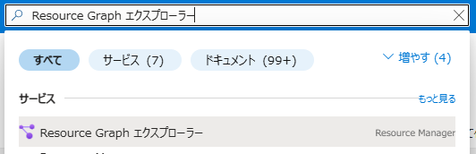
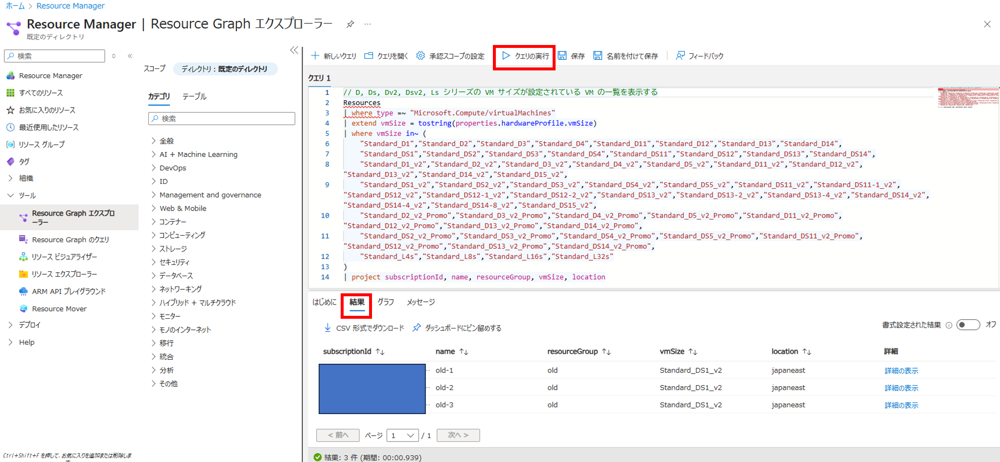

こんにちは、Azure テクニカル サポート チームの富田です。  
2028 年に幾つかの古い VM サイズ（D, Ds, Dv2, Dsv2, Ls および F, Fs, Fsv2, Lsv2, G, Gs, Av2, Amv2, B シリーズ）のリタイアが予定されております。  
本件について多くお問い合わせもいただいておりますため、本ブログ記事にて解説をさせていただきます。  

■ご参考：Retirement: D, Ds, Dv2, Dsv2, and Ls Series Virtual Machines to Be Retired on May 1, 2028  
https://azure.microsoft.com/en-us/updates?id=485569  

■ご参考：Retirement: The F, Fs, Fsv2, Lsv2, G, Gs, Av2, Amv2, and B series VMs are retiring in 2028  
https://azure.microsoft.com/en-us/updates?id=500682  

■ご参考：廃止された Azure VM サイズ シリーズ  
https://learn.microsoft.com/ja-jp/azure/virtual-machines/sizes/retirement/retired-sizes-list  

---

## VM サイズがリタイアするとどうなるか

リタイアにより既存の VM リソースが強制的に削除されるといったことはございません。  
しかしながら、リタイア予定のサイズを使い続けていた場合、リタイアの日程以降に VM が自動的に割り当て解除され、VM サイズを現行のものに変更しない限り起動ができなくなることが想定されます。  
意図しない VM 停止とならないように、リタイア予定日までに VM サイズを移行いただきますようお願いいたします  

---

## 今回のリタイアのスケジュールについて

今回のリタイアについて現状のスケジュールは以下の通りとなっております。

| VM サイズシリーズ | リタイア予定日 |
| --- | --- |
| D, Ds, Dv2, Dsv2, Ls | 2028 年 5 月 1 日 |
| F, Fs, Fsv2, Lsv2, G, Gs, Av2, Amv2, B | 2028 年 11 月 15 日 |

---

## 今回のリタイア対象の VM サイズについて

今回のリタイア予定の VM サイズの一覧は Azure CLI で以下のコマンドで確認可能です。

```Bash
# dummy
# D, Ds, Dv2, Dsv2, Ls シリーズの VM サイズ一覧を表示
az vm list-skus -r virtualMachines \
  --query "[?family=='standardDFamily' || family=='standardDSFamily' || family=='standardDv2Family' || family=='standardDSv2Family' || family=='standardDv2PromoFamily' || family=='standardDSv2PromoFamily' || family=='standardLSFamily'].name" \
  -o tsv | sort -u

# F, Fs, Fsv2, Lsv2, G, Gs, Av2, Amv2, B シリーズの VM サイズ一覧を表示
az vm list-skus -r virtualMachines \
  --query "[?family=='standardFFamily' || family=='standardFSFamily' || family=='standardFSv2Family' || family=='standardLSv2Family' || family=='standardGFamily' || family=='standardGSFamily' || family=='standardAv2Family' || family=='standardBSFamily'].name" \
  -o tsv | sort -u
```

こちらの結果を整形して、以下に今回のリタイア対象の VM サイズの一覧をご用意させていただきましたので、ご参考となりましたら幸いでございます。

> [!TIP]
> 下記の通り Standard_D2_v3 サイズといった Dv3 シリーズや Standard_B2s_v2 サイズといった Bsv2 サイズは、今回のリタイアの対象には含まれておりません。

### D, Ds, Dv2, Dsv2, Ls シリーズ

```
# D シリーズ
Standard_D1
Standard_D2
Standard_D3
Standard_D4
Standard_D11
Standard_D12
Standard_D13
Standard_D14

# Ds シリーズ
Standard_DS1
Standard_DS2
Standard_DS3
Standard_DS4
Standard_DS11
Standard_DS12
Standard_DS13
Standard_DS14

# Dv2 シリーズ
Standard_D1_v2
Standard_D2_v2
Standard_D3_v2
Standard_D4_v2
Standard_D5_v2
Standard_D11_v2
Standard_D12_v2
Standard_D13_v2
Standard_D14_v2
Standard_D15_v2

# Dsv2 シリーズ
Standard_DS1_v2
Standard_DS2_v2
Standard_DS3_v2
Standard_DS4_v2
Standard_DS5_v2
Standard_DS11_v2
Standard_DS11-1_v2
Standard_DS12_v2
Standard_DS12-1_v2
Standard_DS12-2_v2
Standard_DS13_v2
Standard_DS13-2_v2
Standard_DS13-4_v2
Standard_DS14_v2
Standard_DS14-4_v2
Standard_DS14-8_v2
Standard_DS15_v2

# Dv2 シリーズ（Promo）
Standard_D2_v2_Promo
Standard_D3_v2_Promo
Standard_D4_v2_Promo
Standard_D5_v2_Promo
Standard_D11_v2_Promo
Standard_D12_v2_Promo
Standard_D13_v2_Promo
Standard_D14_v2_Promo

# Dsv2 シリーズ（Promo）
Standard_DS2_v2_Promo
Standard_DS3_v2_Promo
Standard_DS4_v2_Promo
Standard_DS5_v2_Promo
Standard_DS11_v2_Promo
Standard_DS12_v2_Promo
Standard_DS13_v2_Promo
Standard_DS14_v2_Promo

# L シリーズ
Standard_L4s
Standard_L8s
Standard_L16s
Standard_L32s
```

### F, Fs, Fsv2, Lsv2, G, Gs, Av2, Amv2, B シリーズ

```
# F シリーズ
Standard_F1
Standard_F2
Standard_F4
Standard_F8
Standard_F16

# Fs シリーズ
Standard_F1s
Standard_F2s
Standard_F4s
Standard_F8s
Standard_F16s

# Fsv2 シリーズ
Standard_F2s_v2
Standard_F4s_v2
Standard_F8s_v2
Standard_F16s_v2
Standard_F32s_v2
Standard_F48s_v2
Standard_F64s_v2
Standard_F72s_v2

# Lsv2 シリーズ
Standard_L8s_v2
Standard_L16s_v2
Standard_L32s_v2
Standard_L48s_v2
Standard_L64s_v2
Standard_L80s_v2

# G シリーズ
Standard_G1
Standard_G2
Standard_G3
Standard_G4
Standard_G5

# GS シリーズ
Standard_GS1
Standard_GS2
Standard_GS3
Standard_GS4
Standard_GS4-4
Standard_GS4-8
Standard_GS5
Standard_GS5-16
Standard_GS5-8

# Av2 シリーズ
Standard_A1_v2
Standard_A2_v2
Standard_A4_v2
Standard_A8_v2

# Amv2 シリーズ
Standard_A2m_v2
Standard_A4m_v2
Standard_A8m_v2

# B シリーズ
Standard_B1ls
Standard_B1ms
Standard_B1s
Standard_B2ms
Standard_B2s
Standard_B4ms
Standard_B8ms
Standard_B12ms
Standard_B16ms
Standard_B20ms
```

---

## Azure Resource Graph クエリを使って今回のリタイア対象 VM と VMSS を見つける

実際にお客様の環境において、今回のリタイア対象の VM サイズが設定されている VM および VMSS リソースを見つけるには、Azure Resource Graph クエリを使うのがお勧めでございます。  
以下に Azure ポータルから実行する手順を紹介させていただきます。  
実行の際はサブスクリプション内の Azure VM を参照できるユーザーにて実施をお願いいたします。  

Azure ポータル上部の検索ボックスにて「Resource Graph エクスプローラー」を検索します。  



表示された画面にてクエリを実行します。  
まずは、検証として全ての VM 一覧が可能か確認することを推奨いたします。  

```KQL
// 試しに全ての VM 一覧を表示してみる
Resources
| where type =~ "Microsoft.Compute/virtualMachines"
```

次に、以下のクエリで今回のリタイア対象の VM サイズが設定されている VM の一覧を表示します。  


```KQL
// D, Ds, Dv2, Dsv2, Ls シリーズの VM サイズが設定されている VM の一覧を表示する
Resources
| where type =~ "Microsoft.Compute/virtualMachines"
| extend vmSize = tostring(properties.hardwareProfile.vmSize)
| where vmSize in~ (
    "Standard_D1","Standard_D2","Standard_D3","Standard_D4","Standard_D11","Standard_D12","Standard_D13","Standard_D14",
    "Standard_DS1","Standard_DS2","Standard_DS3","Standard_DS4","Standard_DS11","Standard_DS12","Standard_DS13","Standard_DS14",
    "Standard_D1_v2","Standard_D2_v2","Standard_D3_v2","Standard_D4_v2","Standard_D5_v2","Standard_D11_v2","Standard_D12_v2","Standard_D13_v2","Standard_D14_v2","Standard_D15_v2",
    "Standard_DS1_v2","Standard_DS2_v2","Standard_DS3_v2","Standard_DS4_v2","Standard_DS5_v2","Standard_DS11_v2","Standard_DS11-1_v2","Standard_DS12_v2","Standard_DS12-1_v2","Standard_DS12-2_v2","Standard_DS13_v2","Standard_DS13-2_v2","Standard_DS13-4_v2","Standard_DS14_v2","Standard_DS14-4_v2","Standard_DS14-8_v2","Standard_DS15_v2",
    "Standard_D2_v2_Promo","Standard_D3_v2_Promo","Standard_D4_v2_Promo","Standard_D5_v2_Promo","Standard_D11_v2_Promo","Standard_D12_v2_Promo","Standard_D13_v2_Promo","Standard_D14_v2_Promo",
    "Standard_DS2_v2_Promo","Standard_DS3_v2_Promo","Standard_DS4_v2_Promo","Standard_DS5_v2_Promo","Standard_DS11_v2_Promo","Standard_DS12_v2_Promo","Standard_DS13_v2_Promo","Standard_DS14_v2_Promo",
    "Standard_L4s","Standard_L8s","Standard_L16s","Standard_L32s"
)
| project subscriptionId, name, resourceGroup, vmSize, location
```

```KQL
// F, Fs, Fsv2, Lsv2, G, Gs, Av2, Amv2, B シリーズの VM サイズが設定されている VM の一覧を表示する
Resources
| where type =~ "Microsoft.Compute/virtualMachines"
| extend vmSize = tostring(properties.hardwareProfile.vmSize)
| where vmSize in~ (
    "Standard_F1","Standard_F2","Standard_F4","Standard_F8","Standard_F16",
    "Standard_F1s","Standard_F2s","Standard_F4s","Standard_F8s","Standard_F16s",
    "Standard_F2s_v2","Standard_F4s_v2","Standard_F8s_v2","Standard_F16s_v2","Standard_F32s_v2","Standard_F48s_v2","Standard_F64s_v2","Standard_F72s_v2",
    "Standard_L8s_v2","Standard_L16s_v2","Standard_L32s_v2","Standard_L48s_v2","Standard_L64s_v2","Standard_L80s_v2",
    "Standard_G1","Standard_G2","Standard_G3","Standard_G4","Standard_G5",
    "Standard_GS1","Standard_GS2","Standard_GS3","Standard_GS4","Standard_GS4-4","Standard_GS4-8","Standard_GS5","Standard_GS5-16","Standard_GS5-8",
    "Standard_A1_v2","Standard_A2_v2","Standard_A4_v2","Standard_A8_v2",
    "Standard_A2m_v2","Standard_A4m_v2","Standard_A8m_v2",
    "Standard_B1ls","Standard_B1ms","Standard_B1s","Standard_B2ms","Standard_B2s","Standard_B4ms","Standard_B8ms","Standard_B12ms","Standard_B16ms","Standard_B20ms"
)
| project subscriptionId, name, resourceGroup, vmSize, location
```

下記はクエリとその結果の画面の例です。  



なお、均一オーケストレーションモードの VMSS について、同じように今回のリタイア対象を見つけるには以下のクエリをご利用ください。

```KQL
// 試しに全ての VMSS 一覧を表示してみる
Resources
| where type =~ "Microsoft.Compute/virtualMachineScaleSets"
```

```KQL
// D, Ds, Dv2, Dsv2, Ls シリーズの VM サイズが設定されている VMSS の一覧を表示する
Resources
| where type =~ "Microsoft.Compute/virtualMachineScaleSets"
| extend vmSize = tostring(sku.name)
| where vmSize in~ (
    "Standard_D1","Standard_D2","Standard_D3","Standard_D4","Standard_D11","Standard_D12","Standard_D13","Standard_D14",
    "Standard_DS1","Standard_DS2","Standard_DS3","Standard_DS4","Standard_DS11","Standard_DS12","Standard_DS13","Standard_DS14",
    "Standard_D1_v2","Standard_D2_v2","Standard_D3_v2","Standard_D4_v2","Standard_D5_v2","Standard_D11_v2","Standard_D12_v2","Standard_D13_v2","Standard_D14_v2","Standard_D15_v2",
    "Standard_DS1_v2","Standard_DS2_v2","Standard_DS3_v2","Standard_DS4_v2","Standard_DS5_v2","Standard_DS11_v2","Standard_DS11-1_v2","Standard_DS12_v2","Standard_DS12-1_v2","Standard_DS12-2_v2","Standard_DS13_v2","Standard_DS13-2_v2","Standard_DS13-4_v2","Standard_DS14_v2","Standard_DS14-4_v2","Standard_DS14-8_v2","Standard_DS15_v2",
    "Standard_D2_v2_Promo","Standard_D3_v2_Promo","Standard_D4_v2_Promo","Standard_D5_v2_Promo","Standard_D11_v2_Promo","Standard_D12_v2_Promo","Standard_D13_v2_Promo","Standard_D14_v2_Promo",
    "Standard_DS2_v2_Promo","Standard_DS3_v2_Promo","Standard_DS4_v2_Promo","Standard_DS5_v2_Promo","Standard_DS11_v2_Promo","Standard_DS12_v2_Promo","Standard_DS13_v2_Promo","Standard_DS14_v2_Promo",
    "Standard_L4s","Standard_L8s","Standard_L16s","Standard_L32s"
)
| project subscriptionId, name, resourceGroup, vmSize, location
```

```KQL
// F, Fs, Fsv2, Lsv2, G, Gs, Av2, Amv2, B シリーズの VM サイズが設定されている VMSS の一覧を表示する
Resources
| where type =~ "Microsoft.Compute/virtualMachineScaleSets"
| extend vmSize = tostring(sku.name)
| where vmSize in~ (
    "Standard_F1","Standard_F2","Standard_F4","Standard_F8","Standard_F16",
    "Standard_F1s","Standard_F2s","Standard_F4s","Standard_F8s","Standard_F16s",
    "Standard_F2s_v2","Standard_F4s_v2","Standard_F8s_v2","Standard_F16s_v2","Standard_F32s_v2","Standard_F48s_v2","Standard_F64s_v2","Standard_F72s_v2",
    "Standard_L8s_v2","Standard_L16s_v2","Standard_L32s_v2","Standard_L48s_v2","Standard_L64s_v2","Standard_L80s_v2",
    "Standard_G1","Standard_G2","Standard_G3","Standard_G4","Standard_G5",
    "Standard_GS1","Standard_GS2","Standard_GS3","Standard_GS4","Standard_GS4-4","Standard_GS4-8","Standard_GS5","Standard_GS5-16","Standard_GS5-8",
    "Standard_A1_v2","Standard_A2_v2","Standard_A4_v2","Standard_A8_v2",
    "Standard_A2m_v2","Standard_A4m_v2","Standard_A8m_v2",
    "Standard_B1ls","Standard_B1ms","Standard_B1s","Standard_B2ms","Standard_B2s","Standard_B4ms","Standard_B8ms","Standard_B12ms","Standard_B16ms","Standard_B20ms"
)
| project subscriptionId, name, resourceGroup, vmSize, location
```

> [!TIP]
> Azure ポータルではなく、Azure CLI からも Azure Resource Graph クエリを実行することが可能です。以下はそのコマンドの例です。  
> **az graph query -q 'クエリの内容'**

---

## リタイア対象の VM を移行する（VM サイズ変更を行う）

リタイア対象の VM および VMSS については、リタイア予定日までに移行をお願いいたします。  
以降についてはガイドの公式ドキュメントもご用意されておりますので、必要に応じてご参照いただけますと幸いです。  

■ご参考：汎用サイズ移行ガイド  
https://learn.microsoft.com/ja-jp/azure/virtual-machines/migration/sizes/d-ds-dv2-dsv2-ls-series-migration-guide  

なお、基本的に移行に必要な操作としては「リタイア対象外の VM サイズに変更する」という操作のみですので、VM 停止は伴いますが容易に可能と存じます。  
VM サイズ変更については以下の公式ドキュメントとブログ記事もございます。  

■ご参考：仮想マシンのサイズの変更  
https://learn.microsoft.com/ja-jp/azure/virtual-machines/sizes/resize-vm  

■ご参考：VM サイズの選定および変更時の注意点について  
https://jpaztech.github.io/blog/vm/vm-size-change/  

今回のリタイア対象の VM の移行について幾つか補足をさせていただきます。

---

## 推奨されるサイズとサイズ変更に注意が必要な点

上記の「汎用サイズ移行ガイド」に各 VM サイズシリーズ毎に、推奨の移行先 VM サイズシリーズの記載がございます。  
あくまで推奨でございますので、他のサイズに変更いただいても問題ございません。  
また、実際にどの VM サイズを採用するかについては、必要に応じてお客様のワークロードにおいてベンチマーク等を行いご検討いただけますと幸いです。

VM サイズ変更にあたり、以下の点により変更が叶いません場合がありますのでご留意ください。

### v6 サイズシリーズに変更するにあたりディスクコントローラーの変更が必要である

移行先の推奨サイズに末尾に v6 と記載のあるサイズシリーズがございます。  
これらの v6 サイズは NVMe ディスクコントローラーが必須のため、ディスクコントローラー変換作業が必要となります。  
v6 サイズに変更をするにあたっては、以下のブログ記事をご参照ください。  

■ご参考：NVMe ディスクコントローラー必須の Azure VM サイズについて（Dsv5 から Dsv6 サイズへの変更など）  
https://jpaztech.github.io/blog/vm/nvme-vm/  

v6 サイズへの変更はお手間がかかるものとなりますので、SCSI ディスクコントローラーのまま変更可能な v5 サイズへの移行もご検討ください。  

> [!TIP]
> 移行先推奨サイズとして記載のある Lsv4 / Lasv4 サイズシリーズも、同じく NVMe ディスクコントローラーが必須となっております。

### Windows VM で一時ディスクありから無しの VM サイズに変更できない

Windows VM については一時ディスクありの VM サイズから、一時ディスク無しの VM サイズへ直接の変更操作が叶いません。  
今回のリタイア対象の VM は全て一時ディスクがあるサイズと存じますため、Dsv5 / Dasv5 / Bsv2 / Basv2 といった一時ディスク無しのサイズに直接変更ができないものとなります。  
このような一時ディスク無しのサイズに変更をしたい場合は以下のドキュメントをご参照ください。  

■ご参考：ローカル一時ディスクを使用するサイズから、ローカル一時ディスクのない VM サイズに Windows VM を移行するにはどうすればよいですか?  
https://learn.microsoft.com/ja-jp/azure/virtual-machines/azure-vms-no-temp-disk#-----------------------------------vm------windows-vm---------------------  

VM 再作成にて一時ディスク無しの VM サイズ変更を行う方法について解説したブログ記事もございますので、参考としてご紹介させていただきます。

■ご参考：Azure VM の設定変更不可の項目を VM 再作成により再設定する手順  
https://jpaztech.github.io/blog/vm/recreate-vm-to-change-settings/  

Ddsv5 / Dadsv5 サイズといった一時ディスクありの VM サイズでしたら、容易に直接 VM サイズ変更が可能と存じますので、その点もご検討いただけますと幸いです。  

### Arm アーキテクチャの VM サイズに変更できない

移行先の推奨サイズに p という文字が入ったサイズシリーズがございます。（例：Bpsv2 / Dpsv5 など）  
こちらは x86 ではなく、Arm アーキテクチャの CPU の VM サイズでございます。  
CPU の互換性が無いものと存じますので、こちらのサイズを利用したい場合は新規に VM を構築いただくことをご検討ください。  

### VM が起動中のため変更先のサイズが表示されない

VM が起動中の場合は移行可能な VM サイズであっても対象として表示されないことがございます。  
もし、変更先の VM サイズが表示されない場合は VM の割り当て解除をお試しくださいませ。  

---

これらの情報が皆様のお役に立てますと幸いでございます。

