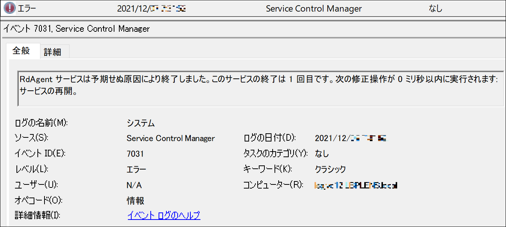

こんにちは。Azure テクニカル サポート チームの重田と前田です。

Azure 上の Windows 仮想マシンをご利用のお客様から、RdAgent サービスの再起動を示すイベント ログ Service Control Manager 7031 の原因や影響についてお問い合わせいただくことがあります。そのため、本記事では当該イベントについてご紹介します。

<!-- more -->

> ログの名前:   System
> ソース:       Service Control Manager
> 日付:         yyyy/mm/dd hh:mm:ss
> イベント ID:  7031
> レベル:       エラー
> キーワード:   クラシック
> 説明:
> RdAgent サービスは予期せぬ原因により終了しました。
> このサービスの終了は 1 回目です。
> 次の修正操作が 0 ミリ秒以内に実行されます: サービスの再開。

---

## イベント ログ Service Control Manage 7031

RdAgent サービスの予期せぬ終了を示すイベント ログ Service Control Manager 7031 は、一般的に、Windows Azure ゲスト エージェントのアップデート時に実施されるエージェントの再起動に起因して記録されるメッセージとなります。
※アップデートは必要に応じて不定期に実施されます。

アップデート時には新しいバージョンで Windows Azure ゲスト エージェントを起動する必要があるため、サービスの再起動が発生します。そのため、アップデート時に本イベントのエラー メッセージが記録されることは想定通りの動作となります。

イベント記録後に RdAgent サービスが再開されており、エラー メッセージが継続して出力されていないような場合には、静観いただいて問題ありません。RdAgent サービスが再開された場合には、イベント ログ Service Control Manager 7036 が記録されますのでご確認いただけますと幸いです。

> ログの名前:   System
> ソース:       Service Control Manager
> 日付:         yyyy/mm/dd hh:mm:ss
> イベント ID:  7036
> レベル:       情報
> キーワード:   クラシック
> 説明:
> RdAgent サービスは 実行中 状態に移行しました。

## 仮想マシン エージェントのアップデートと RdAgent サービスの再起動

アップデートの有無についてはイベント ログから判断することは叶わず、C:\WindowsAzure\Logs 配下に出力される WaAppAgent.log を確認する必要があります。

### WaAppAgent.log

Windows Azure ゲスト エージェントのアップデート時には、C:\WindowsAzure\Logs 配下に出力される WaAppAgent.log に下記のようなログが記録されます。

> (前のバージョンでの起動を示すログ)
> *[000000XX] [XX/XX/XXXX XX:XX:XX.XX] [INFO]  WindowsAzureGuestAgent starting.  Version X.X.XXXXX.XXX*
> …
> (アップデート処理により停止処理が開始されたことを示すログ)
> *[000000XX] [XX/XX/XXXX XX:XX:XX.XX] [WARN]  Stopping from update*
> …
> (エージェントが停止して新しいバージョンでの起動を示すログ)
> *[000000XX] [XX/XX/XXXX XX:XX:XX.XX] [INFO]  WindowsAzureGuestAgent stopped successfully.*
> *[000000XX] [XX/XX/XXXX XX:XX:XX.XX] [INFO]  WindowsAzureGuestAgent starting. Version X.X.XXXXX.YYY*

### 確認の結果アップデート起因ではない場合

アップデートの有無にかかわらず、イベント記録後に RdAgent サービスが再開されており、エラー メッセージが継続して出力されていないような場合には、静観いただいて問題ありません。
もし、仮想マシン エージェント自体の動作に問題がある場合には、後述の「[[おまけ] 仮想マシン エージェントの状態確認方法](https://jpaztech.github.io/blog/vm/7031-rdagent-restart/#%E3%81%8A%E3%81%BE%E3%81%91-%E4%BB%AE%E6%83%B3%E3%83%9E%E3%82%B7%E3%83%B3-%E3%82%A8%E3%83%BC%E3%82%B8%E3%82%A7%E3%83%B3%E3%83%88%E3%81%AE%E7%8A%B6%E6%85%8B%E7%A2%BA%E8%AA%8D%E6%96%B9%E6%B3%95)」をご確認の上、切り分けいただけますと幸いです。

---

## 補足情報

### 仮想マシン エージェントとは

仮想マシン エージェントとは、仮想マシンと Azure 基盤側とのやり取りを管理するプロセスであり、仮想マシンの拡張機能の管理や仮想マシンのステータスの報告などを実施しています。
Windows 仮想マシンには Windows Azure ゲスト エージェントが、Linux 仮想マシンには Azure Linux エージェント (waagent) があります。

> ご参考) [Windows] Azure 仮想マシン エージェントの概要
> [https://docs.microsoft.com/ja-jp/azure/virtual-machines/extensions/agent-windows](https://docs.microsoft.com/ja-jp/azure/virtual-machines/extensions/agent-windows)

> ご参考) [Linux] Azure Linux エージェントの理解と使用
> [https://docs.microsoft.com/ja-jp/azure/virtual-machines/extensions/agent-linux](https://docs.microsoft.com/ja-jp/azure/virtual-machines/extensions/agent-linux)

### Windows 仮想マシンの仮想マシン エージェント (Windows Azure ゲスト エージェント)

Windows Azure ゲスト エージェントは、Azure Marketplace イメージからデプロイされたすべての Windows 仮想マシンに既定でインストールされます。
Windows インストーラー パッケージを使用して、手動でインストールすることも可能であり、カスタム イメージを用いて仮想マシンを作成するときやオンプレミス環境を移行いただく際には、手動でのインストールが必要な場合があります。

Windows 仮想マシンに Windows Azure ゲスト エージェントが正常にインストールされると、次のサービスが 仮想マシンの services.msc に一覧表示されます。

- Windows Azure ゲスト エージェント サービス
- テレメトリ サービス (バージョン 2.7.41491.971 以降のバージョンでは表示されません)
- RdAgent サービス

### RdAgent とは

RdAgent とは、Windows Azure ゲスト エージェント (Windows OS 用の仮想マシン エージェント) のサービスの 1 つであり、RdAgent サービスはゲスト エージェントのインストールや、仮想マシンから物理ホスト上のホスト エージェントにハートビートを送信する役割を担っています。

### RdAgent が停止している場合の影響

RdAgent サービスが実行されていない場合、Windows Azure ゲスト エージェントが正しく動作しません。
ゲスト OS 内の動作 (システムやご利用のアプリケーション) には影響しませんが、Azure 基盤側でゲスト OS の状態を取得できずに、プロビジョニングがタイムアウトとなるまで完了しない、拡張機能が正しくご利用いただけない、といったことが発生します。

### [おまけ] 仮想マシン エージェントの状態確認方法

仮想マシン エージェントの状態は Azure Portal より確認することが可能です。
[Virtual Machines] - [<当該仮想マシン>] のページを開き、左メニュー [概要] の下記画面にて "エージェントの状態" が "Ready" であれば問題なく稼働していると判断できます。

なお、仮想マシン エージェントが正しく稼働していないように見受けられる場合のトラブルシューティングは、下記公開情報をご確認ください。

> ご参考) Azure ゲスト Windowsのトラブルシューティング
> [https://docs.microsoft.com/ja-jp/troubleshoot/azure/virtual-machines/windows-azure-guest-agent](https://docs.microsoft.com/ja-jp/troubleshoot/azure/virtual-machines/windows-azure-guest-agent)

> ご参考) Windows ゲスト エージェント (WinGA) の再インストール方法
> [https://jpaztech.github.io/blog/vm/re-install-windows-azure-guest-agent/](https://jpaztech.github.io/blog/vm/re-install-windows-azure-guest-agent/)

 
いかがでしたでしょうか。
イベント ログでエラーが記録されていると、影響や対処の有無などでご心配いただくことも多いかと存じますが、RdAgent サービスの予期せぬ終了を示すイベント ログに関して、上記状況がお役に立てましたらば幸いです。
