こんにちは。Azure テクニカルサポートチームの小田です。 
今回は仮想ネットワークに対して Azure Cloud Shell をデプロイする手順を紹介いたします。

<!-- more -->

## はじめに
通常 Azure Cloud Shell のマシンは、お客様が管理されている仮想ネットワークとは異なる Azure が管理するネットワークに対して展開されます。
Azure Cloud Shell が存在するネットワークは、お客様ではなくマイクロソフトが管理を行っております。 
 
そのため、Azure Cloud Shell のご利用において以下のような制約でお困りのお客様から、お問い合わせを頂くことがしばしばございます。

* Azure Cloud Shell から仮想マシンなどのリソースが持つプライベート IP アドレスに対して接続ができない
* Azure Cloud Shell が使用する IP アドレスをお客様が設定 / 管理できないため、Azure Cloud Shell からの通信を NSG などによりを制御することができない
 
このような場合にはAzure Cloud Shell を仮想ネットワークにデプロイすることで、Azure Cloud Shell が使用する IP アドレスをお客様が管理することができ、これらの制約が解消されます。
なお補足となりますが、この Azure Cloud Shell を仮想ネットワークに対してデプロイすることを “VNET の分離” とも呼びます。
必要に応じて、Azure Cloud Shell を仮想ネットワークに対してデプロイすることについてご検討をいただけますと幸いです。


## ご利用にあたっての注意事項
ご利用に際して注意事項がございますのでご確認ください。

Azure Cloud Shell を仮想ネットワークに対してデプロイする場合には、Azure Relay をご利用いただく必要がございますが、Azure Relay は有料サービスとなります。
この点につきましてご留意をいただけますと幸いです。

> ・ご参考: [VNET に Azure Cloud Shell をデプロイする前に考慮すべき事項](https://learn.microsoft.com/ja-jp/azure/cloud-shell/private-vnet#things-to-consider-before-deploying-azure-cloud-shell-in-a-vnet)
> ---- 抜粋 -----
> VNET の分離では、有料サービスである Azure Relay を使用する必要があります。
> ---- 抜粋 -----


## デプロイ手順
本稿では、Azure Cloud Shell や仮想ネットワーク、ストレージアカウントをARM テンプレートにより新規に作成し、仮想ネットワーク上に Azure Cloud Shell をデプロイする手順をご紹介いたします。
以下の公式ドキュメントが対応いたしますので、併せてご参考ください。

> ・ご参考: [クイックスタート テンプレートを使用して VNET に Azure Cloud Shell をデプロイする](https://learn.microsoft.com/ja-jp/azure/cloud-shell/quickstart-deploy-vnet)


### 手順の概要
具体的な手順の説明に入る前に、まずは手順の概要を説明させて頂きます。
作業は以下 7 つの手順にて実施いたします。

手順① リソースグループの作成
手順② 仮想ネットワークの作成
手順③ リソースプロバイダーの登録
手順④ Azure Container Instance ID の確認
手順⑤ ARM テンプレートを使用してストレージアカウント以外のリソースを作成
手順⑥ ARM テンプレートを使用してストレージアカウントを作成
手順⑦ 仮想ネットワークを使用するように Cloud Shell を構成


### 手順の詳細
具体的なデプロイ手順を以下にご案内いたします。

#### 手順① リソースグループを作成する
Cloud Shell 端末をデプロイできるリージョンを指定し（以下の画面例では ”southeastasia”を指定）リソースグループを作成いたします。

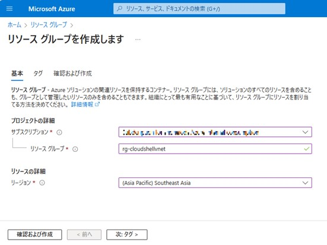


#### 手順②　仮想ネットワークを作成する
前項で作成したリソースグループおよび対象のリージョンを指定し、仮想ネットワークを作成いたします。

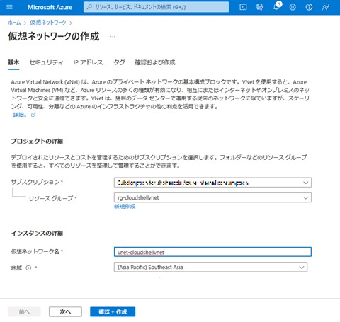

IP アドレス タブにて、ご希望の IP アドレス レンジをご指定ください。

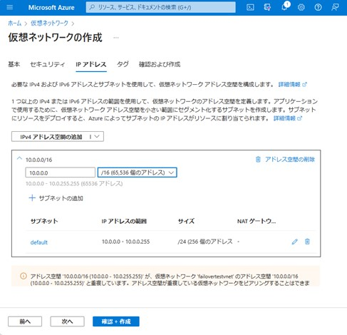

#### 手順③リソースプロバイダーの登録
以下のドキュメントの「1.リソース プロバイダーを登録する」のセクションに沿って、必要なリソースプロバイダーの登録をお願いいたします。

> ・ご参考: [1.リソース プロバイダーを登録する](https://learn.microsoft.com/ja-jp/azure/cloud-shell/vnet/deployment#1-register-resource-providers)

#### 手順④ Azure Container Instance ID を確認する
後続の手順において必要となるサービスプリンシパル “Azure Container Instance” に割り当てられた Azure Container Instance ID を、Azure PowerShell より以下のコマンドを実行して確認してください。

```PowerShell
Get-AzADServicePrincipal -DisplayNameBeginsWith 'Azure Container Instance'
```

以下の出力例の場合には、 Azure Container Instance Id は “8fe7fd25-33fe-4f89-ade3-0e705fcf4370” となります。

```PowerShell
DisplayName                      Id                                   AppId
-----------                      --                                   -----
Azure Container Instance Service 8fe7fd25-33fe-4f89-ade3-0e705fcf4370 34fbe509-d6cb-4813-99df-52d944bfd95a
```

#### 手順⑤ ARM テンプレートを使用してリソースをプロビジョニングする
以下のリンクへアクセスして、 ARM テンプレートを使用して仮想ネットワークに対して Cloud Shell リソースを作成いたします。

[https://aka.ms/cloudshell/docs/vnet/template](https://aka.ms/cloudshell/docs/vnet/template)

上記リンクへアクセスしたら表示される画面において、の “Deploy to Azure” のリンクを選択してください。

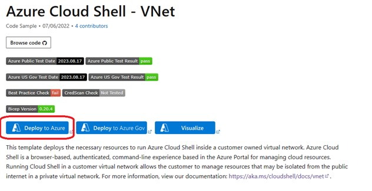

表示されたテンプレートの各項目に必要な情報を入力して、”確認と作成”を 選択してください。  
下記スクリーンショットに加えて Nsg Name の項目が追加されているものと存じますが、新規作成される NSG の名前ですので任意の名前で問題ございません。

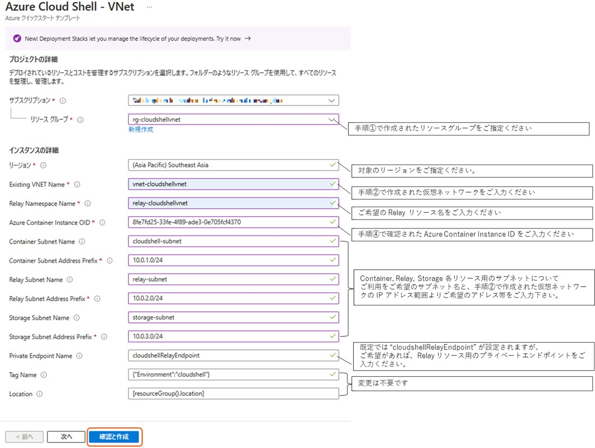

入力したリソースの名称など確認画面が表示されますので、問題なければ “作成” を選択してください。

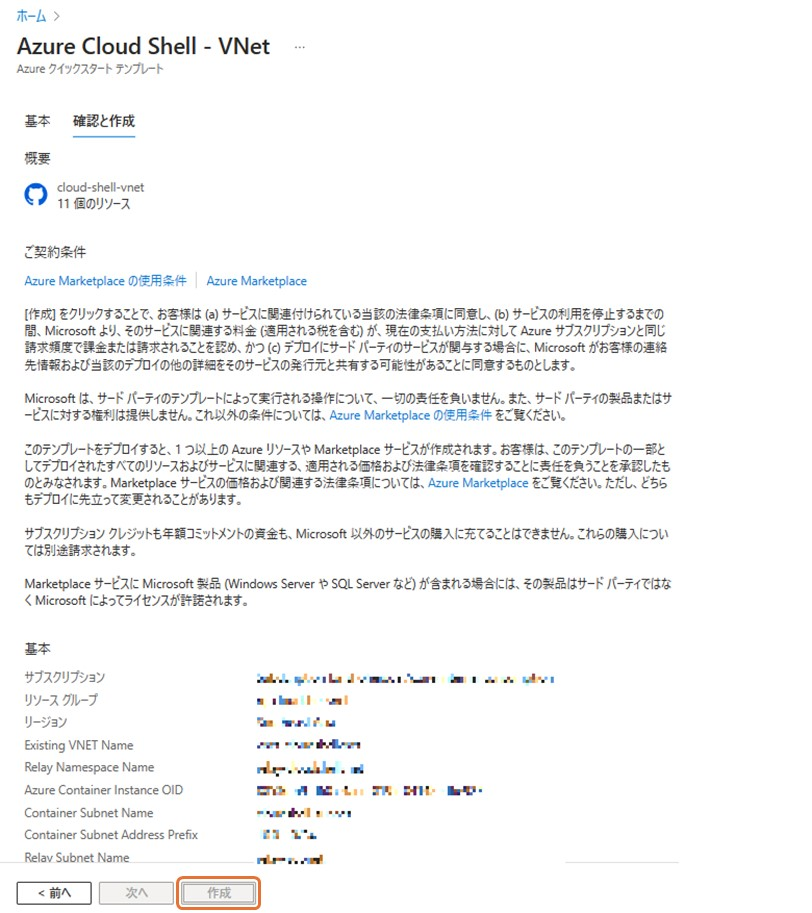

対象のリソースグループ内に必要なリソースが まとめて作成されます。

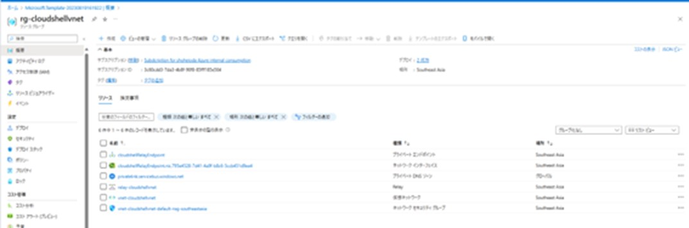


#### 手順⑥ ストレージアカウントを作成する。
以下のリンクへアクセスして、 ARM テンプレートを使用してCloud Shell が使用するストレージアカウントを作成します。

[https://azure.microsoft.com/resources/templates/cloud-shell-vnet-storage/](https://azure.microsoft.com/resources/templates/cloud-shell-vnet-storage/)

上記リンクへアクセスしたら表示される画面において “Deploy to Azure” のリンクを選択してください。


表示されたテンプレートの各項目に必要な情報を入力して、”確認と作成”を 選択してください。

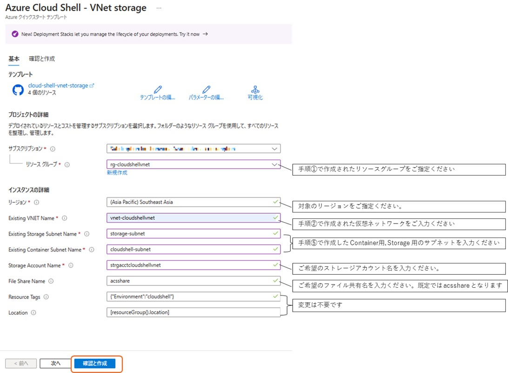

入力したリソースの名称など確認画面が表示されますので、問題なければ “作成” を選択してください。

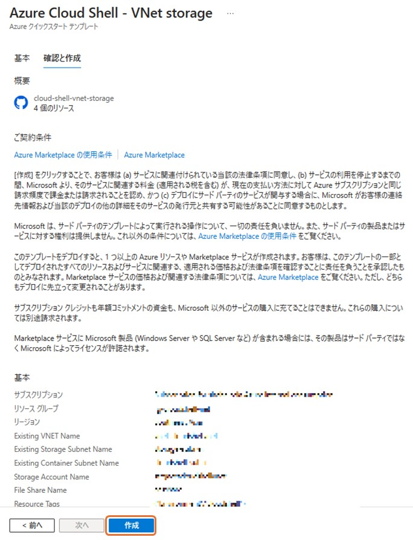

対象のリソースグループ内にストレージアカウントが作成されます。

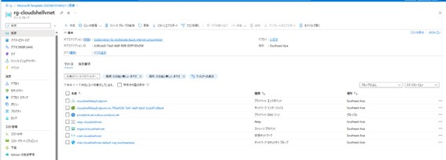


#### 手順⑦ 仮想ネットワークを使用するように Cloud Shell を構成する
Azure ポータル画面上部のメニューより Cloud Shell のアイコンを選択いたします。


初期時点では、以下のような画面が表示されますので、PowerShell もしくは Bash どちらかを選択ください。

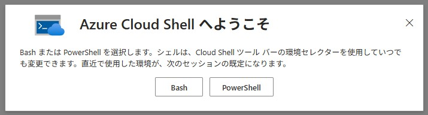

なお、既に既定の設定で Cloud Shell をご利用されており、上記の画面が表示されない場合には、以下のように Cloud Shell 画面より、メニューバーの歯車アイコンから “ユーザー設定のリセット” を選択して設定を初期化させてください。

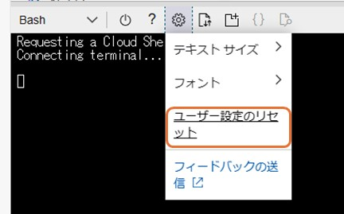

再度 Cloud Shell を起動することで、上述の “ストレージアカウントがマウントされていません” とCloud Shell 端末を新規に作成される画面が表示されますので、“詳細設定の表示” を選択してください。

“詳細設定の表示” より以下のように必要な項目を入力して、”ストレージの作成” を選択してください。

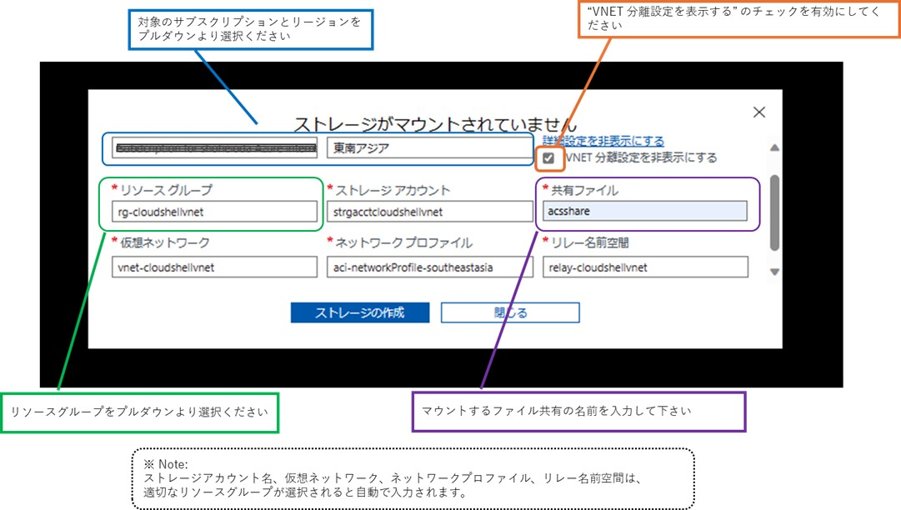

#### 補足： 仮想ネットワークにデプロイした場合の状態確認
Cloud Shell 端末を仮想ネットワークにデプロイした状況について以下のように状態を確認することが可能で

Get-CloudDrive コマンドレットにより、Cloud Shell がマウントしているファイル共有のリソース情報を確認することが可能です。

```PowerShell
PS /home/user> Get-CloudDrive                                                                  ter' -PassThru

FileShareName      : acsshare
FileSharePath      : //srtrgaccctcloudshellvnet.file.core.windows.net/acsshare
MountPoint         : /home/user/clouddrive
Name               : srtrgaccctcloudshellvnet
ResourceGroupName  : rg-cloudshellvnet

StorageAccountName : srtrgaccctcloudshellvnet
SubscriptionId     : XXXXXXXX-XXXX-XXXX-XXXX-XXXXXXXXXXXX
```

以下のように対象の VNET から到達可能な プライベート IP  に対して Ping やSSH により接続が可能です。

```PowerShell
PS /home/user> ping 10.8.0.20
PING 10.8.0.20 (10.8.0.20) 56(84) bytes of data.
64 bytes from 10.8.0.20: icmp_seq=3 ttl=64 time=68.7 ms
64 bytes from 10.8.0.20: icmp_seq=4 ttl=64 time=68.5 ms
64 bytes from 10.8.0.20: icmp_seq=5 ttl=64 time=68.2 ms
^C
--- 10.8.0.20 ping statistics ---
5 packets transmitted, 3 received, 40% packet loss, time 4062ms
rtt min/avg/max/mdev = 68.233/68.479/68.665/0.181 ms
PS /home/user>
PS /home/user> ssh -i rhel-86-02_20230912.pem azureuser@10.8.0.20
Activate the web console with: systemctl enable --now cockpit.socket

Register this system with Red Hat Insights: insights-client --register
Create an account or view all your systems at https://red.ht/insights-dashboard
Last login: Tue Sep 12 04:16:23 2023 from XX.XX.XX.XX
[azureuser@rhel-86-02 ~]$ 
```

