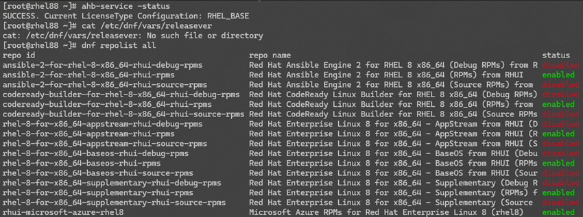
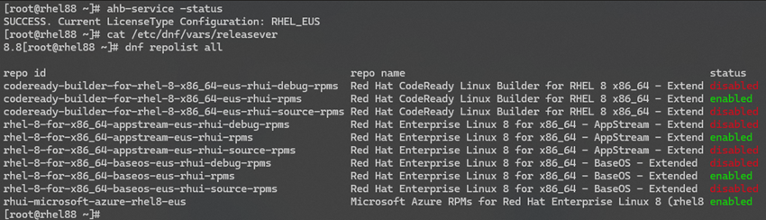
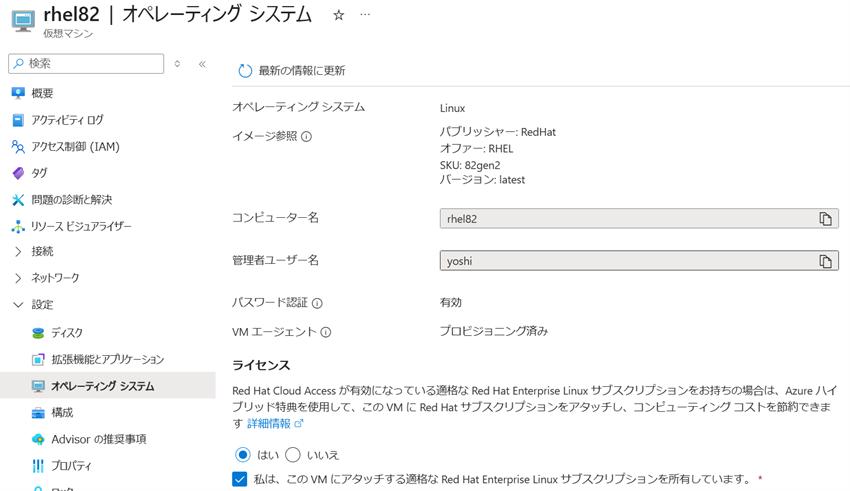
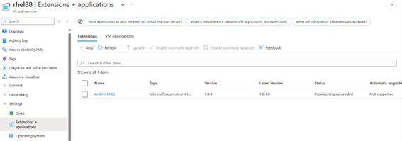
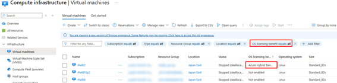

Azure サポートの高橋です。今回は RHEL (Red Hat Enterprise Linux) VM をご利用いただいているお客様よりお問い合わせをいただく Azure ハイブリッド特典 (AHB) についてご紹介していきたいと思います。

Azure Hybrid Benefit (AHB) を利用することで、Azure 上の Red Hat Enterprise Linux (RHEL) VM のソフトウェア サブスクリプション モデルを簡単に切り替えることができます。
この記事では、AHB に関する概要、各種ライセンスタイプの違い、BYOS (サブスクリプション持ち込み) と PAYG (従量課金制) の切り替え手順、切り替え後の確認方法について詳しく解説します。

<!-- more -->

---

## AHB の概要解説
Azure Hybrid Benefit (AHB) は、(RHEL) VM のソフトウェア サブスクリプション モデルを切り替えるために利用するものです。
PAYG (従量課金モデル) と BYOS (サブスクリプション持ち込み) をそれぞれ切り替えることができます。
VM を再デプロイすることなく、ダウンタイムのリスクなしでサブスクリプション モデルを変更することが可能となります。
具体的なイメージについては、こちらの公開ドキュメントをご確認ください。

> □ 参考 : Linux VM の Azure ハイブリッド特典を調べる
> https://learn.microsoft.com/ja-jp/azure/virtual-machines/linux/azure-hybrid-benefit-linux?tabs=ahbRhelPayg%2CahbNewPortal%2CahbExistingPortal%2Clicenseazcli%2CrhelAzcliByosConv%2Crhelazclipaygconv%2Crhelpaygconversion%2Crhelcompliance#payg-vs-byos

---

## ライセンスタイプの違い
BYOS モデルから PAYG モデルに変換する場合に使用可能な RHEL のライセンスタイプは、以下の表の通りとなります。
後述する拡張機能により、選択したライセンスタイプに応じて RHUI リポジトリを利用するよう自動的に構成が行われます。

| ライセンスの種類  | ソフトウェア更新プログラム  |
| ------------ | ------------ |
| RHEL_BASE  | Red Hat 標準/ベース リポジトリを VM にインストールします |
| RHEL_EUS | Red Hat Extended Update Support (EUS) リポジトリを VM にインストールします |
| RHEL_SAPAPPS | RHEL for SAP Business Apps リポジトリを VM にインストールします | 
| RHEL_SAPHA | 高可用性 (HA) リポジトリを使用して RHEL for SAP を VM にインストールします |
| RHEL_BASESAPAPPS | RHEL 標準/ベース SAP Business Apps リポジトリを VM にインストールします |
| RHEL_BASESAPHA | HA 対応の標準/ベース RHEL for SAP リポジトリを VM にインストールします |

一般的な RHEL VM では、RHEL_BASE と RHEL_EUS の2種類があります。
これらのライセンスタイプの違いは、接続されるリポジトリサーバーが異なります。
RHEL_BASEでは、ベースリポジトリ (非 EUS リポジトリ) へ接続されることとなります。
以下の例では、BYOS の RHEL 8.8 の VM で、RHEL_BASE にライセンスタイプを切り替えた際の接続されているリポジトリを確認しています。


RHEL_EUS では、EUS リポジトリに接続され、マイナーバージョンが固定化されます。
先ほどと同様に、RHEL_EUS にライセンスタイプを切り替えたと際に接続されているリポジトリを確認してみると、EUS リポジトリに接続されており、マイナーバージョンが固定されていることが確認できます。(以下の例では RHEL 8.8 に固定化)


非 EUS リポジトリと EUS リポジトリの違いについては、以下のブログで詳細にご紹介しているのでご確認ください。
> □ 参考 : Azure RHEL VM の 非 EUS/ EUS リポジトリについて
> https://jpaztech.github.io/blog/vm/rhui-eus/

PAYG モデルから BYOS モデル変換する場合、ライセンスタイプは RHEL_BYOS を利用することとなります。 
リポジトリの構成変更に関してはお客様にて実施いただく必要がございます。

> [!TIP]
> ## ライセンスタイプ Null / None について
> ライセンスタイプ Null / None は、VM を作成した時点でのサブスクリプションモデルとなります。
> Azure Marketplace から提供されている RHEL イメージは PAYG となり、持ち込みイメージを利用いただいている場合は BYOS となります。
> Azure ハイブリッド特典を一度も有効化していない場合は、どちらのサブスクリプションモデルでもライセンスタイプは Null として表示されます。
> 一度、Azure ハイブリッド特典を有効化し、サブスクリプションモデルを切り替えた後に、再度サブスクリプションモデルを戻した場合には、None として表示されます。
> つまり、ライセンスタイプ Null / None は PAYG と BYOS どちらの場合でも表示されますので、Null / None の場合は VM 作成時点でのサブスクリプションモデルが適用されることとなります。

---

## BYOS から PAYG への切り替え手順
それでは、AHB を有効にしてライセンスタイプを切り替える手順についてご紹介いたします。
まずは、BYOS から PAYG に切り替える手順についてご紹介いたします。
現時点では、Azure portal から BYOS から PAYG に切り替える方法はございません。
また、拡張機能のインストールが必要になるため、VM 起動中に実施いただく必要があります。
以下の Azure CLI のコマンドにて、AHB の拡張機能のインストールをします。
<リソース グループ名>や<VM 名>についてはご自身の環境のものに置き換えください。 

```bash
az vm extension set -n AHBForRHEL --publisher Microsoft.Azure.AzureHybridBenefit --vm-name <VM 名> --resource-group <リソースグループ名>
```

> [!WARNING]
> ## AHBForRHEL 拡張機能のリポジトリ登録エラーについて 
> AHBForRHEL を利用するにあたってahb-service がエラーを出力する旨のお問い合わせがしばしばございます。 
> 下記のエンドポイントへの通信が遮断されている場合にはエラーが発生することを確認しておりますので、Firewall 等で通信制御を行っている場合は通信許可をいただくことで解消するかご確認ください。 
> ・拡張機能の構成ファイルの取得 
> ahbsa.blob.core.windows.net 
> ・RHUI構成ファイルの取得 
> rhelimage.blob.core.windows.net 
> また、RHUI リポジトリへのアクセスができない場合にもエラーが発生いたします。 
> RHUI で利用される可能性のある IP アドレスが公開されておりますので、こちらのIP へ接続できることを事前にご確認ください。
> □ 参考 : Azure のオンデマンド Red Hat Enterprise Linux VM 用 Red Hat Update Infrastructure
> https://learn.microsoft.com/ja-jp/azure/virtual-machines/workloads/redhat/redhat-rhui?tabs=rhel8

拡張機能のインストールが完了したら、以下のコマンドで必要とするライセンスタイプに変更します。
以下の例では RHEL_BASE へ変更いたします。

```bash
az vm update -g <リソースグループ名> -n <VM 名> --license-type RHEL_BASE
```

"AHB for RHEL" 機能フラグが有効になっているかどうかを確認します。

```bash
az feature list --namespace Microsoft.Compute | grep "AHBEnabledForRHEL" -A 3  
出力結果例
    "id": "/subscriptions/<subscription ID>/providers/Microsoft.Features/providers/microsoft.compute/features/AHBEnabledForRHEL",
    "name": "microsoft.compute/AHBEnabledForRHEL",
    "properties": {
      "state": "Registered"
    },
```

一度 PAYG に変更したものを再度 BYOS にする際には、ライセンスタイプを None にして切り替える必要があります。

```bash
az vm update -g <リソースグループ名> -n <VM 名> --license-type NONE
```

こちらの公開ドキュメントにも手順が記載されておりますのでご確認ください。

> □ 参考 : BYOS を PAYG に転換する
> https://learn.microsoft.com/ja-jp/azure/virtual-machines/linux/azure-hybrid-benefit-linux?tabs=ahbRhelPayg%2CahbNewPortal%2CahbExistingPortal%2Clicenseazcli%2CrhelAzcliByosConv%2Crhelazclipaygconv%2Crhelpaygconversion%2Crhelcompliance#convert-byos-to-payg

## PAYG から BYOS への切り替え手順
PAYG から BYOS に切り替える手順は
Azure portal から対象の VM を選択し、設定ブレード内の “オペレーティングシステム” 内にある、ライセンスの項目から変更することができます。
この操作は、VM が停止している状態でも起動している状態でも実施することができます。
また、VM の動作に影響は発生いたしません。
BYOS に切り替える際は、以下の画面のように、”はい” を選択し、
“私は、この VM にアタッチする適切な Red Hat Enterprise Linux サブスクリプションを所有しています。” にチェックを入れ適用をしてください。



もしも、一度 BYOS に変更した後に、再度 PAYG に戻す場合には、
“いいえ” を選択して、適用をすることで PAYG に戻ります。

Azure CLI からは以下のコマンドで切り替えることができます。
```bash
az vm update -g <リソースグループ名> -n <VM 名> --license-type RHEL_BYOS
```

BYOS に切り替えたら必要に応じて subscription-manager で登録作業を実施ください。

> □ 参考 : Using Red Hat Enterprise Linux subscriptions with Microsoft Azure Hybrid Benefit
> https://access.redhat.com/articles/5419341

一度 BYOS にしたものを PAYG にする際には、ライセンスタイプを None にして切り替える必要があります。
```bash
az vm update -g <リソースグループ名> -n <VM 名> --license-type NONE
```
こちらの公開ドキュメントにも手順が記載されておりますのでご確認ください。

> □ 参考 : Azure ハイブリッド特典を有効にする | 既存の VM
> https://learn.microsoft.com/ja-jp/azure/virtual-machines/linux/azure-hybrid-benefit-linux?tabs=ahbRhelPayg%2CahbNewPortal%2CahbExistingPortal%2Clicenseazcli%2CrhelAzcliByosConv%2Crhelazclipaygconv%2Crhelpaygconversion%2Crhelcompliance#existing-vm

> [!IMPORTANT]
> AHB を有効化して、BYOS に変換する際には、事前に Red Hat Cloud Access に登録する必要があります。
> Red Hat Cloud Access への登録がされていない場合、ライセンスを変更しようとすると以下のような画面で表示され、選択ができません。
> 
> なお、Red Hat Cloud Access サブスクリプションの登録が、Red Hat から Azure に反映されるまでに時間がかかる場合があります。
> Red Hat Cloud Access の登録方法については、Red Hat 社のドキュメントを確認してください。
> □ 参考 : Using Red Hat Enterprise Linux subscriptions with Microsoft Azure Hybrid Benefit
> https://access.redhat.com/articles/5419341

---

## 切り替え後の確認方法
ライセンスタイプが正しく切り替わったかについては、以下の点を確認してください。

・ライセンスタイプの確認
Azure CLI のコマンドで、ライセンスタイプを確認することができます。
```bash
az vm get-instance-view -g <リソースグループ名> -n <VM 名> --query licenseType
"RHEL_BASE"
```

また、ゲスト OS 内からは、以下のコマンドで確認することができます。(BYOS から PAYG に変更したとき)
```bash
# ahb-service -status
SUCCESS. Current LicenseType Configuration: RHEL_BASE
```

・リポジトリの設定状況
dnf コマンドにて、リポジトリの接続状況確認できます。(以下は Base リポジトリに接続されたとき)


・拡張機能のプロビジョニング状態 (BYOS から PAYG に変換したときのみ)
Azure portal からは、対象の VM のページから拡張機能がインストールされているか確認することができます。


Azure CLI での確認
```bash
az vm get-instance-view -g <リソースグループ名> -n <VM 名> --query instanceView.extensions
[
  {
    "name": "AHBForRHEL",
    "statuses": [
      {
        "code": "ProvisioningState/succeeded",
        "displayStatus": "Provisioning succeeded",
        "level": "Info",
        "message": "Plugin enabled",
        "time": null
      }
    ],
    "substatuses": null,
    "type": "Microsoft.Azure.AzureHybridBenefit.AHBForRHEL",
    "typeHandlerVersion": "1.0.4"
  },
```
VM の一覧から、フィルタに OS licensing benefit を追加することで、ハイブリッド特典が有効な VM の一覧を確認することができます。


---

## お問い合わせ先について
PAYG / BYOS に関わらず、Azure プラットフォーム上で起きた Azure 基盤側の問題切り分け調査については、Azure サポートで対応をいたします。
PAYG をご利用の環境では、OS 観点に関しましては、
以下の Red Hat 社のドキュメントに記載通り、L1 (事例調査) および L2 サポート (検証を含む調査) を Azure サポートから提供する形となります。
Azure の Linux サポートは break & fix (障害からの復旧) が基本となります。
 
> □ 参考: Microsoft Azure の問題で Red Hat のサポートを受ける方法
> https://access.redhat.com/ja/articles/3040851

BYOS をご利用の環境では、OS 観点に関しましては、Red Hat 社へお問い合わせをください。

本稿が皆様のお役に立てれば幸いです。
