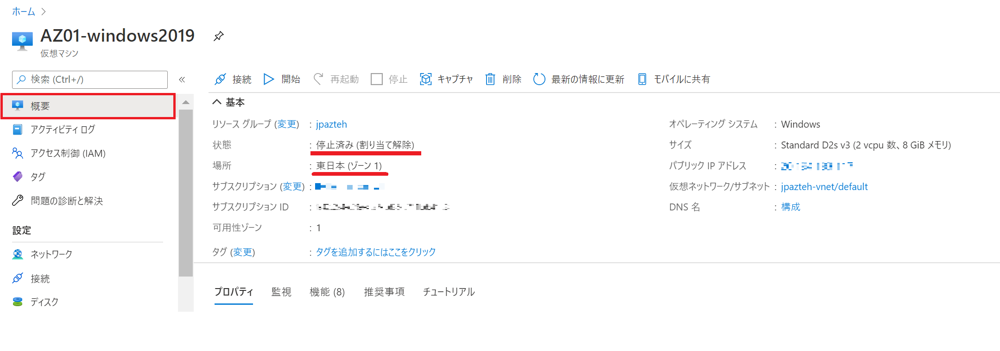
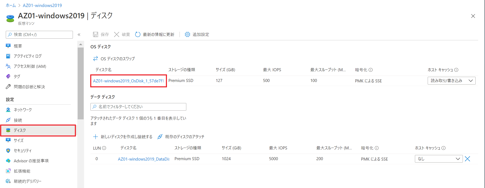
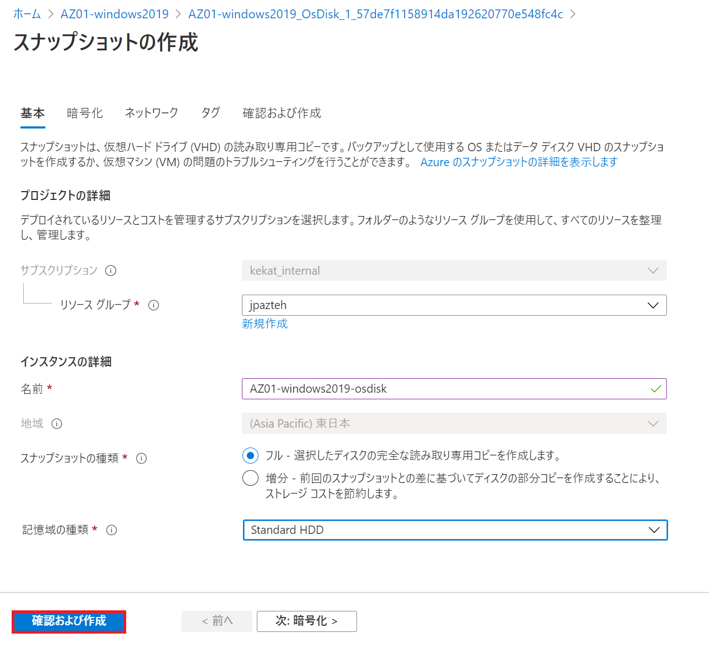
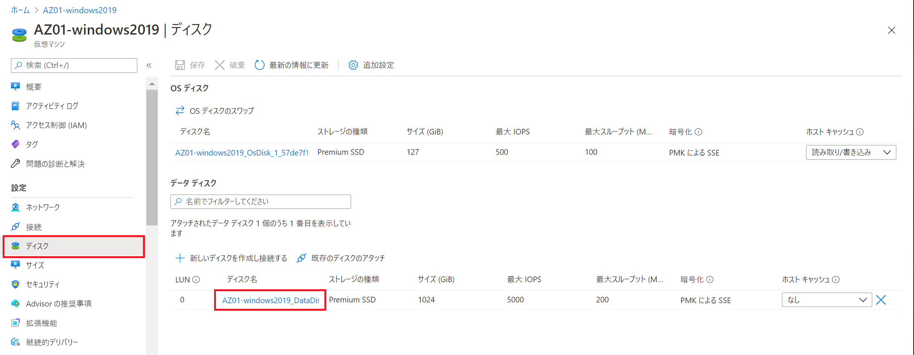
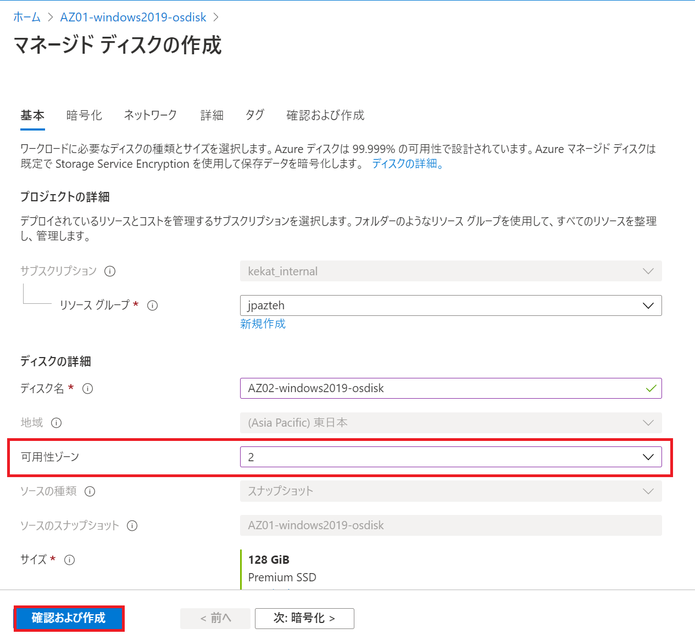
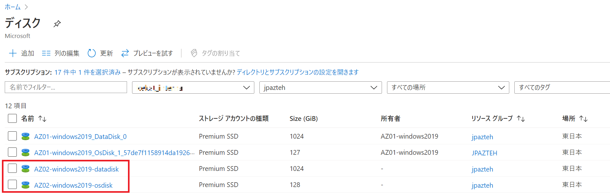
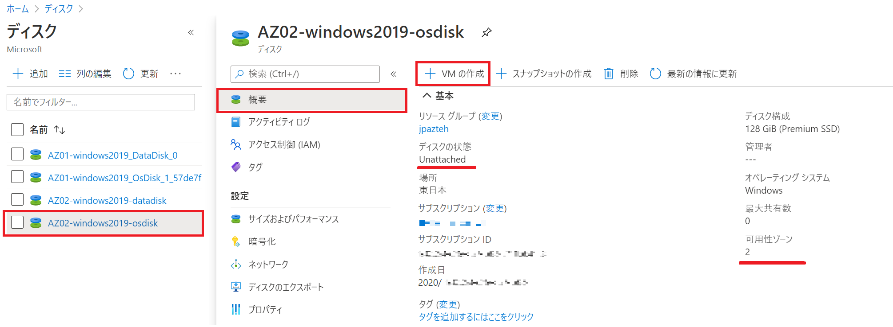
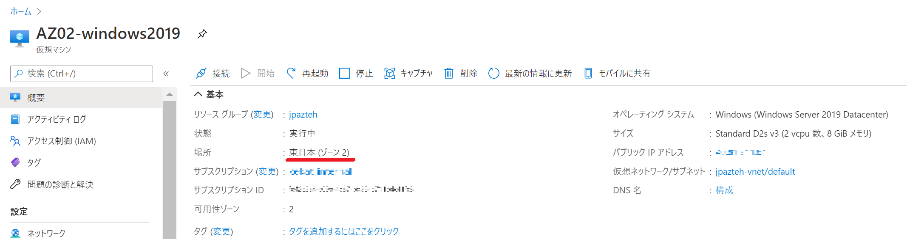

こんにちは、Azure テクニカル サポート チームの松岡です。

VM における可用性ゾーンの利用有無は、VM を新規作成する場合にのみ設定することができますが、運用をしている中で VM を可用性ゾーンへ組み入れる必要が発生したり、逆に、可用性ゾーンに組み入れられていると一部機能が対応しないため、可用性ゾーンから外したいという状況もあるかと思います。
本稿では、そのような際、VM の可用性ゾーンを変更する方法について、Azure ポータルからの実施方法をご案内します。

<!-- more -->

なお、Azure ポータルからではなく Azure PowerShell を用いた実施方法を確認する場合は、以下の記事をご確認ください。

> VM の再作成により可用性ゾーンを変更する (PowerShell 編)
> [https://jpaztech.github.io/blog/vm/change-availability-zone-using-powershell/](https://jpaztech.github.io/blog/vm/change-availability-zone-using-powershell/)

また、可用性ゾーンをサポートしているのは一部リージョンのみとなりますので、ご留意ください。

> Azure での Availability Zones をサポートしているリージョン
> [https://docs.microsoft.com/ja-jp/azure/availability-zones/az-region](https://docs.microsoft.com/ja-jp/azure/availability-zones/az-region)

---

## ■ 手順を利用する前提条件

本手順では、管理ディスクを利用していることを前提としてご案内します。

---

## ■ 手順の流れについて

VM の可用性ゾーンを変更する場合、以下の流れにて作業を行います。

1. VM を停止 (割り当て解除) する
2. ディスクのスナップショットを作成する
3. ディスクのスナップショットから新規にディスクを作成する
4. 新規に作成したディスクから VM を作成する
5. 作成したスナップショット、および元々利用していたリソースを削除する

本稿では、VM の可用性ゾーンを 1 から 2 に変更する手順を例として紹介します。

---

## ■ VM の可用性ゾーンを変更する手順

### 1. VM を停止 (割り当て解除) する

Azure ポータルより [Virtual Machines] - [<当該 VM 名>] を開き、VM を停止 (割り当て解除) します。
VM の状態が [停止済み (割り当て解除)] になっていることを確認します。

左メニュー "設定" より [ディスク] を選択し、開いた画面 "OS ディスク" より [<当該 OS ディスク名>] をクリックします。

### 2. ディスクのスナップショットを作成する

画面の "＋ スナップショットの作成" をクリックします。

必要項目を適宜入力し、[確認および作成] - [作成] をクリックします。
"記憶域の種類" は、スナップショットを高パフォーマンスのディスクに保存する必要がある場合を除き、 [Standard_HDD] を選択します。

データディスクがある場合、データディスクについても同様にスナップショットを作成します。

### 3. ディスクのスナップショットから新規にディスクを作成する

Azure ポータル 上部の検索バーに "スナップショット" と入力し、サービス [スナップショット] を選択します。
上記手順で作成した OS ディスクおよび、データ ディスクのスナップショットが作成されていることを確認します。

OS ディスクのスナップショットを選択し、[+ ディスクの作成] をクリックします。

必要項目を適宜入力し、[確認および作成] - [作成] をクリックします。
可用性ゾーンを希望のゾーン番号に変更します。
こちらの手順では、元々選択していた "1" から "2" へとゾーンを変更しています。

データ ディスクについても同様にディスクを作成します。

### 4. 新規に作成したディスクから VM を作成する

Azure ポータル上部の検索バーに "ディスク" と入力し、サービス [ディスク] を選択します。
上記手順で作成した OS ディスクおよび、データ ディスクが作成されていることを確認します。

作成した OS ディスクを選択し、[+ VM の作成] をクリックします。
表示されているディスクの状態が "Unattached"、可用性ゾーンが指定した番号であるかを確認します。

必要項目を適宜入力し、[確認および作成] - [作成] をクリックします。
可用性ゾーンの番号は、作成したディスクと同じ番号を指定します。
データ ディスクは [既存のディスクの接続] より、スナップショットから作成したデータ ディスクを適宜選択します。
VNET は同様に既存のものから選択出来ますが、NIC は新規に作成されます。

作成された VM が、指定のゾーン番号で表示されていること(こちらの手順ではゾーン "2" )を確認します。

### 5. 作成したスナップショット、および元々利用していたリソースを削除する

作成した VM が正常動作することを確認後、元々利用していたリソース、および元々利用していたリソースを削除し、手順は完了です。

---

本稿が皆様のお役に立てれば幸いです。
