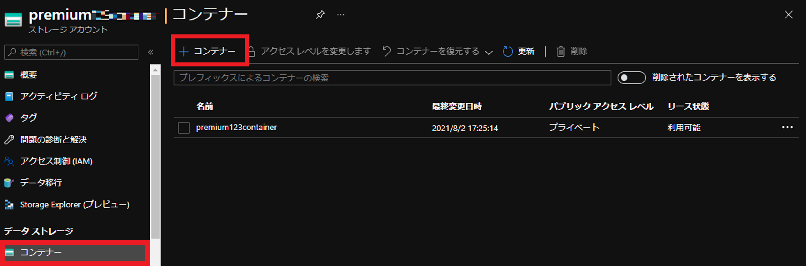

こんにちは、Azure テクニカル サポート チームの坂部です。
今回は、非管理ディスクの種類を Standard HDD から Premium SSD への変更する手順についてご紹介します。

非管理ディスクの種類は、VHD ファイルが保管されているストレージ アカウントの種類 (Standard ストレージ アカウント / Premium ストレージ アカウント) によって異なります。
そのため、ディスクの種類を変更する場合には、ご利用いただくパフォーマンスのストレージ アカウントを新たに作成し、そこに変更対象の VHD ファイルを配置いただきます。
OS ディスク (非管理ディスク) の種類を変更いただく場合には仮想マシンの再作成が必要となりますので、予めご留意ください。

<!-- more -->

> [!NOTE] 
> 非管理ディスク (アンマネージド ディスク) は現状サポートされておりますが、管理ディスク (マネージド ディスク) のご利用を推奨しております。
>　
> 非管理ディスクの種類の変更をご検討の際には、管理ディスクへの移行につきましてもご検討ください。
> なお、管理ディスクぼり点に関してご確認いただく場合は、下記をご参照ください。
> 　
>> Azure IaaS VM ディスクと Premium マネージド ディスクおよびアンマネージド ディスクについてよく寄せられる質問
>> [https://docs.microsoft.com/ja-jp/azure/virtual-machines/faq-for-disks](https://docs.microsoft.com/ja-jp/azure/virtual-machines/faq-for-disks)
>> 抜粋：アンマネージド ディスクはまだサポートされていますか?
>> はい。アンマネージド ディスクとマネージド ディスクの両方がサポートされています。 
>> 新しいワークロードではマネージド ディスクを使用し、現在のワークロードはマネージド ディスクに移行することをお勧めします。
> 　
>> Azure VM を Managed Disks に移行する
>> [https://docs.microsoft.com/ja-jp/azure/virtual-machines/windows/migrate-to-managed-disks](https://docs.microsoft.com/ja-jp/azure/virtual-machines/windows/migrate-to-managed-disks)
> 　
>> Azure マネージド ディスクの概要 - マネージド ディスクの利点
>> [https://docs.microsoft.com/ja-jp/azure/virtual-machines/managed-disks-overview#benefits-of-managed-disks](https://docs.microsoft.com/ja-jp/azure/virtual-machines/managed-disks-overview#benefits-of-managed-disks)


本記事では、OS ディスク (非管理ディスク) を Standard HDD から Premium SSD に変更する場合の手順について、スクリーンショットを添えて詳細にご紹介します。
手順の概要としては、新規に作成した Premium ストレージ アカウント上に、Standard ストレージ アカウント上の対象 VHD ファイルをコピーし、そのコピーした VHD ファイルより、VM を再作成します。

---

## 事前準備

本手順では、AzCopy と Azure PowerShell を使用します。
それぞれの導入については、下記公開情報をご参照の上ご実施ください。

> Azure PowerShell：
> [https://docs.microsoft.com/ja-jp/powershell/azure/install-az-ps?view=azps-6.2.1](https://docs.microsoft.com/ja-jp/powershell/azure/install-az-ps?view=azps-6.2.1)
	
> AzCopy：
> [https://docs.microsoft.com/ja-jp/azure/storage/common/storage-use-azcopy-v10?toc=%2fazure%2fstorage%2fblobs%2ftoc.json](https://docs.microsoft.com/ja-jp/azure/storage/common/storage-use-azcopy-v10?toc=%2fazure%2fstorage%2fblobs%2ftoc.json)

> AzCopy を使ってみる
> [https://docs.microsoft.com/ja-jp/azure/storage/common/storage-use-azcopy-v10](https://docs.microsoft.com/ja-jp/azure/storage/common/storage-use-azcopy-v10)
---

## 手順

手順は大きく分けて下記 2 つの作業が必要になります。
- VHD ファイルを Standard ストレージ アカウントから Premium ストレージ アカウントにコピーする
- Premium ストレージ アカウントにコピーした VHD ファイルから VM を作成する

### VHD ファイルを Standard ストレージ アカウントから Premium ストレージ アカウントにコピーする

1. Azure Portal より [ストレージ アカウント] を開きます。
 
2. [+ 作成] をクリックしてコピー先のストレージ アカウントを作成します。
   ※コピー先のストレージ カウントは パフォーマンス: Premiumで作成します。
   ※コピー元と同じリージョン (VM を作成するリージョン) にストレージ アカウントを作成する必要があります。

   

3. 作成した Preimum ストレージ アカウント内にコンテナーを作成します。
   ※下記では、"premium123container" という名前のコンテナーを作成しています。

   

4. 作成したコンテナー内で、[共有アクセス トークン] を選択し、アクセス許可を "不変ストレージ" を除くすべての項目を許可し、[SAS トークンおよび URL を生成] をクリックします。

   

5. 生成された [BLOB SAS URL] をテキスト エディタ等にコピーしておきます。

   

   コピーした [BLOB SAS URL] を下記の通り編集します。

   変更前： 
   `https://[ストレージ アカウント名].blob.core.windows.net/[コンテナー名]?`
   変更後：
   `https://[ストレージ アカウント名].blob.core.windows.net/[コンテナー名]/[VHD 名].vhd?`
   <span style="color:red;">※ ここで編集した URL は 後の手順 9 にて、"コピー元の URL" として使います。</span>

 
6. コピー元の Standard ストレージ アカウントを選択し、コンテナー内にあります当該 VHD ファイルをクリックします。
   ※下記では、"vhds" という名前に VHD ファイルが格納されています。

  　

7. [共有アクセストークン]を選択し、 [SAS トークンおよび URL を生成] をクリックします。

   

8. 表示された [BLOB SAS URL] をコピーします。

   

    コピーした [BLOB SAS URL] を下記の通り編集します。
    変更後に追記する VHD 名は、コピー後に格納される VHD ファイル名になりますので、コピー元と同様の名前でも任意の名前でも問題ありません。

   変更前： 
   `https://[ストレージ アカウント名].blob.core.windows.net/[コンテナー名]?`
   変更後：
   `https://[ストレージ アカウント名].blob.core.windows.net/[コンテナー名]/[VHD 名].vhd?`
   <span style="color:red;">※ ここで編集した URL は 後の手順 9 にて、"コピー先の URL" として使います。</span>
 
9. AzCopy コマンドを実行します。

   - ローカル環境にて AzCopy コマンドをダウンロードしている場合には、管理者権限でコマンド プロンプトを起動し、AzCopy のフォルダに移動します。
     (Azure Portal にて、CloudShell をご利用いただいても問題ございません。)

   - 以下のようにコマンドを実行し、VHD のコピーを行います。
     `azcopy copy "コピー元の SAS URL (手順 5)" "コピー先の SAS URL (手順 8)" –blob-type PageBlob`

     実行例：
     `azcopy copy “https://xxxxxxxx.xxx.blob.storage.azure.net/xxxxxxxxxxxx/osdisk.vhd?略" “https://xxxxxxxx.blob.core.windows.net/vhds/osdiskcopy.vhd?略" –blob-type PageBlob`

   これにより、コピー先のリージョンのストレージアカウントにコピー元 VM の VHD ファイルをコピーすることができます。
   コピーが100% まで進行した後、少しおいて Job Summary が表示されます。
   Final Job Status: Completed と表示されていれば完了となります。

   > ご参考) AzCopy を使用して Azure ストレージ アカウント間で BLOB をコピーする
   > [https://docs.microsoft.com/ja-jp/azure/storage/common/storage-use-azcopy-blobs-copy?toc=/azure/storage/blobs/toc.json#copy-a-blob](https://docs.microsoft.com/ja-jp/azure/storage/common/storage-use-azcopy-blobs-copy?toc=/azure/storage/blobs/toc.json#copy-a-blob)
   > 参照箇所：BLOB をコピーする

10. コピーが成功したら、Premium ストレージのコンテナー内に当該vhdファイルがコピーされていることが確認できます。

   

### Premium ストレージ アカウントにコピーした VHD ファイルから VM を作成する

既存の VHD ファイルから VM を作成いただくには、Azure PowerShell や Azure CLI を用いて作成いただく必要があります。

下記のブログ記事のアーカイブには、Azure PowerShell を用いて、ストレージ アカウントのコンテナー内にある vhd ファイルから非管理ディスクの VM を作成するが紹介されています。
こちらは、Az モジュールではなく、古いモジュールである AzureRM を用いたスクリプトで記載されております。

> ご参考) 特殊化 VHD ファイルから ARM 環境へ仮想マシンをデプロイする Azure PowerShell
> [https://docs.microsoft.com/en-us/archive/blogs/jpaztech/deployfromspecializedvhd-powershell](https://docs.microsoft.com/en-us/archive/blogs/jpaztech/deployfromspecializedvhd-powershell)

本記事では、上記記事のスクリプトの Az モジュール版をご紹介いたします。

なお、ご紹介するスクリプトは、リソース グループ / 仮想ネットワーク / サブネット / ネットワーク セキュリティ グループ (NSG) / 可用性セット (任意) は事前に作成されていることを前提としています。
本スクリプトで作成されないリソースは、必要に応じて別途作成をお願いいたします。

また、スクリプトで作成する NSG は、仮想マシンのネットワーク インターフェース (NIC) に定義されます。
別途、仮想ネットワークのサブネットに定義する場合には、Azure Portal などから設定してください。(NIC の NSG と仮想ネットワーク サブネットの NSG 両方がある場合、両方のルールで許可された通信が有効になります。)
NSG の設定は、要件に合わせて適宜変更をご実施ください。

> **免責事項**
> 
> 本サンプルスクリプトは、サンプルとして提供されるものであり、製品の実運用環境で使用されることを前提に提供されるものではありません。
>
> 本サンプルコードおよびそれに関連するあらゆる情報は、「現状のまま」で提供されるものであり、商品性や特定の目的への適合性に関する黙示の保証も含め、明示・黙示を問わずいかなる保証も付されるものではありません。
>
> マイクロソフトは、お客様に対し、本サンプルコードを使用および改変するための非排他的かつ無償の権利ならびに本サンプルコードをオブジェクトコードの形式で複製および頒布するための非排他的かつ無償の権利を許諾します。
>
> 但し、お客様は、（１）本サンプルコードが組み込まれたお客様のソフトウェア製品のマーケティングのためにマイクロソフトの会社名、ロゴまたは、商標を用いないこと、（２）本サンプルコードが組み込まれたお客様のソフトウェア製品に有効な著作権表示をすること、および（３）本サンプルコードの使用または頒布から生じるあらゆる損害 （弁護士費用を含む）に関する請求または訴訟について、マイクロソフトおよびマイクロソフトの取引業者に対し補償し、損害を与えないことに同意するものとします。


```PowerShell
#設定項目
$SubscriptionId = "サブスクリプション ID"
$ResourceGroupName = "リソース グループ名"
$Location = "リージョン"
$VhdUri = "OS ディスクの VHD ファイルの絶対パス (https://ストレージ アカウント名.blob.core.windows.net/コンテナー名/VHD ファイル名.vhd)"
$VmName = "仮想マシン名"
$VmSize = "仮想マシン サイズ"
$OSdiskName = "OSディスク名"
$VnetName = "仮想ネットワーク名"
$SubnetName = "サブネット名"
$NsgName = "ネットワーク セキュリティ グループ (NSG) 名"
$Nic1Name = "ネットワーク インターフェイス (NIC) 名"
$PrivateIpName = "プライベート IP アドレス"
# 可用性セットは任意
$AvailabilitySetName = "可用性セット名"

#ログインおよびサブスクリプションの指定
Login-AzAccount
Select-AzSubscription -SubscriptionId $SubscriptionId

#対象の仮想ネットワーク、サブネットの情報を取得
$Vnet = Get-AzVirtualNetwork -ResourceGroupName $ResourceGroupName -Name $VnetName
$Subnet = Get-AzVirtualNetworkSubnetConfig -Name $SubnetName -VirtualNetwork $Vnet

#NSG の情報を取得
$Nsg = Get-AzNetworkSecurityGroup -ResourceGroupName $ResourceGroupName -Name $NsgName

#仮想マシンの設定を定義
$VmConfig = New-AzVMConfig -Name $VmName -VMSize $VmSize
$VmConfig = Set-AzVMOSDisk -VM $VmConfig -VhdUri $VhdUri -Name $OSdiskName -CreateOption attach -Windows -Caching ReadWrite

#NIC を作成
$Nic1 = New-AzNetworkInterface -Name $Nic1Name -ResourceGroupName $ResourceGroupName -Location $Location -SubnetId $Subnet.Id -PrivateIpAddress $PrivateIpName -NetworkSecurityGroupId $Nsg.Id

#NIC の情報を取得
$Nic1 = Get-AzNetworkInterface -ResourceGroupName $ResourceGroupName -Name $Nic1Name

#仮想マシンの設定の定義に NIC を追加
$VmConfig = Add-AzVMNetworkInterface -VM $VmConfig -NetworkInterface $Nic1
$VmConfig.NetworkProfile.NetworkInterfaces.Item(0).Primary = $true

#可用性セットの情報を取得 (任意)
$AvailabilitySet = Get-AzAvailabilitySet -Name $AvailabilitySetName -ResourceGroupName $ResourceGroupName

#仮想マシンの設定の定義に可用性セットを追加 (任意)
$VmConfig.AvailabilitySetReference = $AvailabilitySet.Id

#仮想マシンを作成
New-AzVM -ResourceGroupName $ResourceGroupName -Location $Location -VM $VmConfig
```

手順は以上となります。
本稿が皆様のご参考となれば幸いです。