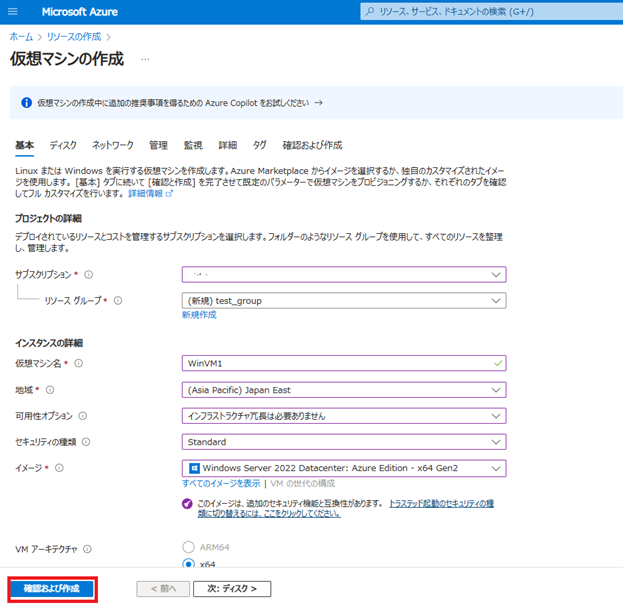
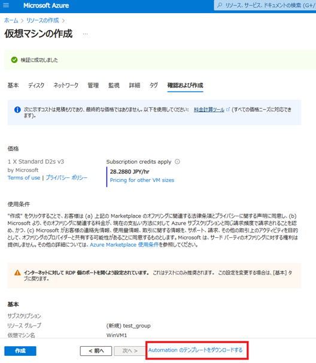
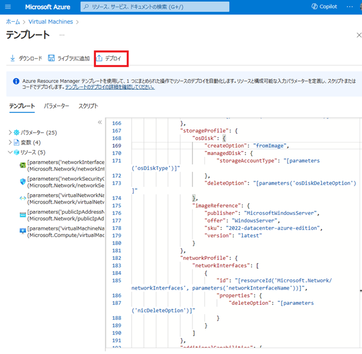
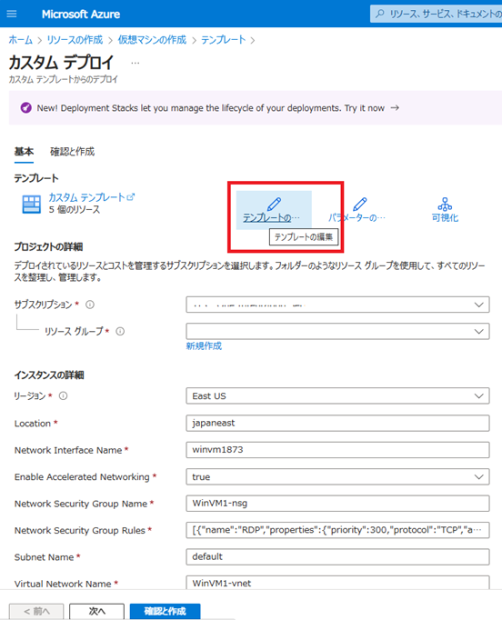
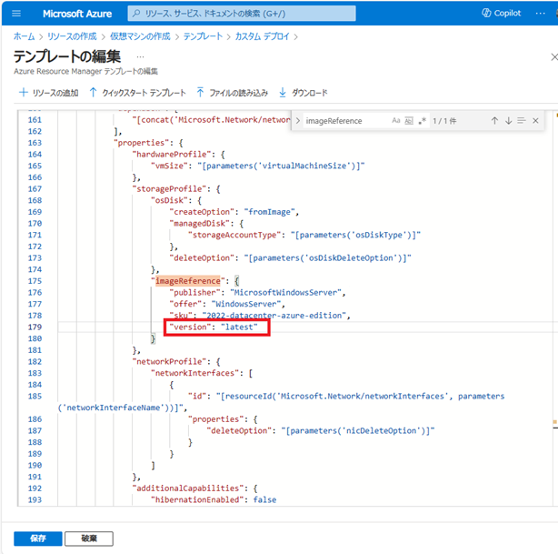
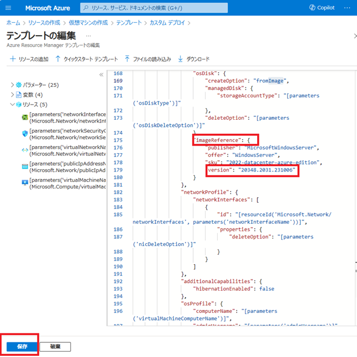
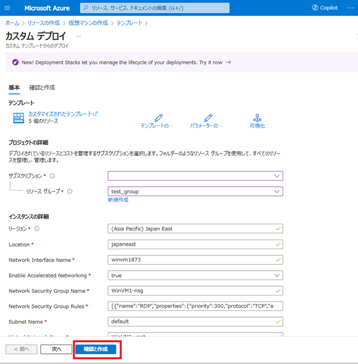
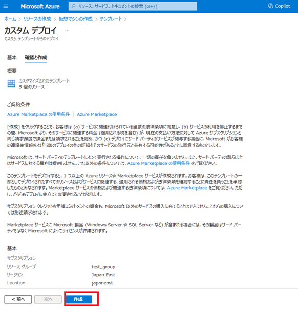
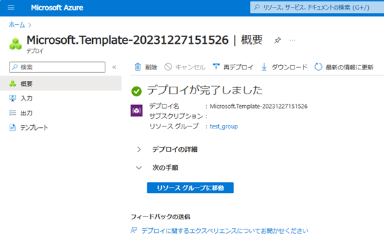
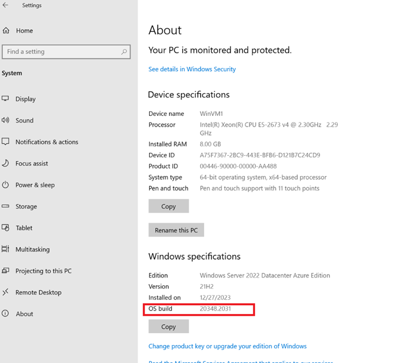

こんにちは。Azureサポートチームです。
この記事では、VM イメージ バージョンを指定して VM を作成する方法についてご紹介します。

<!-- more -->

通常、Marketplace から VM を作成すると、最新のバージョン (latest) が既定で作成されます。

ここで Azure Marketplace の Windows Server イメージを例にとると、以下のドキュメントに示す通り毎月最新のパッチがリリースされていることを確認いただくことができます。

- [Windows Server release on Azure Marketplace update history - Microsoft サポート](https://support.microsoft.com/ja-jp/topic/windows-server-release-on-azure-marketplace-update-history-6dbc5136-db53-6c5d-61f6-da370e2fa68c)

通常、最新のセキュリティパッチが適用されたイメージをご利用いただくことが一般的かと存じます。しかし、お客様によっては何らかの理由により最新のセキュリティ更新プログラムが適用されていない VM を作成する必要がある場合もあるかと存じます。
そのような場合には、VM イメージ バージョンを指定して VM をデプロイすることができます。

例えば、2023 年 10 月時点の Windows Server バージョン 2022 のイメージをデプロイする場合は「[2023 年 10 月の Windows Server イメージ - Microsoft サポート](https://support.microsoft.com/ja-jp/topic/2023-%E5%B9%B4-10-%E6%9C%88%E3%81%AE-windows-server-%E3%82%A4%E3%83%A1%E3%83%BC%E3%82%B8-cb930aa9-4609-48f4-90b2-13767a0f9dcd)」に記載されているバージョン「20348.2031.231006」を指定して VM を作成するという手順となります。
本記事では、VM 作成時にイメージ バージョンを指定する手順について説明します。

***

## 概要
下記手順にそって VM イメージ バージョンを指定し、VM をデプロイします。

### 大まかな流れ

1. イメージを検索する
    1-1. Azure CLI を使用して VM イメージを検索する
    1-2. PowerShell を使用して VM イメージを検索する
2. Azure Portal より ARM テンプレートを用意する
3. VM バージョンを指定する
4. VM をデプロイする
5. 指定したバージョンで作成できたかを確認する


## 実際の手順

それでは、上記の大まかな流れに沿って実際の手順をやってみましょう。

***

### 1. VM イメージを検索する

この項では、必要なバージョンの VM イメージを検索する手順について説明します。最新のバージョンでない VM イメージは、Azure Marketplace からは検索できず、 Azure CLI または PowerShell を使用して検索する必要があります。
 
VM イメージを検索するには、次の 4 つの属性を指定する必要があります。

| 属性  | 意味  | 説明  | 例  |
| ------------ | ------------ | ------------ | ------------ |
|  Publisher  |  発行元  |  イメージを作成した組織  |  Canonical、MicrosoftWindowsServer  |
|  Offer  |  プラン  |  発行元によって作成された関連するイメージのグループ名  |  UbuntuServer、WindowsServer  |
|  Sku  |  SKU  |  ディストリビューションのメジャー リリースなど、<br>プランのインスタンス  | 18.04-LTS、2019-Datacenter  |
|  Version  |  バージョン  |  イメージの SKU のバージョン番号  |  20348.2031.231006、latest  |

この記事では、次の属性の例に基づいて東日本リージョンから [2023 年 10 月の Windows Server イメージ](https://support.microsoft.com/ja-jp/topic/2023-%E5%B9%B4-10-%E6%9C%88%E3%81%AE-windows-server-%E3%82%A4%E3%83%A1%E3%83%BC%E3%82%B8-cb930aa9-4609-48f4-90b2-13767a0f9dcd)を検索し、VM をデプロイします。

|  属性  |  意味  |  後述の検索の結果、今回利用する値  |
| ---- | ---- | ---- |
|  Publisher  |  発行元  |  MicrosoftWindowsServer  |
|  Offer  |  プラン  |  WindowsServer  |
|  Sku  |  SKU  |  2022-datacenter-azure-edition  |
|  Version  |  バージョン  |  20348.2031.231006  |

***

#### 1-1. Azure CLI を使用して VM イメージを検索する

基本的には、「[Azure CLI を使用して Azure Marketplace イメージ情報を検索する](https://learn.microsoft.com/ja-jp/azure/virtual-machines/linux/cli-ps-findimage)」のドキュメントにある通りの手順で検索します。

***

##### 1. Publisher を指定して、Offer を一覧表示します。

```
az vm image list-offers --location <リージョン> --publisher <発行元> --output table
```

コマンド実行例：
```
az vm image list-offers --location japaneast --publisher MicrosoftWindowsServer --output table
```

以下が実際に実行した結果です。指定した Publisher 内の Offer の一覧が表示されました。
```
Location    Name
----------  ----------------------------------------
japaneast   19h1gen2servertest
japaneast   microsoftserveroperatingsystems-previews
japaneast   servertesting
japaneast   windows-cvm
japaneast   WindowsServer
japaneast   windowsserver-gen2preview
japaneast   windowsserver-previewtest
japaneast   windowsserverdotnet
japaneast   windowsserverhotpatch-previews
japaneast   WindowsServerSemiAnnual
japaneast   windowsserverupgrade
```

次に、確認した Offer を指定してその Offer 内の Sku の一覧を表示します。

***

##### 2. Publisher、Offer を指定して、Sku を一覧表示します。

```
az vm image list-skus --location <リージョン> --publisher <発行元> --offer <プラン> --output table
```

コマンド実行例：
```
az vm image list-skus --location japaneast --publisher MicrosoftWindowsServer --offer WindowsServer --output table
```

 
以下が実際に実行した結果の一部です。指定した Offer 内の Sku の一覧が表示されました。

```
Location    Name
----------  -------------------------------------------------
(略)
 
japaneast   2022-datacenter
japaneast   2022-datacenter-azure-edition
japaneast   2022-datacenter-azure-edition-core
japaneast   2022-datacenter-azure-edition-core-smalldisk
japaneast   2022-datacenter-azure-edition-hotpatch
japaneast   2022-datacenter-azure-edition-hotpatch-smalldisk
japaneast   2022-datacenter-azure-edition-smalldisk
japaneast   2022-datacenter-core
japaneast   2022-datacenter-core-g2
japaneast   2022-datacenter-core-smalldisk
japaneast   2022-datacenter-core-smalldisk-g2
japaneast   2022-datacenter-g2
 
(略)
```

東日本リージョンに 2022-datacenter-azure-edition の Sku が存在することが確認できたので、次に、その Sku を指定して、Sku 内の Version を一覧表示します。

***

##### 3. Publisher、Offer、Sku を指定して、Version を一覧表示します。

```
az vm image list --location <リージョン> --publisher <発行元> --offer <プラン> --sku <SKU> --all --output table
```

コマンド実行例：
```
az vm image list --location japaneast --publisher MicrosoftWindowsServer --offer WindowsServer --sku 2022-datacenter-azure-edition --all --output table
```

以下が実際に実行した結果の一部です。
```
Architecture    Offer          Publisher               Sku                               Urn                                                                                      Version
--------------  -------------  ----------------------  --------------------------------  ---------------------------------------------------------------------------------------  -----------------
x64             WindowsServer  MicrosoftWindowsServer  2022-datacenter-azure-edition     MicrosoftWindowsServer:WindowsServer:2022-datacenter-azure-edition:20348.1970.230905     20348.1970.230905
x64             WindowsServer  MicrosoftWindowsServer  2022-datacenter-azure-edition     MicrosoftWindowsServer:WindowsServer:2022-datacenter-azure-edition:20348.2031.231006     20348.2031.231006
x64             WindowsServer  MicrosoftWindowsServer  2022-datacenter-azure-edition     MicrosoftWindowsServer:WindowsServer:2022-datacenter-azure-edition:20348.2113.231109     20348.2113.231109
x64             WindowsServer  MicrosoftWindowsServer  2022-datacenter-azure-edition     MicrosoftWindowsServer:WindowsServer:2022-datacenter-azure-edition:20348.2159.231202     20348.2159.231202
(略)
```

Version 20348.2031.231006 のイメージが存在することが確認できたので、次に VM をデプロイします。「2. Azure Portal より ARM テンプレートを用意する」以降の手順を実施します。

***

#### 1-2. PowerShell を使用して VM イメージを検索する

基本的には、「[Azure PowerShell を使用して Azure Marketplace VM イメージを検索して使用する](https://learn.microsoft.com/ja-jp/azure/virtual-machines/windows/cli-ps-findimage#list-image)」のドキュメントにある通りの手順で検索します。

***

##### 1. Publisher を指定して、Offer を一覧表示します。

```
$locName="japaneast"
$pubName="MicrosoftWindowsServer"
Get-AzVMImageOffer -Location $locName -PublisherName $pubName | Select Offer
```

以下が実際に実行した結果です。指定した Publisher  内の Offer の一覧が表示されました。

``` 
Offer
-----
19h1gen2servertest
microsoftserveroperatingsystems-previews
servertesting
windows-cvm
WindowsServer
windowsserver-gen2preview
windowsserver-previewtest
windowsserverdotnet
windowsserverhotpatch-previews
WindowsServerSemiAnnual
windowsserverupgrade
```

次に、確認した Offer を指定してその Offer 内の Sku の一覧を表示します。

***

##### 2. Publisher、Offer を指定して、Sku を一覧表示します。

```
$offerName="WindowsServer"
Get-AzVMImageSku -Location $locName -PublisherName $pubName -Offer $offerName | Select Skus
```

以下が実際に実行した結果の一部です。指定した Offer 内の Sku の一覧が表示されました。

``` 
Skus
----
(略)
2022-datacenter
2022-datacenter-azure-edition
2022-datacenter-azure-edition-core
2022-datacenter-azure-edition-core-smalldisk
2022-datacenter-azure-edition-hotpatch
2022-datacenter-azure-edition-hotpatch-smalldisk
2022-datacenter-azure-edition-smalldisk
2022-datacenter-core
2022-datacenter-core-g2
2022-datacenter-core-smalldisk
2022-datacenter-core-smalldisk-g2
2022-datacenter-g2
2022-datacenter-smalldisk
2022-datacenter-smalldisk-g2
```

東日本リージョンに 2022-datacenter-azure-edition の Sku が存在することが確認できたので、次に、その Sku を指定して、Sku 内の Version を一覧表示します。

***

##### 3. Publisher、Offer、Sku を指定して、Versionを一覧表示します。

```
$skuName="2022-datacenter-azure-edition"
Get-AzVMImage -Location $locName -PublisherName $pubName -Offer $offerName -Sku $skuName | Select Version
```

以下が実際に実行した結果の一部です。

``` 
Version
-------
20348.1129.221007
20348.1131.221014
20348.1249.221105
20348.1366.221207
20348.1487.230106
20348.1547.230207
20348.1607.230310
20348.1668.230404
20348.1726.230505
20348.1787.230607
20348.1787.230621
20348.1850.230707
20348.1906.230803
20348.1970.230905
20348.2031.231006
20348.2113.231109
20348.2159.231202
```
 
Version 20348.2031.231006 のイメージが存在することが確認できたので、次に VM をデプロイします。「2. Azure Portal より ARM テンプレートを用意する」以降の手順を実施します。

***

### 2. Azure Portal より ARM テンプレートを用意する

この項では、1項にて検索したバージョンの Azure Marketplace イメージを利用し VMを作成する方法を説明します。先にも記載した通り Azure Portal から VM を通常通り作成すると最新のバージョンが利用される動作となることから、ARM テンプレートを編集しバージョン指定を行って VM を作成する必要があります。

Azure ポータルより [Virtual Machines] を開き、VM の新規作成画面を開きます。
必要な項目を設定し、画面下部にある [確認および作成] を選択します。



 \[検証に成功しました\] と表示されたら、画面下部にある \[Automation のテンプレートをダウンロードする\] を選択します。



表示された ARM テンプレートを使用して VM をデプロイするため、\[デプロイ\] を選択します。



ARM テンプレートを使用したカスタム デプロイの画面へ遷移しましたら、テンプレートを編集するため、\[テンプレートの編集\] を選択します。



***

### 3. VM バージョンを指定する

ARM テンプレートの "imageReference" 配下で、 バージョンを編集します。
 "version": "latest" の "latest" を修正し、今回指定するバージョンを入力します。



今回の例では、"version": "20348.2031.231006" と設定します。

```json 
                    "imageReference": {
                        "publisher": "MicrosoftWindowsServer",
                        "offer": "WindowsServer",
                        "sku": "2022-datacenter-azure-edition",
                        "version": "20348.2031.231006"
                    }
```

編集が完了しましたら、画面下部にある \[保存\] を選択します。



***

### 4. VM をデプロイする

\[カスタム デプロイ\] 画面に戻ります。リソースグループ名など、いくつかの値は設定されていない既定の状態に戻ってしまいますので、再度設定しなおします。
\[リソース グループ\]、\[Admin Password\] の値を再度設定したら、\[確認と作成\] をクリックします。



"カスタム デプロイ" 画面にて \[確認と作成\] をクリックし、"確認と作成" の "ご契約条件" の画面で、\[作成\] をクリックするとデプロイが開始されます。



テンプレート編集画面に戻って "保存されていない編集は破棄されます" のポップアップメッセージが表示された場合は、\[OK\] をクリックしてデプロイ進行中の画面に遷移します。
最後に、デプロイが完了したことを確認します。




***

### 5. 指定したバージョンで作成できたかの確認

VM に RDP 接続をして OS ビルドを確認します。今回の例では、指定した "20348.2031" となっています。




***


## まとめ

今回の記事では、Windows Server のイメージを検索し、VM をデプロイしました。
 
上記の手順において、発行元、プラン、SKU、バージョンを置き換えることによって、Linux など他のイメージについてもこの手順が応用できます。詳細については、次のドキュメントを参照してください。


 
- [CLI を使用してマーケットプレース購入プランの情報を検索および使用する - Azure Virtual Machines | Microsoft Learn](https://learn.microsoft.com/ja-jp/azure/virtual-machines/linux/cli-ps-findimage)
 
- [PowerShell を使用してマーケットプレース購入プランの情報を検索および使用する - Azure Virtual Machines | Microsoft Learn](https://learn.microsoft.com/ja-jp/azure/virtual-machines/windows/cli-ps-findimage)
 
手順は以上となります。
本記事が皆様のお役に立てれば幸いです。


