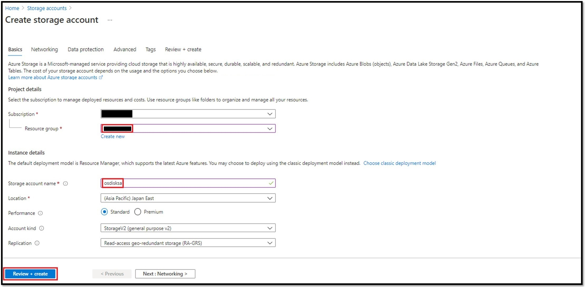
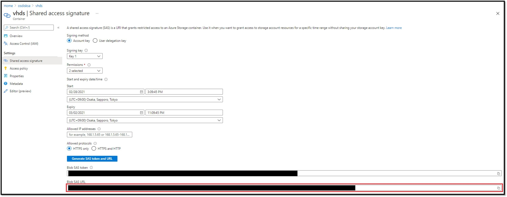
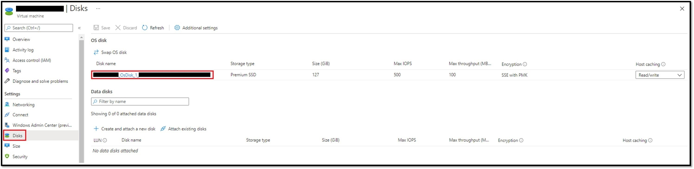
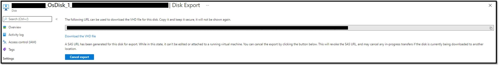
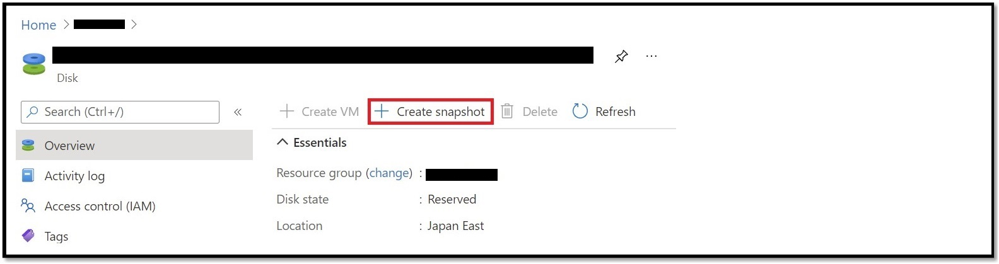
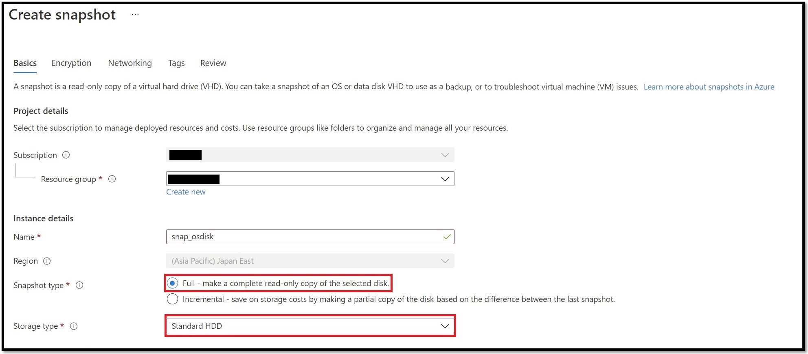
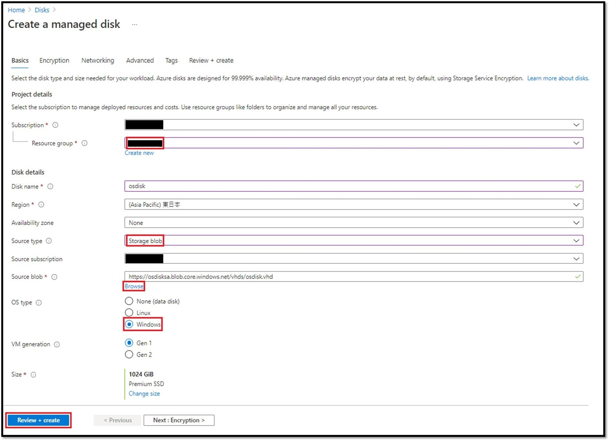
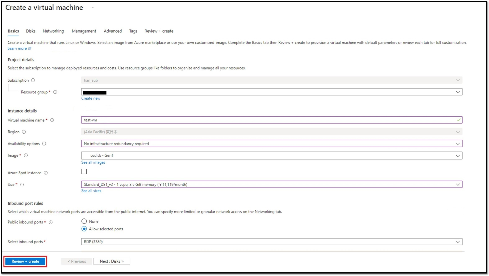

こんにちは。Azure テクニカル サポート チームの韓です。

Azure VM では、VM で利用している OS ディスクやデータ ディスクの VHD ファイルをエクスポートすることができます。
検証環境を作成するために別のサブスクリプション配下に複製 VM を作成したいときや既存の VM のリージョンを変更したいときには、エクスポートした VHD ファイルをストレージ アカウントにコピーし、新たに複製 VM を作成することで実現できます。

<!-- more -->

本記事では、**ディスクの VHD ファイルをエクスポートしてストレージ アカウントにコピーする手順**、および、**エクスポートされた VHD ファイルから複製 VM を新規に作成する手順**について紹介します。

なお、本記事の手順は ARM 環境にて管理ディスクを用いることを前提としています。
ASM 環境 \(クラシック VM\) や非管理ディスクをご利用の場合は対象としておりませんのでご注意ください。

---

## ■ ディスクの VHD ファイルをエクスポートしてストレージ アカウントにコピーする手順

### \[1\] コピー先のストレージ アカウントおよびコンテナ―を作成する

1. Azure Portal より \[Storage Account\] を開き、\[\+ Create\] をクリックします。
  必須項目を適宜設定し、\[Review ＋ create\] – \[Create\] をクリックしてストレージ アカウントを作成します。
  - "Region" は、複製 VM を作成したいリージョンをご選択ください。
  - ストレージ アカウントのパフォーマンスは Standard (general-purpose v2 account) または Premium を選択する場合は、"Premium account type" は \[Page blobs\] を選択します。

2. Storage Account 作成後、\[Storage Account\] - \[<当該ストレージ アカウント名>\] を選択し、左メニュー "Blob service" から \[Containers\] を選択します。

3. \[\+ Containers\] をクリックし \[vhds\] という名前でコンテナーを作成します。

### \[2\] コピー先の SAS を発行する

1. 手順 \[1\] - 3 で作成したコンテナ― \[vhds\] を選択し、左メニュー "Settings" から、\[Shared Access Signature\] を選択します。

2. \[Shared Access Signature\]の設定画面で、Permissionsに \[Read\] と \[Write\] を選択します。

3. Expiryに当該SASの有効期限を適宜に指定し、\[Generate SAS token and URL\] をクリックします。

4. \[Blob SAS token\] をテキスト エディタ等にコピーします。

5. コピーした \[Blob SAS token\] を以下の通り編集します。
   ※ VHD ファイル名は適宜設定してください。
   **※ ここで作成した URL は 後の手順 \[4\] - 3 にて、コピー先の URL として使います。**

編集前: 
**https://<ストレージ アカウント名>.blob.core.windows.net/vhds?<'SAS token'>**

例:
> https://xxxxxxxx.blob.core.windows.net/vhds?sp=rw&st=2021-xx-xxTxx:xx:xxZ&se=2021-xx-xxTxx:xx:xxZ&spr=https&sv=2020-02-10&sr=c&sig=xxxxxxxxxx

編集後: 
**https://<ストレージ アカウント名>.blob.core.windows.net/vhds/<コピー後の VHD ファイル名>?<'SAS token'>**

例:
> https://xxxxxxxx.blob.core.windows.net/vhds/osdisk.vhd?sp=rw&st=2021-xx-xxTxx:xx:xxZ&se=2021-xx-xxTxx:xx:xxZ&spr=https&sv=2020-02-10&sr=c&sig=xxxxxxxxxx

### \[3\] VHD ファイルをエクスポートする

ディスクの VHD ファイルをエクスポートするには、後述の 2 つの方法 \(A および B\) があります。

方法 A は対象の OS ディスクにて直接エクスポートを行う方法であり、エクスポートのキャンセルを実施するまで、当該 OS ディスクが関連付けられている VM を起動することはできません。
ダウンタイムを最小にする必要がある場合には、ディスクのスナップショットを取得し、そのスナップショットをエクスポートする方法 B をお勧めします。

なお、下記の手順は OS ディスクのエクスポートについて記載しておりますが、データ ディスクをエクスポートいただく場合も同様となります。

#### A: ディスクから直接 VHD ファイルをエクスポートする場合

1. 複製元の VM を停止 (割り当て解除) します。
  \[Virtual Machines\] - \[<当該 VM 名 \(コピー元\)>\] を選択し、\[stop\] をクリックします。
  Statusが "Stopped \(deallocated\)" になったことを確認します。

2. 左メニュー "Settings" より \[Disks\] を選択し、開いた画面 "OS disk" より、\[<当該 OS ディスク名>\] をクリックします。

3. 左メニュー "Settings" から "Disk Export" をクリックします。

4. "URL expires in \(seconds\)" を適宜多めに設定し、\[Generate URL\] をクリックします。
  既定では 3600 秒 \(1 時間\) ですが、ネットワーク環境によりダウンロードに時間がかかることも予想されますので、適宜 86400 秒などにご調整ください。

> [!TIP]
> Enable data access authentication mode（データ アクセス認証モードを有効にする）にチェックを入れると、権限を割り当てられたユーザーのみが VHD ダウンロードできることとなります。特にそのような要件が不要であれば、チェックを入れる必要はございません。

5. 表示された URL をテキスト エディタ等にコピーしておきます。
  **※ ここで作成した SAS URL は 後の手順 \[4\] - 3 にて、コピー元の URL として使います。**
  ※ コピー作業が完了したら、上記 \[Cancel export\] ボタンで、SAS 発行を解除してください。
  ※ SAS 発行を解除しないと当該 VM は起動できません。

#### B: ディスクのスナップショットを取得し、そのスナップショットから VHD ファイルをエクスポートする場合

VM の長期にわたる停止が難しい場合には、取得いただいたディスクのスナップショットから VHD ファイルをエクスポートすることが可能です。

はじめに、ディスクのスナップショットを取得します。

1. 複製元の VM を停止 (割り当て解除) します。
2. 左メニュー "Settings" より \[Disks\] を選択し、開いた画面 "OS disk" より、\[<当該 OS ディスク名>\] をクリックします。

3. 開いた画面にて \[Create snapshot\] をクリックします。

4. 必要項目を適宜入力し、\[Review ＋ create\] – \[Create\] をクリックします。
  "Snapshot type" は \[Full\]、"Storage type" は、スナップショットを高パフォーマンスのディスクに保存する必要がある場合を除き、\[Standard_HDD\] を選択します。

スナップショットの取得が完了したら、停止 \(割り当て解除\) いただいていた元 VM を起動いただいて問題ございません。
次に、VHD ファイルをエクスポートするための SAS を発行します。

5. Azure Portal にて、\[Snapshot\] - \[<当該スナップショット>\] を選択します。
6. 左メニュー "Settings" から "Snapshot export" をクリックします。
7. "URL expires in \(seconds\)" を適宜多めに設定し、\[Generate URL\] をクリックします。
  既定では 3600 秒 \(1 時間\) ですが、ネットワーク環境によりダウンロードに時間がかかることも予想されますので、適宜 86400 秒などにご調整ください。

> [!TIP]
> Enable data access authentication mode（データ アクセス認証モードを有効にする）にチェックを入れると、権限を割り当てられたユーザーのみが VHD ダウンロードできることとなります。特にそのような要件が不要であれば、チェックを入れる必要はございません。

8. 表示された URL をテキスト エディタ等にコピーしておきます。
      **※ ここで作成した SAS URL は 後の手順 \[4\] - 3 にて、コピー元の URL として使います。**

### \[4\] VHD ファイルをストレージアカウントにコピーする

1. ローカル環境に AzCopy コマンドをダウンロードします。
  \(Azure Portal にて、CloudShell をご利用いただいても問題ございません。\)

  ご参考：AzCopy を使ってみる
  [https://docs.microsoft.com/ja-jp/azure/storage/common/storage-use-azcopy-v10](https://docs.microsoft.com/ja-jp/azure/storage/common/storage-use-azcopy-v10)

2. 管理者権限でコマンド プロンプトを起動し、AzCopy のフォルダに移動します。

3. 以下のようにコマンドを実行し、VHD のコピーを行います。
   **azcopy copy "<手順 \[3\] でコピーしたURL \(コピー元\)>" "手順 \[2\] の編集後の URL (コピー先)>" \-\-blob\-type PageBlob**

実行例：
> azcopy copy "https://xxxxxxxx.xxx.blob.storage.azure.net/xxxxxxxxxxxx/abcd?sv=2018-03-28&sr=b&si=略&sig=略" "https://xxxxxxxx.blob.core.windows.net/vhds/osdisk.vhd?sp=rw&st=2021-xx-xxTxx:xx:xxZ&se=2021-xx-xxTxx:xx:xxZ&spr=https&sv=2020-02-10&sr=c&sig=略" \-\-blob\-type PageBlob

  これにより、コピー先のリージョンのストレージアカウントにコピー元 VM の VHD ファイルをコピーすることができます。
  コピーが 100 % まで進行した後、少しおいて Job Summary が表示されます。
  Final Job Status: Completed と表示されていれば完了となります。

実行結果例 (途中省略)：

4. VHDファイルのコピーが完了しますと、手順 \[1\] で作成したストレージ アカウントのコンテナー \[vhds\] にて、コピーされた VHD ファイルが確認できます。

---

## ■ エクスポートされた VHD ファイルから複製 VM を新規に作成する手順

### \[5\] VHD ファイルから管理ディスクを作成する

1. Azure Portal より \[Disk\] を開き、\[\+ Create\] をクリックします。

2. 以下のとおり、適宜設定を行い、\[Review \+ create\] \- \[Create\] をクリックします。
   - 手順 \[1\] のストレージ アカウントと同様の "Resource group" を選択します。
   - "Source type" は \[Storage blob\] を選択します。
   - "Source blob" は、\[Browse\] をクリックして、手順 \[1\] のストレージ アカウントのコンテナー \[vhds\] にコピーした VHD ファイルを選択します。
   - "OS の種類" は OS ディスクの場合にのみ、複製元 VM と同様のものを選択します。
     - Windows の場合には \[Windows\] を、Linuxの場合、\[Linux\] を選択します。
     - データ ディスクの場合は \[None\] を選択します。
   - "VM generation" は OS ディスクの場合にのみ、複製元 VM と同様のものを選択します。**起動不可を回避するために元と同じ世代をご選択ください。**

### \[6\] VHD ファイルから作成したディスクで VM を作成する。

1. Azure Portal より \[Disk\] を開き、手順 \[5\] で作成したDiskをクリックします。
   ディスクのページ上部の \[\+ Create VM\] をクリックし、コピーした VHD ファイルから作成した OS ディスクを使用した VM を作成します。

2. 適宜設定を行い、\[Review \+ create\] \- \[Create\] をクリックします。

手順は以上です。

なお、VHD ファイルをコピーするために作成したストレージ アカウントや VHD をエクスポートするために取得したスナップショットは、必要に応じて削除いただいて問題ございません。

---

## ■ ご参考
- Azure から Windows VHD をダウンロードする
  [https://docs.microsoft.com/ja-jp/azure/virtual-machines/windows/download-vhd](https://docs.microsoft.com/ja-jp/azure/virtual-machines/windows/download-vhd)
- Azure から Linux VHD をダウンロードする
  [https://docs.microsoft.com/ja-jp/azure/virtual-machines/linux/download-vhd](https://docs.microsoft.com/ja-jp/azure/virtual-machines/linux/download-vhd)
- ポータルまたは PowerShell を使用してスナップショットを作成する
  [https://docs.microsoft.com/ja-jp/azure/virtual-machines/windows/snapshot-copy-managed-disk](https://docs.microsoft.com/ja-jp/azure/virtual-machines/windows/snapshot-copy-managed-disk)
- AzCopy を使ってみる
  [https://docs.microsoft.com/ja-jp/azure/storage/common/storage-use-azcopy-v10](https://docs.microsoft.com/ja-jp/azure/storage/common/storage-use-azcopy-v10)
- AzCopy v10 を使用して Azure ストレージ アカウント間で BLOB をコピーする
  [https://docs.microsoft.com/ja-jp/azure/storage/common/storage-use-azcopy-blobs-copy](https://docs.microsoft.com/ja-jp/azure/storage/common/storage-use-azcopy-blobs-copy)
- クイック スタート:Azure Portal で Windows 仮想マシンを作成する
  [https://docs.microsoft.com/ja-jp/azure/virtual-machines/windows/quick-create-portal](https://docs.microsoft.com/ja-jp/azure/virtual-machines/windows/quick-create-portal)
- クイック スタート:Azure portal で Linux 仮想マシンを作成する
  [https://docs.microsoft.com/ja-jp/azure/virtual-machines/linux/quick-create-portal](https://docs.microsoft.com/ja-jp/azure/virtual-machines/linux/quick-create-portal)
