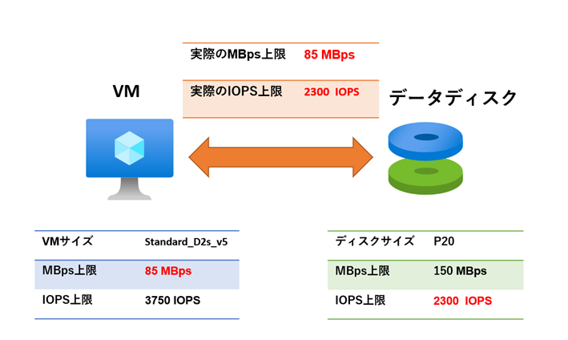
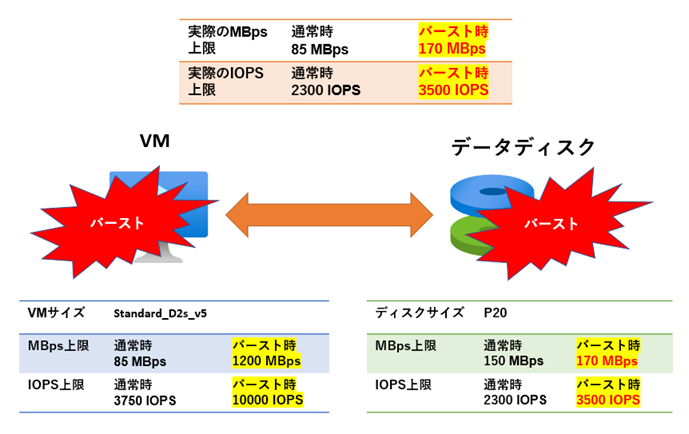
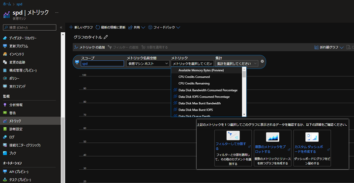
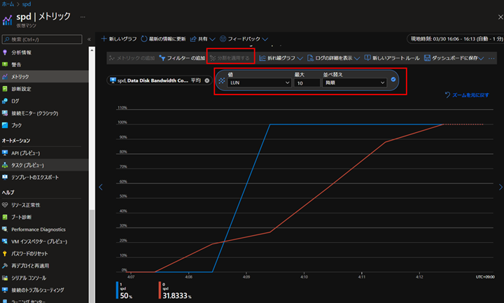
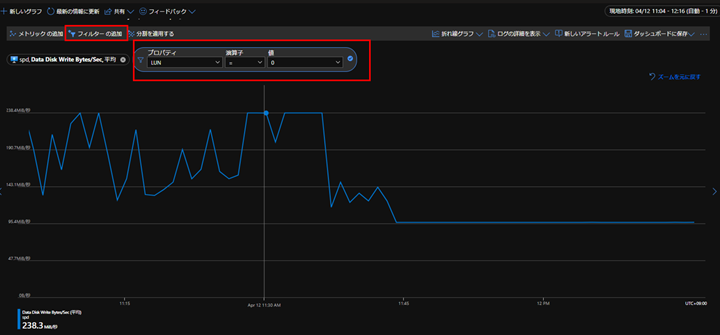

こんにちは、Azure テクニカル サポート チームの富田です。  
期待したディスクパフォーマンスが得られないといったお問い合わせをいただくことがあります。
そのため、今回この記事以下の内容について解説をさせていただきます。  
 
1. Azure 側にて VM サイズとディスクサイズ毎に設定されている上限について解説
2. ディスクに関するメトリックでパフォーマンスを確認する方法
3. VM サイズとディスクサイズを変更する方法
 
> [!NOTE]
> 本記事では各種の上限について数値を交えて解説しておりますが、こちらは理論値となっており実際の計測では OS レイヤ以上の影響等もございますので、必ずしも記載の理論値が計測可能であることを保証するものではございません点について予めご了承くださいませ。
 
---
## 1-1.VM サイズとディスクサイズ毎に設定されている上限について解説
 
まずは、Azure VM におけるディスクのパフォーマンスの上限値について解説させていただきます。
 
> [!TIP]
> ディスク性能の上限はオンプレミス上の物理ディスクでも勿論あるものであり、OS から高負荷な I/O 要求が発生し、ディスク性能の上限に達した場合、 I/O に遅延等が発生することはご理解いただけるかと存じます。
> Azure のディスク性能も同じような考え方となります。上限に達した場合は、オンプレミス環境と同様に I/O の遅延等が発生しますが、これは Azure 特有のものでは無く、オンプレミス環境と同じように発生するものであると考えていただけますと幸いです。

オンプレミス環境のサーバーや私たちが普段使用しているパソコンと同様に、Azure VM でもディスクアクセスが行われます。  
Azure ではこの VM とディスク間のディスクアクセスについて、「VMサイズ」と「ディスクサイズ」のそれぞれ両方で「MBps」と「IOPS」の上限値を設定しています。  
  
なお、この上限は Read / Write の合計で適用されます。  
つまり Read が 100 MBps、Write が 50 MBps 同時に発生していたら、150 MBps のディスクアクセスとして合算されます。  
  
重要な点として、ディスクアクセスの上限は「VMサイズ」と「ディスクサイズ」に設定されている低い方の上限値が適用されます。  
ホストキャッシュやバーストは無効と考えて、VM とデータディスク間の通信について以下に例を記載します。  
 

 
上記の例では Standard_D2s_v5 の VM サイズに P20 のデータディスクのサイズを組み合わせています。

- Standard_D2s_v5 の VM サイズでの上限：85 MBps / 3750 IOSP
- P20 のディスクサイズでの上限：150 MBps / 2300 IOPS

という設定がございます。
先に解説した通り低い値の方（赤字）が適用されますので、実際に想定される速度の上限値としては「85 MBps / 2300 IOPS」となります。
 
なお、この「Standard_D2s_v5 の VM サイズでの上限：85 MBps / 3750 IOSP」という VM の上限値については、ディスク 1 つごとでは無く、ホストキャッシュ無効な全てのデータディスク全体で共有されます。  
すなわち、複数のホストキャッシュ無効なデータディスク合算で 85 MBps / 3750 IOSP が上限となります。 
 
ホストキャッシュの有効なディスク・無効なディスクで上限値が別に設定されている VM サイズもございます。  
各 VM サイズおよびディスクサイズにおけるディスクアクセスの上限値は、公式ドキュメントをご確認くださいませ。  

> ■ご参考：Azure の仮想マシンのサイズ  
> [https://learn.microsoft.com/ja-jp/azure/virtual-machines/sizes](https://learn.microsoft.com/ja-jp/azure/virtual-machines/sizes)

> ■ご参考：Azure マネージド ディスクの種類  
> [https://learn.microsoft.com/ja-jp/azure/virtual-machines/disks-types](https://learn.microsoft.com/ja-jp/azure/virtual-machines/disks-types)
 
---
## 1-2.一時的に通信の上限を上げる「ディスクバースト」という機能がございます
 
先に記載した通り、「VMサイズ」と「ディスクサイズ」それぞれにディスクアクセスの上限が設定されています。  
しかしながら、特定の「VMサイズ」と「ディスクサイズ」には、このディスクアクセスの上限を一時的に上げられる「ディスクバースト」という機能がございます。
 
- VM サイズに設定されているディスクアクセスの上限値が一時的に上がること = VM レベルのバースト
- ディスクサイズに設定されているディスクアクセスの上限値が一時的に上がること = ディスクレベルのバースト
 
ディスクバーストの詳細については公式ドキュメントをご参照くださいませ。
 
> ■ご参考：マネージド ディスクのバースト  
> [https://learn.microsoft.com/ja-jp/azure/virtual-machines/disk-bursting](https://learn.microsoft.com/ja-jp/azure/virtual-machines/disk-bursting)

なお、クレジットベースのバーストの場合、VM レベルのバーストとディスクレベルのバーストは独立しており、
以下のように 6 種類のクレジットが独立している点、ご留意くださいませ。
 
- VM レベルに関する MBps のバーストクレジット（キャッシュ無し）
- VM レベルに関する IOPS のバーストクレジット（キャッシュ無し）
- VM レベルに関する MBps のバーストクレジット（キャッシュあり）
- VM レベルに関する IOPS のバーストクレジット（キャッシュあり）
- ディスクレベルに関する MBps のバーストクレジット
- ディスクレベルに関する IOPS のバーストクレジット
 
では、ホストキャッシュは無しとして、バーストが発生した際の例を見てみましょう。
 

 
上記は、Standard_D2s_v5 の VM サイズに P20 のデータディスクのサイズを組み合わせて、VM レベルのバースト・ディスクレベルのバースト両方が働いた場合の例です。  
一時的に「170 MBps / 3500 IPOS」までバースト可能なことが分かりましたね。
 
 
---
## 2-1.ディスクに関するメトリックでパフォーマンスを確認する方法
 
Azure では、ディスクアクセスに関してどの程度のパフォーマンスが出ているかといったことを記録しており、メトリックとして確認を行うことが可能です。  
パフォーマンスが上限で頭打ちしている場合は、スペックアップが必要である可能性があるといったことを確認することができます。

パフォーマンスが上限で頭打ちしていないにも関わらず、期待したパフォーマンスを得られていない場合は、
OS やアプリケーションが適切なディスクアクセスを発生させていない可能性がございます。
ディスクパフォーマンスの詳細については以下の記事もご参照くださいませ。  

> ■ご参考：Azure Premium Storage: 高パフォーマンス用に設計する  
> [https://learn.microsoft.com/ja-jp/azure/virtual-machines/premium-storage-performance](https://learn.microsoft.com/ja-jp/azure/virtual-machines/premium-storage-performance)

Azure ではこの調査に役立つ多くのディスクに関するメトリックがございますので、一覧形式でご紹介させていただきます。

> [!NOTE]
> これらの記録された値については Azure 基盤上で観測された値となりますため、OS 上で観測した値と差異がある可能性がございます点、予めご了承ください。  
> また、メトリック表示の最小の粒度は 1 分でございますため、瞬間的な状況等は確認が叶いません点、ご留意ください。
 
### OS ディスクの Read / Write に関して何 MBps / IOPS が記録されたか確認する

|確認できる内容|メトリック名|
|:-|:-|
|OS ディスクの Read が何 MBps 記録されたか確認|OS Disk Read Bytes/Sec|
|OS ディスクの Write が何 MBps 記録されたか確認|OS Disk Write Bytes/Sec|
|OS ディスクの Read が何 IOPS 記録されたか確認|OS Disk Read Operations/Sec|
|OS ディスクの Write が何 IOPS 記録されたか確認|OS Disk Write Operations/Sec|

### データディスクの Read / Write に関して何 MBps / IOPS が記録されたか確認する

|確認できる内容|メトリック名|
|:-|:-|
|データディスクの Read が何 MBps 記録されたか確認|Data Disk Read Bytes/Sec
|データディスクの Write が何 MBps 記録されたか確認|Data Disk Write Bytes/Sec
|データディスクの Read が何 IOPS 記録されたか確認|Data Disk Read Operations/Sec
|データディスクの Write が何 IOPS 記録されたか確認|Data Disk Write Operations/Sec
 
### VM レベルのディスクバーストのクレジットの残りがどれくらいか確認する

|確認できる内容|メトリック名|
|:-|:-|
|VM レベルの MBps の残バーストクレジット量（キャッシュ有効であるディスク）|VM Cached Used Burst BPS Credits Percentage|
|VM レベルの IOPS の残バーストクレジット量（キャッシュ有効であるディスク）|VM Cached Used Burst IO Credits Percentage|
|VM レベルの MBps の残バーストクレジット量（キャッシュ**無効**なディスク）|VM Uncached Used Burst BPS Credits Percentage|
|VM レベルの IOPS の残バーストクレジット量（キャッシュ**無効**なディスク）|VM Uncached Used Burst IO Credits Percentage|
 
### ディスクレベルのディスクバーストのクレジットの残りがどれくらいか確認する

|確認できる内容|メトリック名|
|:-|:-|
|ディスクレベルの MBps の残バーストクレジット量（OS ディスク）|OS Disk Used Burst BPS Credits Percentage|
|ディスクレベルの IOPS の残バーストクレジット量（OS ディスク）|OS Disk Used Burst IO Credits Percentage|
|ディスクレベルの MBps の残バーストクレジット量（データディスク）|Data Disk Used Burst BPS Credits Percentage|
|ディスクレベルの IOPS の残バーストクレジット量（データディスク）|Data Disk Used Burst IO Credits Percentage|

### ディスクレベルのベースパフォーマンスに対して何 % のパフォーマンスが記録されたか確認する

|確認できる内容|メトリック名|
|:-|:-|
|ディスクレベルのベースパフォーマンスに対して計測された MBps のパーセント表示（OS ディスク）|OS Disk Bandwidth Consumed Percentage|
|ディスクレベルのベースパフォーマンスに対して計測された IOPS のパーセント表示（OS ディスク）|OS Disk IOPS Consumed Percentage|
|ディスクレベルのベースパフォーマンスに対して計測された MBps のパーセント表示（データディスク）|Data Disk Bandwidth Consumed Percentage|
|ディスクレベルのベースパフォーマンスに対して計測された IOPS のパーセント表示（データディスク）|Data Disk IOPS Consumed Percentage|

> [!NOTE]
> ※Premium ストレージをサポートする VM シリーズ上でのみ使用できます。  
> ※バースト時の上限ではなくベースパフォーマンスを 100 % として記録されます。バーストしている場合も 100 % で記録されます。
 
### VM レベルのベースパフォーマンスに対して何 % のパフォーマンスが記録されたか確認する

|確認できる内容|メトリック名|
|:-|:-|
|VMレベルのベースパフォーマンスに対して計測された MBps のパーセント表示（キャッシュ有効であるディスク）|VM Cached Bandwidth Consumed Percentage|
|VMレベルのベースパフォーマンスに対して計測された IOPS のパーセント表示（キャッシュ有効であるディスク）|VM Cached IOPS Consumed Percentage|
|VMレベルのベースパフォーマンスに対して計測された MBps のパーセント表示（キャッシュ**無効**なディスク）|VM Uncached Bandwidth Consumed Percentage|
|VMレベルのベースパフォーマンスに対して計測された IOPS のパーセント表示（キャッシュ**無効**なディスク）|VM Uncached IOPS Consumed Percentage|

> [!NOTE]
> ※Premium ストレージをサポートする VM シリーズ上でのみ使用できます。  
> ※バースト時の上限ではなくベースパフォーマンスを 100 % として記録されます。バーストしている場合も 100 % で記録されます。
 
### ディスクのキューの深さを確認する

|確認できる内容|メトリック名|
|:-|:-|
|OS ディスクのキューの深さを確認|OS Disk Queue Depth|
|データ ディスクのキューの深さを確認|Data Disk Queue Depth|

ディスク パフォーマンス メトリックについては公式ドキュメントもございますので、合わせてご参照くださいませ。

> ■ご参考：ディスク パフォーマンス メトリック  
> [https://learn.microsoft.com/ja-jp/azure/virtual-machines/disks-metrics](https://learn.microsoft.com/ja-jp/azure/virtual-machines/disks-metrics)
 
---
## 2-2.実際に Azure ポータルでメトリックを確認する（データディスク毎に確認する方法）
 
メトリックを見る際は以下のように、Azure ポータルで対象の VM の画面より「メトリック」のブレードを選択いただくことでメトリック表示画面になります。
 

 
メトリックの表示自体の詳細を確認したい場合は、以下の公開ドキュメントをご参照ください。

> ■ご参考: Azure Monitor メトリックの概要  
> [https://docs.microsoft.com/ja-jp/azure/azure-monitor/essentials/data-platform-metrics](https://docs.microsoft.com/ja-jp/azure/azure-monitor/essentials/data-platform-metrics)

> ■ご参考：Azure Monitor のサポートされるメトリック  
> [https://docs.microsoft.com/ja-jp/azure/azure-monitor/essentials/metrics-supported](https://docs.microsoft.com/ja-jp/azure/azure-monitor/essentials/metrics-supported)
 

データディスクのメトリックでは、既定の表示では全データディスクの値が合算されたりした状態で表示されてしまいます。  
各データディスク毎にメトリックを確認したい場合は、以下の手順に沿う必要がございます。  
まず、以下のように VM のディスクブレードからデータディスクの LUN 番号を確認しましょう。  
 

 
以下のようにメトリック画面でディメンションを LUN で分割すると、各データディスク毎のメトリックの表示が可能になります。  
下図では 2 つのデータディスクの情報がそれぞれ表示されていますね。
 

 
また、LUN でフィルターをすることで、特定のデータディスクのみ表示することも可能です。
 

 
 
---
## 3.VM サイズ / ディスクサイズを変更する
 
上記のメトリックなどを確認の上、更に高パフォーマンスなディスクアクセスが必要となった場合は、VM サイズ / ディスクサイズを変更することが可能です。  
オンプレミス環境の場合は新しいハードウェアの調達などが必要でしたが Azure では簡単に変更をすることが可能です。  
手順については以下のドキュメントをご確認いただけますと幸いです。  

> ■ご参考：仮想マシンのサイズの変更
> [https://learn.microsoft.com/ja-jp/azure/virtual-machines/resize-vm](https://learn.microsoft.com/ja-jp/azure/virtual-machines/resize-vm)

> ■ご参考：マネージド ディスクをある特定のディスクの種類から別のものに切り替える
> [https://learn.microsoft.com/ja-jp/azure/virtual-machines/windows/convert-disk-storage#switch-managed-disks-from-one-disk-type-to-another](https://learn.microsoft.com/ja-jp/azure/virtual-machines/windows/convert-disk-storage#switch-managed-disks-from-one-disk-type-to-another)
 
VM サイズ / ディスクサイズ変更には VM 停止が必要となります点、ご留意くださいませ。
 
---

以上の通り、ディスクのディスクメトリックの確認について解説をさせていただきました。  
お客様の調査等の一助となれば幸いでございます。