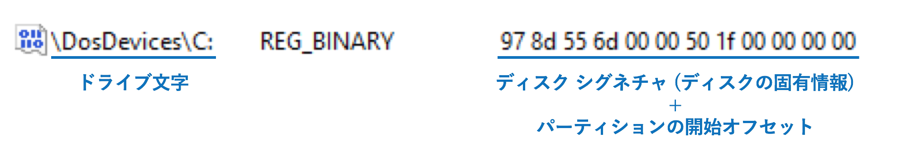
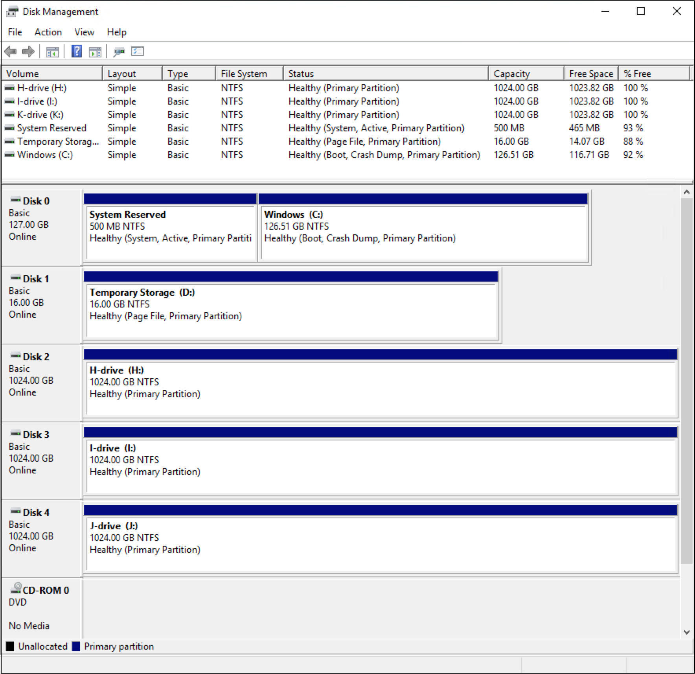
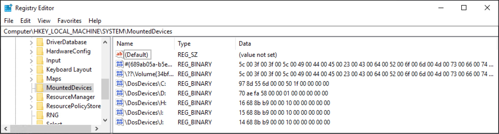
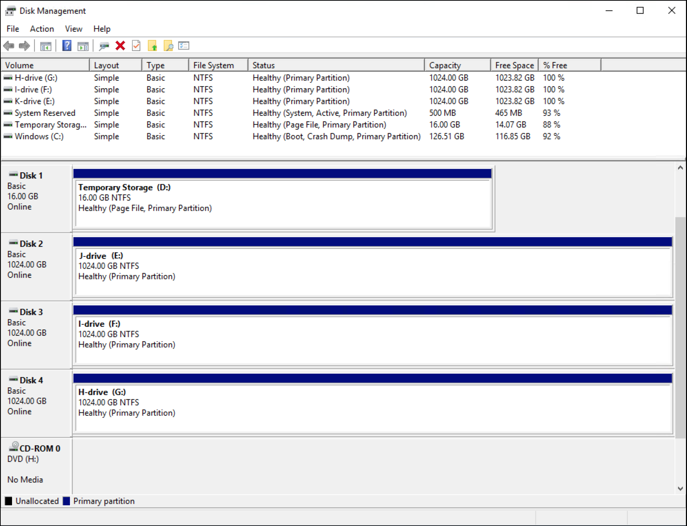
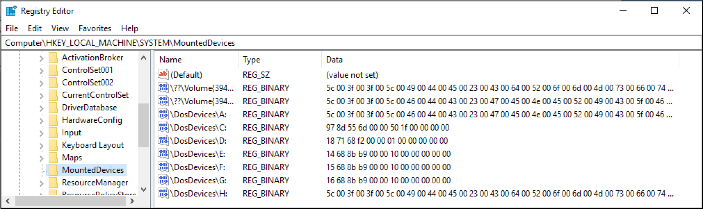
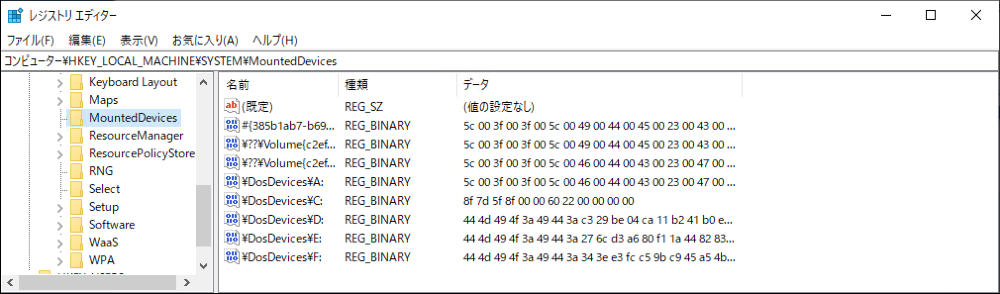
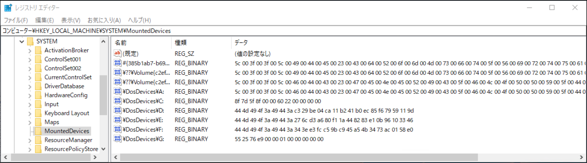

こんにちは。Azure テクニカル サポート チームの重田です。

オンプレミス環境の Hyper-V Guest を Azure 環境に移行した際や、Azure Windows VM を一般化 (sysprep) したイメージから複製 VM を作成したところ、割り当てられていたドライブ文字が以前の状態と変わったしまった、というお問い合わせをいただくことがありましたので、検証結果を交えてご説明させていただきます。

<!-- more -->

なお、移行手順に関しては下記ドキュメントに詳説されておりますので、こちらをご参照ください。

- [Azure にアップロードする Windows VHD または VHDX を準備する](https://docs.microsoft.com/ja-jp/azure/virtual-machines/windows/prepare-for-upload-vhd-image)
- [汎用化した VHD をアップロードして Azure で新しい VM を作成する](https://docs.microsoft.com/ja-jp/azure/virtual-machines/windows/upload-generalized-managed)

## <a href="#how-it-works">■ ドライブ文字を割り当ての仕組み</a>
※ ダイナミック ディスク構成による複数ディスクにまたがるボリュームにつきましては、レガシーな機能であり、Windows では非推奨となっておりますため、本稿ではベーシック ディスクについて説明しています。

はじめに、Windows によるドライブ文字の割り当ては、すべてレジストリキー **HKLM¥SYSTEM¥MountedDevices** に格納されます。
このレジストリ キーには、¥??¥Volume{GUID} という名前の値 (ボリューム名のエントリ) と、¥DosDevices¥C: のような名前の値があり、格納されるデータは、ディスク シグネチャとそのボリュームに関連する最初のパーティションの開始オフセットです。
どのディスクのどこから始まるパーティションのドライブ、という情報に対して、ドライブ文字が紐づけられているイメージになります。

ドライブ文字の割り当てはマウント マネージャー (mountmgr.sys) が行っています。
マウント マネージャーが新しいボリュームに関する通知を受け取ると、新しいボリュームの GUID やディスク シグネチャを特定し、その情報をもとに MountedDevices レジストリ キーの内容が反映されている内部データベースを調べて、ドライブ文字の割り当てが含まれているかどうかを確認します。
このデータベースに新しいボリュームのエントリがない場合、マウント マネージャーは最初の未割り当てドライブ文字を採用して新規割り当てを定義し、それをデータベースに格納します。利用できるドライブ文字がない場合、ドライブ文字の割り当ては行われません。

## <a href="#verify">■ いつドライブ文字が変わるのか</a>

### <a href="#verify1">□ 検証 1: Azure Windows VM を sysprep し、複製 VM を作成した場合</a>

**<検証概要>**

本検証は、ドライブ文字の情報が sysprep の影響を受けることを確認した検証となります。
上述の通り、ドライブ文字の情報は **HKLM¥SYSTEM¥MountedDevices** に格納されていますので、sysprep 前後のレジストリの値を確認します。

具体的な手順は下記の通りです。
1. [Azure Portal] Azure Windows VM にデータ ディスク 3 本をアタッチする
1. [ゲスト OS] VM に RDP 接続し、データ ディスクそれぞれに H、I、J ドライブを作成する
1. [ゲスト OS] 作成した VM に RDP 接続し、レジストリ値を確認する
1. [ゲスト OS] sysprep を実行して一般化を行う
1. [Azure Portal] 当該 VM の画面にて "キャプチャ" をクリックし、イメージ リソースを作成する
1. [Azure Portal] 作成したイメージ リソースから VM を作成する
1. [ゲスト OS] 作成した VM に RDP 接続し、レジストリ値を確認する

手順につきましては、下記ドキュメントに詳説されておりますので、こちらをご参照ください。
- [Azure で一般化された VM の管理対象イメージを作成する](https://docs.microsoft.com/ja-jp/azure/virtual-machines/windows/capture-image-resource)

**<検証結果>**
検証の結果、sysprep を実施すると今までのドライブ文字の情報は考慮されず、ディスクを読み込んだ順に新たにドライブ文字を割り当てることが確認できました。

レジストリに格納されている名前に対するデータ (ディスク シグネチャとパーティションの開始オフセット) より、sysprep 実施前後で同一のディスクがアタッチされていると OS には認識されておりますが、ドライブ文字との紐付け情報は残っていないことが確認できます。

**sysprep 実施前:**

**sysprep 実施後再作成した VM にて:**
ドライブ先頭に付けた文字と実際に割り当てられた文字が違うことが確認いただけます。

**<まとめ>**
そのため、Azure Windows VM のイメージから VM を作成する際には、必要に応じてドライブ文字の再設定をご実施ください。

### <a href="#verify2">□ 検証 2: オンプレミス環境の Hyper-V Guest から Azure 環境への移行した場合</a>

**<検証概要>**

本検証は、一般化を行なっていないオンプレミス環境の Hyper-V Guest　から Azure 環境への移行を実施した際に、ドライブ文字が変わるのかを確認します。

すべての Azure 仮想マシンでは、ページング ファイルやスワップ ファイルなどのデータのみを格納するための一時的なストレージ (一時ディスク) が割り当てされます。
Azure MarketPlace イメージをご利用の場合、一時ディスクは規定で D ドライブとなり、ページング ファイルはこの一時ディスクに設定されます。すでにデータ ディスクのドライブに D が使用されている場合には、一時ディスクのドライブ文字は D ドライブにはなりません。そのため、すでに D ドライブが設定されているオンプレミス環境を用意して確認を行います。

具体的な手順は下記の通りです。
1. [Hyper-V Guest] システム ドライブ以外にディスクを 3 本アタッチし、D、E、F ドライブを作成する
1. [Hyper-V Guest] Azure に vhd ファイルをアプロードするための準備を行う ([手順](https://docs.microsoft.com/ja-jp/azure/virtual-machines/windows/prepare-for-upload-vhd-image))
1. [Hyper-V Host] vhd ファイルを Azure ストレージ アカウントにアップロードする
1. [Azure Portal] vhd ファイルから管理ディスクを作成する
1. [Azure Portal] 作成した管理ディスクから VM を作成する
1. [ゲスト OS] 作成した VM に RDP 接続し、レジストリ値を確認する

**<検証結果>**
検証の結果、Azure 環境にオンプレミス環境の VHD ファイルをアップロードして作成した仮想マシンでは、D、E、F ドライブは変わらず、移行前後で同一のディスクがアタッチされていると OS には認識されております。
Azure の一時ディスクについては、C 以降で使用済みのアルファベットを除いてもっとも若いアルファベットである G が割り当てられていることを確認いたしました。

**移行前:**

**移行後:**

## <a href="#summary">■ まとめ</a>

上記検証と Windows の動作より、ボリュームに割り当てられたドライブ文字が変更されてしまうには、下記の 2 つのパターンが存在すると言えます。

>- sysprep を行い VM を一般化して、レジストリに該当ボリュームの情報がない場合
>- ディスクの情報が異なり、レジストリに該当ボリュームの情報がない場合

そのため、イメージから VM 作成後や VHD から移行後には改めてドライブ文字の設定をご検討ください。
また、意図せずドライブ文字が変更された場合には、ディスク自体の情報が変更されているか、レジストリに情報がないことが想定されますので、**どんな操作を行った時にドライブ文字が変更されたか**、**ディスクは同一ディスクとして認識されているか** をご確認ください。

本稿が皆様のお役に立てれば幸いです。

