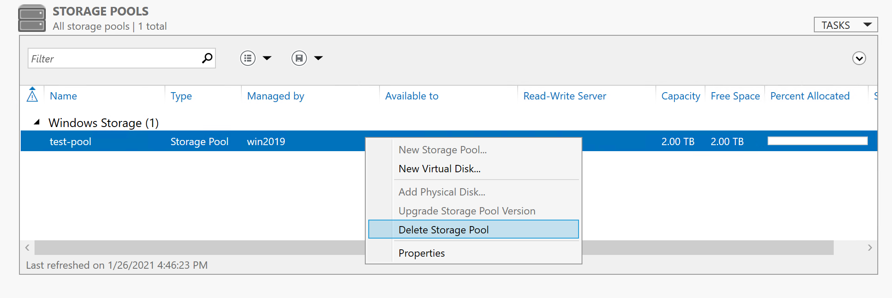

こんにちは。Azure テクニカル サポート チームの重田です。

Azure Windows VM において記憶域スペースをご構成いただいているお客様や、SQL VM (SQL Server on Windows Server) をご利用いただいているお客様より、ディスクの拡張方法に関してお問い合わせをいただくことが多いので、手順についてご紹介します。

<!-- more -->

**ご参考**
公開情報: [記憶域スペースの概要](https://docs.microsoft.com/ja-jp/windows-server/storage/storage-spaces/overview)

対象サーバー OS:
Windows Server 2019、Windows Server 2016、Windows Server 2012 R2、Windows Server 2012

## ■ 通常の Windows VM に関して

### □ 作業概要
記憶域スペースを拡張いただく場合には、下記の 2 方法があります。それぞれの方法について、シンプル レイアウトの記憶域スペースを用いた検証結果を踏まえてご紹介します。

1. 記憶域プールに新規のディスクを追加し、仮想ディスクおよびボリュームを拡張する。
1. 記憶域スペースを再作成する。
   仮想ディスク上のデータを別ディスクなどに退避いただき、仮想ディスクならびに記憶域プールを削除する。
   その後、記憶域プールを構成していたディスクを拡張し、再度記憶域プールならびに仮想ディスクを作成する。

**注意**
記憶域プールは複数のディスクを 1 つの記憶域としてまとめて、まとめられた記憶域から仮想ディスクの領域を切り出します。
記憶域プール自体に新たに領域を足すことは想定されておりますが、すでに仮想ディスクとして切り出された土台となる領域 (記憶域プールを構成しているディスク) を拡張することは想定されておりません。

例えば、1TB × 3 本のディスクで記憶域プールを構成している場合、この既に構成している 1 TB を 2 TB にすることで拡張することは想定しておりません。

なお、Azure ディスク リソースは縮小いただくことがご実施いただけません。
公開情報:  [Azure IaaS VM ディスクと Premium マネージド ディスクおよびアンマネージド ディスクについてよく寄せられる質問](https://docs.microsoft.com/ja-jp/azure/virtual-machines/linux/find-unattached-disks)

### □ 方法 1 : 記憶域プールに新規のディスクを追加し、仮想ディスクおよびボリュームを拡張する

方法 1 では、すでに構成されている記憶域プールにディスクを追加し、仮想ディスクおよびボリュームを拡張する方法をご紹介します。

**注意**
Windows Server 2012、2012R2 においては、記憶域プールにディスクを追加する場合、「列の数 (NumberOfColumns) × データのコピーの数 (NumberOfDataCopies)」の台数分のディスクを増設する必要があります。

記憶域プールには、仮想ディスクの 1 データ (ストライプ: ディスクに書き込む 1 トランザクションの単位) が、仮想ディスクを構成する物理ディスクのうち、何本の物理ディスクに分散して書き込まれるかを決定する、Numberofcolumns という値があります。
仮想ディスクを構成する物理ディスクを追加し、仮想ディスクを拡張する場合、データのコピーの数 (NumberOfDataCopies) を維持するため、NumberOfColumns の数の単位の利用可能なディスクが必要となります。

公開情報: [公開情報記憶域スペースの NumberOfColumns と仮想ディスクの拡張について](https://blogs.technet.microsoft.com/askcorejp/2017/06/22/numberofcolumns-of-storagespace/)

例:
はじめに 3 本の物理ディスクの存在する記憶域プール内に作成した仮想ディスクは、NumberOfColumns が 3 で作成されているため、ディスクの拡張のためにも 3 本単位での利用可能な物理ディスクが必要になります。

以下の PowerShell コマンドレットを実施することで仮想ディスクの現在の NumberOfColumns の値を確認することができます。

> Get-VirtualDisk –FriendlyName "<仮想ディスク名>" | FL NumberOfColumns

なお、Windows Server 2016 以降の記憶域スペースにおいては、記憶域プールに割り当てられた領域をリバランス (再配置) するためのコマンド Optimize-StoragePool が用意されています。

> Optimize-StoragePool -FriendlyName "<記憶域プール名>"

公開情報: [Optimize-StoragePool](https://docs.microsoft.com/en-us/powershell/module/storage/optimize-storagepool?view=win10-ps)

**1. 既存の VM に新規ディスクを追加します**
管理ディスクを護衛用の場合は下記の公開情報をご参照いただき、Azure Portal または Azure PowerShell より VM に新規ディスク リソースを追加します。

公開情報: [Azure portal を使用して Windows VM にマネージド データ ディスクを接続する - データ ディスクの追加](https://docs.microsoft.com/ja-jp/azure/virtual-machines/windows/attach-managed-disk-portal#add-a-data-disk)
公開情報: [PowerShell を使用して Windows VM にデータ ディスクを接続する](https://docs.microsoft.com/ja-jp/azure/virtual-machines/windows/attach-disk-ps)

非管理ディスクをご利用の場合は、下記をご参照ください。

Azure Portal の場合 : 
Azure Portal より、[Virtual Machines] - [<対象 VM 名>] を選択し、開いた画面の左メニュー [ディスク] を選択します。開いた画面にて [+ データ ディスクの追加] をクリックします。
"アンマネージド ディスクの接続" 画面にて適宜値を設定し、[OK] をクリックします。値設定時に、"ソースの種類" は [新規 (空のディスク)] を選択します。

Azure PowerShell の場合 : 
下記公開情報のコマンド例をご参照ください。
公開情報: [Add-AzVMDataDisk - Example 2: Add a data disk to an existing virtual machine](https://docs.microsoft.com/en-us/powershell/module/az.compute/add-azvmdatadisk?view=azps-5.4.0#example-2--add-a-data-disk-to-an-existing-virtual-machine)

**2. VM に RDP 接続を行います。**

**3. 記憶域プールにディスクを追加します**
[サーバー マネージャー] より、[ファイル サービスと記憶域サービス] - [ボリューム] - [記憶域プール] を開き、[<対象の記憶域プール>] を選択します。
"物理ディスク" の [タスク] - [物理ディスクの追加] をクリックします。

追加するディスク (追加した新規ディスク) を選択し、[OK] をクリックします。

**注意**
- Windows Server 2012R2 以前では、仮想ディスク作成時の物理ディスク数単位で物理ディスクを追加します。
- Windows Server 2016 以降では、ディスク追加後に Optimize-StoragePool コマンドを実行します。
  > Optimize-StoragePool -FriendlyName "<記憶域プール名>"

**4. 仮想ディスクを拡張します**
記憶域プールにディスクを追加後、"仮想ディスク" の [対象仮想ディスク] を右クリックし、[仮想ディスクの拡張] を選択します。

拡張するサイズを指定し、[OK] をクリックします。以下の例では、拡張可能な最大サイズを選択し、拡張を実施しています。

仮想ディスクの拡張が完了すると、以下の通り容量が増えます。

**5. 仮想ディスク上のボリュームを拡張します**
公開情報: [ベーシック ボリュームを拡張する](https://docs.microsoft.com/ja-jp/windows-server/storage/disk-management/extend-a-basic-volume)

[スタート] を右クリックし、[ディスクの管理] をクリックします。
開いた画面にて、仮想ディスク上の対象のボリュームを右クリックし、[ボリュームの拡張] をクリックします。
"ボリュームの拡張ウィザード" に沿って進み、拡張したいサイズを指定して [完了] をクリックします。 

ボリュームの拡張が完了すると、以下の通り容量が増えます。

### □ 方法 2 : 記憶域スペースを再作成する
 
**1. 仮想ディスクにあるデータを別領域に退避します**
拡張したいディスクにて構成している記憶域プール上の全仮想ディスクにあるデータを、仮想ディスク以外の領域 (退避用に新規ディスクを追加する、Azure Storage を利用するなど) にデータを退避 (コピーまたは移動) します。

**2. 仮想ディスクを削除します**
[サーバー マネージャー] より、[ファイル サービスと記憶域サービス] - [ボリューム] - [記憶域プール] を開きます。
[<対象の記憶域プール>] を選択し、"仮想ディスク" の [対象仮想ディスク] を右クリックし、[仮想ディスクのデタッチ] を選択します。

デタッチが完了すると、仮想ディスク名の横に "!" が表示されます。

再度 [対象仮想ディスク] を右クリックし、[仮想ディスクの削除] を選択します。

**3. 記憶域プールを削除します**
[対象記憶域プール] を右クリックし、[記憶域プールの削除] を選択します。

**4. 対象ディスクを拡張します**
Azure Portal または Azure PowerShell より、対象のディスク リソースを拡張します。

Azure Portal の場合 : 
ディスクのサイズ変更を行う際には、VM が停止済み (割り当て解除) の状態である必要があります。

1. Azure Portal にアクセスし、[<当該 VM 名>] - [ディスク] をクリックします。
2. "OS ディスク" または "データ ディスク" よりサイズを変更したいディスク名をクリックします。
3. 管理ディスクの場合は [構成] をクリックし、"サイズ" に任意の値を入力します。
   非管理ディスクの場合は、"サイズ" に任意の値を入力します。
4. 保存をクリックします。

Azure PowerShell の場合 :
公開情報: [データ ディスクのサイズを変更する](https://docs.microsoft.com/ja-jp/azure/virtual-machines/windows/expand-os-disk#resizing-data-disks) 

**5. VM を起動し、RDP 接続を行います**

**6. 記憶域プールを作成します**
公開情報をご参照の上、記憶域プールを作成します。
公開情報: [スタンドアロン サーバーに記憶域スペースを展開する - 手順 1: 記憶域プールを作成する](https://docs.microsoft.com/ja-jp/windows-server/storage/storage-spaces/deploy-standalone-storage-spaces#step-1-create-a-storage-pool)

**7. 仮想ディスクを作成します**
公開情報をご参照の上、仮想ディスクを作成します。
公開情報: [スタンドアロン サーバーに記憶域スペースを展開する - 手順 2: 仮想ディスクを作成する](https://docs.microsoft.com/ja-jp/windows-server/storage/storage-spaces/deploy-standalone-storage-spaces#step-2-create-a-virtual-disk)

**8. ボリュームを作成します**
公開情報をご参照の上、ボリュームを作成します。
公開情報: [スタンドアロン サーバーに記憶域スペースを展開する - 手順 3: ボリュームを作成する](https://docs.microsoft.com/ja-jp/windows-server/storage/storage-spaces/deploy-standalone-storage-spaces#step-3-create-a-volume)

## ■ (余談) SQL VM に関して
SQL ギャラリー イメージ にて VM を作成いただき構成された記憶域プールについては、Azure ポータルにて一部のストレージ設定を変更することが可能です。詳細は下記の公開情報をご参照ください。

公開情報: [SQL Server VM のストレージの構成](https://docs.microsoft.com/ja-jp/azure/azure-sql/virtual-machines/windows/storage-configuration)

 
本稿は以上となりますが、いかがでしたでしょうか。
本稿が皆様のお役に立てれば幸いです。

