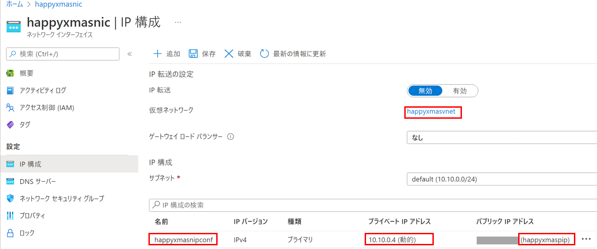
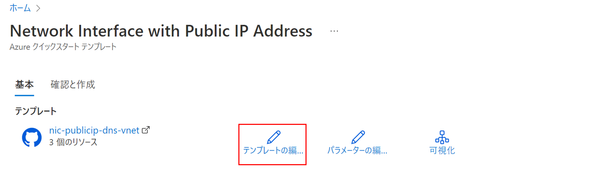
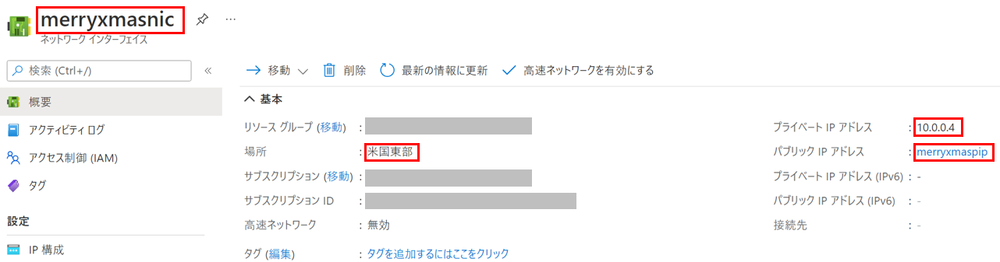
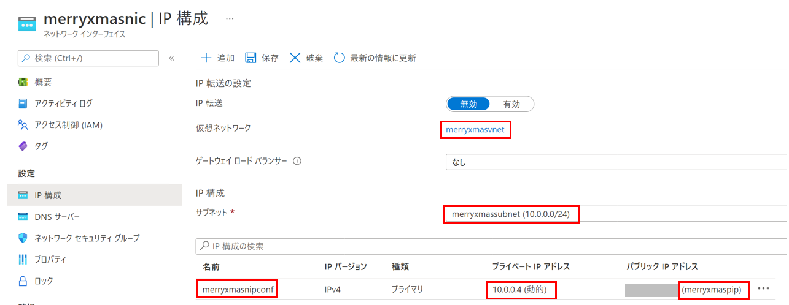
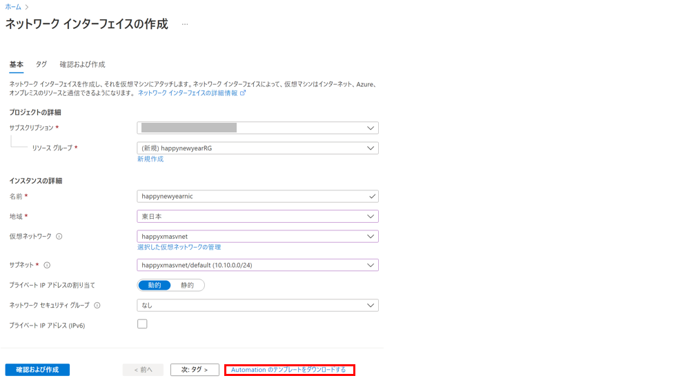
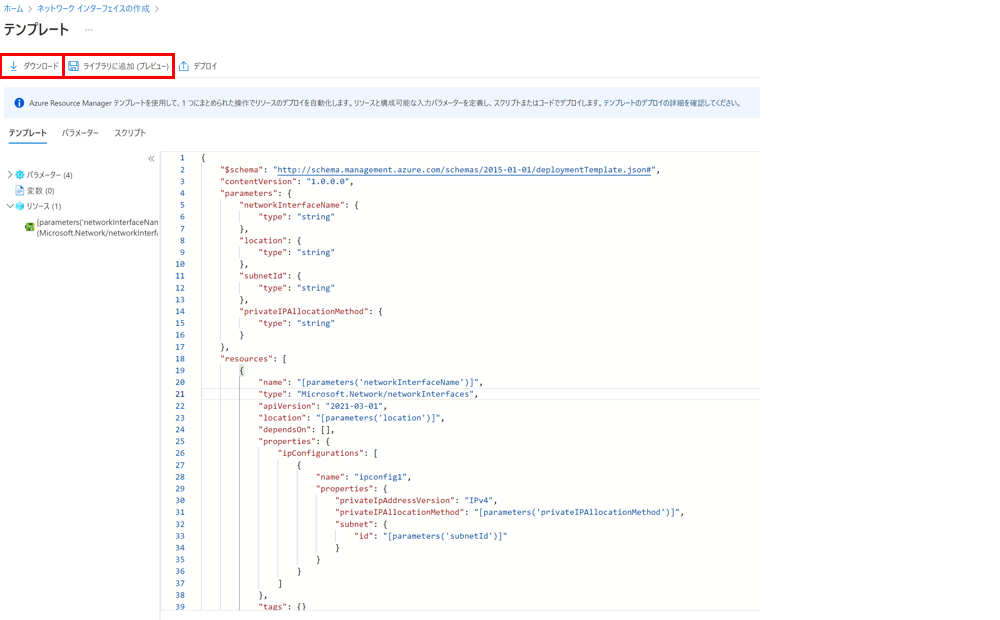
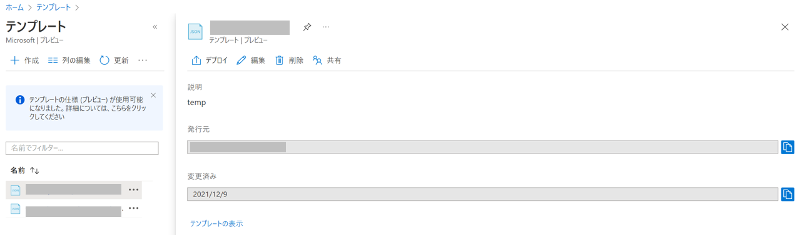

こんにちは。Azure テクニカル サポート チームの イ ソヨンです。

Azure portal、Azure PowerShell 及び Azure CLI などで NIC を作成いただく場合、デフォルトで IP 構成 [ipconfig1] が自動的に作成されます。デフォルトの IP 構成の名前、IP アドレスを任意の値でご指定いただきたい場合には、ARM テンプレートを利用して NIC を作成いただくことが可能です。

そこで本記事では、ARM テンプレートでデフォルトの IP 構成の名前、IP アドレスを指定の上、NIC をデプロイする手順についてご紹介します。<!-- more -->
ARM テンプレートでリソースを作成する際のご参考としてもお役立ていただけるかと存じますので、ぜひご活用いただけますと幸いです。

---

## すでに仮想ネットワーク及びパブリックIPアドレスをご作成いただいた場合

本手順は、すでに仮想ネットワーク及びパブリック IP アドレスをご作成いただいた場合を想定しております。

1. 下記テンプレートの【】に各変数を入力し、NIC 作成の ARM テンプレートを作成します。

   ```json:NIC作成のARMテンプレート
   {
        "$schema": "https://schema.management.azure.com/schemas/2019-04-01/deploymentTemplate.json#",
        "contentVersion": "1.0.0.0",
        "parameters": {
            "networkInterfaces_【NIC名】_name": {
                "defaultValue": "【NIC名】",
                "type": "String"
            },
            "publicIPAddresses_【public ip address名】_externalid": {
                "defaultValue": "【public ip addressパス】",
                "type": "String"
            },
            "virtualNetworks_【vnet名】_externalid": {
                "defaultValue": "【vnetパス】",
                "type": "String"
            }
        },
        "variables": {},
        "resources": [
            {
                "type": "Microsoft.Network/networkInterfaces",
                "apiVersion": "2020-11-01",
                "name": "[parameters('【NIC名】')]",
                "location": "【リージョン名】",
                "properties": {
                    "ipConfigurations": [
                        {
                            "name": "【IP構成名】",
                            "properties": {
                                "privateIPAddress": "【public ip address名】",
                                "privateIPAllocationMethod": "【プライベート IP アドレスの割り当て[DYNAMIC] (動的) または [STATIC](静的)】",
                                "publicIPAddress": {
                                    "id": "[parameters('publicIPAddresses_【public ip address名】_externalid')]"
                                },
                                "subnet": {
                                    "id": "[concat(parameters('virtualNetworks_【vnet名】_externalid'), '/subnets/default')]"
                                },
                                "primary": true,
                                "privateIPAddressVersion": "IPv4"
                            }
                        }
                    ],
                    "dnsSettings": {
                        "dnsServers": []
                    },
                    "enableAcceleratedNetworking": true,
                    "enableIPForwarding": false
                }
            }
        ]
    }
   ```

以下は、仮想ネットワーク [happyxmasvnet] の上に、パブリック IP アドレス [happyxmaspip] を持つネットワークインターフェース [happyxmasnic] を、[japaneast] (東日本) リージョンにご作成いただく場合の ARM テンプレートの作成例になります。
以下のテンプレートでは、IP 構成 [happyxmasnipconf] を作成しております。

   ```json:NIC作成のARMテンプレートの作成例
   {
        "$schema": "https://schema.management.azure.com/schemas/2019-04-01/deploymentTemplate.json#",
        "contentVersion": "1.0.0.0",
        "parameters": {
            "networkInterfaces_happyxmasnic_name": {
                "defaultValue": "happyxmasnic",
                "type": "String"
            },
            "publicIPAddresses_happyxmaspip_externalid": {
                "defaultValue": "/subscriptions/*****-*****-*****-*****-**********/resourceGroups/********/providers/Microsoft.Network/publicIPAddresses/happyxmaspip",
                "type": "String"
            },
            "virtualNetworks_happyxmasvnet_externalid": {
                "defaultValue": "/subscriptions/*****-*****-*****-*****-**********/resourceGroups/********/providers/Microsoft.Network/virtualNetworks/happyxmasvnet",
                "type": "String"
            }
        },
        "variables": {},
        "resources": [
            {
                "type": "Microsoft.Network/networkInterfaces",
                "apiVersion": "2020-11-01",
                "name": "[parameters('networkInterfaces_happyxmasnic_name')]",
                "location": "japaneast",
                "properties": {
                    "ipConfigurations": [
                        {
                            "name": "happyxmasnipconf",
                            "properties": {
                                "privateIPAddress": "***.***.***.***",
                                "privateIPAllocationMethod": "Static",
                                "publicIPAddress": {
                                    "id": "[parameters('publicIPAddresses_happyxmaspip_externalid')]"
                                },
                                "subnet": {
                                    "id": "[concat(parameters('virtualNetworks_happyxmasvnet_externalid'), '/subnets/default')]"
                                },
                                "primary": true,
                                "privateIPAddressVersion": "IPv4"
                            }
                        }
                    ],
                    "dnsSettings": {
                        "dnsServers": []
                    },
                    "enableAcceleratedNetworking": true,
                    "enableIPForwarding": false
                }
            }
        ]
    }
   ```

2. Azure Portal から、「カスタムテンプレート」を開き、「エディターで独自のテンプレートを作成する」を押下します。

   

3. 手順 1 で作成した json ファイルを貼り付けて保存します。

4. 各パラメータの情報が正しく表示されることを確認し、「確認と作成」を押下します。

5. 問題なく NIC が作成されたことを確認します。

6. [IP 構成] のブレードを開き、ご指定の IP 構成が作成されたことを確認します。

   
  
---

## NIC と合わせて仮想ネットワーク及びパブリック IP アドレスを合わせて新規作成いただく場合

NIC と合わせて仮想ネットワーク及びパブリック IP アドレスを新規作成する場合は、quickstart の ARM テンプレートをご活用いただけます。

> (参照) Network Interface with Public IP Address
> [https://azure.microsoft.com/ja-jp/resources/templates/nic-publicip-dns-vnet/](https://azure.microsoft.com/ja-jp/resources/templates/nic-publicip-dns-vnet/)

1. 上記公開テンプレートから「Azure へのデプロイ」を押下いただき、「テンプレートの編集」から ARM テンプレートを編集の上、保存します。

   

   下記テンプレートの【】に各変数を入力し、NIC作成のARMテンプレートを作成します。

   ```json:NIC作成のARMテンプレート
   {
        "$schema": "https://schema.management.azure.com/schemas/2019-04-01/deploymentTemplate.json#",
        "contentVersion": "1.0.0.0",
        "parameters": {
            "dnsLabelPrefix": {
                "type": "string",
                "defaultValue": "【パブリックIPのDNS名ラベル】",
                "metadata": {
                    "description": "DNS Label for the Public IP. Must be lowercase. It should match with the following regular expression: ^[a-z][a-z0-9-]{1,61}[a-z0-9]$ or it will raise an error."
                }
            },
            "vnetAddressPrefix": {
                "type": "string",
                "defaultValue": "【ご希望のvnetのIPアドレス】",
                "metadata": {
                    "description": "Address Prefix"
                }
            },
            "subnetPrefix": {
                "type": "string",
                "defaultValue": "【ご希望のサブネットのIPアドレス】",
                "metadata": {
                    "description": "Subnet prefix"
                }
            },
            "publicIPAddressType": {
                "type": "string",
                "defaultValue": "【パブリック IP アドレスの割り当て[DYNAMIC] (動的) または [STATIC](静的)】",
                "allowedValues": [
                    "Dynamic",
                    "Static"
                ],
                "metadata": {
                    "description": "Type of public IP address"
                }
            },
            "location": {
                "type": "string",
                "defaultValue": "【各リソースの位置。リソースグループのロケーションを指定する場合は [resourceGroup().location]】",
                "metadata": {
                    "description": "Location for all resources."
                }
            }
        },
        "variables": {
            "virtualNetworkName": "【ご希望のvnet名】",
            "publicIPAddressName": "【ご希望のIPアドレス名】",
            "subnetName": "【ご希望のサブネット名】",
            "nicName": "【NIC名】",
            "subnetRef": "[resourceId('Microsoft.Network/virtualNetworks/subnets', variables('virtualNetworkName'), variables('subnetName'))]"
        },
        "resources": [
            {
                "apiVersion": "2020-05-01",
                "type": "Microsoft.Network/publicIPAddresses",
                "name": "[variables('publicIPAddressName')]",
                "location": "[parameters('location')]",
                "properties": {
                    "publicIPAllocationMethod": "[parameters('publicIPAddressType')]",
                    "dnsSettings": {
                        "domainNameLabel": "[parameters('dnsLabelPrefix')]"
                    }
                }
            },
            {
                "apiVersion": "2020-05-01",
                "type": "Microsoft.Network/virtualNetworks",
                "name": "[variables('virtualNetworkName')]",
                "location": "[parameters('location')]",
                "properties": {
                    "addressSpace": {
                        "addressPrefixes": [
                            "[parameters('vnetAddressPrefix')]"
                        ]
                    },
                    "subnets": [
                        {
                            "name": "[variables('subnetName')]",
                            "properties": {
                                "addressPrefix": "[parameters('subnetPrefix')]"
                            }
                        }
                    ]
                }
            },
            {
                "apiVersion": "2020-05-01",
                "type": "Microsoft.Network/networkInterfaces",
                "name": "[variables('nicName')]",
                "location": "[parameters('location')]",
                "dependsOn": [
                    "[resourceId('Microsoft.Network/virtualNetworks/', variables('virtualNetworkName'))]",
                    "[resourceId('Microsoft.Network/publicIPAddresses/', variables('publicIPAddressName'))]"
                ],
                "properties": {
                    "ipConfigurations": [
                        {
                            "name": "【IP構成名】",
                            "properties": {
                                "publicIPAddress": {
                                    "id": "[resourceId ('Microsoft.Network/publicIPAddresses/', variables('publicIPAddressName'))]"
                                },
                                "privateIPAllocationMethod": "【プライベート IP アドレスの割り当て[DYNAMIC] (動的) または [STATIC](静的)】",
                                "subnet": {
                                    "id": "[variables('subnetRef')]"
                                }
                            }
                        }
                    ]
                }
            }
        ]
   }
   ```

   以下は仮想ネットワーク [merryxmasvnet] の上に、DNS ラベル [merryxmasdnslavel] .(リージョン名).cloudapp.azure.com からのパブリック IP アドレス [merryxmaspip] を持つネットワーク インターフェース [merryxmasnic] を、リソース グループと同リージョンに作成いただく場合の ARM テンプレートの作成例になります。
   以下のテンプレートでは、IP 構成 [merryxmasnipconf] を作成しております。

   ```json:NIC作成のARMテンプレート
   {
        "$schema": "https://schema.management.azure.com/schemas/2019-04-01/deploymentTemplate.json#",
        "contentVersion": "1.0.0.0",
        "parameters": {
            "dnsLabelPrefix": {
                "type": "string",
                "defaultValue": "merryxmasdnslavel",
                "metadata": {
                    "description": "DNS Label for the Public IP. Must be lowercase. It should match with the following regular expression: ^[a-z][a-z0-9-]{1,61}[a-z0-9]$ or it will raise an error."
                }
            },
            "vnetAddressPrefix": {
                "type": "string",
                "defaultValue": "10.0.0.0/16",
                "metadata": {
                    "description": "Address Prefix"
                }
            },
            "subnetPrefix": {
                "type": "string",
                "defaultValue": "10.0.0.0/24",
                "metadata": {
                    "description": "Subnet prefix"
                }
            },
            "publicIPAddressType": {
                "type": "string",
                "defaultValue": "Static",
                "allowedValues": [
                    "Dynamic",
                    "Static"
                ],
                "metadata": {
                    "description": "Type of public IP address"
                }
            },
            "location": {
                "type": "string",
                "defaultValue": "[resourceGroup().location]",
                "metadata": {
                    "description": "Location for all resources."
                }
            }
        },
        "variables": {
            "virtualNetworkName": "merryxmasvnet",
            "publicIPAddressName": "merryxmaspip",
            "subnetName": "merryxmassubnet",
            "nicName": "merryxmasnic",
            "subnetRef": "[resourceId('Microsoft.Network/virtualNetworks/subnets', variables('virtualNetworkName'), variables('subnetName'))]"
        },
        "resources": [
            {
                "apiVersion": "2020-05-01",
                "type": "Microsoft.Network/publicIPAddresses",
                "name": "[variables('publicIPAddressName')]",
                "location": "[parameters('location')]",
                "properties": {
                    "publicIPAllocationMethod": "[parameters('publicIPAddressType')]",
                    "dnsSettings": {
                        "domainNameLabel": "[parameters('dnsLabelPrefix')]"
                    }
                }
            },
            {
                "apiVersion": "2020-05-01",
                "type": "Microsoft.Network/virtualNetworks",
                "name": "[variables('virtualNetworkName')]",
                "location": "[parameters('location')]",
                "properties": {
                    "addressSpace": {
                        "addressPrefixes": [
                            "[parameters('vnetAddressPrefix')]"
                        ]
                    },
                    "subnets": [
                        {
                            "name": "[variables('subnetName')]",
                            "properties": {
                                "addressPrefix": "[parameters('subnetPrefix')]"
                            }
                        }
                    ]
                }
            },
            {
                "apiVersion": "2020-05-01",
                "type": "Microsoft.Network/networkInterfaces",
                "name": "[variables('nicName')]",
                "location": "[parameters('location')]",
                "dependsOn": [
                    "[resourceId('Microsoft.Network/virtualNetworks/', variables('virtualNetworkName'))]",
                    "[resourceId('Microsoft.Network/publicIPAddresses/', variables('publicIPAddressName'))]"
                ],
                "properties": {
                    "ipConfigurations": [
                        {
                            "name": "merryxmasnipconf",
                            "properties": {
                                "publicIPAddress": {
                                "id": "[resourceId ('Microsoft.Network/publicIPAddresses/', variables('publicIPAddressName'))]"
                                },
                                "privateIPAllocationMethod": "Dynamic",
                                "subnet": {
                                    "id": "[variables('subnetRef')]"
                                }
                            }
                        }
                    ]
                }
            }       
        ]
   }
   ```

2. 各パラメータの情報が正しく表示されることを確認し、「確認と作成」を押下します。

3. 問題なくNICが作成されたことを確認します。

   

4. [IP 構成] のブレードを開き、ご指定の IP 構成が作成されたことを確認します。

   

---

## Azure Portal から ARM テンプレートのサンプル作る方法

Azure Portal にてリソースを作成する前に、ARM テンプレートにエクスポートすると、「0」から作成するより効率的かつ正確な ARM テンプレートを作成いただけます。

1. Azure Portal の各リソースの作成画面から、各変数を入力いただき、画面右下の「Automation のテンプレートをダウンロードする」を押下します。

   

2. 当該作業に対してARMテンプレートのフォーマットが表示されます。
   編集済みのテンプレートは「保存」し、今後同作業を実施する際の ARM テンプレートとして活用いただけます。
   尚、「ライブラリに追加　(プレビュー)」を押下し、Azure のテンプレート　ライブラリへ保存することも可能です。

   

3. Azure のテンプレート ライブラリへ保存した ARM テンプレートは、Azure Portal の「テンプレート」へ保存され、
いつでも簡単に編集・デプロイいただけます。

   

   > (参考) ポータルを使用したテンプレートの生成
   > [https://docs.microsoft.com/ja-jp/azure/azure-resource-manager/templates/quickstart-create-templates-use-the-portal#generate-a-template-using-the-portal](https://docs.microsoft.com/ja-jp/azure/azure-resource-manager/templates/quickstart-create-templates-use-the-portal#generate-a-template-using-the-portal)

本記事は以上となりますが、いかがでしたでしょうか。
本記事の内容が皆様のお役に立てれば幸いです。
