こんにちは。Azure テクニカル サポート チーム、インターン生の杉野です。

お客様より、リソース管理の都合上、既存の仮想マシンのリソース名を変更したいというお問い合わせをいただくことがあります。

ゲスト OS 内のホスト名は、ゲスト OS 内よりすぐにご変更いただくことが可能です。
しかしながら、Azure のリソース名である仮想マシン名を Azure Portal 等よりすることは叶わず、実施する場合には仮想マシンの再作成が必要となります。
そこで今回は、仮想マシン名を変更する方法および注意点についてご紹介します。

<!-- more -->

## 目次

1. 仮想マシン名とは
2. 変更手順
3. [おまけ] 仮想マシン名の代わりにタグでも管理できる

---

## 1. 仮想マシン名とは

今回変更する "仮想マシン名" とは、Azure のリソースとして表示される名前を指しています。
Azure Portal にて仮想マシンを選択し、左メニュー [概要] を選択した画面に表示される "コンピューター名" や、ゲスト OS 内で表示される "コンピューター名"、"ホスト名" とは異なりますのでご注意ください。
ただし、Azure Marketplace や一般化されたイメージより、新規に仮想マシンを作成した場合には、仮想マシン名と同名にて "コンピューター名" や "ホスト名" が設定されます。

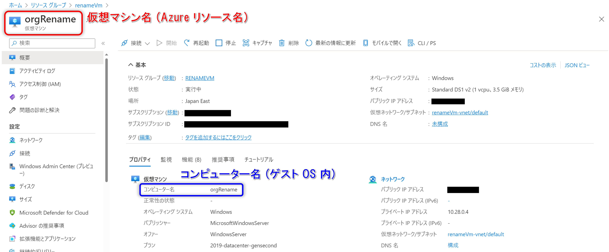

ゲスト OS 内の "コンピューター名" や "ホスト名" は、管理のためにシステム名などに基づき命名されることが多いかと思います。
当該環境の用途が変更となった場合には、管理の観点から新しいシステムに応じて名前を変える必要がありますが、それにより、ゲスト OS 内の名前と Azure リソースとしての仮想マシン名が異なってしまった場合にも管理がややこしくなります。

---

## 2. 変更手順

冒頭に記載した通り、Azure のリソース名を簡単に変える方法はなく、今回の場合は仮想マシンの再作成が必要となります。
再作成手順の概要は以下の通りとなります。

- 事前準備: 引き継ぎたい情報を確認する
- 手順 1: 仮想マシンを削除する
- 手順 2: 仮想マシンを新しい名前で作成する

### 事前準備: 引き継ぎたい情報を確認する

再作成時には、元の仮想マシンと同様の設定を実施する必要があるかと思いますので、事前に構成を控えておくことをお勧めします。
下記に項目の例を紹介しますが、その他必要な設定および構成がある場合は、適宜控えておきましょう。

#### 仮想マシン - 左メニュー [概要]

[必須項目]

- リソース グループ名
- 場所 (リージョン)
- 仮想マシンのサイズ
- パブリック IP アドレス (利用している場合)
  ※ IP アドレスが表示されている場合にはクリックし、リソース名を確認します。
- 仮想ネットワーク / サブネット名

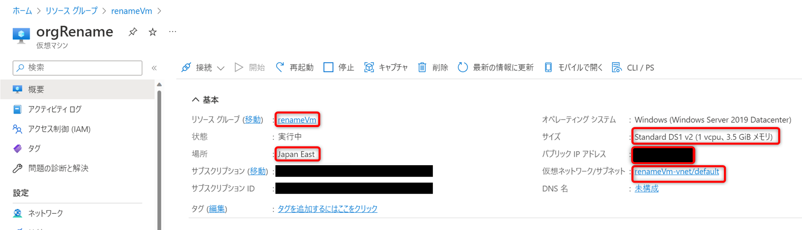

[設定がある場合]
- 可用性とスケーリング

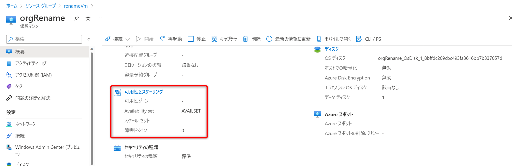

#### 仮想マシン - 左メニュー [ネットワーク]

[元の NIC を使う場合]

- ネットワーク インターフェイス名 (複数の場合はすべて) を控えます。

[設定がある場合]
負荷分散を設定されている方は併せて控えておきましょう。

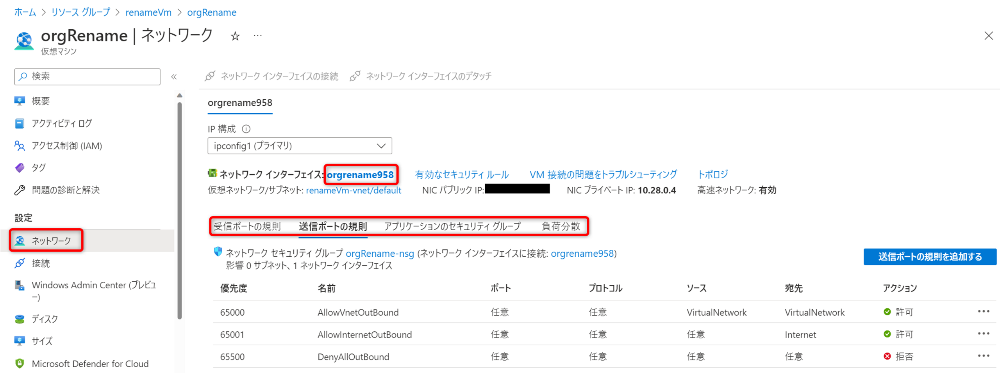

> [!NOTE] 
> **NIC は引き継げる ?**
> Azure PowerShell や Azure CLI を用いて仮想マシンを作成する場合には既存の NIC を指定することが可能ですが、Azure Portal から仮想マシンを作成いただく場合には指定することは現状叶いません。
> Azure Portal から操作を行いたい場合には、仮想マシン作成後に NIC の付け替えをご実施いただくこととなります。

#### 仮想マシン - 左メニュー [ディスク]

- OS ディスク名とデータ ディスク名 (複数の場合はすべて) を控えます。
- 全ディスクのホスト キャッシュ設定も忘れずに控えておきましょう。

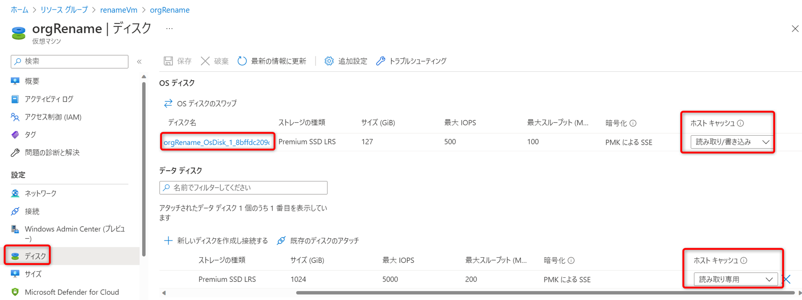

#### その他

上記以外にも仮想マシンの再作成時に設定可能な項目は複数あります。必要な項目は控えておきましょう。

- Azure ハイブリッド特典の設定
- 近接配置グループ名
- Azure Dedicated Host の使用の有無
- 容量予約の使用の有無
- 拡張機能名 (複数の場合はすべて)
- VM アプリケーション (複数の場合はすべて)
- 自動シャットダウンの設定
- バックアップの設定
- ゲスト OS の更新プログラム
- ゲスト OS 診断の設定
- ブート診断の設定
など

### 手順 1: 仮想マシンを削除する

> [!WARNING]
> **誤操作に備えて**
> 予期せぬご状況に備えるためにも、操作前には Azure Backup やディスクのスナップショット (要 OS シャットダウン) をご取得いただくことをお勧めします。
> 　
> ご参考) Azure VM バックアップについて
> [https://learn.microsoft.com/ja-jp/azure/backup/backup-azure-vms-introduction](https://learn.microsoft.com/ja-jp/azure/backup/backup-azure-vms-introduction)
> ご参考) 仮想ハード ディスクの Azure スナップショットを作成する
> [https://learn.microsoft.com/ja-jp/azure/virtual-machines/snapshot-copy-managed-disk?tabs=portal](https://learn.microsoft.com/ja-jp/azure/virtual-machines/snapshot-copy-managed-disk?tabs=portal)

以下の画面の通り、仮想マシンの [削除] をクリックします。

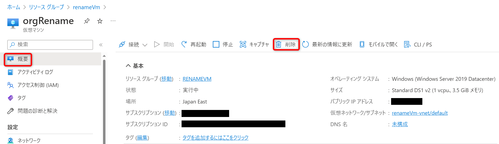

[削除] をクリックした後に表示される確認画面にて、"強制削除の適用" や 各関連リソースの "VM で削除" のボックスにチェックが入っていないことを確認します。
問題がない場合には、削除について理解した文言にチェックを入れ、[削除] をクリックします。

### 手順 2: 仮想マシンを新しい名前で作成する

削除した仮想マシンで使用していた OS ディスクより、控えた内容をもとに仮想マシンを作成します。
今回は、Azure Portal を使用して仮想マシンを作成し、その後、元の NIC を使用するために NIC の付け替えを実施する手順をご紹介します。

#### 仮想マシンの作成

1. 削除した仮想マシンで使用していた OS ディスク (控えていた OS ディスク名を参照) を選択します。
   

2. OS ディスクの [概要] から [VM の作成] を選択します。
   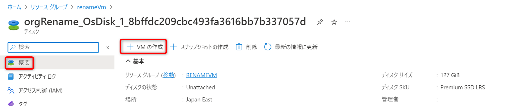

3. 先ほど控えた内容をもとに、仮想マシンを作成します。
   以下に例を示しますが、各項目はご自身の環境に合わせて設定してください。
   - **[基本] タブ**：
     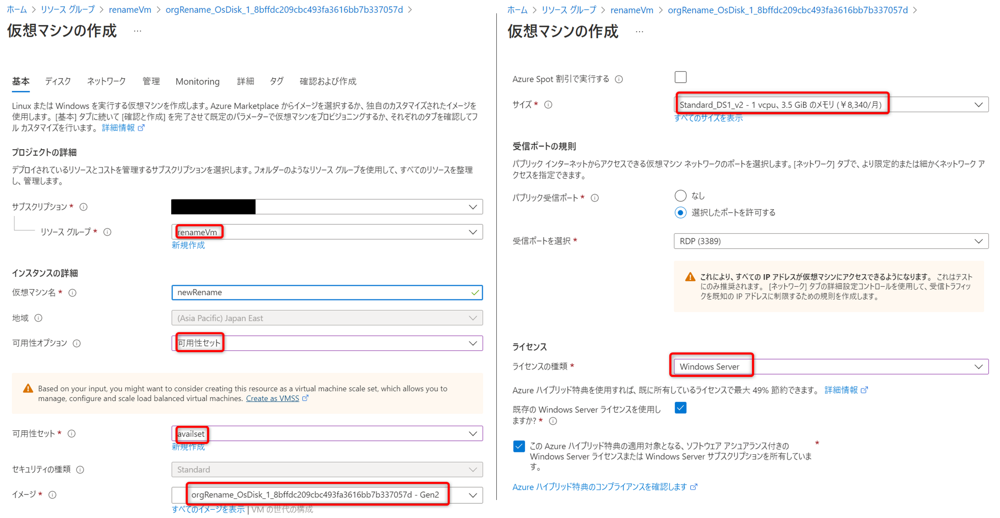

   - **[ディスク] タブ**：
     既存のデータ ディスクを接続する場合は、 [ディスク] タブで [既存のディスクの接続] を選択します。
     データ ディスクのホストのキャッシュ設定も控えたパラメータに設定します。
     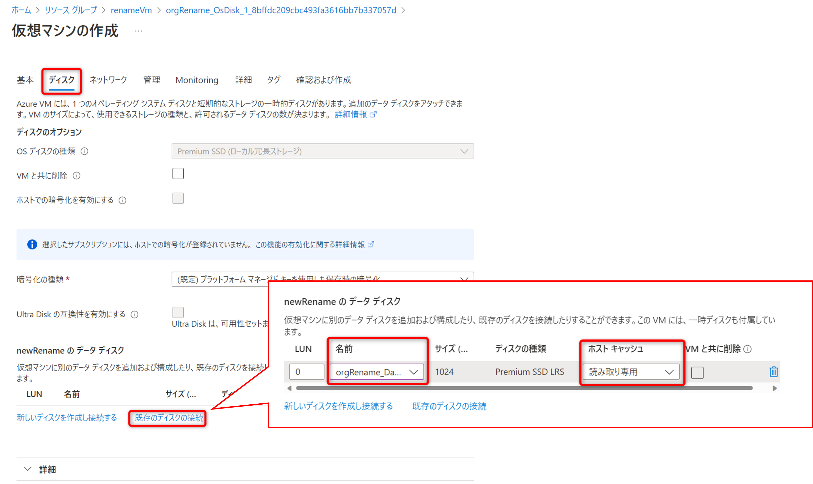
  
   - **[ネットワーク] タブ**：
     既存のネットワーク インターフェースの接続は仮想マシン作成後に行います。そのため、この段階での "NIC ネットワーク セキュリティ グループ" の設定は不要です。
     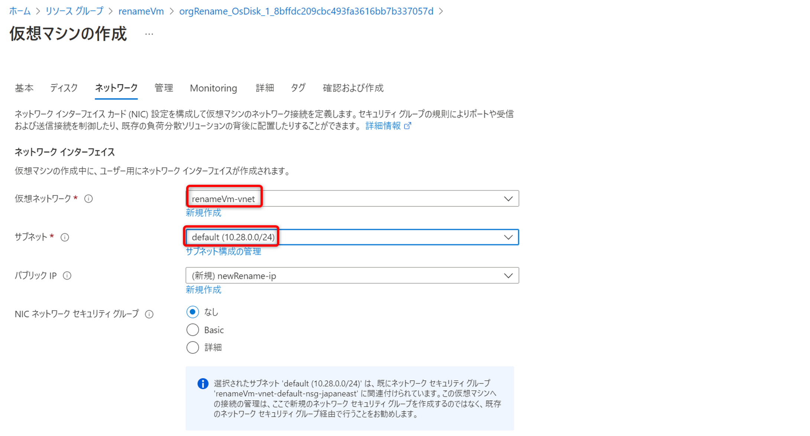

   - 全ての設定が完了後、 [確認および作成] から[作成] をクリックします。
     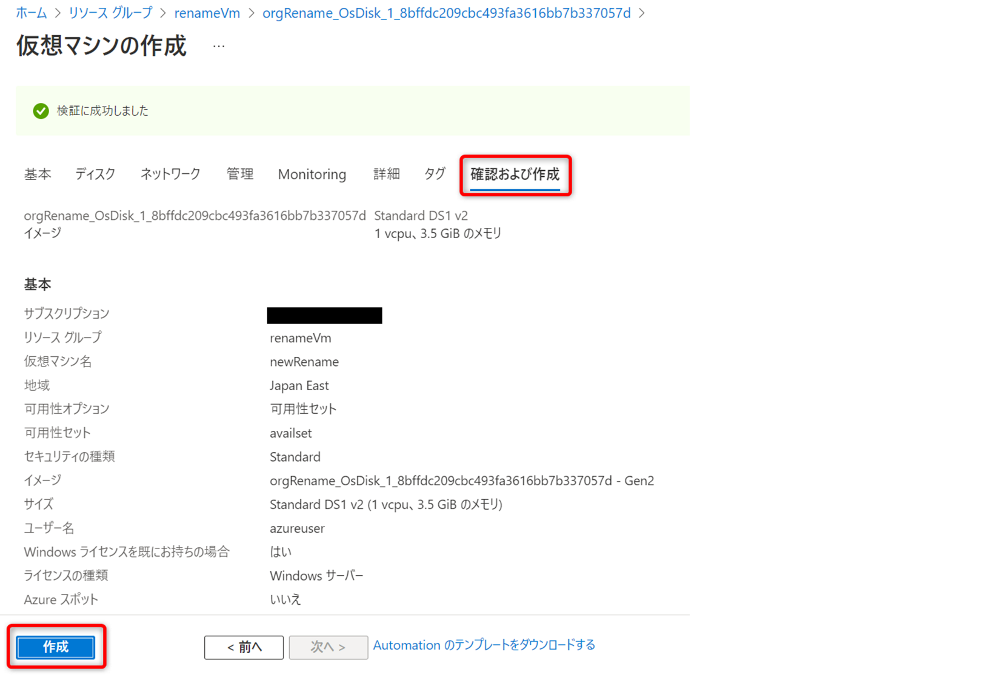

4. 作成が完了すると新しく作成した仮想マシンを確認することができます。
   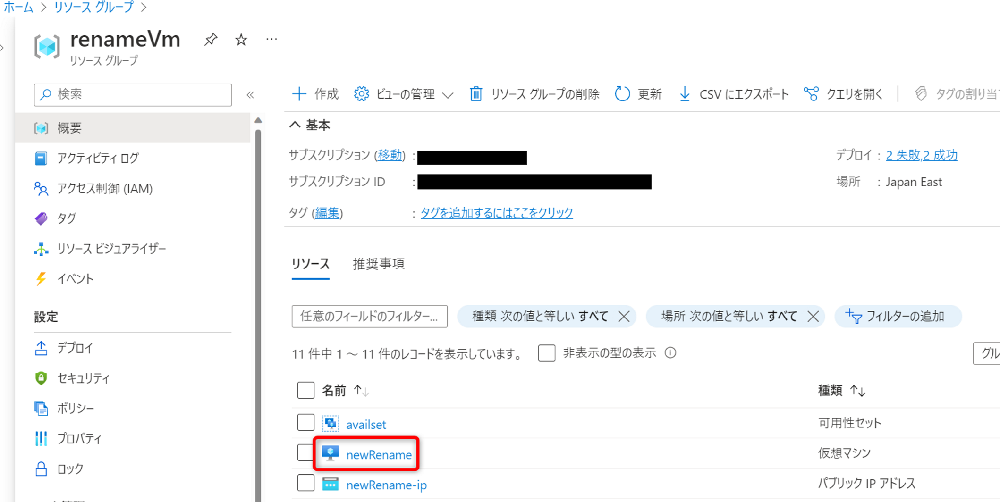

#### NIC の付け替え

1. 仮想マシン作成後、既存 NIC を接続するため、仮想マシンを停止 (割り当て解除) します。
   

2. 仮想マシン停止 (割り当て解除) 後、仮想マシンのページから [ネットワーク] - [ネットワーク インターフェイスの接続] を選択し、削除した仮想マシンで使用していた NIC を接続します。
   

3. 既存の NIC の接続完了後も、仮想マシン作成時に作成された NIC がまだプライマリとなっているの状態なので、[ネットワーク インターフェイスのデタッチ] を選択し、分離する必要があります。
   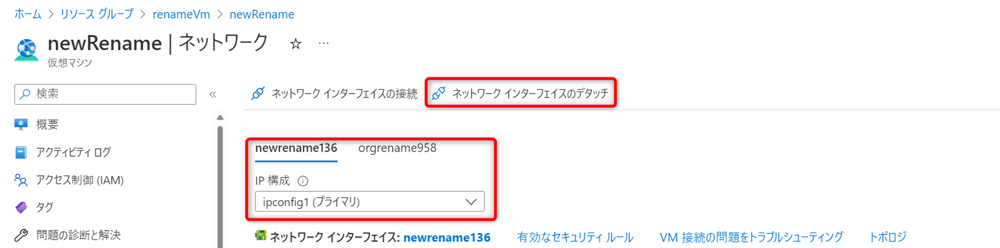

   NIC のデタッチを実施後、セカンダリとして接続した既存 NIC は自動的にプライマリとなります。
   なお、デタッチした NIC については削除されても問題ありません。

4. 仮想マシンを起動します。

---

## 3. [おまけ] 仮想マシン名の代わりにタグでも管理できる

ここまでの内容の通り、Azure のリソースとしての仮想マシン名を変えるためには再作成が必要となり、構成の確認や再設定等、それなりの時間がかかることがお分かりいただけたかと思います。

そのため、仮想マシン名にすぐに変更されうる情報 (プロジェクト名や担当者名など) を使うと、後々に運用変更が発生した際に、異なる名前による管理の負荷や変更作業の負荷がかかる可能性があります。

それでは、どのように管理するのがよいのか。
Azure では、リソース管理に用いるタグという機能が用意されています。

> ご参考) リソースの名前付けとタグ付けの意思決定ガイド
> [https://learn.microsoft.com/ja-jp/azure/cloud-adoption-framework/decision-guides/resource-tagging/?toc=%2Fazure%2Fazure-resource-manager%2Fmanagement%2Ftoc.json](https://learn.microsoft.com/ja-jp/azure/cloud-adoption-framework/decision-guides/resource-tagging/?toc=%2Fazure%2Fazure-resource-manager%2Fmanagement%2Ftoc.json)

> ご参考) タグを使用して Azure リソースと整理階層を整理する
> [https://docs.microsoft.com/ja-jp/azure/azure-resource-manager/resource-group-using-tags](https://docs.microsoft.com/ja-jp/azure/azure-resource-manager/resource-group-using-tags)

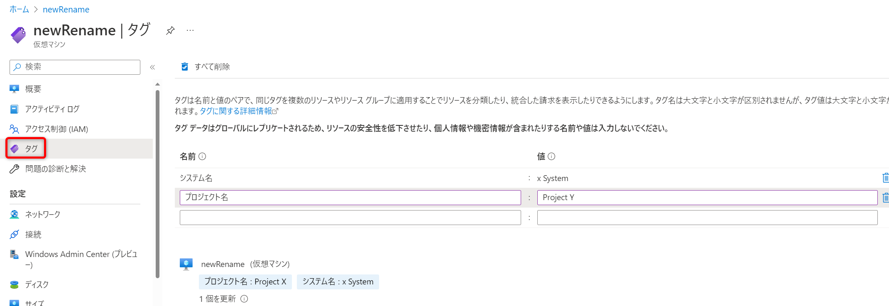

変更されうる細かな情報をタグに記載しておけば、後からの変更も簡単にできます。
仮想マシンに付与するタグを変更する場合、仮想マシンの停止は不要であり、変更処理自体もお時間を要さないことが想定されています。(弊社環境での検証時には、数十秒程度で完了しました。)
リソースの管理手段として、ご参考となれば幸いです。
