こんにちは。Azure テクニカル サポート チームの宇田です。
今回は、Azure Windows VM での完全メモリ ダンプの採取手順について、情報を更新した上で改めてご紹介いたします。

更新元の記事：[Azure VM (Windows) で完全メモリ ダンプを採取する方法](https://docs.microsoft.com/en-us/archive/blogs/jpaztech/how_to_get_a_complete_memory_dump)

<!-- more -->

---

## ダンプ解析について

Azure VM として稼働している Windows OS がハングした際など、完全メモリ ダンプを採取して解析を行うことが、有効な調査手段となる場合があります。

一方で、Azure に限ったお話しではありませんが、ダンプから原因調査を行うためには、"現象が発生している際に" ダンプを採取する必要があるほか、解析を行っても原因特定に至らない場合もあるため、必ずしもダンプの解析を行う事が最善の策とは限りません。こうした点については、以下の投稿でも詳しくご説明しておりますので、まずはご一読いただく事を推奨いたします。

> Azure 上で利用している Windows 仮想マシンがフリーズしたら (2018/8/28 更新)
> [https://jpaztech1.z11.web.core.windows.net/Azure上で利用しているWindows仮想マシンがフリーズしたら(2018828更新).html](https://jpaztech1.z11.web.core.windows.net/Azure%E4%B8%8A%E3%81%A7%E5%88%A9%E7%94%A8%E3%81%97%E3%81%A6%E3%81%84%E3%82%8BWindows%E4%BB%AE%E6%83%B3%E3%83%9E%E3%82%B7%E3%83%B3%E3%81%8C%E3%83%95%E3%83%AA%E3%83%BC%E3%82%BA%E3%81%97%E3%81%9F%E3%82%89(2018828%E6%9B%B4%E6%96%B0).html)

また、上記の投稿でもご案内しております通り、ご採取いただいたダンプの解析を Microsoft のサポート サービスで承る場合、原則としてプレミア サポート契約が必要となりますので、その点はご承知おきいただければと思います。IaaS として稼働する Azure VM 内の (Windows OS の) 設定や挙動に関してのお問い合わせは、Azure のサポート契約 (Developer / Standard / Professional Direct 等) では承ることが出来ず、Windows のサポート契約が必要となりますので、何卒ご了承ください。

> Azure IaaS における有償 Azure テクニカル サポートの対応範囲
> [https://jpaztech.github.io/blog/other/azure_technical_support_explained/](https://jpaztech.github.io/blog/other/azure_technical_support_explained/)

---

## 完全メモリ ダンプを採取するための Windows OS の事前設定について

物理メモリ上のデータを完全メモリ ダンプとして出力させるためには、事前に以下の設定が必要となります。こちらの設定を行っていない既定の状態でも、自動メモリ ダンプなどの採取はいただけますが、完全メモリ ダンプとして採取されたい場合には、明示的に設定をお願いいたします。

なお、物理メモリを多く搭載した VM をご利用の場合、完全メモリ ダンプの採取に長時間を要すほか、出力先のディスクにも大きな空き容量が必要となります。このため、ご利用の環境やお客様側で必要とされるダンプの種類に合わせて、適宜設定をいただければと思います。

> [!WARNING]
> 下記の手順には、レジストリの編集方法が記載されています。
> レジストリを誤って変更すると、深刻な問題が発生することがあります。
> レジストリを編集する際には充分に注意し、ユーザー自身の責任において行ってください。
> 万一に備えて、編集の前にレジストリをバックアップしておくと、問題が発生した場合にレジストリを復元することができます。
> バックアップおよび復元方法の詳細は、サポート技術情報「[Windows でレジストリをバックアップおよび復元する方法](https://support.microsoft.com/ja-jp/help/322756/)」をご確認ください。

### 1. ページ ファイルの大きさを 物理メモリ + 400 MB 以上の大きさに設定する

> [!NOTE]
> 大容量の物理メモリを搭載し、且つ、非常に多くのドライバーをインストールした環境に対しては、ダンプ ファイルの取得を目的としたページング ファイルの大きさにおいて、"物理メモリ + 400 MB" の値が必要となる場合があります。
> 　
> この "+ 400 MB" とは、ダンプ ファイルのヘッダー情報や二次ダンプ ファイルのために使われる領域です。
> より多くの環境においても対応できるように余裕を持たせた値となっておりますが、ご案内によっては、より少ない値 (1MB など) である場合もあります。
> 　
> 本手順では、ページ ファイルの大きさを "物理メモリ + 400 MB" 以上の大きさとしてご案内しております。

#### GUI から設定する場合

1. [ファイル名を指定して実行] から "sysdm.cpl" を起動し、[システムのプロパティ] を起動します。
2. [詳細設定] タブに移動し、[パフォーマンス] の [設定] ボタンをクリックします。
3. [詳細設定] タブに移動し、[仮想メモリ] の [変更] ボタンをクリックします。
4. [すべてのドライブのページング ファイルのサイズを自動的に管理する] を無効にします。
5. 任意のボリュームをクリックします。

例: メモリ 8 GB の VM サイズの場合
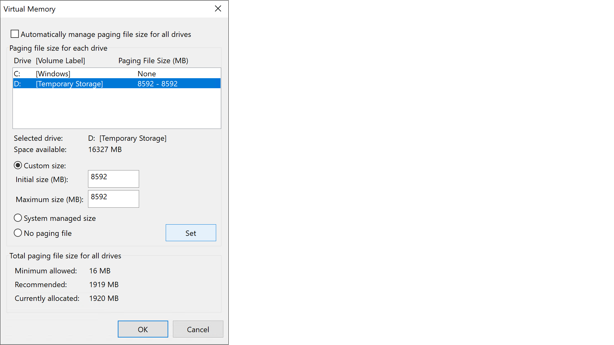

> [!NOTE]
> 一時ディスク (Temporary Storage / 既定では D ドライブ) がある VM サイズをご利用の場合は、一時ディスクをご利用いただければと存じます。
> 一時ディスクがない VM サイズをご利用の場合は、任意のデータ ディスクをアタッチいただき、データ ディスク上のボリュームをご利用ください。

6. [カスタム サイズ] を有効にし、[初期サイズ]、[最大サイズ] に物理メモリ + 400 MB 以上の数値を入力します。
7. [設定] ボタンをクリック後、[OK] をクリックします。

#### レジストリから設定する場合

直接レジストリを編集することでも、ページング ファイルの設定が可能です。
対象のレジストリ キーと値は下記のとおりです。

> キー　 :  HKEY_LOCAL_MACHINE\System\CurrentControlSet\Control\SessionManager\MemoryManagement
> 値　　 : PagingFiles
> タイプ : REG_MULTI_SZ

PagingFiles は下記の形式で記載します。
初期サイズと最大サイズは、物理メモリ + 400 MB 以上の数値を入力します。

> <ページ ファイル保存先> <初期サイズ (MB)> <最大サイズ (MB)>
> 
> 例: メモリ 8 GB の VM サイズの場合
> d:\pagefile.sys 8592 8592

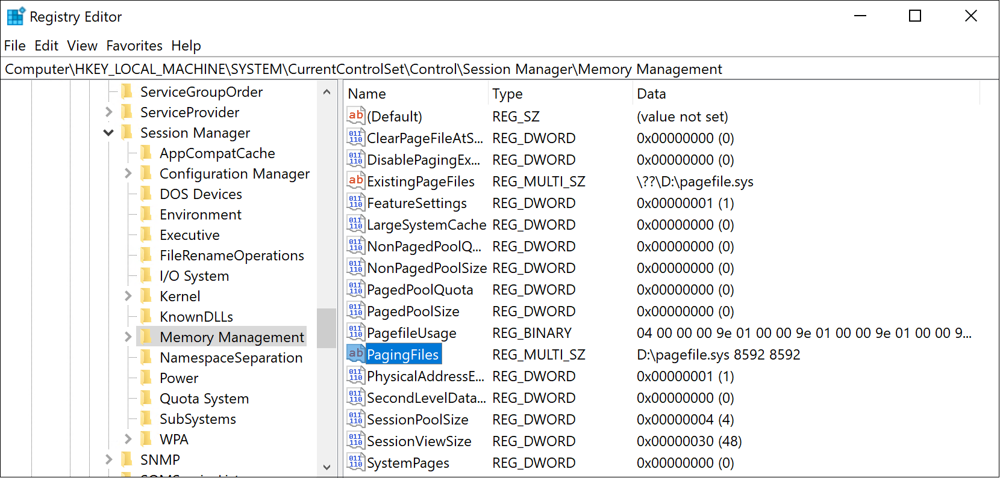

### 2. 完全メモリ ダンプ (Full Dump) が生成される設定にする

#### GUI から設定する場合

1. [ファイル名を指定して実行] から "sysdm.cpl" を起動し、[システムのプロパティ] を起動します。
2. [詳細設定] タブに移動し、[起動と回復] の [設定] ボタンをクリックします。
3. [システム エラー] 項目の [デバッグ情報の書き込み] で [完全メモリ ダンプ] を選択します。
4. また、メモリ ダンプ ファイルの保存先を変更する場合は [ダンプ ファイル] のパスを変更します。
5. 完了しましたら [OK] ボタンをクリックします。

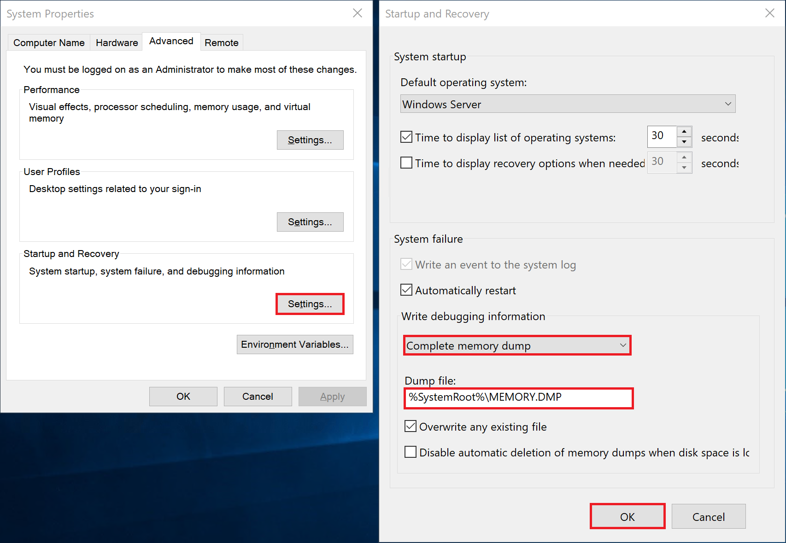

> [!WARNING]
> メモリ ダンプ ファイルは、物理メモリ サイズと同等のサイズとなります。
> 既定では C:\Windows 配下に MEMORY.DMP という名前でファイルが作成されることとなりますが、もし、C ドライブの空き容量が足りない場合などは、設定したページング ファイルのサイズ以上の充分な空き容量があるボリュームを保存先にご設定ください。

#### レジストリから設定する場合

下記のレジストリの値を設定してください。対象のレジストリ キーと値は下記のとおりです。

> キー　 : HKEY_LOCAL_MACHINE\System\CurrentControlSet\Control\CrashControl
> 値　　 : CrashDumpEnabled
> タイプ : REG_DWORD
> 設定値 : 1

また、メモリ ダンプの出力先は下記にて確認できます。

> キー　 : HKEY_LOCAL_MACHINE\System\CurrentControlSet\Control\CrashControl
> 値　　 : DumpFile
> タイプ : REG_EXPAND_SZ
> 既定値 : %SystemRoot%\MEMORY.DMP

### 3. NMI から STOP エラーを発生させるように設定する

下記のレジストリの値を設定してください。NMICrashDump がない場合には、新規に作成してください。

> キー　 : HKEY_LOCAL_MACHINE\SYSTEM\CurrentControlSet\Control\CrashControl
> 値　　 : NMICrashDump
> タイプ : REG_DWORD
> 設定値 : 1

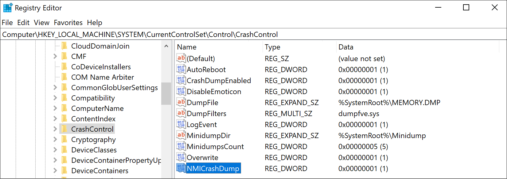

### 4. VM を再起動する

Azure Portal から VM を再起動させます。

---

## ダンプの採取手順について

上記の設定後、OS ハングなどの事象が再現したタイミングで、Azure Windows VM のシリアル コンソールから NMI を発行して、完全メモリ ダンプを採取します。

なお、NMI の発行に伴い対象の Azure Windows VM ではブルー スクリーンが発生し、OS が強制再起動されることになりますので、未保存のデータ (物理メモリ上からディスクへ書き戻されていないデータ) が消失する点にご留意ください。

### 1. ブート診断を設定する

1. 対象の Azure VM のシリアル コンソールが利用できるかを確認し、利用できない場合には、ブート診断を [カスタム ストレージ アカウントで有効にする] 必要があります。

   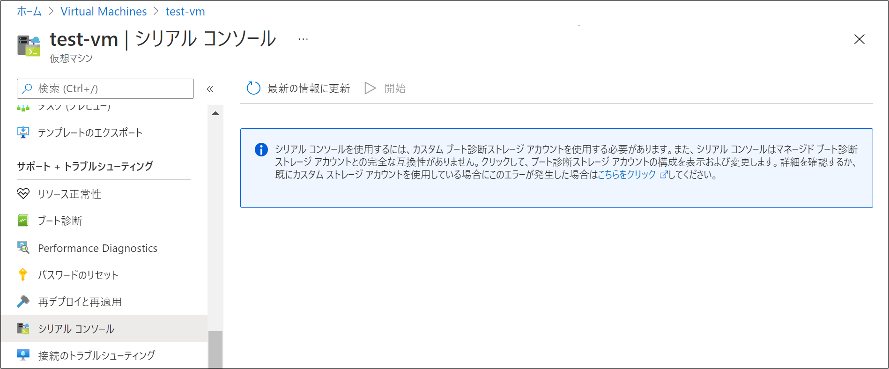

2. 左メニュー ”サポート + トラブルシューティング” の [ブート診断] をクリックし、[設定] をクリックします。

   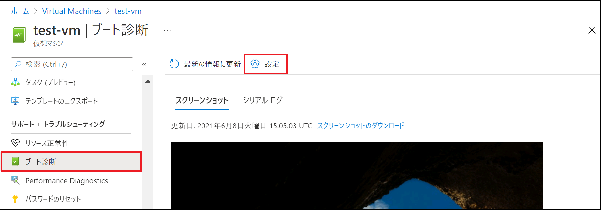

3. [カスタム ストレージ アカウントで有効にする] を選択し、任意のストレージ アカウントを選択して、[保存] をクリックします。

   

### 2.シリアル コンソールから NMI を発行します

1. シリアル コンソールの画面を開き、SAC> と表示されるまで待ってから、上部のボタンより [マスク不可能割込み (NMI) を送信する / Send Non-Maskable Interrupt (NMI)] をクリックします。

   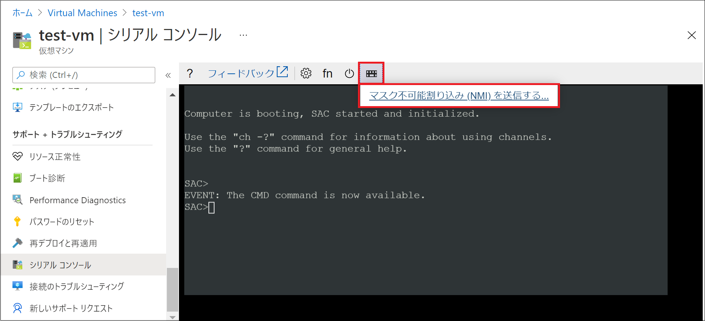

   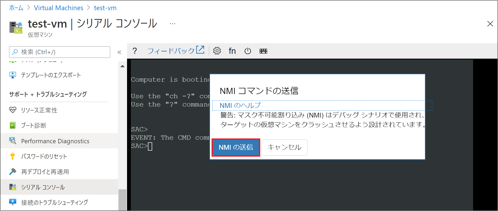

2. NMI が発行されると、以下のようなメッセージが表示され、物理メモリ上のデータがダンプ ファイルとして指定の場所 (既定: C:\Windows\MEMORY.DMP) に書き出されます。
   末尾の表示が 100 % となった後、OS が再起動いたしますので、起動するまでしばらくお待ちください。
   物理メモリの大きな VM をご利用の場合、ディスクへの書き出しにお時間を要す場合があります。

   

   なお、対象の Azure VM に対して強制割り込み (NMI) が発行されると、Windows OS であれば、ブルースクリーンの状態となります。

   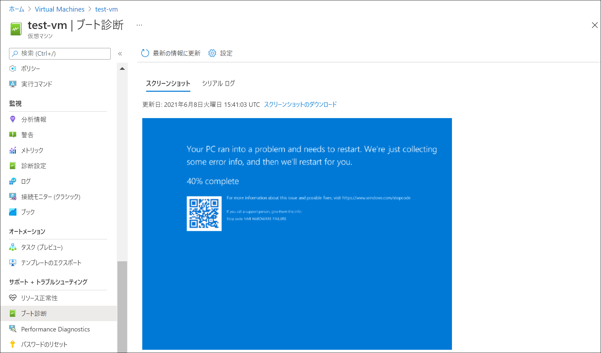

### 3. ダンプ ファイルを収集します
1. OS の起動後に RDP 接続を行うと、予期せぬ再起動が発生した事を示す画面が表示されます。

2. 事前設定の手順 2. でレジストリに設定したフォルダ (既定: C:\Windows\MEMORY.DMP) に、ダンプ ファイルが出力されます。
   こちらを適宜ダウンロードください。

   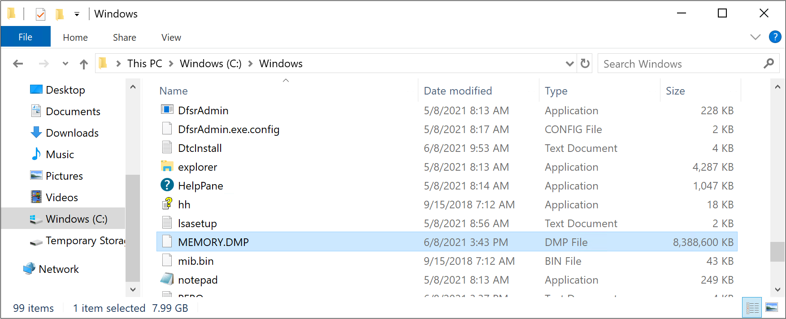

---

## 補足情報

Windows OS にてブルー スクリーンが発生し、再起動時にダンプ ファイルが出力された際には、イベント ログにもその旨が記録されます。
ダンプ ファイルが出力されているのか、その出力先がどこなのか分からない場合には、イベント ログをご確認ください。

例:
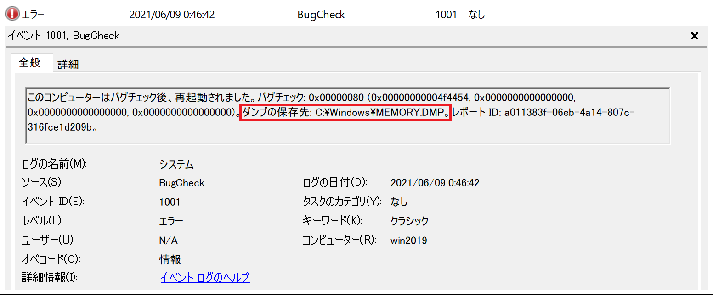

以上となりますが、いかがでしたでしょうか。
本記事が皆様のお役に立てれば幸いです。
