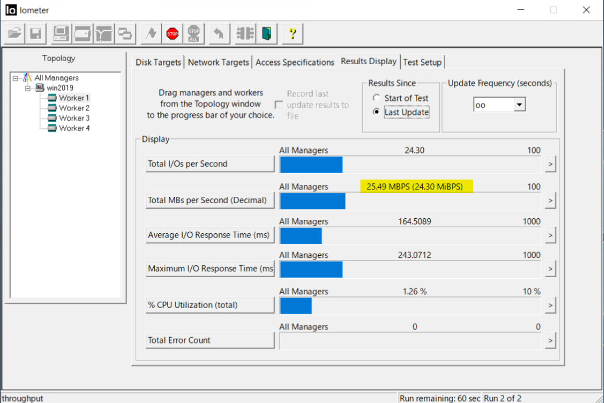
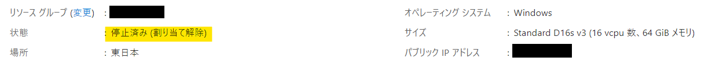
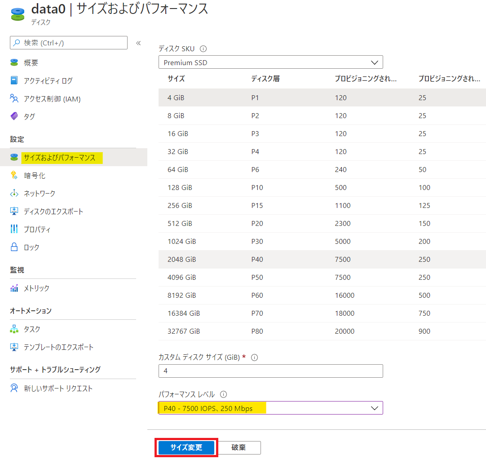
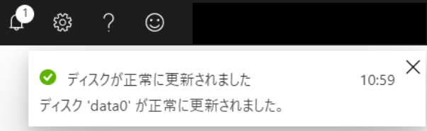
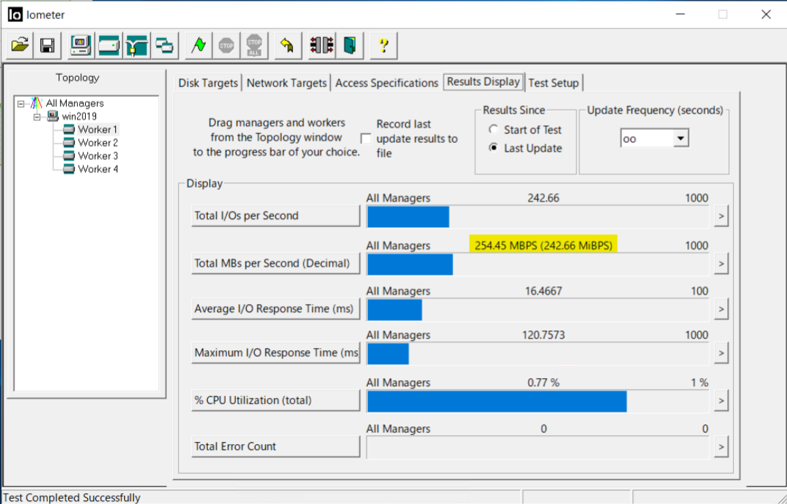
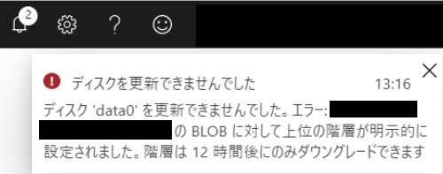

こんにちは、Azure テクニカル サポート チームの山下です。

今回は、先日一般公開 (GA) が [発表](https://azure.microsoft.com/en-us/updates/performance-tiers-for-premium-ssds-is-now-generally-available/) された、Premium SSD のパフォーマンス レベルについてご紹介いたします。

## はじめに
Azure のディスクでは、ディスクのサイズに応じて性能（スループット、IOPS）が設定されています。ディスクの性能を向上されたい場合には、ディスクのサイズを拡張を行うという、シンプルな仕組みで提供されております。しかしながら、ディスクの拡張は容易に行える一方で、一度拡張したディスクは縮小が行えないという制限事項があるため、月末のバッチ処理やパフォーマンスの調査で切り分けなどで一時的に向上されたい場合には、拡張いただくのが難しいという課題がございました。

> Azure で利用できるディスクの種類
> [https://docs.microsoft.com/ja-jp/azure/virtual-machines/disks-types](https://docs.microsoft.com/ja-jp/azure/virtual-machines/disks-types)
> Azure IaaS VM ディスクと Premium マネージド ディスクおよびアンマネージド ディスクについてよく寄せられる質問
> [https://docs.microsoft.com/ja-jp/azure/virtual-machines/faq-for-disks](https://docs.microsoft.com/ja-jp/azure/virtual-machines/faq-for-disks)

今回 GA された Premium SSD のパフォーマンス レベルの機能では、ディスク サイズを変更することなく、数日間だけ上位のサイズと同じパフォーマンス レベルを得るといったことができる機能となっております。

## 制限事項
公開ドキュメントより制限事項を以下に抜粋いたします。

- 現在、この機能は Premium SSD でのみサポートされています。
- ディスクのレベルを変更する前に、VM の割り当てを解除するか、実行中の VM からディスクを切断する必要があります。
- P60、P70、P80 の各パフォーマンス レベルの使用は、4,096 GiB 以上のディスクに制限されています。
- ディスクのパフォーマンス レベルは、12 時間ごとに 1 回だけダウングレードできます。

> Azure portal を利用してパフォーマンス レベルを変更する
> [https://docs.microsoft.com/ja-jp/azure/virtual-machines/disks-performance-tiers-portal](https://docs.microsoft.com/ja-jp/azure/virtual-machines/disks-performance-tiers-portal)
> Change your performance tier using the Azure portal
> [https://docs.microsoft.com/en-us/azure/virtual-machines/disks-performance-tiers-portal](https://docs.microsoft.com/en-us/azure/virtual-machines/disks-performance-tiers-portal)

## 使用方法
ここでは Azure Portal からの設定方法、ならびに実際にパフォーマンスが向上している様子をご紹介いたします。Azure Portal だけではなく、Azure PowerShell, Azure CLI からも設定が行えますので、CUI で変更されたい場合には、公開ドキュメントのご参照をお願いいたします。

今回は以下のような環境で、データディスクにおけるパフォーマンス レベルの変更を確認します。

- VM サイズ：Standard D16s_v3
- ディスク サイズ：P4 (120 IOPS / 25 MBps)
- 変更後のパフォーマンス レベル：P40 (7500 IOPS / 250 MBps)
- ゲスト OS：Windows Server 2019

### パフォーマンス レベル変更前の性能を確認
iometer を使用して P4 のデータディスクのスループットを計測した結果、以下の画像のように、P4 の上限値である 25 MBps 前後の性能であることが確認できます。

### パフォーマンス レベルの変更
1. VM の停止操作を行い、割り当て解除の状態にします。

1. パフォーマンス レベルを変更されたいディスクを開き、[設定] - [サイズおよびパフォーマンス] にアクセスします。
1. 下部にある [パフォーマンス レベル] のプルダウンより、変更されたいパフォーマンス レベルを選択します。ここでは P40 を選択し、[サイズ変更] をクリックします。

1. 更新が完了したメッセージが表示されるのを待ちます。

1. 更新完了後、VM を開始します。

### パフォーマンス レベル変更後の性能を確認
再度 iometer を使用してスループットを計測した結果が以下です。スループットが先ほどの 25 MBps から、250 MBps 前後まで向上していることが確認できます。

### 補足事項
制限事項に記載した通り、パフォーマンス レベルのダウングレードは 12 時間ごとに 1 回の操作が許可されています。12 時間経過せずに変更しようとした場合、下記画像のようにエラーが発生し、変更操作は失敗しますのでご留意ください。

また、アップグレードしている期間は、アップグレードされたパフォーマンス レベルの料金で課金されます。今回の場合、パフォーマンス レベルを P40 に変更している期間は、P4 ではなく、P40 の料金で課金される挙動となります。パフォーマンス レベルをもとの P4 に戻すことで、戻した以降は P4 の料金で課金されます。

本稿が少しでも皆様のご参考となれば幸いです。
