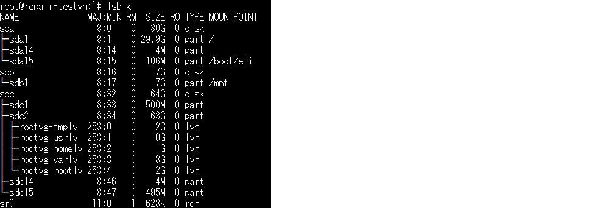
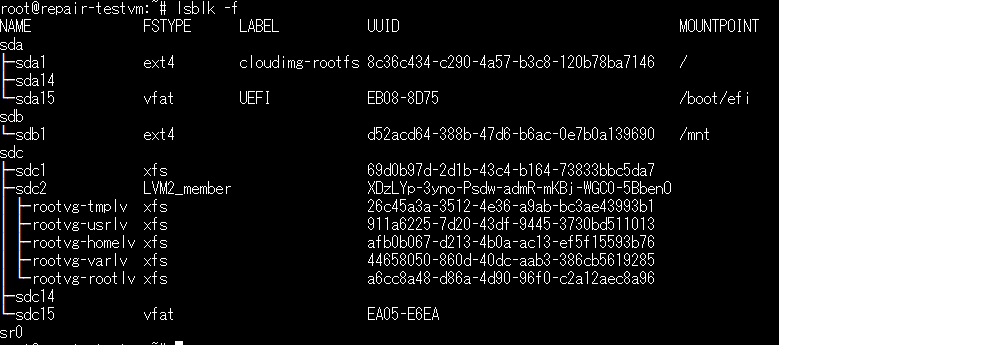
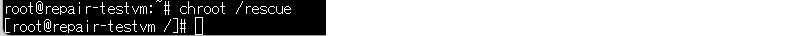
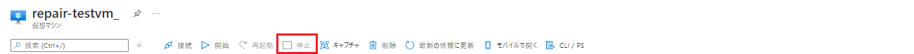
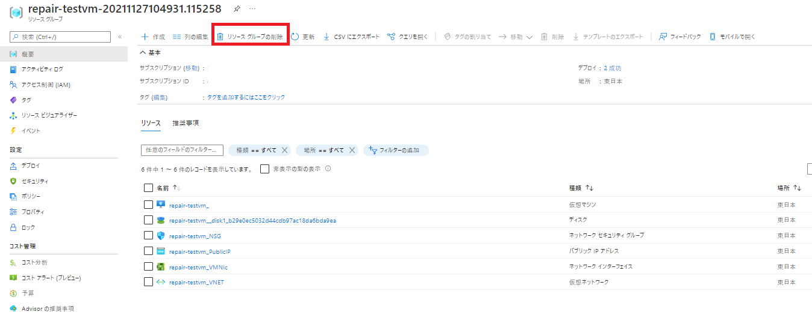

こんにちは。Azure テクニカル サポート チームの橋本です。

Linux OS にて設定変更後、または新たにアプリケーションなどをインストールした後で OS が起動しなくなり困ったことはないでしょうか。
今回は OS 設定変更後に正常に起動せず、ログインができなくなってしまったケースを想定し、問題の OS ディスクのクローンを作成し、復旧作業用の別の VM (以降復旧 VM) にて OS ディスクの修正対応をする方法をご案内させていただきます。

<!-- more --> 

## 関連ドキュメント
公式ドキュメント上では以下の URL 情報にご案内があります。

> **Azure Virtual Machine の修復コマンドを使用して Linux VM を修復する**
> [https://docs.microsoft.com/ja-jp/troubleshoot/azure/virtual-machines/repair-linux-vm-using-azure-virtual-machine-repair-commands](https://docs.microsoft.com/ja-jp/troubleshoot/azure/virtual-machines/repair-linux-vm-using-azure-virtual-machine-repair-commands)
>
> **Linux レスキュー VM の Chroot 環境**
> [https://docs.microsoft.com/ja-jp/troubleshoot/azure/virtual-machines/chroot-environment-linux](https://docs.microsoft.com/ja-jp/troubleshoot/azure/virtual-machines/chroot-environment-linux)

## 目的

本記事では、VM (testvm) (リソースグループ rg-test) の /etc/fstab 修正、rpm パッケージのアプリケーション インストールを行った後で　VM が起動できなくなったことを想定し、復旧手順について上記 2 つの公式ドキュメント記載内容を纏めた形で一連の流れをご紹介します。
また、復旧のために利用した復旧 VM 関連のリソースを、作業後に削除する方法も併せてご紹介します。

## 作業概要
1. Azure CLI にて問題の VM を指定し、復旧 VM を作成
2. 復旧 VM にて、問題の VM の OS ディスクをマウント
3. 復旧 VM にて、修復操作を実施
4. 復旧 VM で修正した OS ディスクのコピーを、問題の VM の OS ディスクとスワップ
5. 不要となった復旧 VM のリソースグループを削除

## 手順

### 1. Azure CLI にて問題の VM を指定し、復旧 VM を作成

- Azure 環境へログイン
  ```bash
  az login
  ```

- 復旧 VM 作成コマンドを実行
  このコマンドを実行し、問題の VM の OS ディスクのコピー (自動で作成されます) をデータ ディスクとしてマウントした復旧 VM を作成します。復旧 VM は元の仮想マシンと同一サイズで作成され、通常の仮想マシンと同様にコストが掛かります。
  ```bash
  az vm repair create -g rg-test -n testvm
  ```

  下記のように実行結果が表示されるため、復旧 VM のログイン アカウントおよびパスワードを入力します。
  ```bash
  # 省略 #
  The vm-repair extension is not up to date, please update with az extension update -n vm-repair
  Repair VM admin username:  # 復旧 VM のログイン アカウントを入力
  Repair VM admin password:  # 復旧 VM のログイン パスワードを入力
  Confirm Repair VM admin password:  # パスワードを再入力
  # 省略 #
    "repair_resource_group": "repair-testvm-20211127104931.115258",
    "repair_vm_name": "repair-testvm_",
    "resource_tag": "repair_source=rg-test/testvm",
    "status": "SUCCESS"
  }
  ```

### 2. 復旧 VM にて、問題の VM の OS ディスクをマウント

- Azure ポータルから復旧 VM "repair-testrh0_" の パブリック IP アドレスを確認

  

- 上記確認したパブリック IP アドレス、手順 1 で作成したユーザ、パスワードで SSH ログインし、VM (testvm) のディスクをマウントし、chroot コマンドを実行します。

  ```bash
  sudo su - 

  # root 権限で実行
  lsblk
  ```

  コマンド表示結果例
  

  ```bash
  # root 権限で実行
  lsblk -f
  ```

  コマンド実行例
  

  lsblk コマンドでは、復旧 VM に接続されたデータ ディスクのパーティション構成を確認します。
  パーティション構成はお客様環境に依存するため、必ずしも今回の例と同じとは限りません。
  今回の例では論理ボリューム名より各ファイルシステム判断し、sdc1 が 500M であることから /boot 、sdc15 が vfat であることから /boot/efi と判断しマウントをします。

- 各ファイル システムのマウント
  本手順例では LVM 構成を前提とした手順となります。
  非 LVM 構成の場合にも基本的な操作は同じとなりますが、ご不明な場合、公式ドキュメントに 非 LVM 構成を前提とした手順がございますので、ご参考にしていただければと思います。

  ```bash
  # root 権限で実行
  mkdir /rescue
  mount /dev/mapper/rootvg-rootlv /rescue
  mount /dev/mapper/rootvg-varlv /rescue/var
  mount /dev/mapper/rootvg-homelv /rescue/home
  mount /dev/mapper/rootvg-usrlv /rescue/usr
  mount /dev/mapper/rootvg-tmplv /rescue/tmp
  mount /dev/sdc1 /rescue/boot/
  mount /dev/sdc15 /rescue/boot/efi
  cd /rescue
  mount -t proc proc proc
  mount -t sysfs sys sys/
  mount -o bind /dev dev/
  mount -o bind /dev/pts dev/pts/
  mount -o bind /run run/
  chroot /rescue
  ```

  ※ chroot コマンド実行後プロンプトに [] が付与されます。
  

### 3.　復旧 VM にて、修復操作を実施

- 手順 2 で /rescue ディレクトリにマウントした VM (testvm) の root ファイル システムにアクセスし、修正対応を行います。
  ここでは例としまして /etc/fstab を修正し、直前にインストールしたパッケージをアンインストールします。
  
  ```bash
  # ルートディレクトリ変更後の状態で実行
  cd /etc
  vi fstab

  rpm --erase アプリケーションパッケージ
  # Running in chroot, ignoring request: daemon-reload
  # こちらのメッセージが出力される可能性がございますが、無視いただいて問題ありません。
  ```

- 作業完了後、chroot から抜けて、ファイル システムをすべてアンマウントします。
  その後ポータルから復旧 VM を停止します。

  ```bash
  # ルートディレクトリ変更後の状態で実行
  exit
  ```

  ※ exit コマンド実行後プロンプトから [] が外れます
  

  ```bash
  # root 権限で実行
  umount /rescue/proc/
  umount /rescue/sys/
  umount /rescue/dev/pts
  umount /rescue/dev/
  umount /rescue/run
  cd /
  umount /rescue/boot/efi
  umount /rescue/boot
  umount /rescue/home
  umount /rescue/var
  umount /rescue/usr
  umount /rescue/tmp
  umount /rescue
  ```

  ※ ファイルシステムがプロセス利用中のためアンマウントできない場合がありますが、後続の復旧 VM のシャットダウン操作でアンマウントされますので問題ありません。

- Azure ポータルから復旧 VM "repair-testrh0_" を停止
  

### 4. 復旧 VM で修正した OS ディスクのコピーを、問題の VM の OS ディスクとスワップ

- "az vm repair restore" コマンドにて、問題の VM の OS ディスクを、修復した OS ディスクとスワップします。

  ```bash
  az vm repair restore -g rg-test -n testvm --verbose
  # 省略 #
  Continue with clean-up and delete resources? (y/n): n ※復旧 VM 作成時に作成されたリソースを削除するかの選択。
  今回ご紹介の手順では n を選択し、後続の手順にて関連リソースを削除します。
  y を選択いただいても問題ありません。
  ```

  コマンドが完了すると、復旧 VM にアタッチされていたディスクが自動的に問題の仮想マシンの OS ディスクとしてアタッチされます。

- 問題の VM をポータルから起動し、ログインができるか確認

### 5. 不要となった復旧 VM のリソースグループを削除

ポータル上からリソース グループ内のリソースを確認した後で削除する流れをご紹介します。

- 復旧 VM のリソース グループ削除
  ポータルのリソース グループのメニューより、
「repair-tesetvg-yyyymmdd・・・」の名称のリソース グループを選択。リソースグループ内のリソースが業務で利用していないことを確認して削除します。

  


- 問題の VM の元ディスクの削除
  
  管理ディスク環境と非管理ディスク環境で手順が異なります。
  【管理ディスクをご利用環境の場合】、【非管理ディスクをご利用環境の場合】
  手順をそれぞれ用意しておりますので、環境に合わせてご対応ください。
  
  【管理ディスクをご利用環境の場合】
  
  VM のリソースグループより、元々利用していたディスクを選択し、
  ディスクの状態が　Unattached（どの VM からも利用されていない）であることを確認し、削除を行います。

  
  

  
  【非管理ディスクをご利用環境の場合】
  
  VM のディスク情報より、現在 VM が利用している vhd ファイルを確認し、
  仮想マシンの vhd ファイルが格納されているストレージアカウントのコンテナーをご確認ください。
  現在 VM が利用していない VHD ファイル、
  尚且つディスクの状態が利用可能（どの VM からも利用されていない）であることを確認し、削除を行います。

  
  

本記事が皆様のお役に立てれば幸いです。
