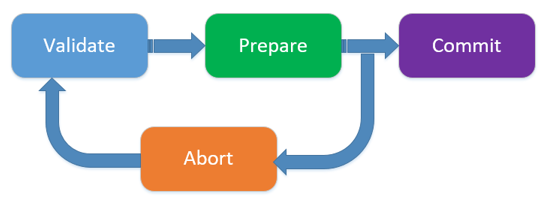
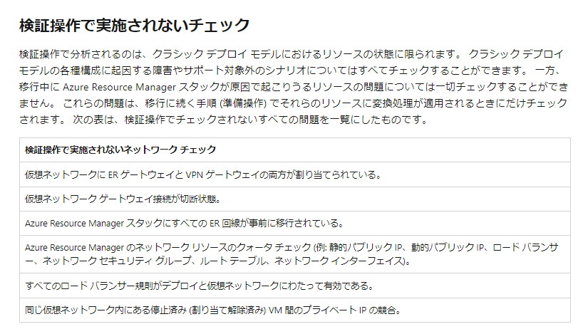
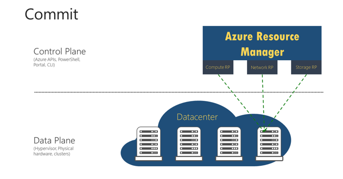
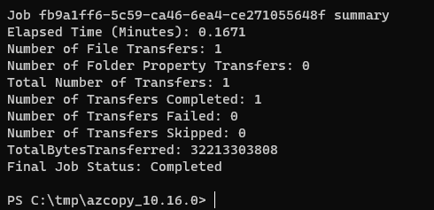

> [!WARNING]
> クラシック VM は既に廃止となっておりますので、本記事はアーカイブとなります。

こんにちは。Azure テクニカル サポート チームの鳥越です。
2014年に Azure Resource Manager モデルがリリースされており、リタイアがアナウンスされた 2020 年 7 月時点ですでに 90% が Azure Resource Manager モデルで利用されておりました。

Azure 初期で利用されておりました Azure Service Manager (ASM) を介した IaaS 仮想マシン (VM) の管理を 2020 年 2 月 28 日 に 非推奨として **2023 年 9 月 6 日** に完全に廃止される予定です。

> ■ ご参考: Migrate your IaaS resources to Azure Resource Manager by September 6, 2023
> [https://learn.microsoft.com/en-us/azure/virtual-machines/classic-vm-deprecation](https://learn.microsoft.com/en-us/azure/virtual-machines/classic-vm-deprecation)
> (ご参考: 日本語 URL)
> [https://learn.microsoft.com/ja-jp/azure/virtual-machines/classic-vm-deprecation](https://learn.microsoft.com/ja-jp/azure/virtual-machines/classic-vm-deprecation)

> [!IMPORTANT]
> **(2023/01/27 Update)**: 当初、2023 年 3 月 1日とご説明しておりました ASM の廃止は **2023 年 9 月 1 日** に延期されました。
> その後、2023 年 9 月 6 日まで更に延期されましたが、現在これ以上の延期は計画されておりません。

そのため、これから 2023 年 9 月 6 日までに移行計画を立てていらっしゃるお客様に対して、移行がスムーズに行えるようにあらかじめ確認しておくべきポイントをお纏めしました。

本内容がお客様の移行作業に少しでもお役に立てば幸いでございます。

<!-- more -->

---

## 移行作業の全体像

> ■ ご参考: プラットフォームでサポートされているクラシックから Azure Resource Manager への移行に関する技術的な詳細
> [https://learn.microsoft.com/ja-jp/azure/virtual-machines/migration-classic-resource-manager-deep-dive](https://learn.microsoft.com/ja-jp/azure/virtual-machines/migration-classic-resource-manager-deep-dive)

Azure ではリソースの管理操作にかかわる Control Plane と実際のリソースに対する Data Plane が存在します。
ASM (Azure Service Manager) から ARM (Azure Resource Manager) への移行は Control Plane に対する操作となります。


原則として Data Plane はそのまま使用可能なので、ユーザー目線から見た場合、VM の動作状況や、ストレージアカウント上へのアクセスには影響がないように見えます。
しかしながら、移行非対応の機能のための構成変更に伴い、ユーザー目線でのダウンタイムが発生する可能性はございます。

たとえば、クラシック VM においては、「仮想ネットワークに配置されていない VM」という構成があり得ましたが、ARM における VM ではすべての仮想マシンが仮想ネットワーク上に配置されます。
従いまして、仮想ネットワークに配置されていないクラシック VM を、ARM に移行する場合、移行手順の途上で VM の停止が伴います。

また、移行中は、管理系の操作が行えないことも合わせてご理解いただく必要がございます。
例えば、VMのサイズ変更、開始、停止、再起動、再デプロイ、ディスクの構成変更、ネットワーク的な構成変更が実施できなくなる操作となります。
そのため、移行で問題が生じたときに、VM 側の操作ができないといった事態に陥る可能性もゼロではございません。

### 移行をサポートしていないリソース


https://learn.microsoft.com/ja-jp/azure/virtual-machines/migration-classic-resource-manager-overview#unsupported-features-and-configurations

---

全体的な移行の流れは下記の図のようになります。



## 移行の事前準備 (重要)

### (1) クラシックリソースの操作に対応した、クラシック用の Azure PowerShell を実施前にご用意ください。

クラシックリソース用の Azure PowerShell コマンドは、現行の ARM 対応の `AzureRM` や `Az` というモジュールではなく、`Azure` という名称で配布されています。
インストール方法は、以下の技術文書をご参照ください。

> ■ ご参考: Azure PowerShell Service Management モジュールのインストール
> [https://learn.microsoft.com/ja-jp/powershell/azure/servicemanagement/install-azure-ps?view=azuresmps-4.0.0 ](https://learn.microsoft.com/ja-jp/powershell/azure/servicemanagement/install-azure-ps?view=azuresmps-4.0.0 )

なお、クラシック Azure PowerShell によるリソース管理には、Azure サブスクリプションにおける **従来の管理者** の割り当てが必要になることにご注意ください。

> ■ ご参考: Azure の従来のサブスクリプション管理者
> [https://learn.microsoft.com/ja-jp/azure/role-based-access-control/classic-administrators](https://learn.microsoft.com/ja-jp/azure/role-based-access-control/classic-administrators)

多くの場合、移行が失敗した場合には、コマンドベースで回復作業を実施します。
そのため、事前にクラシックリソース用 Azure PowerShell を利用いただける環境をご用意いただけますと幸いです。

### (2) クラシック Azure PowerShell を用いて事前チェックをお願いいたします

たとえば、よくあるお問い合わせとして、ストレージアカウント内にディスクリソースが存在するためクラシックストレージアカウントの移行に失敗するといったお問い合わせがございます。

Portal 側の手順では、この点が考慮されていない部分がございますので、下記のように PowerShell を利用してチェックをいただけますと幸いです。
VM の移行が完了しておらず、クラシックストレージアカウントに VM で利用中のディスクリソースが残ってしまっていないかなどのチェック方法は以下のとおりです。

#### (2-1) ディスクがストレージ アカウントに格納されている仮想マシンを移行する。

次のコマンドは、ストレージ アカウント内のすべての VM ディスクの RoleName および DiskName プロパティを返します。RoleName はディスクが接続される仮想マシンの名前です。
このコマンドでディスクが返される場合、ストレージアカウントを移行する前にこれらのディスクが接続されている仮想マシンが移行されている必要があります。

```powershell
$storageAccountName = 'yourStorageAccountName'

Get-AzureDisk | where-Object {$_.MediaLink.Host.Contains($storageAccountName)} | Select-Object -ExpandProperty AttachedTo -Property DiskName | Format-List -Property RoleName, DiskName
```

#### (2-2) ストレージ アカウントに格納されている、接続されていない VM ディスクを削除する。

次のコマンドを使用して、ストレージ アカウントの接続されていない VM のディスクを探します。

```powershell
$storageAccountName = 'yourStorageAccountName'

Get-AzureDisk | where-Object
{$_.MediaLink.Host.Contains($storageAccountName)} | Where-Object -Property AttachedTo -EQ $null | Format-List -Property DiskName
```

上記のコマンドでディスクが返された場合、次のコマンドを使用してこれらのディスクを削除します。

```powershell
Remove-AzureDisk -DiskName 'yourDiskName'
```

#### (2-3) ストレージ アカウントに格納されている VM イメージを削除する。

次のコマンドは、ストレージ アカウントに格納されたすべての VM イメージと OS ディスクを返します。

```powershell
Get-AzureVmImage | Where-Object { $_.OSDiskConfiguration.MediaLink -ne $null -and $_.OSDiskConfiguration.MediaLink.Host.Contains($storageAccountName)} | Select-Object -Property ImageName, ImageLabel
```

次のコマンドは、ストレージ アカウントに格納されたすべての VM イメージとデータ ディスクを返します。

```powershell
Get-AzureVmImage | Where-Object {$_.DataDiskConfigurations -ne $null -and ($_.DataDiskConfigurations | Where-Object {$_.MediaLink -ne $null -and $_.MediaLink.Host.Contains($storageAccountName)}).Count -gt 0 } | Select-Object -Property ImageName, ImageLabel
```

次のコマンドを使用して、上記のコマンドによって返されるすべての VM イメージを削除します。

```powershell
Remove-AzureVMImage -ImageName 'yourImageName'  
```

---

## 検証フェーズ (Validate)

検証フェーズでは移行対象リソースが前提条件を満たしているのかチェックします。
ただし、この検証フェーズですべての前提条件がチェックされる訳ではない点に注意が必要です。


[https://learn.microsoft.com/ja-jp/azure/virtual-machines/migration-classic-resource-manager-deep-dive#checks-not-done-in-the-validate-operation](https://learn.microsoft.com/ja-jp/azure/virtual-machines/migration-classic-resource-manager-deep-dive#checks-not-done-in-the-validate-operation)

## 準備フェーズ (Prepare)

準備フェーズでは、リソースの実体に対して、ASM 側にも ARM 側にもリソースが表示されるようになります。


このタイミングで管理系操作はロックされるため、Commit で実行フェーズに進むか Abort で強制終了するかのどちらかの作業が必要となります。

### 準備フェーズでの重要な注意点  

注意点となりますが、ASM から ARM への移行に際し VM 単位で実施する場合に、Prepare -> Commit の間に 4 分間の間隔を空けないと移行処理が失敗するという報告がございます。

このような状態に陥った場合、Portal での対処ができず、先にご案内しましたクラシック用の PowerShell により以下のコマンドで Commit を実行いただく必要がございます。

```powershell
$serviceName = "My Service"   # クラシック VM が配置されているクラウドサービス名に置き換えてください
$deployment = Get-AzureDeployment -ServiceName $serviceName
$deploymentName = $deployment.DeploymentName
Move-AzureService -Commit -ServiceName $serviceName -DeploymentName $deploymentName
```

## 実行フェーズ (Commit)

実行フェーズにてリソースの実体に対してクラシック側の参照が切り離される動作となります。

これにより ARM への移行が完了します。



---

## ASM から ARM に移行される際の FAQ

公式ドキュメントとしては以下のご用意がございます。

> ■ ご参考: クラシックから Azure Resource Manager への移行に関してよく寄せられる質問
> [https://learn.microsoft.com/ja-jp/azure/virtual-machines/migration-classic-resource-manager-faq](https://learn.microsoft.com/ja-jp/azure/virtual-machines/migration-classic-resource-manager-faq)

問題が発生した場合の対処コマンドについては、以下に記載させていただきます。

### Q1. 移行の Abort はできますか？

移行作業をどうしても Abort したい場合には下記コマンドを実施ください。
デバッグ出力も併せて表示されますので、何らかのエラーが発生する場合は、デバッグ出力も添えて Azure サポート窓口へのお問い合わせをご検討ください。

```powershell
$serviceName = "My Service"   # クラシック VM が配置されているクラウドサービス名に置き換えてください
$deployment = Get-AzureDeployment -ServiceName $serviceName  
$deploymentName = $deployment.DeploymentName  
Move-AzureService -Abort -ServiceName $serviceName -DeploymentName $deploymentName -debug -verbose
```

### Q2. ストレージアカウントを Azure PowerShell で Commit する方法はありますか？

移行作業でポータルから操作ができず、Azure PowerShell を利用して Commit が必要なケースが存在します。
そのような場合には以下のように Commit の実施をお願いいたします。
デバッグ出力も併せて表示されますので、何らかのエラーが発生する場合は、デバッグ出力も添えて Azure サポート窓口へのお問い合わせをご検討ください。

```powershell
$storageAccountName = "myStorageAccount"
Move-AzureStorageAccount -Commit -StorageAccountName $storageAccountName -debug -verbose
```

### Q3. VNET を含んだ VM の移行で問題が発生したときはどうすればよいですか？

VNET を含んだ VM の移行については今回割愛しておりますが、移行に問題が発生した際に、PowerShell を利用した切り分け作業の実施が必要となります。

上記のとおり、PowerShell 環境の事前の準備と問題が発生した際には `-debug` オプションと `-verbose` オプションを利用した原因調査の実施が必要となりますのであらかじめご承知おきいただけますと幸いです。

### Q4. 移行がスタックした際にクラシック VM から新規 の ARM の VM を手動で作成できますか？

移行が途中でスタックした際には、上述の通り管理操作を行うことができません。
そのため、VM の起動再開といった作業が実現できないこととなります。

この場合、VM で利用されていた VHD を利用して新たに VM を作成することで、スタックの状況を回避することが可能となります。
作業としては以下の流れで作業の実施をお願いいたします。

> [!TIP]
> こちらの手順についてスクリーンショット等を交えた解説ブログ記事が別途公開されましたので、ご参照いただけますと幸いです。  
>    
> ■ご参考：クラシック VM で使用していた VHD から ARM VM を作成する手順  
> [https://jpaztech.github.io/blog/vm/classic-vhd-to-arm-vm/](https://jpaztech.github.io/blog/vm/classic-vhd-to-arm-vm/)

#### (4-1) コピー先 URL を準備

##### 手順A. ARM 仮想マシン用のストレージ アカウントを作成します。

1. Azure Portal より **\[ストレージ アカウント\]** を開き、**\[追加\]** をクリックします。
  適宜値を設定し、ストレージ アカウントを作成します。
2. 作成後、**\[ストレージ アカウント\]** - **\[<当該ストレージ アカウント名>\]** を選択し、左メニュー **\[Blob service\]** から **\[コンテナー\]** を選択します。
3. **\[+ コンテナー\]** をクリックし `vhds` という名前でコンテナーを作成します。

##### 手順B. VHD ファイルをコピーするためのコピー先の SAS を発行します。

1. **手順A-1** で作成した **\[<当該ストレージ アカウント名>\]** を選択し、左メニュー **\[設定\]** から **\[Shared Access Signature\]** を選択します。
2. 適宜設定を行い、**\[SAS と接続文字列を生成する\]** をクリックします。
3. **\[Blob service の SAS URL\]** をテキストエディタ等にコピーしておきます。

##### 手順C. 手順D-3 で取得した URL を下記のとおり編集し、テキスト エディタ等にコピーしておきます。

**編集前**: `https://{ストレージ アカウント名}.blob.core.windows.net/?{SAS}`
**編集後**: `https://{ストレージ アカウント名}.blob.core.windows.net/vhds/{コピー後の VHD ファイル名}?{SAS}`

コピー後の VHD ファイル名は「.vhd」拡張子となるようにご指定ください。

> [!TIP]
> A から C の手順は、当初より公開しております以下の記事にも記載がございます。
> Azure VM からエクスポートした VHD ファイルを用いた複製 VM の作成方法のページにおける
> [[1] コピー先のストレージ アカウントおよびコンテナ―を作成する](https://jpaztech.github.io/blog/vm/create-vm-using-vhd/#1-%E3%82%B3%E3%83%94%E3%83%BC%E5%85%88%E3%81%AE%E3%82%B9%E3%83%88%E3%83%AC%E3%83%BC%E3%82%B8-%E3%82%A2%E3%82%AB%E3%82%A6%E3%83%B3%E3%83%88%E3%81%8A%E3%82%88%E3%81%B3%E3%82%B3%E3%83%B3%E3%83%86%E3%83%8A%E2%80%95%E3%82%92%E4%BD%9C%E6%88%90%E3%81%99%E3%82%8B)
> [[2] コピー先の SAS を発行する](https://jpaztech.github.io/blog/vm/create-vm-using-vhd/#2-%E3%82%B3%E3%83%94%E3%83%BC%E5%85%88%E3%81%AE-SAS-%E3%82%92%E7%99%BA%E8%A1%8C%E3%81%99%E3%82%8B)
> の手順と同様です。
> 　
> ■ ご参考: Azure VM からエクスポートした VHD ファイルを用いた複製 VM の作成方法
> [https://jpaztech.github.io/blog/vm/create-vm-using-vhd/](https://jpaztech.github.io/blog/vm/create-vm-using-vhd/)

#### (4-2) コピー元のVMの停止

##### 手順D. コピー元の仮想マシンを停止します。

#### (4-3) コピー元 URL を準備

事前に VM のディスクに関してスナップショットを取得します。

##### 手順E. クラシック仮想マシン の VHD にてスナップショットを取得します。

1. Azure Portal にて、**\[ストレージ アカウント\]** - **\[<当該 (クラシック) ストレージアカウント名>\]** を選択し、左メニュー **\[Blob service\]** から **\[コンテナー\]** を選択します。
2. スナップショットを作成します。
    **\[vhds (コンテナー名)\]** - **\[<ファイル名.vhd>\]** の **\[...\]** をクリックし、**\[スナップショットの作成\]** をクリックします。
3. スナップショットを表示します。
    **\[vhds (コンテナー名)\]** - **\[<ファイル名.vhd>\]** の **\[...\]** をクリックし、**\[スナップショットの表示\]** をクリックします。
    該当スナップショットの **\[...\]** をクリックし、ダブルクリックして表示される **\[スナップショットのプロパティ\]** から URL をテキスト エディタ等にコピーしておきます。

##### 手順F. クラシック仮想マシンで作成した VHD ファイルをコピーするための SAS を発行します。

1. **手順E-2, 3** と同様に **\[vhds (コンテナー名)\]** - **\[<ファイル名.vhd>\]** の **\[...\]** をクリックし、**\[SAS の生成\]** をクリックします。
2. 適宜設定を行い、**\[SAS トークンおよび URL を生成\]** をクリックします。
3. **\[BLOB SAS トークン\]** をテキスト エディタ等にコピーしておきます。

##### 手順G. コピー元の URL を合わせ、テキスト エディタ等準備しておきます。

スナップショットを AzCopy で複製する場合に、コピー元 URL を作成する手順は以下のようになります。


1. **手順E-3** で準備した URL を前半 (VHD のパスまで)、後半 (? マークから後ろ) に分けます。
    **例: 元々のスナップショットの URL が以下の場合**
    `https://{コピー元のストレージアカウント}.blob.core.windows.net/vhds/{ファイル名}.vhd?snapshot=YYYY-MM-DDThhmm:ss.nnnnnnnZ`

    **前半**:
    `https://{コピー元のストレージアカウント}.blob.core.windows.net/vhds/{ファイル名}.vhd`

    **後半** (? マークから後ろ):
    `snapshot=YYYY-MM-DDThhmm:ss.nnnnnnnZ`
2. （**手順G-1** の前半部分）＋ (?) + (SAS文字列) + (&) +(**手順G-1** の後半部分）を連結し、以下のようなコピー元 URL を準備します。
    `https://{コピー元のストレージアカウント}.blob.core.windows.net/vhds/{ファイル名}.vhd?{SAS文字列}&snapshot=YYYY-MM-DDThh:mmss.nnnnnnnZ`

#### (4-4) AzCopy コマンドで VHD ファイルをコピー

##### 手順H. 作業環境に AzCopy コマンドをダウンロードします。

Azure Cloud Shell をご利用の場合、この手順は不要です。

> ■ ご参考: AzCopy を使ってみる
> [https://docs.microsoft.com/ja-jp/azure/storage/common/storage-use-azcopy-v10](https://docs.microsoft.com/ja-jp/azure/storage/common/storage-use-azcopy-v10)

##### 手順I. 以下のようにコマンドを実行し、VHD をコピーします。

`azcopy copy "{手順Gで準備したURLとファイル名.vhd?SAS文字列&snapshot=日時を含む文字列}" "{手順CでコピーしたURL?SAS文字列}" --blob-type PageBlob`


正常に転送が完了した場合は以下のような例の表示となります。



これにより、ARM 環境のストレージアカウントに ASM 環境の VHD ファイルのコピーができました。

#### (4-5) vhdを元にディスクを作成、仮想マシンを作成

##### 手順J. ARM 環境の仮想マシンを作成します。

1. Azure Portal より **\[ディスク\]** を開き、**\[+ 追加\]** をクリックします。
2. 適宜設定を行い、**\[確認および作成\]** - **\[作成\]** をクリックします。
      1. `ソースの種類` は **\[ストレージ BLOB\]** を選択します。
      2. `ソース BLOB` は **手順C** のストレージ アカウントの `vhds` にコピーした VHD ファイルを選択します。
      3. `OS の種類` は適宜選択します。
      
3. Azure Portal より作成した OS ディスクを開き、**\[+ VM の作成\]** をクリックします。
4. 適宜設定を行い、**\[確認および作成\]** - **\[作成\]** をクリックします。

##### 手順K. ARM 仮想マシンに接続し、必要に応じて動作を確認します。

以上の手順で、移行がスタックした際にクラシック VM から新規 の ARM の VM を手動で作成することが可能となります。

> [!TIP]
> J から K の手順は、当初より公開しております以下の記事にも記載がございます。
> Azure VM からエクスポートした VHD ファイルを用いた複製 VM の作成方法のページにおける
> [[5] VHD ファイルから管理ディスクを作成する](https://jpaztech.github.io/blog/vm/create-vm-using-vhd/#5-VHD-%E3%83%95%E3%82%A1%E3%82%A4%E3%83%AB%E3%81%8B%E3%82%89%E7%AE%A1%E7%90%86%E3%83%87%E3%82%A3%E3%82%B9%E3%82%AF%E3%82%92%E4%BD%9C%E6%88%90%E3%81%99%E3%82%8B)
> [[6] VHD ファイルから作成したディスクで VM を作成する。](https://jpaztech.github.io/blog/vm/create-vm-using-vhd/#6-VHD-%E3%83%95%E3%82%A1%E3%82%A4%E3%83%AB%E3%81%8B%E3%82%89%E4%BD%9C%E6%88%90%E3%81%97%E3%81%9F%E3%83%87%E3%82%A3%E3%82%B9%E3%82%AF%E3%81%A7-VM-%E3%82%92%E4%BD%9C%E6%88%90%E3%81%99%E3%82%8B%E3%80%82)
> と同様です。
> 　
> ■ ご参考: Azure VM からエクスポートした VHD ファイルを用いた複製 VM の作成方法
> [https://jpaztech.github.io/blog/vm/create-vm-using-vhd/](https://jpaztech.github.io/blog/vm/create-vm-using-vhd/)

これらの記事の内容が皆様のお役にたてれば幸いでございます。
