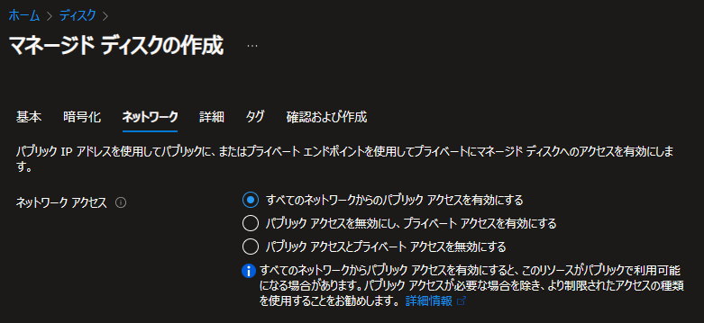
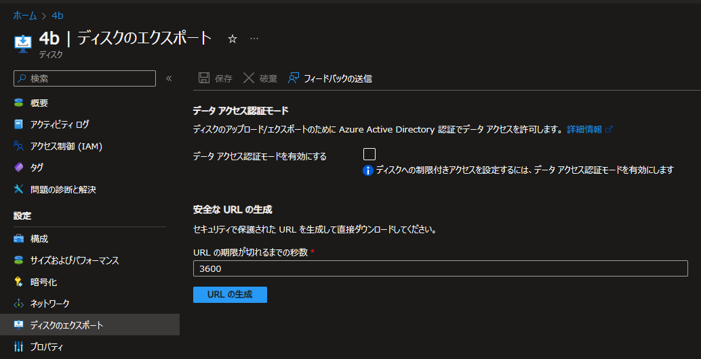

こんにちは、Azure テクニカル サポート チームの富田です。  
マネージドディスクとスナップショットのネットワーク設定について、どういったものであるかといった点をお問い合わせいただくことがございますので、この点を解説させていただきます。

---
## マネージドディスクとスナップショットのネットワーク設定

マネージドディスクやスナップショットを新規作成する際に、作成画面にて以下のように「ネットワーク」というタブで、ネットワーク設定をすることができます。  
（作成後に、後から編集することも可能です。）  

既定では、「すべてのネットワークからのパブリック アクセスを有効にする」となっておりますため、「ディスクに対し外部から不正アクセスされてしまうのでは？」というお問い合わせをいただくこともございます。  
このネットワークの設定は**マネージドディスクとスナップショットのエクスポート/インポートをする際に、アクセス許可をするネットワークを設定する**ものとなっております。  
すなわち、明示的にエクスポート URL の生成を行わない場合は、パブリック上の不特定多数からディスクにアクセスされるといったことはございませんのでご安心ください。  
また Azure VM から接続されているマネージドディスクへの通信に影響を及ぼす設定でもございません。  

>■ご参考：マネージド ディスクがインポートまたはエクスポートされる操作を制限する  
>https://learn.microsoft.com/ja-jp/azure/virtual-machines/disks-restrict-import-export-overview

---
## マネージドディスク / スナップショットのエクスポートについて 

マネージドディスクとスナップショットは以下の通り、ポータル等でエクスポート URL を発行し、VHD ファイルとしてダウンロードを行うといったことが可能です。  
セキュリティ上の観点より、明示的にエクスポート URL を発行しない場合はエクスポートはできず、URL も有効期限を設ける必要がございます。  

>■ご参考：Azure から Windows VHD をダウンロードする  
>https://learn.microsoft.com/ja-jp/azure/virtual-machines/windows/download-vhd

>■ご参考：Azure から Linux VHD をダウンロードする  
>https://learn.microsoft.com/ja-jp/azure/virtual-machines/linux/download-vhd

この際、マネージドディスクおよびスナップショットのネットワーク設定にて既定の「すべてのネットワークからのパブリック アクセスを有効にする」という設定にしている場合、エクスポート URL があればどのパブリックネットワークからも VHD のダウンロード等が可能となります。  
しかしながら、万が一悪意のあるユーザーにエクスポート URL が入手されてしまった場合にも VHD ダウンロードを不可とさせるための設定として、  

- パブリック アクセスを無効にし、プライベート アクセスを有効にする
- パブリック アクセスとプライベート アクセスを無効にする

というオプションもご用意しているといったこととなります。  

「パブリック アクセスを無効にし、プライベート アクセスを有効にする」の設定とした場合は、エクスポート URL があったとしてもパブリックネットワークからのアクセスはできず、Azure 仮想ネットワーク上のクライアントからプライベート リンクを介してでないとアクセスできないといった、よりセキュリティの高い設定となります。  
この点詳細については以下の公開ドキュメントをご参照ください。  

>■ご参考：Azure Private Link を使用してマネージド ディスクに対するインポートおよびエクスポートのアクセスを制限する  
>https://learn.microsoft.com/ja-jp/azure/virtual-machines/disks-enable-private-links-for-import-export-portal

「パブリック アクセスとプライベート アクセスを無効にする」の設定にした場合は、エクスポート URL の発行自体が不可になります。  

上記、エクスポートを例として記載しましたが以下のマネージドディスクに対する VHD インポートについても同じようにネットワークの制限の設定か可能です。

>■ご参考：VHD または VHDX をアップロードする
>https://learn.microsoft.com/ja-jp/azure/virtual-machines/managed-disks-overview#upload-your-vhd-or-vhdx

---

上述の通り、こちらのネットワーク設定はあくまでエクスポート/インポート時のネットワーク制限の設定を行うものである点、ご理解賜りますと幸いでございます。
