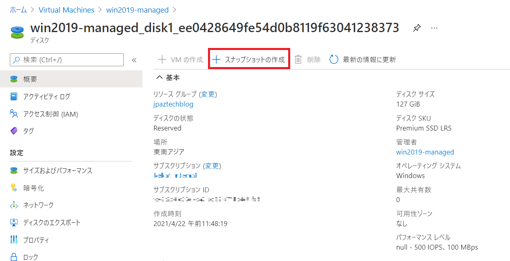
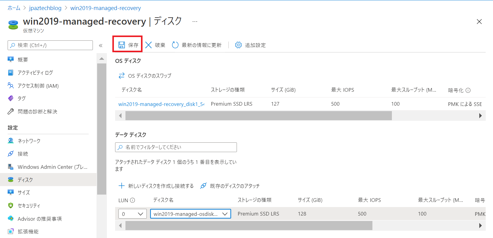
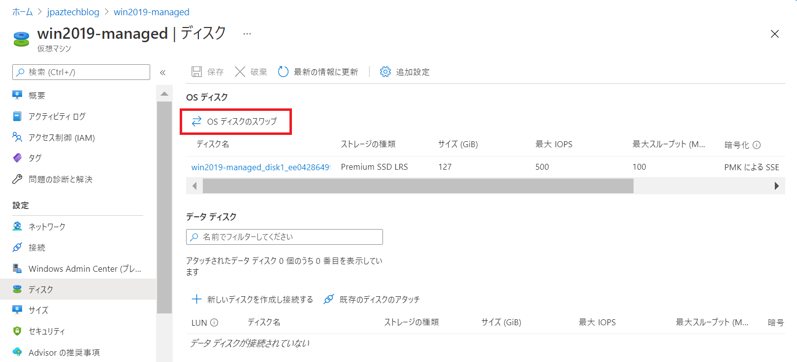
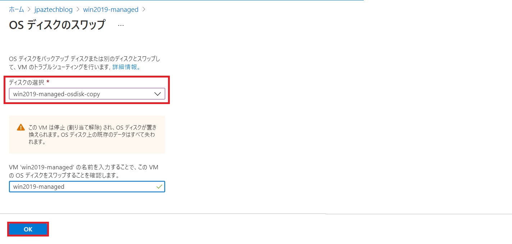

こんにちは。Azure テクニカル サポート チームの重田です。 
本記事では、Windows OS が起動しなくなる事象が発生した際に Windows OS の復旧手順を実施するために、起動ができない VM の OS ディスクを、他の正常な VM にデータ ディスクとして接続する方法について紹介します。

<!-- more -->

Windows OS の復旧手順に関しては、Windows サポートチームのブログからご紹介しています。対処方法に関する記事内に記載されている [3] - [6] を Azure 環境上でお試しいただく方法について、本記事で紹介しています。

> **OS が起動しなくなる問題が発生した場合の対処方法について – 概要**
> [https://jpwinsup.github.io/blog/2021/05/07/Performance/NoBoot/NoBoot-OutLine/](https://jpwinsup.github.io/blog/2021/05/07/Performance/NoBoot/NoBoot-OutLine/)

> **OS が起動しなくなる問題が発生した場合の対処方法について – 対処方法**
> [https://jpwinsup.github.io/blog/2021/05/07/Performance/NoBoot/NoBoot-Solution/](https://jpwinsup.github.io/blog/2021/05/07/Performance/NoBoot/NoBoot-Solution/)

本記事では、**管理ディスク**をご利用の環境用の手順を紹介します。非管理ディスクをご利用の場合は、「[【非管理ディスク編】復旧 VM を使った Windows VM の Noboot 復旧手順](https://jpaztech.github.io/blog/vm/noboot-recovery-unmanaged-disk/)」をご確認ください。

## 概要
1. 当該仮想マシンの OS ディスクのスナップショットを取得します
2. スナップショットから、修復用 OS ディスクを作成します
3. 復旧作業用仮想マシンに、修復用 OS ディスクを接続します
4. 復旧作業用仮想マシンにて、切り分けを実施します
5. 修復用 OS ディスクを、対象仮想マシンの OS ディスクとスワップさせます

## 手順

### 1. 当該仮想マシンの OS ディスクのスナップショットを取得します
Azure Portal より 仮想マシンを停止できるようであれば、停止してからご実施ください。
Azure Portal より [Virtual Machine] - [<当該仮想マシン>] を開き、左メニュー "設定" から [ディスク] をクリックします。
[<当該 OS ディスク>] をクリックし、[スナップショットの作成] をクリックします。

適宜、値を設定し、[確認および作成] - [作成] をクリックします。

> スナップショットの作成
> [https://docs.microsoft.com/ja-jp/azure/virtual-machines/windows/snapshot-copy-managed-disk#use-the-azure-portal](https://docs.microsoft.com/ja-jp/azure/virtual-machines/windows/snapshot-copy-managed-disk#use-the-azure-portal)
 
### 2. スナップショットから、修復用 OS ディスクを作成します
Azure Portal にて [リソースの作成] をクリックし、検索窓に "Managed Disks" と入力します。[作成] をクリックし、適宜値を設定します。[確認および作成] - [作成] をクリックします。
※ "ソースの種類" を [スナップショット] に指定し、1 にて作成したスナップショットを指定します。

> 管理ディスク (Managed Disks) スナップショットより VM をデプロイする
> [https://docs.microsoft.com/ja-jp/archive/blogs/jpaztech/deployvmfromsnapshot](https://docs.microsoft.com/ja-jp/archive/blogs/jpaztech/deployvmfromsnapshot)
> 「2. スナップショットより "ディスク" リソースを作成する」をご確認ください。
 
### 3. 復旧作業用仮想マシンに、修復用 OS ディスクを接続します
本事象のトラブルシューティングを行う復旧作業用仮想マシンを別途ご準備いただき、作成した OS ディスクをデータ ディスクとして接続します。

### 4.復旧作業用仮想マシンにて、切り分けを実施します

下記 Windows OS 観点のブログに記載されている [3] - [6] をお試し下さい。

> OS が起動しなくなる問題が発生した場合の対処方法について – 対処方法
> [https://jpwinsup.github.io/blog/2021/05/07/Performance/NoBoot/NoBoot-Solution/](https://jpwinsup.github.io/blog/2021/05/07/Performance/NoBoot/NoBoot-Solution/)

また、事象別のトラブルシューティングについては、下記公開情報に詳細が記載されています。併せてご確認ください。

> Azure 仮想マシンのブート エラーのトラブルシューティング
> [https://docs.microsoft.com/ja-jp/troubleshoot/azure/virtual-machines/boot-error-troubleshoot](https://docs.microsoft.com/ja-jp/troubleshoot/azure/virtual-machines/boot-error-troubleshoot)

### 5. 修復用 OS ディスクを、対象仮想マシンの OS ディスクとスワップさせます

復旧作業用仮想マシンを停止し、データ ディスクとして接続されている修復した OS ディスクをデタッチします。
対象仮想マシンの OS ディスクを、修復した OS ディスクとスワップします。

> VM の OS ディスクをスワップする
> [https://docs.microsoft.com/ja-jp/troubleshoot/azure/virtual-machines/troubleshoot-recovery-disks-portal-windows#swap-the-os-disk-for-the-vm](https://docs.microsoft.com/ja-jp/troubleshoot/azure/virtual-machines/troubleshoot-recovery-disks-portal-windows#swap-the-os-disk-for-the-vm)

復旧対象仮想マシンを起動し、事象が解消されたかをご確認ください。

手順は以上となります。

## ご参考

> Azure Portal から OS ディスクを復旧 VM にアタッチして Windows VM のトラブルシューティングを行う
> [https://docs.microsoft.com/ja-jp/troubleshoot/azure/virtual-machines/troubleshoot-recovery-disks-portal-windows](https://docs.microsoft.com/ja-jp/troubleshoot/azure/virtual-machines/troubleshoot-recovery-disks-portal-windows)

本記事が皆様のお役に立てれば幸いです。
