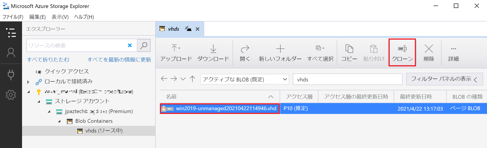
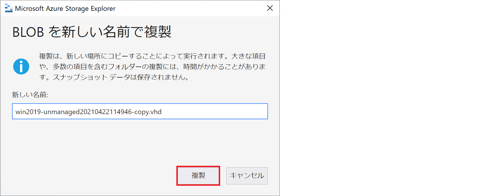
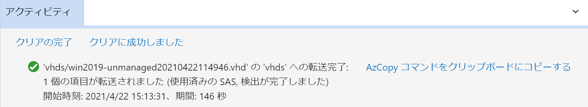
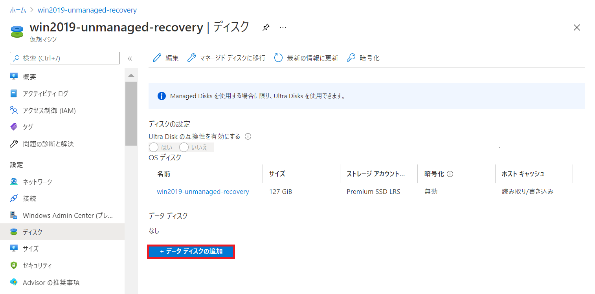
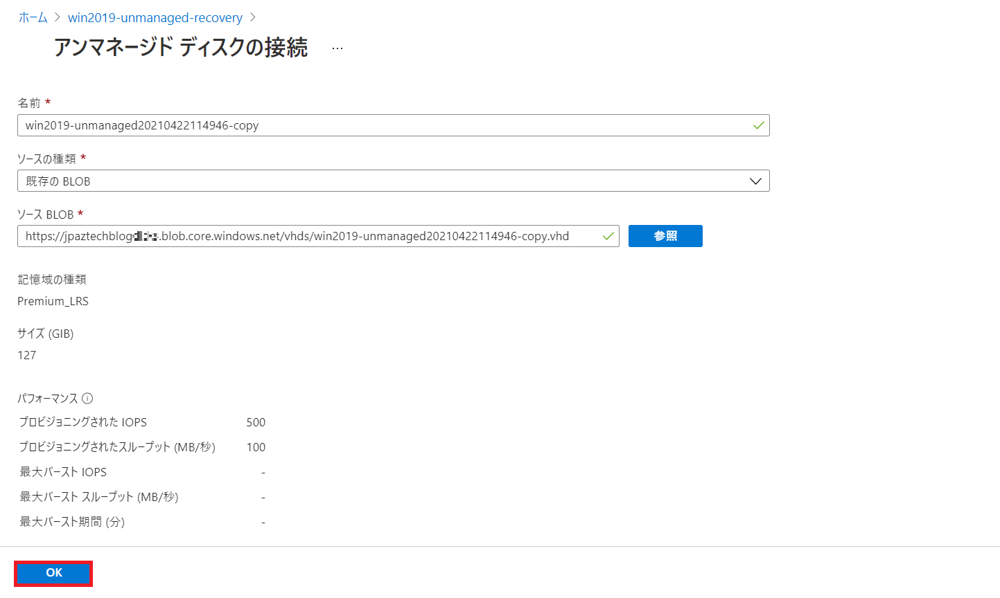
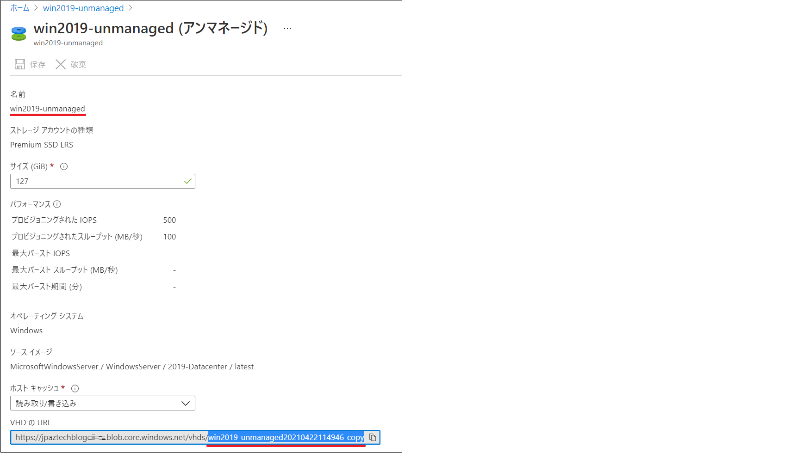

こんにちは。Azure テクニカル サポート チームの重田です。 
本記事では、Windows OS が起動しなくなる事象が発生した際に Windows OS の復旧手順を実施するために、起動ができない VM の OS ディスクを他の正常な VM にデータ ディスクとして接続する方法について紹介します。

<!-- more -->

Windows OS の復旧手順に関しては、Windows サポートチームのブログからご紹介しています。
本記事では、[対処方法] 編に記載されている切り分け [3] - [6] を Azure 環境上でお試しいただく方法について紹介しています。

> **OS が起動しなくなる問題が発生した場合の対処方法について – 概要**
> [https://jpwinsup.github.io/blog/2021/05/07/Performance/NoBoot/NoBoot-OutLine/](https://jpwinsup.github.io/blog/2021/05/07/Performance/NoBoot/NoBoot-OutLine/)

> **OS が起動しなくなる問題が発生した場合の対処方法について – 対処方法**
> [https://jpwinsup.github.io/blog/2021/05/07/Performance/NoBoot/NoBoot-Solution/](https://jpwinsup.github.io/blog/2021/05/07/Performance/NoBoot/NoBoot-Solution/)


本記事では、<span style="color:red;">**非管理ディスク**</span>をご利用の環境用の手順を紹介します。管理ディスクをご利用の場合は、「[【管理ディスク編】復旧 VM を使った Windows VM の Noboot 復旧手順](https://jpaztech.github.io/blog/vm/noboot-recovery-managed-disk/)」をご確認ください。

<hr>

## 概要
1. 復旧対象仮想マシンの OS ディスク VHD ファイルを複製します
2. 復旧作業用の仮想マシンにて、複製した VHD ファイルをデータ ディスクとしてアタッチします
3. 復旧作業用仮想マシンにて、切り分けを実施します。
4. 修復した VHD を Azure PowerShell にて現在の復旧対象の仮想マシンの VHD と差し替えます。

<hr>

## 手順

### 1. 復旧対象仮想マシンの OS ディスク VHD ファイルを複製します

Azure Storage Explorer または AzCopy をご利用いただく方法にて、復旧対象仮想マシンの OS ディスク VHD ファイルを複製します。
　
#### Azure Storage Explorer をご利用いただく場合

Azure Storage Explorer については、下記公開情報をご確認ください。
> Azure Storage Explorer
> [https://azure.microsoft.com/ja-jp/features/storage-explorer/](https://azure.microsoft.com/ja-jp/features/storage-explorer/)

1. 復旧対象仮想マシンを停止 (割り当て解除) します。
2. Azure Storage Explorer にて [ストレージ アカウント] - [<ストレージ アカウント名>] - [Blob Containers] - [vhds (コンテナ―名)] を開き、復旧対象仮想マシンの OS ディスクの VHD を選択した状態で、[クローン] をクリックします。

   

3. "BLOB を新しい名前で複製" 画面にて [<複製後の VHD 名>] を入力し、[複製] をクリックします。

   

4. 複製が完了した際には Azure Storage Explorer の "アクティビティ" に "転送完了" のメッセージが表示されます。

   

#### AzCopy をご利用いただく場合

AzCopy については、下記公開情報をご確認ください。

> AzCopy を使ってみる
> [https://docs.microsoft.com/ja-jp/azure/storage/common/storage-use-azcopy-v10](https://docs.microsoft.com/ja-jp/azure/storage/common/storage-use-azcopy-v10)


1. 復旧対象仮想マシンを停止 (割り当て解除) します。
2. AzCopy コマンドを下記の通り実行します。
   構文：
   ```PowerShell
   ./azcopy.exe copy "https://ストレージアカウント名.blob.core.windows.net/vhds/複製元のディスク名.vhd?SAS" "https://ストレージアカウント名.blob.core.windows.net/vhds/複製後のディスク名.vhd?SAS" --overwrite=prompt --s2s-preserve-access-tier=false --recursive
   ```

### 2. 復旧作業用の仮想マシンにて、複製した VHD ファイルをデータ ディスクとしてアタッチします

1. 復旧作業用の仮想マシンを作成します。
   Azure Portal から [Virtual Machines] を開き、 [+ 追加] をクリックし、復旧対象仮想マシンと同様のリージョンにて、同様の OS バージョンの非管理ディスクを用いた仮想マシンを作成します。
2. 複製した VHD ファイルをデータ ディスクとしてアタッチします。
   Azure Portal から [Virtual Machines] - [<復旧作業用の仮想マシン名>] を開き、左メニュー "設定" の [ディスク] をクリックします。
3. 開いた画面にて [+ データ ディスクの追加] をクリックします。

   

   [ソースの種類] を [既存の BLOB] とし、[ソース BLOB] を手順 2 にて複製した VHD を選択します。

   

   [OK] をクリックし、前の画面にて [保存] をクリックします。

   

4. 復旧作業用仮想マシンに RDP 接続し、追加したデータ ディスクが認識されるかを確認します。
 
### 3. 復旧作業用仮想マシンにて、切り分けを実施します

下記 Windows OS 観点のブログに記載されている [3] - [6] をお試し下さい。

> OS が起動しなくなる問題が発生した場合の対処方法について – 対処方法
> [https://jpwinsup.github.io/blog/2021/05/07/Performance/NoBoot/NoBoot-Solution/](https://jpwinsup.github.io/blog/2021/05/07/Performance/NoBoot/NoBoot-Solution/)

また、事象別のトラブルシューティングについては、下記公開情報に詳細が記載されています。併せてご確認ください。

> Azure 仮想マシンのブート エラーのトラブルシューティング
> [https://docs.microsoft.com/ja-jp/troubleshoot/azure/virtual-machines/boot-error-troubleshoot](https://docs.microsoft.com/ja-jp/troubleshoot/azure/virtual-machines/boot-error-troubleshoot)

### 4. 修復した VHD を Azure PowerShell にて現在の復旧対象の仮想マシンの VHD と差し替えます

1. Azure Portal より復旧作業用仮想マシンを停止 (割り当て解除) します。
2. Azure Portal から [Virtual Machines] - [<復旧作業用の仮想マシン名>] を開き、左メニュー "設定" の [ディスク] をクリックします。
3. データディスクをデタッチし、[保存] をクリックます。
4. 復旧対象仮想マシンを停止 (割り当て解除) されていることを確認します。

5. PowerShell にて下記コマンドを実行します。
   ```PowerShell
   #VM 情報の取得
   $VM = Get-AzVM -ResourceGroupName リソースグループ名 -name 復旧対象仮想マシン名
   #VHD ファイルの内容を差し替え
   $VM.StorageProfile.OsDisk.Vhd.Uri = "修復した VHD ファイルのパス"
   #VM 情報の更新
   Update-AzVM –VM $VM –ResourceGroupName リソースグループ名
   ```
   結果例：
   ```PowerShell
   RequestId IsSuccessStatusCode StatusCode ReasonPhrase
   --------- ------------------- ---------- ------------
                            True         OK OK
   ```

   Azure PowerShell については、下記公開情報をご確認ください。

   > Install the Azure Az PowerShell module
   > [https://docs.microsoft.com/ja-jp/powershell/azure/install-az-ps?view=azps-5.9.0](https://docs.microsoft.com/ja-jp/powershell/scripting/install/installing-powershell)

6. 上記コマンド実施後、復旧対象仮想マシンの OS ディスクの参照先が変更されていることを確認します。

   

7. 復旧対象仮想マシンを起動し、事象が解消されたかをご確認ください。

手順は以上となります。
本記事が皆様のお役に立てれば幸いです。