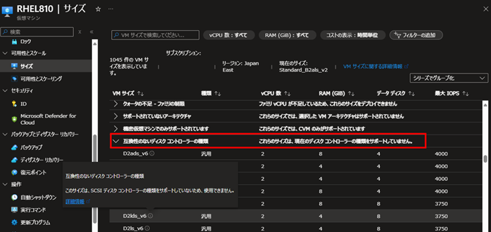
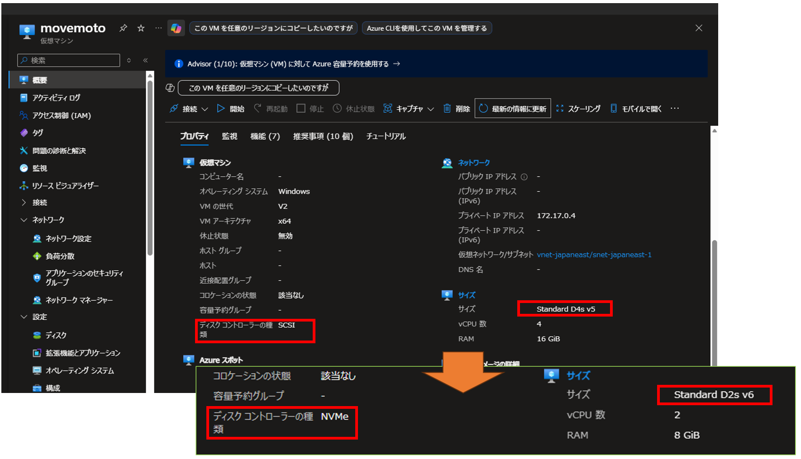
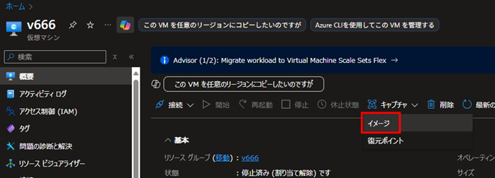

こんにちは。Azure テクニカル サポート チームの富田です。  
今回は、Dsv6 シリーズ等の NVMe 必須となる VM サイズシリーズのご利用を検討されているお客様より、よくお問い合わせをいただく以下の点について解説させていただきます。  

- [NVMe ディスクコントローラータイプの必須の VM サイズとは](./#NVMe-%E3%83%87%E3%82%A3%E3%82%B9%E3%82%AF%E3%82%B3%E3%83%B3%E3%83%88%E3%83%AD%E3%83%BC%E3%83%A9%E3%83%BC%E3%82%BF%E3%82%A4%E3%83%97%E3%81%AE%E5%BF%85%E9%A0%88%E3%81%AE-VM-%E3%82%B5%E3%82%A4%E3%82%BA%E3%81%A8%E3%81%AF)
- [どの VM サイズが NVMe 必須サイズであるかを確認する](./#%E3%81%A9%E3%81%AE-VM-%E3%82%B5%E3%82%A4%E3%82%BA%E3%81%8C-NVMe-%E5%BF%85%E9%A0%88%E3%82%B5%E3%82%A4%E3%82%BA%E3%81%A7%E3%81%82%E3%82%8B%E3%81%8B%E3%82%92%E7%A2%BA%E8%AA%8D%E3%81%99%E3%82%8B)
- [NVMe 必須サイズを利用するにあたっての前提条件](./#NVMe-%E5%BF%85%E9%A0%88%E3%82%B5%E3%82%A4%E3%82%BA%E3%82%92%E5%88%A9%E7%94%A8%E3%81%99%E3%82%8B%E3%81%AB%E3%81%82%E3%81%9F%E3%81%A3%E3%81%A6%E3%81%AE%E5%89%8D%E6%8F%90%E6%9D%A1%E4%BB%B6)
- [SCSI 必須サイズと NVMe 必須サイズ間の VM サイズ変更について](./#SCSI-%E5%BF%85%E9%A0%88%E3%82%B5%E3%82%A4%E3%82%BA%E3%81%A8-NVMe-%E5%BF%85%E9%A0%88%E3%82%B5%E3%82%A4%E3%82%BA%E9%96%93%E3%81%AE-VM-%E3%82%B5%E3%82%A4%E3%82%BA%E5%A4%89%E6%9B%B4%E3%81%AB%E3%81%A4%E3%81%84%E3%81%A6)
- [ディスクコントローラーを変更し NVMe 必須サイズへ変更する方法、および SCSI 必須サイズに戻す方法](./#%E3%83%87%E3%82%A3%E3%82%B9%E3%82%AF%E3%82%B3%E3%83%B3%E3%83%88%E3%83%AD%E3%83%BC%E3%83%A9%E3%83%BC%E3%82%92%E5%A4%89%E6%9B%B4%E3%81%97-NVMe-%E5%BF%85%E9%A0%88%E3%82%B5%E3%82%A4%E3%82%BA%E3%81%B8%E5%A4%89%E6%9B%B4%E3%81%99%E3%82%8B%E6%96%B9%E6%B3%95%E3%80%81%E3%81%8A%E3%82%88%E3%81%B3-SCSI-%E5%BF%85%E9%A0%88%E3%82%B5%E3%82%A4%E3%82%BA%E3%81%AB%E6%88%BB%E3%81%99%E6%96%B9%E6%B3%95)
- [NVMe 必須サイズ対応のカスタムイメージを用意する方法](./#NVMe-%E5%BF%85%E9%A0%88%E3%82%B5%E3%82%A4%E3%82%BA%E5%AF%BE%E5%BF%9C%E3%81%AE%E3%82%AB%E3%82%B9%E3%82%BF%E3%83%A0%E3%82%A4%E3%83%A1%E3%83%BC%E3%82%B8%E3%82%92%E7%94%A8%E6%84%8F%E3%81%99%E3%82%8B%E6%96%B9%E6%B3%95)

---

## NVMe ディスクコントローラータイプの必須の VM サイズとは

従来の Azure VM では SCSI ディスクコントローラーのみがサポートされておりましたが、近年発表された比較的新しい VM サイズシリーズでは、NVMe ディスクコントローラーのみがサポートされるといったものが増えてきました。  
例えば汎用サイズである Dsv6, Dasv6 シリーズなどは、NVMe ディスクコントローラーが必須な VM シリーズとなっております。  
以下、そのようなサイズを **NVMe 必須サイズ** と記載させていただきます。  

NVMe コントローラーを利用することで従来の SCSI コントローラーを利用する場合よりもディスク性能が向上することが期待されますが、NVMe コントローラーならではの制約などもございますので、本ブログ記事にて解説をさせていただきます。  
NVMe の詳細等については以下の公式ドキュメントもご参照くださいませ。  

■ご参考：NVMe の概要  
https://learn.microsoft.com/ja-jp/azure/virtual-machines/nvme-overview  

■ご参考：NVMe に関する一般的な FAQ  
https://learn.microsoft.com/ja-jp/azure/virtual-machines/enable-nvme-faqs  

■ご参考：リモート NVMe ディスクに関する FAQ  
https://learn.microsoft.com/ja-jp/azure/virtual-machines/enable-nvme-remote-faqs  

> [!TIP]
> 一時ディスクが付属する NVMe 必須サイズにて、その一時ディスクを使用するにはゲスト OS 内でフォーマットが必要でございます。  
> ＝＝＝＝＝＝＝＝＝＝＝＝＝＝＝＝＝＝＝＝＝＝＝＝＝＝＝＝＝＝＝＝
> ■ご参考：一時 NVMe ディスクを使用して VM を構成する場合、どのような変更を準備する必要がありますか?  
> https://learn.microsoft.com/ja-jp/azure/virtual-machines/enable-nvme-temp-faqs#---nvme-----------vm------------------------------  
> ＝＝＝＝＝＝＝＝＝＝＝＝＝＝＝＝＝＝＝＝＝＝＝＝＝＝＝＝＝＝＝＝
> 抜粋："VM の起動後にディスクを初期化してフォーマットする必要があります。 ユーザーが開始した停止、割り当て解除、計画メンテナンス、および Azure で開始された自動復旧イベントの後、VM は生の一時 NVMe ディスクのみで起動します。 NVMe ディスクが初期化され、フォーマットされるまで、一時 NVMe ディスクはアプリケーションに表示されません。"

---

## どの VM サイズが NVMe 必須サイズであるかを確認する

では、実際にどの VM サイズが NVMe 必須サイズであるかという点を確認する方法を紹介させていただきます。  
次の Azure PowerShell / Azure CLIコマンドで、指定したリージョンにおける、各 VM サイズのサポートされるディスクコントローラーを確認することが可能です。  
＜リージョン名＞ の部分は japaneast などリージョン名に置き換えをお願いいたします。  

- PowerShell + Azure PowerShell 環境でのコマンド例

```PowerShell
Get-AzComputeResourceSku -Location ＜リージョン名＞ |
  Where-Object { $_.ResourceType -eq 'virtualMachines' } |
  Select-Object Family, Name,
    @{Name='vCPUs';Expression={
      ($_.Capabilities | Where-Object Name -eq 'vCPUsAvailable' | Select-Object -ExpandProperty Value -First 1)
    }},
    @{Name='DiskControllerTypes';Expression={
      ($_.Capabilities | Where-Object Name -eq 'DiskControllerTypes' | Select-Object -ExpandProperty Value -First 1)
    }} |
  Sort-Object -Property @{Expression='Family'; Ascending=$true},
                        @{Expression={ [int]$_.vCPUs }; Ascending=$true} |
  Format-Table -AutoSize
```
- Bash + Azure CLI 環境でのコマンド例

```Bash
az vm list-skus -l ＜リージョン名＞ -r virtualMachines \
  --query "sort_by([].{Family: family, Size: name, DiskControllerTypes: capabilities[?name=='DiskControllerTypes'].value|[0], vCPUs: to_number(capabilities[?name=='vCPUsAvailable'].value|[0])}, &vCPUs) | sort_by(@, &Family)" \
  -o table
```
実際のコマンドの実行結果の例を一部抜粋いたします。  

```
Family                           Name                      vCPUs DiskControllerTypes
------                           ----                      ----- -------------------
standardEAv4Family               Standard_E96a_v4          96
StandardNCadsH100v5Family        Standard_NC80adis_H100_v5 80    SCSI
standardEBDSv5Family             Standard_E2bds_v5         2     SCSI,NVMe
standardEav6Family               Standard_E2as_v6          2     NVMe
```

この得られた内容から DiskControllerTypes を確認することで、以下のようにサポートされるディスクコントローラータイプを判別することが可能です。  

| DiskControllerTypes | VM サイズのディスクコントローラーサポート状況 |
| --- | --- |
| 空欄 | SCSI ディスクコントローラー必須の VM サイズです。 |
| SCSI | SCSI ディスクコントローラー必須の VM サイズです。 |
| SCSI,NVMe | SCSI,NVMe 両方のディスクコントローラーをサポートしている VM サイズです。（極一部の VM サイズファミリのみ。） |
| NVMe | NVMe ディスクコントローラー必須の VM サイズです。 |

> [!TIP]
> ご希望の VM サイズがどのゾーンで提供されているか確認をしたい場合は、以下のブログ記事をご参照ください。  
> ＝＝＝＝＝＝＝＝＝＝＝＝＝＝＝＝＝＝＝＝＝＝＝＝＝＝＝＝＝＝＝＝
> ■ご参考：当該リージョン、ゾーンにて変更先のサイズが提供されているか  
> https://jpaztech.github.io/blog/vm/vm-size-change/#%E5%BD%93%E8%A9%B2%E3%83%AA%E3%83%BC%E3%82%B8%E3%83%A7%E3%83%B3%E3%80%81%E3%82%BE%E3%83%BC%E3%83%B3%E3%81%AB%E3%81%A6%E5%A4%89%E6%9B%B4%E5%85%88%E3%81%AE%E3%82%B5%E3%82%A4%E3%82%BA%E3%81%8C%E6%8F%90%E4%BE%9B%E3%81%95%E3%82%8C%E3%81%A6%E3%81%84%E3%82%8B%E3%81%8B

---

## NVMe 必須サイズを利用するにあたっての前提条件

NVMe 必須サイズを利用する場合、以下の前提条件を満たしている必要がございます。  

### 第 2 世代 VMである

第 2 世代 VM をご利用いただく必要がございます。  

■ご参考：第 1 世代 VM は NVMe ディスクでサポートされますか?  
https://learn.microsoft.com/ja-jp/azure/virtual-machines/enable-nvme-faqs#--1----vm---nvme----------------  

### ゲスト OS が NVMe をサポートしている必要がある

ゲスト OS が NVMe をサポートするバージョンである必要がございます。  
NVMe サポート対象の OS は以下のドキュメントよりご確認ください。  

■ご参考：リモート NVMe でサポートされている OS イメージ  
https://learn.microsoft.com/ja-jp/azure/virtual-machines/enable-nvme-interface  

### 新規 VM 作成時は NVMe のマークのあるイメージを使用する必要がある
NVMe 必須サイズで新規 VM 作成をする際は、NVMe 対応のマークのあるイメージから VM 作成が必要となっております。  
NVMe に対応するカスタムイメージを作成する例については、後述させていただきます。  
詳細は以下のドキュメントをご参照ください。  

■ご参考：NVMe 対応のマーク  
https://learn.microsoft.com/ja-jp/azure/virtual-machines/nvme-overview#mark-as-nvme-capable   
 
---

## SCSI 必須サイズと NVMe 必須サイズ間の VM サイズ変更について

以下の通り、同じディスクコントローラーを必須とする VM サイズ間での VM サイズ変更は簡単に可能でございます。  
他方、現在と異なるディスクコントローラーを必須とするサイズへ変更する場合はディスクコントローラー変換といった対応が必要となります。  

| 現在の VM サイズ | 変更先の VM サイズ | 変更可否について |
| --- | --- | --- |
| SCSI 必須 サイズ | SCSI 必須 サイズ | 変更可能。 |
| **NVMe** 必須 サイズ | **NVMe** 必須 サイズ | 変更可能。 |
| SCSI 必須 サイズ | **NVMe** 必須 サイズ | 変更可能だが、ディスクコントローラーの変換対応が必要。 |
| **NVMe** 必須 サイズ | SCSI 必須 サイズ | 変更可能だが、ディスクコントローラーの変換対応が必要。 |

ディスクコントローラーの変換が必要な場合は、Azure ポータルでは以下のようにディスクコントローラーの互換性が無いとの表示となり、VM サイズ変更の選択が叶いません。  



> [!NOTE]
> トラステッド起動で構成された VM の場合、SCSI 必須サイズから NVMe 必須サイズに移行することは叶いませんのでご留意ください。  
> ＝＝＝＝＝＝＝＝＝＝＝＝＝＝＝＝＝＝＝＝＝＝＝＝＝＝＝＝＝＝＝＝
> ■ご参考：トラステッド起動で構成された VM を SCSI から NVMe に移行することはできますか?  
> https://learn.microsoft.com/ja-jp/azure/virtual-machines/enable-nvme-faqs#---------------vm---scsi----nvme---------------  
> ＝＝＝＝＝＝＝＝＝＝＝＝＝＝＝＝＝＝＝＝＝＝＝＝＝＝＝＝＝＝＝＝
> 抜粋："いいえ。トラステッド起動で構成された VM を SCSI から NVMe に移行することはできません。"

既存の VM について、VM サイズ変更元と変更先の必須ディスクコントローラーが違う場合に、VM サイズ変更方法について以下に解説させていただきます。   

---

## ディスクコントローラーを変更し NVMe 必須サイズへ変更する方法、および SCSI 必須サイズに戻す方法

> [!WARNING]
> 恐縮ながら現時点において、**既存の Windows VM** については SCSI 必須サイズから NVMe 必須サイズに変更することを明確にサポートしている手順のご用意がございません。  
> そのため、原則としては新規に Azure マーケットプレイスなどから NVMe 必須サイズの Windows VM を新規に構築いただくことをご検討ください。  
> 下記の Azure-NVMe-Conversion.ps1 にて Windows VM を NVMe 必須サイズに変更する操作自体は可能と存じますが、変更後にゲスト OS 起動不可の問題等が発生した場合は別途新規 VM 構築の方針をとっていただけますと幸いです。  
> v5 サイズといった SCSI ディスクコントローラーを採用する VM サイズ内でのサイズ変更もご検討いただけますと幸いでございます。  

> [!WARNING]
> Azure-NVMe-Conversion.ps1 を利用の際は、ゲスト OS 起動不可等の予期せぬ状況に備えて、必ずバックアップ取得を行った上で検証や実施をお願いいたします。
> もし、予期せず起動不可となってしまった場合には、サイズを戻すことやバックアップからのリストアをご検討ください。

以下の Azure NVMe Utilities に含まれる Azure-NVMe-Conversion.ps1 という PowerShell スクリプトをご利用いただくことで、Azure VM を NVMe 必須サイズへ変更および、SCSI 必須サイズに戻すことが可能です。  
このスクリプトでは Azure VM のディスクコントローラーの変更も行われます。

■ご参考：Azure NVMe Utilities  
https://github.com/Azure/SAP-on-Azure-Scripts-and-Utilities/tree/main/Azure-NVMe-Utils  

上記ドキュメントの Usage に記載の手順となりますが、一部補足しつつ手順について解説させていただきます。  

---

### NVMe 必須サイズへ変更および SCSI 必須サイズに戻す手順の解説

1:  
Azure PowerShell の実行環境をご用意ください。  
Azure Cloud Shell 上の PowerShell をご利用いただくことも可能です。  

■ご参考：Azure PowerShell をインストールする方法  
https://learn.microsoft.com/ja-jp/powershell/azure/install-azure-powershell  

2:  
PowerShell 上にて、署名されていない PowerShell スクリプトを許可する設定を行うため、以下のコマンドを実行します。  
Cloud Shell 環境や、既にスクリプト実行が可能な環境の場合はスキップ可能と存じます。  

```PowerShell
Set-ExecutionPolicy -ExecutionPolicy Unrestricted
```

3:  
Azure アカウントに接続していない場合は、以下のコマンドでサインインします。  

```PowerShell
Connect-AzAccount
```

4:  
現在接続しているサブスクリプションを確認し、必要に応じて対象サブスクリプションに切り替えます。  

```PowerShell
# dummy
# 現在接続しているサブスクリプションの確認
Get-AzContext

# 接続先サブスクリプションの切り替え
Select-AzSubscription -Subscription xxxxxxxx-xxxx-xxxx-xxxx-xxxxxxxxxxxx
```

5:  
以下の PowerShell コマンドで変換用のスクリプトをダウンロードします。  

```PowerShell
Invoke-WebRequest -Uri "https://raw.githubusercontent.com/Azure/SAP-on-Azure-Scripts-and-Utilities/refs/heads/main/Azure-NVMe-Utils/Azure-NVMe-Conversion.ps1" -OutFile ".\Azure-NVMe-Conversion.ps1"
```

6:  
ダウンロードした変換スクリプトを実行します。**VM 起動状態**にて実施をお願いいたします。  
以下は NVMe 必須サイズもしくは SCSI 必須サイズに変換する例となります。  

```PowerShell
# スクリプト実行の例
./Azure-NVMe-Conversion.ps1 -ResourceGroupName <リソースグループ名> -VMName <VM名> -NewControllerType <NVMe もしくは SCSI> -VMSize <変換先 VM サイズ名> -FixOperatingSystemSettings
```

```PowerShell
# スクリプト実行の例（NVMe 必須サイズへ変換する際の実際の値の例）
./Azure-NVMe-Conversion.ps1 -ResourceGroupName yourRGNAME -VMName yourVMNAME -NewControllerType NVMe -VMSize Standard_D2s_v6 -FixOperatingSystemSettings
```

実行が成功すると、以下の例のように NVMe 必須サイズおよび NVMe ディスクコントローラーへの変更が完了しているはずです。  
ゲスト OS の起動等に問題が無いか、ブート診断の確認や実際の接続テスト等もお願いいたします。  



> [!IMPORTANT]
> 上記のスクリプト実行にあたっての免責事項等について以下をご参照ください。  
> https://github.com/Azure/SAP-on-Azure-Scripts-and-Utilities/blob/main/LICENSE  

---

### Azure-NVMe-Conversion.ps1 のパラメータの解説

Azure-NVMe-Conversion.ps1 の全てのパラメータのオプション一覧および解説については、上記の Azure NVMe Utilities 内のドキュメントの記載を参照いただきたく存じますが、上記の例で使用しているオプションについて解説させていただきます。  

| パラメータ | 解説 |
| --- |--- |
| -ResourceGroupName | 変換元の VM が存在するリソースグループ名を指定します。 |
| -VMName | 変換元の VM 名を指定します。 |
| -NewControllerType | NVMe 必須サイズに変換する場合は、**NVMe** を指定します。SCSI 必須サイズにする場合は、**SCSI** を指定します。 |
| -VMSize | 変換先の VM サイズを指定します。 |
| -FixOperatingSystemSettings | ディスクコントローラー変換にあたり、ゲスト OS 内の設定を RunCommands を用いて自動的に変更します。 |

---

### NVMe サイズへの変更に関する参考情報

以下は NVMe サイズへの変更に関する、各種参考情報となります。  

■ご参考：SCSI ベースの VM のサイズを、異なるサイズのリモート NVMe 対応 VM にサイズ変更するにはどうすればよいですか?  
https://learn.microsoft.com/ja-jp/azure/virtual-machines/enable-nvme-remote-faqs#scsi------vm-------------------nvme----vm----------------------  

■ご参考：Moving Linux and Windows from SCSI to NVMe with one easy command  
https://techcommunity.microsoft.com/blog/sapapplications/moving-linux-and-windows-from-scsi-to-nvme-with-one-easy-command/4427954  

■ご参考：Linux を実行している仮想マシンの SCSI から NVMe への変換  
https://learn.microsoft.com/ja-jp/azure/virtual-machines/nvme-linux  

---

## NVMe 必須サイズ対応のカスタムイメージを用意する方法

前述の通り、VM イメージから NVMe 必須サイズの VM の作成をする場合は、そのイメージが NVMe 対応にマークされている必要がございます。  
これはお客様自身でご用意いただく、カスタムイメージについても同様でございます。  

NVMe 対応にマークされていないイメージから NVMe 必須サイズで VM 作成しようとすると、Azure ポータルの場合「互換性のないディスク コントローラーの種類 このサイズは、SCSI ディスク コントローラーの種類をサポートしていないため、使用できません。」というメッセージが表示され、NVMe 必須サイズの選択が叶いません。  

> [!NOTE]
> NVMe 必須サイズは以下の通り、Azure マーケットプレースおよび Azure Compute Gallery からのみ作成可能であり、Azure Compute Gallery を使用しないレガシマネージドイメージからは作成が叶いません点ご留意ください。  
> ＝＝＝＝＝＝＝＝＝＝＝＝＝＝＝＝＝＝＝＝＝＝＝＝＝＝＝＝＝＝＝＝
> ■ご参考：NVMe 対応のマーク  
> https://learn.microsoft.com/ja-jp/azure/virtual-machines/nvme-overview#mark-as-nvme-capable  
> ＝＝＝＝＝＝＝＝＝＝＝＝＝＝＝＝＝＝＝＝＝＝＝＝＝＝＝＝＝＝＝＝
> 抜粋："NVMe インターフェイスが有効な VM は、NVMe とマークされたイメージ (マーケットプレースで入手可能。または社内の Azure Compute Gallery で共有されます) を使用して**のみ**作成できます。"

NVMe 必須サイズ対応のカスタムイメージを用意する例について紹介させていただきます。  

---

### NVMe 必須サイズ対応のカスタムイメージを用意する例

1:  
Azure マーケットプレースから新規に NVMe 必須サイズで VM を作成します。  

2:  
必要に応じて、作成した VM 内で OS 内のカスタムや一般化作業を行います。  

3:  
Azure Compute Gallery に NVMe 対応のイメージ定義を作成し、イメージを登録します。  
Azure ポータルの場合、対象の VM の画面から [キャプチャ] -> [イメージ] を選択することで登録ができます。  



4:  
イメージ作成画面に遷移しますので、イメージを作成します。  


上記画像例のように「Azure コンピューティング ギャラリーにイメージを共有する：はい、ギャラリーに VM イメージ バージョンとして共有します。」を選択します。  

その後「ターゲット VM イメージ定義：新規作成」より新規の VM イメージ定義作成ができます。  
この VM イメージ定義作成にて「NVMe によるストレージ パフォーマンスの向上」にチェックを入れます。  
これにより NVMe 必須サイズの VM 作成が可能な、NVMe 対応にマークされたイメージとして登録できるようになります。  

> [!TIP]
> 本手順では、イメージ作成元の VM が NVMe 必須サイズの場合は自動で「NVMe によるストレージ パフォーマンスの向上」にチェックが入っているものと存じます。  
> 他方、イメージ作成元の VM が SCSI 必須サイズの場合は、このチェックの選択はできません。

各種設定後、「確認および作成」ボタンよりイメージ作成を行います。  

5:  
上記手順で作成したイメージからは、NVMe 必須サイズおよび SCSI 必須サイズ両方での VM 作成が可能と存じます。  
実際に OS 起動等に問題が無いかご確認をお願いいたします。  

---

以上が NVMe 必須サイズに関する解説となります。  
上記の情報は記事執筆時点のものとなり、公開情報や機能等は日々更新されていきますので、必要に応じて公開情報等の最新情報もご参照いただけますと幸いでございます。  

これらの内容が皆様のお役に立てますと幸いです。  

