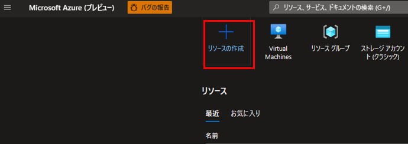
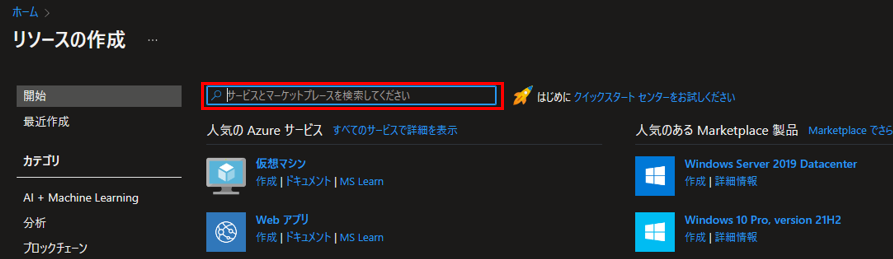
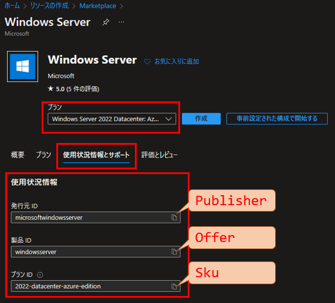
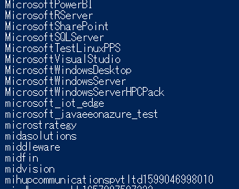
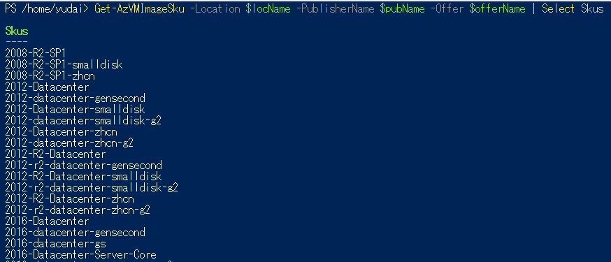
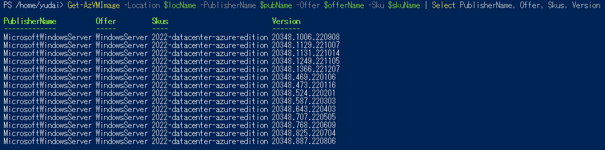
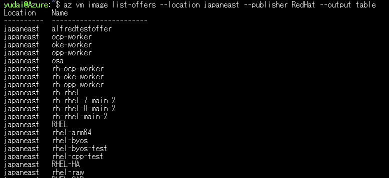
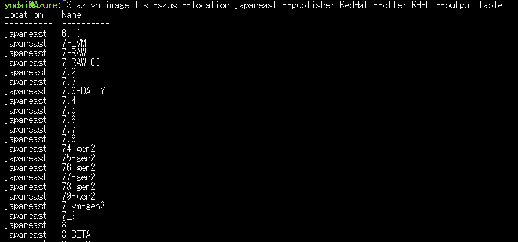
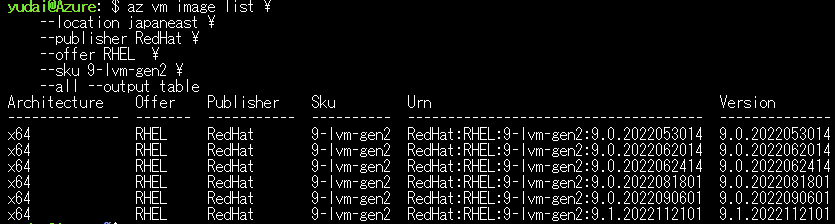
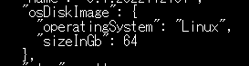

こんにちは。Azure テクニカル サポート チームの富田です。  
今回はお問い合わせいただくことの多い、Azure マーケットプレイスのイメージの OS ディスクサイズについて、  
確認方法・拡張方法・縮小不可などの点について解説させていただきます。  

<!--more-->

---
## 1.イメージの URN を把握する

イメージの OS ディスクサイズを確認や、コマンドベースでイメージを指定してデプロイを行う場合は、  
まずは当該イメージの URN（Uniform Resource Name）を把握する必要があります。
イメージの URN は以下のような 4 つの情報の組み合わせで構成されています。  

 - Publisher
 - Offer
 - Sku
 - Version

この 4 つの情報を組み合わせることで、特定のイメージが指定できるということになります。  
例えば、Azure マーケットプレイス に公開されている 2022/12/29 時点で最新の Windows Server 2022 Datacenter: Azure Edition の URN 以下のようになります。 

 - Publisher : microsoftwindowsserver
 - Offer : windowsserver
 - Sku : 2022-datacenter-azure-edition
 - Version : 20348.1366.221207

ここでひとつ注意したい点は、Azure マーケットプレイスのイメージにおける Version は、あくまでイメージの Version であって、  
「Windows Server 2012」「Windows Server 2019」といった OS の違いは、Sku の方で定義されているということです。  

同じ Windows Server 2022 Datacenter: Azure Edition でも、イメージの Version が古いものはビルド等が古いといったこととなります。  

では、実際にこの URN をどうやって確認するのか、「Azure ポータル」「Azure PowerShell」「Azure CLI」それぞれで確認する方法から見ていきましょう。  

---
## 1-1.Azure ポータルでイメージの URN を把握する

Azure ポータルにログインし、「リソースの作成」を選択します。



「リソースの作成」画面の検索ボックスより、Azure マーケットプレイスのイメージを検索します。



対象のイメージを選択します。


対象のイメージの画面上で、「プラン」を選択の上、「使用状況確認とサポート」タブを選択します。



上記のように、URN が表示されます。  
恐縮ながら Azure ポータルでは Version の一覧の確認は叶いませんため、Version について確認が必要な場合は、後述のコマンドベースでのご確認をお願いいたします。

---
## 1-2.Azure PowerShell でイメージの URN を把握する

基本的に以下の公式ドキュメントの方法となりますが、実際にコマンドの実行結果と共に見ていきましょう。  
Publisher → Offer → Sku → Version の順で絞り込んで検索していくような形となります。

> ■ご参考：Azure PowerShell を使用して Azure Marketplace VM イメージを検索して使用する
> [https://learn.microsoft.com/ja-jp/azure/virtual-machines/windows/cli-ps-findimage](https://learn.microsoft.com/ja-jp/azure/virtual-machines/windows/cli-ps-findimage)

まずは、リージョンを指定して Publisher の一覧を取得します。

> [!TIP]
> リージョン名は下記コマンドで Location として表示されるものを使います。  
> Get-AzLocation | select Location, DisplayName

```CMD
$locName = "リージョン名"
Get-AzVMImagePublisher -Location $locName | Select PublisherName
```

以下が実際に実行した結果の一部です。Publisher の一覧が表示されていますね。



次に、確認した Publisher を指定してその Publisher が公開している Offer の一覧を表示しましょう。

```CMD
$locName = "リージョン名"
$pubName = "パブリッシャー名"
Get-AzVMImageOffer -Location $locName -PublisherName $pubName | Select Offer
```

以下が実際に実行した結果の一部です。Publisher が公開している Offer の一覧が表示されました。


次に、確認した Offer を指定してその Offer 内の Sku の一覧を表示しましょう。

```CMD
$locName = "リージョン名"
$pubName="パブリッシャー名"
$offerName = "オファー名"
Get-AzVMImageSku -Location $locName -PublisherName $pubName -Offer $offerName | Select Skus
```

以下が実際に実行した結果の一部です。指定した Offer 内の Sku の一覧が表示されました。



最後に、Sku を指定してその Sku 内の Version の一覧を調べましょう。  

```CMD
$locName = "リージョン名"
$pubName="パブリッシャー名"
$offerName = "オファー名"
$skuName = "SKU 名"
Get-AzVMImage -Location $locName -PublisherName $pubName -Offer $offerName -Sku $skuName | Select PublisherName, Offer, Skus, Version
```
以下が実際に実行した結果の一部です。  
無事に Version 一覧も取得でき、Publisher, Offer, Sku, Version の組み合わせでイメージの URN が把握できました。



---
## 1-3.Azure CLI でイメージの URN を把握する

基本的に以下の公式ドキュメントの方法となりますが、実際にコマンドの実行結果と共に見ていきましょう。  
Publisher → Offer → Sku → Version の順で絞り込んで検索していくような形となります。

> ■ご参考：Azure CLI を使用して Azure Marketplace イメージ情報を検索する
> [https://learn.microsoft.com/ja-jp/azure/virtual-machines/linux/cli-ps-findimage](https://learn.microsoft.com/ja-jp/azure/virtual-machines/linux/cli-ps-findimage)

まずは、リージョンを指定して Publisher の一覧を取得します。

> [!TIP]
> リージョン名は下記コマンドで name として表示されるものを使います。  
> az account list-locations

```SHELL
az vm image list-publishers --location ＜リージョン名＞ --output table
```

以下が実際に実行した結果の一部です。Publisher の一覧が表示されていますね。


次に、確認した Publisher を指定してその Publisher が公開している Offer の一覧を表示しましょう。

```SHELL
az vm image list-offers --location ＜リージョン名＞ --publisher ＜パブリッシャー名＞ --output table
```

以下が実際に実行した結果の一部です。Publisher が公開している Offer の一覧が表示されました。



次に、確認した Offer を指定してその Offer 内の Sku の一覧を表示しましょう。

```SHELL
az vm image list-skus --location ＜リージョン名＞ --publisher ＜パブリッシャー名＞ --offer ＜オファー名＞ --output table
```

以下が実際に実行した結果の一部です。指定した Offer 内の Sku の一覧が表示されました。



最後に、Sku を指定してその Sku 内の Version の一覧を調べましょう。  

```SHELL
az vm image list \
    --location ＜リージョン名＞ \
    --publisher ＜パブリッシャー名＞ \
    --offer ＜オファー名＞  \
    --sku ＜SKU 名＞ \
    --all --output table
```
以下が実際に実行した結果の一部です。  
無事に Version 一覧も取得でき、Publisher, Offer, Sku, Version の組み合わせでイメージの URN が把握できました。



---
## 2.イメージの OS ディスクサイズを確認する

上述の方法でイメージ URN を把握すれば、 Azure CLI の下記コマンド使用することで、そのイメージの OS ディスクサイズを確認することが可能です。
なお恐縮ながら Azure PowerShell では確認が叶いませんものと存じます。  

```SHELL
 az vm image show --location ＜リージョン名＞ --urn ＜パブリッシャー名＞:＜オファー名＞:＜SKU 名＞:＜バージョン番号＞
```

> [!TIP]
> 最新のバージョンとして ＜バージョン番号＞ に latest という文字列を使用することが可能です。

コマンドの実行結果を見ると以下の通り、OS ディスクサイズに関する表記が確認できます。



---
## 3.Windows のイメージの既定 OS ディスクサイズについて

2023 年 1 月時点で、Azure マーケットプレイスで Microsoft より公開されている Windows のイメージについては、  
OS ディスクサイズは既定で 127 GB となっております。  

しかしながら、これよりも小さな OS ディスクが必要なお客様のために、Windows Server については、  
smalldisk というプラン（Offer）で OS ディスクが 30 GB となっているイメージをご用意しております。  
基本的にディスクサイズが違う点以外、イメージの内容は通常版と差異は無いものと存じますため、  
Windows Server で小さな OS ディスクが必要な場合は smalldisk のイメージをご利用くださいませ。


> ■ご参考：New smaller Windows Server IaaS Image
> [https://azure.microsoft.com/ja-jp/blog/new-smaller-windows-server-iaas-image/](https://azure.microsoft.com/ja-jp/blog/new-smaller-windows-server-iaas-image/)

---
## 4.OS ディスクサイズの拡張について

OS ディスクサイズは以下の通り、VM デプロイ後に後から拡張することが可能です。

> ■ご参考：Windows 仮想マシンに接続されている仮想ハード ディスクを拡張する方法
> [https://learn.microsoft.com/ja-jp/azure/virtual-machines/windows/expand-os-disk](https://learn.microsoft.com/ja-jp/azure/virtual-machines/windows/expand-os-disk)

> ■ご参考：Linux VM の仮想ハード ディスクを拡張する
> [https://learn.microsoft.com/ja-jp/azure/virtual-machines/linux/expand-disks](https://learn.microsoft.com/ja-jp/azure/virtual-machines/linux/expand-disks)

また、Azure CLI を用いた場合、 az vm create コマンドで新規 VM をデプロイする際に、  
--os-disk-size-gb オプションに数値を指定いただくと、指定いただいた GB のサイズで OS ディスクが作成されます。

```SHELL
az vm create --resource-group ＜リソースグループ名＞ --name ＜VM 名＞ --image ＜パブリッシャー名＞:＜オファー名＞:＜SKU 名＞:＜バージョン番号＞ --os-disk-size-gb ＜OS ディスクサイズ GB の数値＞ 
```

> ■ご参考：az vm create
> [https://learn.microsoft.com/ja-jp/cli/azure/vm?view=azure-cli-latest#az-vm-create](https://learn.microsoft.com/ja-jp/cli/azure/vm?view=azure-cli-latest#az-vm-create)

> [!NOTE]
> 既定の OS ディスクサイズより小さな値を指定することはできません。  
> また、サードパーティ様のイメージでは OS ディスクの拡張がサポートされない可能性もございます点、ご了承くださいませ。

例としてこちらのコマンドで以下のように、300 GB の OS ディスクを持つ Windows Server がデプロイできました。


なお恐縮ながら Azure PowerShell ではこのような VM デプロイ時の OS ディスクサイズ指定が叶いませんものと存じますため、  
Azure PowerShell の場合はデプロイ後に OS ディスクサイズをご変更いただけますと幸いです。

---
## 5.OS ディスクサイズの縮小について

恐縮ではございますが、OS ディスク・データディスク共に、  
現在 Azure マネージドディスクの縮小はサポートされておりませんものとなります。

> ■ご参考：マネージド ディスクを縮小またはダウンサイズできますか?
> [https://learn.microsoft.com/ja-jp/azure/virtual-machines/faq-for-disks#----------------------------](https://learn.microsoft.com/ja-jp/azure/virtual-machines/faq-for-disks#----------------------------)


そのため小さな OS ディスクが必要なときは、Windows Server の場合は先述の smalldisk を使用することや、  
Linux の場合オンプレミス環境等で任意の VHD のサイズをご用意いただき、Azure へアップロードしてご利用いただくといったことをご検討いただけますと幸いです。

上記の解説内容が、皆様のお役に立てますと幸いでございます。  


