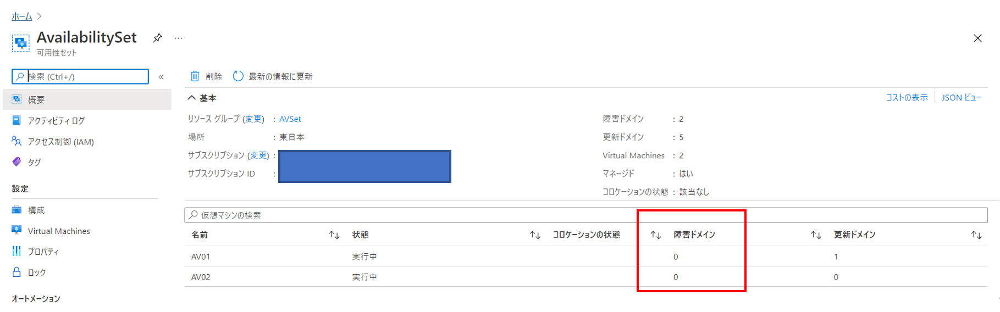
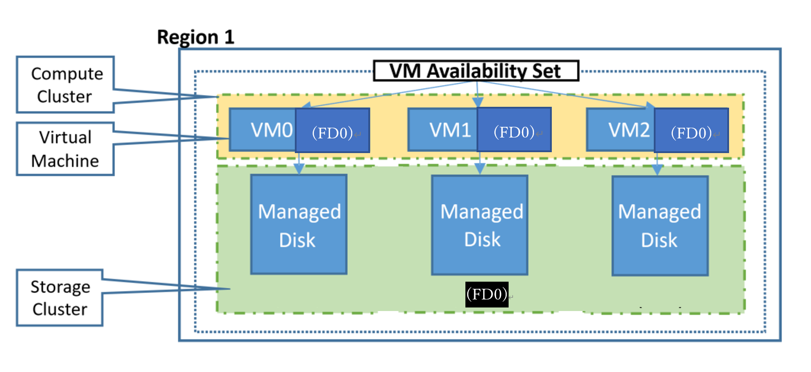
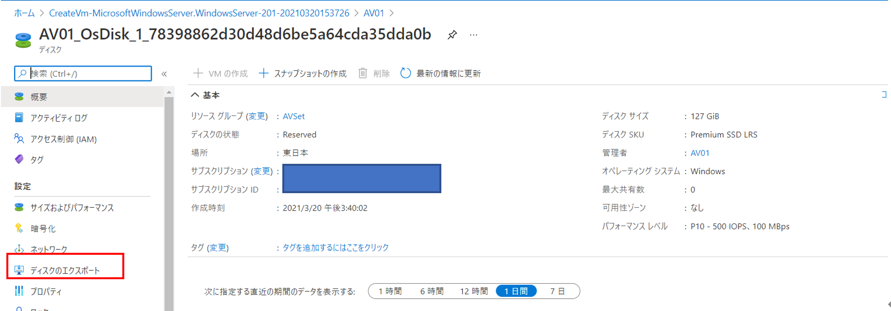
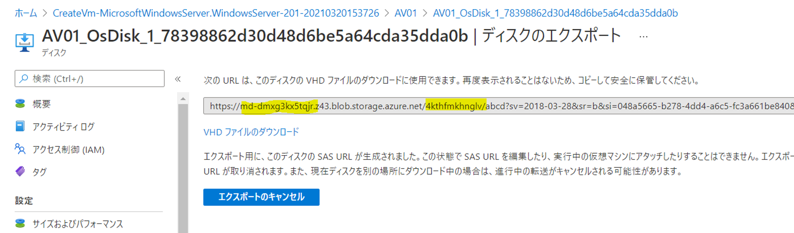
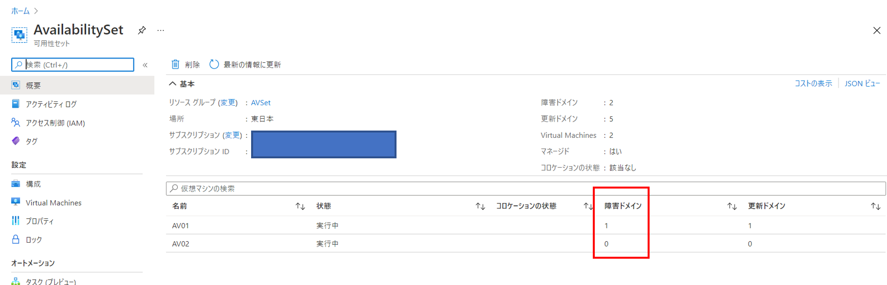
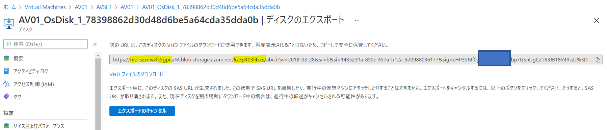

こんにちは。Azure テクニカル サポート チームの鳥越です。

先日 (2021/02/26)、Azure 弊社基盤の問題により、東日本で仮想マシンを含むストレージ サービスをご利用いただいている一部のお客様に対し、多大なるご不便をおかけすることとなりました。

> **2/26**
> **RCA - Azure Storage and dependent services - Japan East (Tracking ID PLWV-BT0)**
> 
> Azure status history
> [https://status.azure.com/en-us/status/history/](https://status.azure.com/en-us/status/history/)

<!-- more -->

上記の障害ですが、単一のストレージスケールユニット (下記、Storage Cluster) で発生した問題であり、 仮想マシンの構成として、可用性セット + 管理ディスクの構成をとることにより、可用性セット内のすべての仮想マシンが同時に障害の影響を受けることを防ぐことが可能でした。

これは、下記の図のように、Storage Cluster についても適切に障害ドメインを分ける挙動を取るためです。


※ Storage Cluster に対して FD0、FD1、FD2 として障害ドメインが分かれていることが確認可能かと存じます。

ただし、可用性セットを組む際に以下のように最初に作成した仮想マシンを、次の仮想マシンを作成する際に、事前に割り当て解除していた場合、障害ドメインが適切に分散されません。 

**1. 最初の仮想マシンをデプロイする**
**2. 最初の仮想マシンを停止 (割り当て解除) する**
**3. 次の仮想マシンをデプロイする**

この場合、更新ドメインは分かれていますが障害ドメインが同一となります。

<参考イメージ>


これを図で表すと下記のようになります。
たとえ可用性セットを構成していたとしてもストレージ レイヤの障害で可用性セット内のすべての仮想マシンに影響が発生する可能性があることをご確認いただけるとかと存じます。



そのため、障害ドメインが同一となっている仮想マシンについては障害ドメインの変更が必要となりますが、この障害ドメインは <span style="color:red;">**可用性セットに仮想マシンを作成したタイミングで自動的に割り当てられるため仮想マシン作成後に変更いただくことは叶いません。**</span>

そこで下記手順にて仮想マシンの再作成を行うことにより、障害ドメインの変更を実施いただけます。

障害ドメインが同一の状態からどのように障害ドメインを分けるか、またその結果どうなるかを含め下記に記載したいと思いますので、ご参考いただけますと幸いでございます。

1. 可用性セット内の仮想マシンで障害ドメインが同一であることを確認


2. (参考) この時に OS ディスクがどのようになっているかを確認してみましょう。
   ディスクのエクスポートを行うことで OS ディスクのストレージ アカウントとコンテナを確認することが可能です。
   (ディスクのエクスポートは事前に仮想マシンの割り当て解除が必要です)



> リンク: https://<span style="color:red;">**md-dmxg3kx5tqjr**</span>.z43.blob.storage.azure.net/<span style="color:red;">**4kthfmkhnglv**</span>/abcd?sv=2018-03-28&sr=b&si=048a5665-b278-4dd4-a6c5-fc3a661be840&sig=ssM5KVUHxxxxxxxxxxcLxGNIkbGFucF4I6qsgw%2BAW5Zw%3D

3. 以下のスクリプトを利用します。
   このスクリプトを利用することで既存のリソースを利用して仮想マシンの再作成を行うことが可能です。
   ※ このスクリプトは仮想マシンがロード バランサーに接続されているかどうかは確認されません。
   ※ もしエラー等発生いたしましたらスクリプトの改変をご検討ください。

```PowerShell
# Set variables 
    $resourceGroup = "AVSET" # Resouce Group Name 
    $vmName = "AV01"         # VM Name 
    $newAvailSetName = "AvailabilitySet" # Availability Set Name  

# Get the details of the VM to be moved to the Availability Set 
    $originalVM = Get-AzVM ` 
        -ResourceGroupName $resourceGroup ` 
        -Name $vmName 

# Create new availability set if it does not exist 
    $availSet = Get-AzAvailabilitySet ` 
        -ResourceGroupName $resourceGroup ` 
        -Name $newAvailSetName ` 
        -ErrorAction Ignore 
    if (-Not $availSet) { 
        $availSet = New-AzAvailabilitySet ` 
            -Location $originalVM.Location ` 
            -Name $newAvailSetName ` 
            -ResourceGroupName $resourceGroup ` 
            -PlatformFaultDomainCount 2 ` 
            -PlatformUpdateDomainCount 2 ` 
            -Sku Aligned 
    } 

# Remove the original VM 
    Remove-AzVM -ResourceGroupName $resourceGroup -Name $vmName     

# Create the basic configuration for the replacement VM.  
    $newVM = New-AzVMConfig ` 
        -VMName $originalVM.Name ` 
        -VMSize $originalVM.HardwareProfile.VmSize ` 
        -AvailabilitySetId $availSet.Id 

# For a Linux VM, change the last parameter from -Windows to -Linux  
# Linux の場合は一番下のパラメータを -Linux としてください。 
    Set-AzVMOSDisk ` 
        -VM $newVM -CreateOption Attach ` 
        -ManagedDiskId $originalVM.StorageProfile.OsDisk.ManagedDisk.Id ` 
        -Name $originalVM.StorageProfile.OsDisk.Name ` 
        -Windows 

# Add Data Disks 
    foreach ($disk in $originalVM.StorageProfile.DataDisks) {  
        Add-AzVMDataDisk -VM $newVM ` 
            -Name $disk.Name ` 
            -ManagedDiskId $disk.ManagedDisk.Id ` 
            -Caching $disk.Caching ` 
            -Lun $disk.Lun ` 
            -DiskSizeInGB $disk.DiskSizeGB ` 
            -CreateOption Attach 
    }

# Add NIC(s) and keep the same NIC as primary; keep the Private IP too, if it exists.  
    foreach ($nic in $originalVM.NetworkProfile.NetworkInterfaces) {     
        if ($nic.Primary -eq "True") { 
            Add-AzVMNetworkInterface ` 
                -VM $newVM ` 
                -Id $nic.Id -Primary 
        } 
        else { 
            Add-AzVMNetworkInterface ` 
                -VM $newVM ` 
                -Id $nic.Id  
        }
    } 

# Recreate the VM 
    New-AzVM ` 
       -ResourceGroupName $resourceGroup ` 
       -Location $originalVM.Location ` 
       -VM $newVM ` 
       -DisableBginfoExtension  
```

4. 可用性セット内で仮想マシンの障害ドメインが適切に分かれていることをご確認ください。



5. (参考) 障害ドメインを変更した際に、管理ディスクがどのように変わるか確認してみましょう。こちらも 2. と同様に、ディスクのエクスポートにてストレージ アカウントとコンテナを確認いただけます。



> リンク: https://<span style="color:red;">**md-szxnwvfc5gpr**</span>.z44.blob.storage.azure.net/<span style="color:red;">**kz3p403l4zcs**</span>/abcd?sv=2018-03-28&sr=b&si=1435231a-850c-457a-b12a-3d0988036177&sig=cHP3SMf0gKxxxxxxxxBmbp7GSnUgC2T63JB18V49s2c%3D

2.の時からストレージ アカウントの変更が行われたことが確認いただけます。

つまり、この結果は、障害ドメインを分けたことによりストレージ レイヤの障害ドメインが適切に分かれるようにストレージ アカウントの変更が実施されたことを意味します。
このように、適切に更新ドメイン、障害ドメインを構成することにより、Azure 基盤での問題が発生したとしても多くのケースで業務を継続いただけます。

弊社といたしましては、可能な限りAzure 基盤側でのお客様の仮想マシンへの影響を無くすように日々改善を行っておりますが、この度のような障害は大変心苦しいのですが起こり得ることがございます。
そのため、事前の備えと致しましても、また、業務継続性といった観点からも可用性ゾーン、可用性セット、管理ディスクといった構成をご検討いただけますと幸いでございます。
