こんにちは！Azure テクニカル サポート チームの高橋です。
今回は、よくお問い合わせを頂く、特定のユーザーに対して、
仮想マシンの 起動 / 停止 / 再起動 のみの操作を実行できるようにする方法について
Azure portal 上のスクリーンショット付きで設定の手順をご紹介いたします。

本手順を実施することで、特定のユーザーは仮想マシンに対して、削除等の操作を実施できなくなり、
誤って仮想マシンを削除するといった問題を事前に防ぐことができます。

<!-- more -->

---

## RBAC とは ?
Azure では、ロールベースのアクセス制御 (RBAC) という機能を使用し、
アクセスできるリソースを制限や、リソースへの操作を制限することが可能となります。
Azure には複数の組み込みロールのご用意がありますが、
独自のカスタムロールを作成することで、必要最低限のリソースへの操作を許可することができます。

>  □ 参考 : Azure ロールベースのアクセス制御 (Azure RBAC) とは
>    https://docs.microsoft.com/ja-jp/azure/role-based-access-control/overview
>
>  □ 参考 : Azure 組み込みロール
>    https://docs.microsoft.com/ja-jp/azure/role-based-access-control/built-in-roles

> [!IMPORTANT]
> ※カスタムロールを作成するには、所有者やユーザー アクセス管理者など、カスタム ロールを作成するための権限を持つユーザーでの操作が必要となります。

---

## 必要な権限について

仮想マシンの起動 / 停止 / 再起動の操作を行うために最低限必要なリソースプロバイダ (操作項目) は、次の4つです。

> [!NOTE]
> "Microsoft.Compute/virtualMachines/read"                // 仮想マシンのプロパティを取得します
> "Microsoft.Compute/virtualMachines/start/action"        // 仮想マシンを起動します
> "Microsoft.Compute/virtualMachines/deallocate/action"   // 仮想マシンを電源オフにし、コンピューティング リソースを解放します。
> "Microsoft.Compute/virtualMachines/restart/action"      // 仮想マシンを再起動します。

リソースプロバイダを追加したい際には、下記の公開ドキュメントから
ご要望のリソースプロバイダを追加頂くことも可能です。

>  □ 参考 : Azure リソース プロバイダーの操作
>    https://docs.microsoft.com/ja-jp/azure/role-based-access-control/resource-provider-operations#microsoftcompute

---

## カスタムロールを作成する手順

1. Azure portal から、カスタム ロールを割り当て可能にするサブスクリプションを開き、
   "アクセス制御 (IAM)" から [+ 追加] をクリックし、[カスタムロールの追加] を選択します。

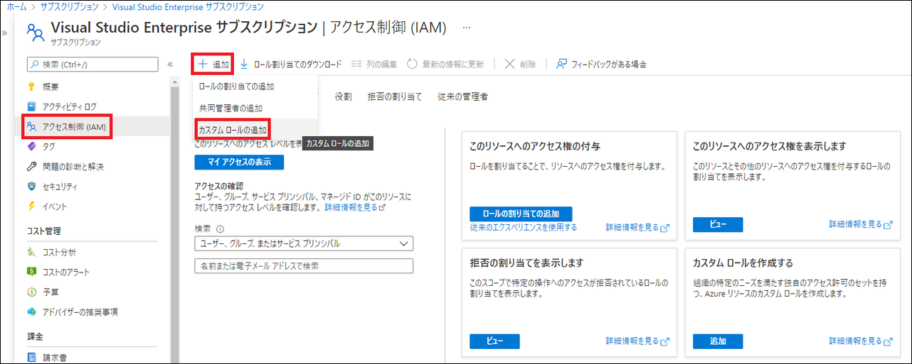

1. 任意のカスタムロール名を入力し、必要に応じてカスタムロールの説明を入力します。
   ここでは、testrole というカスタムロール名で作成します。

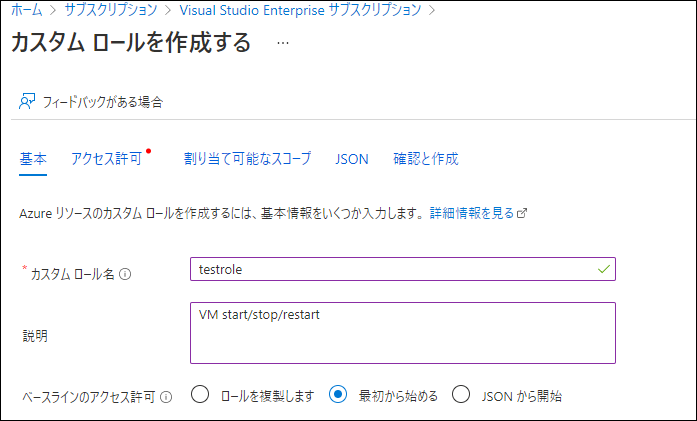

3. アクセス許可のタブへ移動し、[アクセス許可の追加] を選択します。

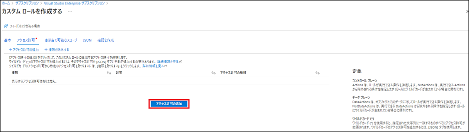

4. 下記のような、画面に移りますので、"アクセス許可を検索してください" に許可したいリソースプロバイダを入力してください。

5. "Microsoft.Compute/virtualMachines/read" を入力すると、対象のアクセス許可が表示されますので、
チェックを入れ、[追加] を選択します。

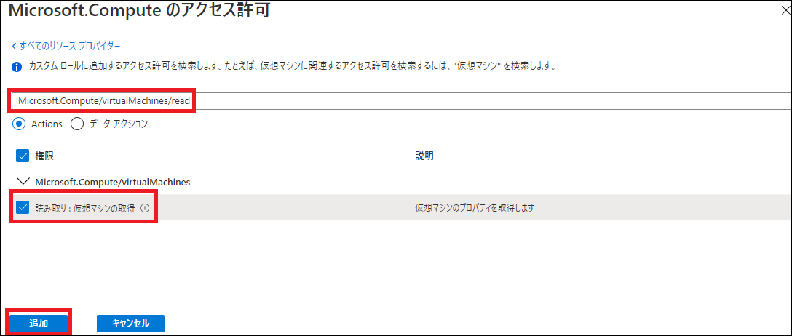

6. 同様の手順で、残りの 3 つの権限も追加します。

> "Microsoft.Compute/virtualMachines/start/action"
> "Microsoft.Compute/virtualMachines/deallocate/action"
> "Microsoft.Compute/virtualMachines/restart/action"

7. 下記の通り、4 つアクセス許可が追加されたことが確認できます。

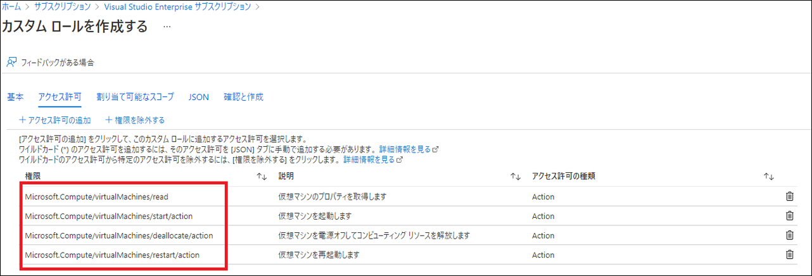

8. [JSON] のタブから、JSON 形式でも、アクセス許可を編集することが可能になります。

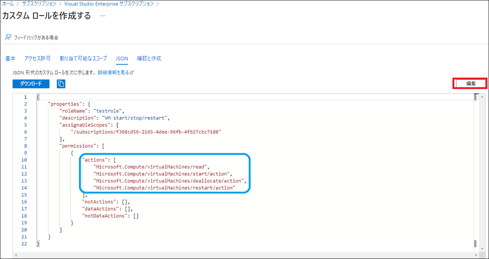

9. アクセス許可を追加したあとは、カスタムロールを作成します。

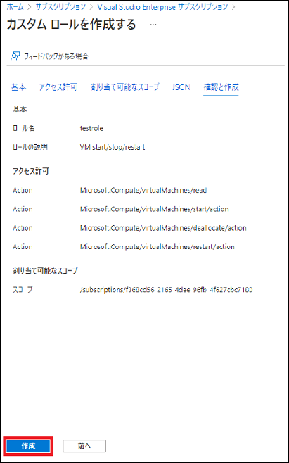

これで、カスタムロールの作成が完了です。
> [!NOTE]
> カスタムロールの作成後、反映には、数分かかる場合がございます。

---

## カスタムロールをユーザーに割り当てる

次は、特定のユーザーに対して、カスタムロールを割り当てていきます。

1. カスタム ロールを割り当て可能にするサブスクリプションを開き、"アクセス制御 (IAM)" から
   [+ 追加] をクリックし、[ロールの割り当ての追加] を選択します。

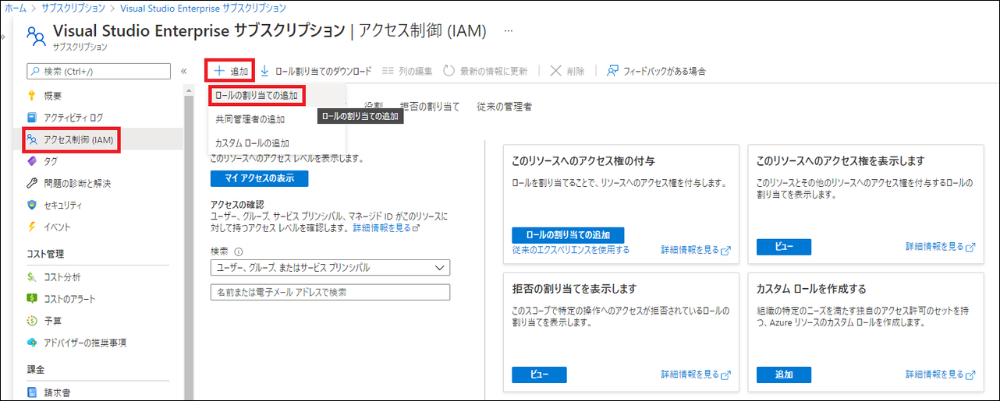

2. [ロールの割り当ての追加] に、登録されているすべてのロールが表示されますので、
   作成したカスタムロールを選択します。

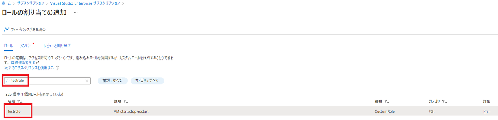

3. [メンバー] のタブから、[+ メンバーを選択する] を選択します。
   画面右端に、カスタムロールを割り当てたい特定のユーザーを選択します。
   ここでは、testuser という特定のユーザーを選択します。
   (グループを選択することも可能です。)

4. ロールの割り当てに問題がなければ、"レビューと割り当て" を選択します。

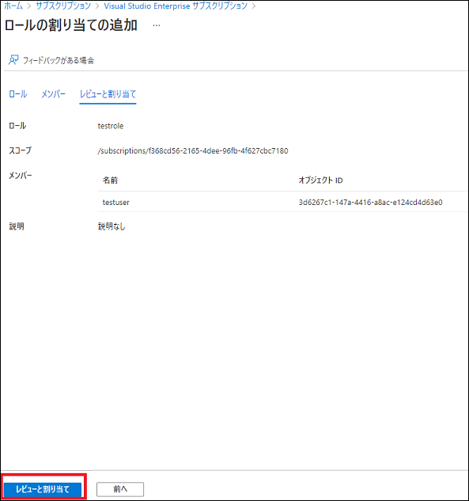

5. しばらくすると、ロールの割り当てが追加されます。

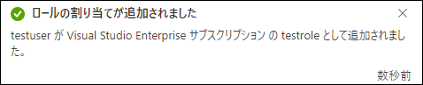

これで、特定のユーザーに対して、仮想マシンの起動 / 停止 / 再起動が許可されました。
それでは、testuser で、Azure portal へログインし、仮想マシンが起動できるか確認します。
下記の通り、無事に仮想マシンの起動ができました。

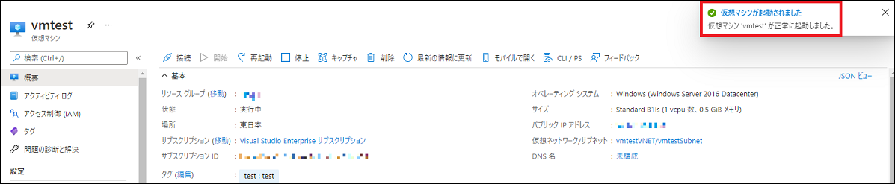

testuser は、仮想マシンの起動 / 停止 / 再起動の操作が許可されています。
そのため、仮想マシンの削除を実施しようとすると、下記画像のように
権限エラーとなり仮想マシンの削除は実施できなくなります。

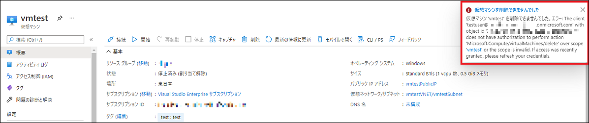

> [!TIP]
> ※カスタムロールの設定が反映されていない場合には、一度 Azure portal からログアウトし、再度ログインをお試しください。

カスタムロールの作成方法につきましては、下記の公式ドキュメントにもございます。

>  □ 参考：Azure portal を使用して Azure カスタム ロールを作成または更新する
>     https://docs.microsoft.com/ja-jp/azure/role-based-access-control/custom-roles-portal

---

## 補足情報

RBAC の権限付与は、管理グループ、サブスクリプション、リソースグループ、リソース
いずれかのスコープに対して適用することが可能となります。
今回、サブスクリプションをスコープとしたカスタムロールを割り当てたため、
サブスクリプション内に存在する全ての仮想マシンに対して同様の操作が実施可能になります。

特定の複数の仮想マシンに対して権限付与をしたい場合には、
対象の仮想マシンが所属するリソースグループや
仮想マシンひとつひとつに対して権限付与を行っていただくことが可能になります。
（親スコープに設定された権限は、子スコープに継承されます。）

>  □ 参考 : Azure RBAC のスコープについて
>    https://docs.microsoft.com/ja-jp/azure/role-based-access-control/scope-overview

本稿が皆様のお役に立てれば幸いです。

