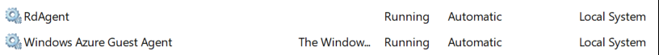
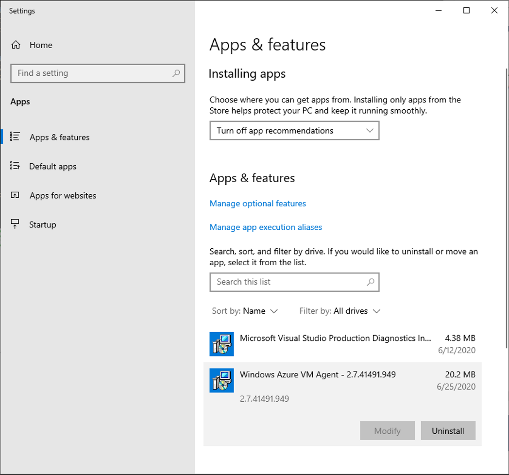
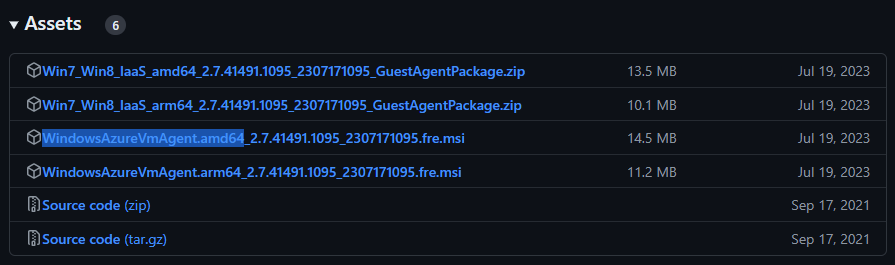

こんにちは、Azure テクニカル サポート チームの富田です。

お問い合わせでご案内する頻度が多い、Windows ゲスト エージェント (WinGA) の再インストール方法をご案内いたします。
WinGA が正常に動作しなくなった場合に再インストールを行うことで正常動作に戻ることが多くあります。

手順としては下記画像の 2 つのサービスを一旦削除し、インストールを行うシナリオとなります。  

 

> [!TIP]
> 以前は WindowsAzureTelemetryService というサービスも稼働しておりましたが、バージョン 2.7.41491.971 から、WindowsAzureTelemetryService は RdAgent に統合されております。
 
## 再インストール方法

1. 現在の WinGA をアンインストールします。  
    
    手動で WinGA をインストールしていた場合は、以下の手順でアンインストールをします。
    スタートを右クリックして、「Apps and Features」を選択します。  
    下記のように「Windows Azure VM Agent」がインストールされている場合は「Uninstall」を選択してください。

     

    WinGAが最初からインストールされているイメージを使用した際は、「Windows Azure VM Agent」の表示はありませんのでこの操作は不要です。

1. 管理者権限でコマンドプロンプトを起動します。

1. 下記のコマンドでサービスを停止します。

    なお、既に停止していた場合は実施不要となります。  
    もしサービスが停止できない場合は、スタート メニューより [サービス] を検索 → 対象のサービスを右クリック → [プロパティ] → スタートアップの種類を [手動] に設定して VM を再起動してから再試行してください。  

    ```CMD
    net stop rdagent
    net stop WindowsAzureGuestAgent
    ```

1. 下記コマンドでサービスの削除を行います。

    ```CMD
    sc delete rdagent
    sc delete WindowsAzureGuestAgent
    ```

1. インストール前に古いログ等のファイルの移動を行います。  
    
    "C:\WindowsAzure" 内に "OLD" というフォルダを作成します。  
    "C:\WindowsAzure" 内に "Packages" または "GuestAgent" で始まるフォルダがあった場合は、作成した "OLD" フォルダに移動させてください。

1. 下記リンクより最新のインストーラーをダウンロードします。  

    [https://github.com/Azure/WindowsVMAgent/releases](https://github.com/Azure/WindowsVMAgent/releases)
    
    最新バージョンの Assets より MSI をダウンロードします。  
    通常は amd64 の表記のある MSI をご利用ください。  
    もし、ARM64 プロセッサをご利用の場合は arm64 の方をご利用くださいませ。

    

1. インストールを行います。
    
    通常はダウンロードしたインストーラーを実行いただく形で問題ございません。

    もし、インストールに失敗するといったことなどがございましたら、以下の手順でインストールを行い、必要に応じて出力された "C:\VMAgentMSI\msiexec.log" の内容を参照してください。  

    ダウンロードしたインストーラーを "C:\VMAgentMSI" に配置し、下記コマンドでインストールを実行します。  
    \<インストーラーファイル名\> はインストーラーのファイル名に合わせて書き換えて実行してください。  
    
    ```CMD
    msiexec.exe /i c:\VMAgentMSI\<インストーラーファイル名> /quiet /L*v c:\VMAgentMSI\msiexec.log
    ```

1. これにてWinGAの再インストールは完了となります。  
    
    なお、サービスが起動するまでに 1,2 分程度かかる場合がございます。  
