こんにちは、Azure テクニカル サポート チームの藤澤です。 
 
Azure VM のいくつかの設定項目は、VM 作成後は変更いただくことが叶いませんが、OS / データディスクを保持したまま、VM を再作成いただくことで再作成時に変更することが可能でございます。 
本記事では、通常変更不可である設定項目を、VM を再作成で変更する手順についてご案内します。 

<!-- more -->

---

## ■再作成が必要となるシナリオ一覧紹介

以下の項目を変更したい場合、VM の再作成が必要となっております。 

 - 可用性ゾーンの変更 / 追加 / 削除 
 - 可用性セットの変更 / 追加 / 削除 
 - Spot VM 設定の有効 / 無効 の変更 
 - Windows VM に対し、一時ディスク有りの VM サイズから一時ディスク無しの VM へサイズ変更（また、その逆） 
 - VM リソース名称の変更 
 - VM の接続先 VNet の変更

> [!TIP]
> 可用性ゾーンの追加や変更の場合は、他の方法として以下のドキュメントの手順もご用意されましたため、参考として記載させていただきます。  
>  
> ■ご参考：可用性ゾーンのサポートを設定する
> https://learn.microsoft.com/ja-jp/azure/reliability/reliability-virtual-machines#configure-availability-zone-support
>   
> ■ご参考：Azure 仮想マシンを可用性ゾーンに移動する  
> https://learn.microsoft.com/ja-jp/azure/site-recovery/move-azure-vms-avset-azone  

---

## ポータルで VM 再作成を行う手順 

それでは、実際に VM 再作成で各項目を変更するための手順について説明させていただきます。 

### 1. 必要事項を控える

 まずは、VM 再作成時に再度同じ設定をするために Azure ポータルの対象 VM の画面を開き、赤枠の項目を控えます。 
 多くの項目がございますが、代表的なものについて説明させていただきますので、以下の通り設定値を控えておきましょう。 

 #### a. 概要メニュー

 - リソースグループ名 
 - 場所 
 - サイズ 
 - 仮想ネットワーク / サブネット 
 - 可用性とスケーリング 

 

 #### b. ネットワークメニュー

 元の NIC を用いるかどうかによって、以下の 2 パターンに分けられます。  
 VM に設定されているプライベート IP アドレスおよびパブリック IP アドレスを保持した形で再利用したい場合は、IP の設定が紐づいている元の NIC を用いる必要があるので b-1 の手順をご参照ください。  
 元の NIC を再利用する場合は、紐づいている NSG や DNS の設定も引き継げます。  
  
 VM 再作成時は Azure Portal にて既存 NIC を指定できませんが、VM 再作成後に後から NIC を付け替えることが可能です。  
 ご希望のシナリオに合わせたパターンをご利用ください。  

 **b-1. 元の NIC を用いて新しい仮想マシンを作成する場合**

まず、プライベート IP アドレスが動的に変更されないようにしたい場合は、IP を静的に変更をします。  
VM に接続されている NIC の画面より、IP 構成メニューからプライベート IP アドレスを静的に変更してください。  
既に静的に設定されている場合は設定不要となります。  

 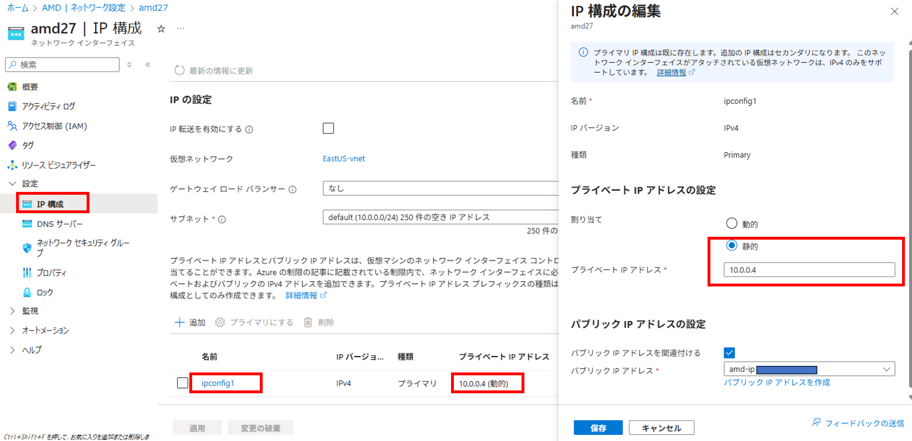

また、NIC を再利用するために NIC 名を控えておきましょう。  
  
- ネットワーク設定メニュー
  - NIC名 (元のNICが複数ある場合はすべて控える) 
   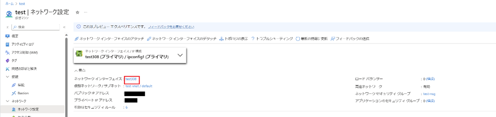

 **b-2. 新しい仮想マシンを作成する際に、元の NIC を使用しない場合**

- ネットワーク設定メニュー
  - NIC に設定されている NSG 名
   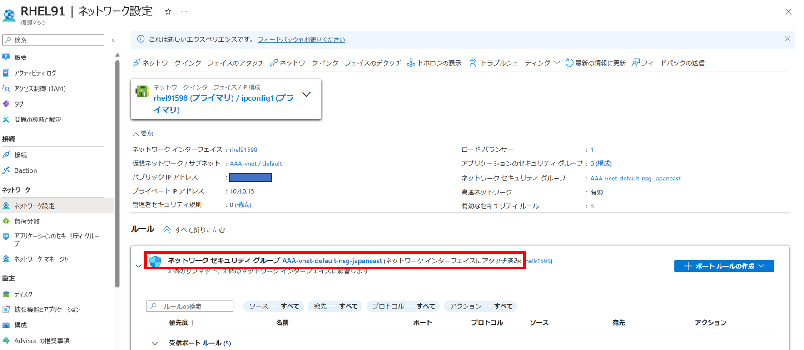

- 負荷分散メニュー
  - 負荷分散の設定 
   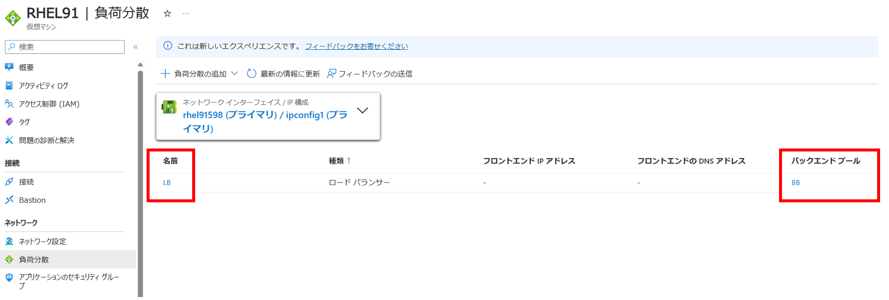

- DNSメニュー

 #### c. ディスクメニュー

- ディスクメニュー
  - 各ディスク名 
  - 各ディスクのホストキャッシュ設定
   

これで、再作成のための情報を控えることができました。
 
---

### 2.スナップショットからゾーン設定を変更したディスク作成（可用性ゾーンの設定変更のシナリオの場合のみ実施） 

>[!NOTE]
>この手順は**以下のシナリオに該当する場合のみ**実施が必要となります。 
>該当しない場合は、後述の「3. 元の仮想マシンを削除する」の手順に進んでいただいて問題ございません。

 **【該当シナリオ】**
 - もともと可用性ゾーンを使っており、今回可用性ゾーンに関する設定変更を行う
   - 例：ゾーン番号の変更・可用性ゾーンから可用性セットへの切り替え・可用性ゾーンをやめる
 - 可用性ゾーンを使っていなかったが、今回可用性ゾーンを使用するように変更する
 
 上記シナリオの場合は、そのゾーン設定に対応するディスクを作成する必要があります。 
 理由としては、以下の例のように特定のゾーン対応に存在しないディスクから、そのゾーン以外の VM を作成しようとすると、以下のような警告メッセージが表示され、VM 再作成ができないからとなります。 

 

 ### 2-1. 元の仮想マシンの OS ディスクのスナップショットを取る

  a. Azure ポータルより [Virtual Machines] - [<当該 VM 名>] を開きます。 

  b. 左メニュー “設定” より [ディスク] を選択し、開いた画面 “OS ディスク” より [<当該 OS ディスク名>] をクリックします。
  
  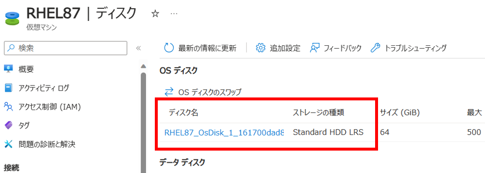

  c. 画面の [+ スナップショットの作成] をクリックします。

  

  d. 必要項目を適宜入力し、[確認および作成] - [作成] をクリックします。 
  [ストレージの種類] は、スナップショットを高パフォーマンスのディスクに保存する必要がある場合を除き、 [Standard HDD(ローカル冗長ストレージ)] を選択します。 

  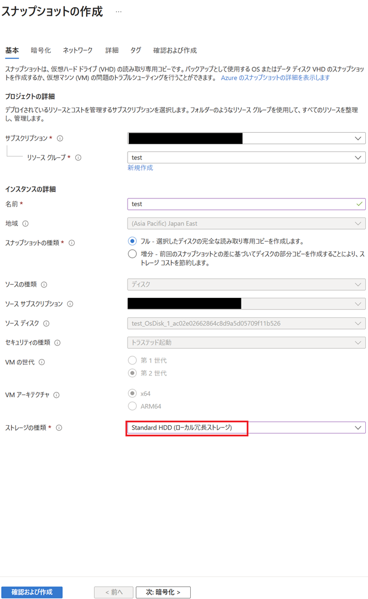

  e. データディスクがある場合、データディスクについても同様にスナップショットを作成します。 

  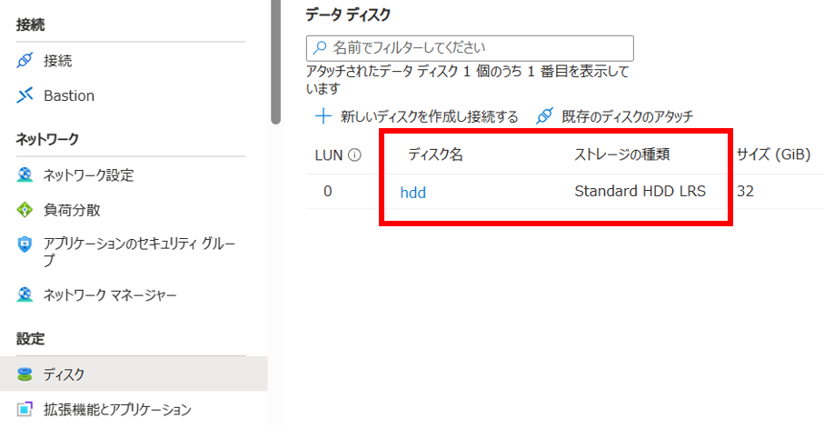

 ### 2-2. スナップショットからディスクを作成する際に可用性ゾーン/可用性セットを変更する

  a. Azure ポータル 上部の検索バーに “スナップショット” と入力し、サービス [スナップショット] を選択します。 
  上記手順で作成した OS ディスクおよび、データ ディスクのスナップショットが作成されていることを確認します。 

  

  b. 対象ディスクのスナップショットを選択し、[+ ディスクの作成] をクリックします 

  

  c. 必要項目を適宜入力し、[確認および作成] - [作成] をクリックします。 
  特定の可用性ゾーンに所属させたい場合は、以下のように可用性ゾーン番号をご指定ください。 
  それ以外の場合は [インフラストラクチャ冗長は必要ありません] を選択します。 

  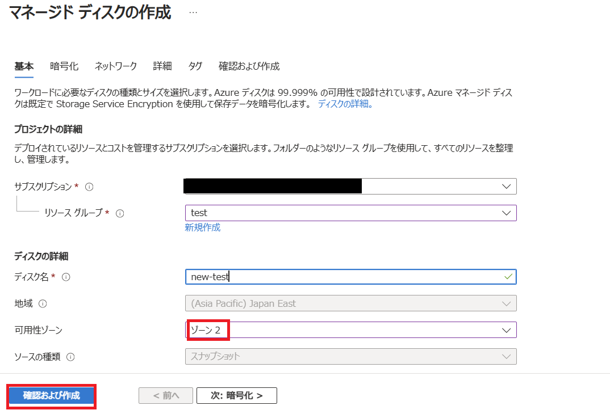

これにより、特定のゾーンに所属するディスク（もしくは、ゾーン設定の無いディスク）を用意することが出来ました。 
この作成したディスク名は VM 再作成時に使用しますので、控えておいてください。 

---

### 3. 元の仮想マシンを削除する 

 元の仮想マシンを削除します。 

 なお、この際にディスク等のリソースは残しますので、データが消失するものでは無い点はご安心ください。 
 一時ディスクの内容は破棄されます点はご承知おきくださいませ。
 
 a. 対象の仮想マシンの概要上部にある「削除」をクリック 
 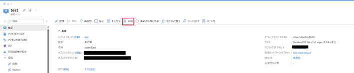

 b. 以下赤枠内にチェックを入れないように気を付けて削除してください 
 

これでディスクを残したまま、仮想マシンのリソースを削除できました。 

---
 
### 4. 元の仮想マシンの OS ディスクから新規仮想マシンを作成する際に変更したい項目を変更する 

残されたディスクから VM を再作成します。  
VM 再作成時にお好みの設定に変更が可能となっております。  

 a. Azure ポータルより削除した VM で使用していた OS ディスク (控えていた OS ディスク名を参照) の画面を開きます。  
 なお、ゾーンに関する設定変更を行う場合は **「2.スナップショットからゾーン設定を変更したディスク作成（可用性ゾーンの設定変更のシナリオの場合のみ実施）」** の手順で作成したディスクを代わりに選択します。

 b. [VM の作成] をクリックします。 

 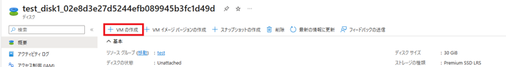

 c. 手順 **「1. 必要事項を控える」** にて控えていた内容をもとに VM の設定項目を入力していきます。 
 この際、変更を行いたい項目をご変更くださいませ。 

  - リソース名を変更したい場合 

    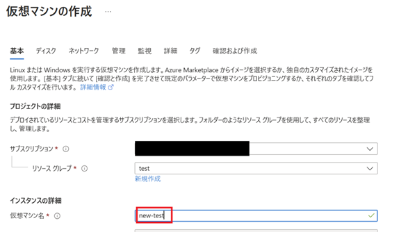

  - データディスクを追加したい場合 

    元の仮想マシンのデータディスクを追加したい場合は、[既存のディスクの接続] より追加します。 

    

    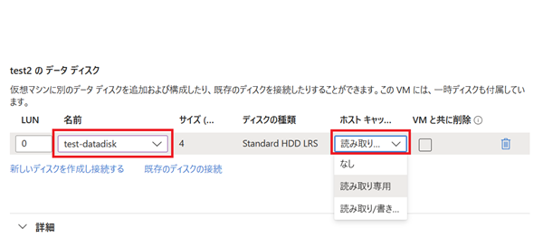

  -  新しい仮想マシンで可用性セットを使用したい場合

     [可用性オプション] にて [可用性セット] を選択し、[可用性セット] の項目にてご希望の障害ドメイン、更新ドメイン数を入力ください。 

     

  -  新しい仮想マシンで可用性ゾーンを使用したい場合 

     [可用性オプション]の項目で[可用性ゾーン] を選択し、[可用性ゾーン] の項目では、スナップショットからディスクを作成する際に指定したゾーン番号を選択します。  

     

  -  Azure Spot 割引を変更したい場合 

     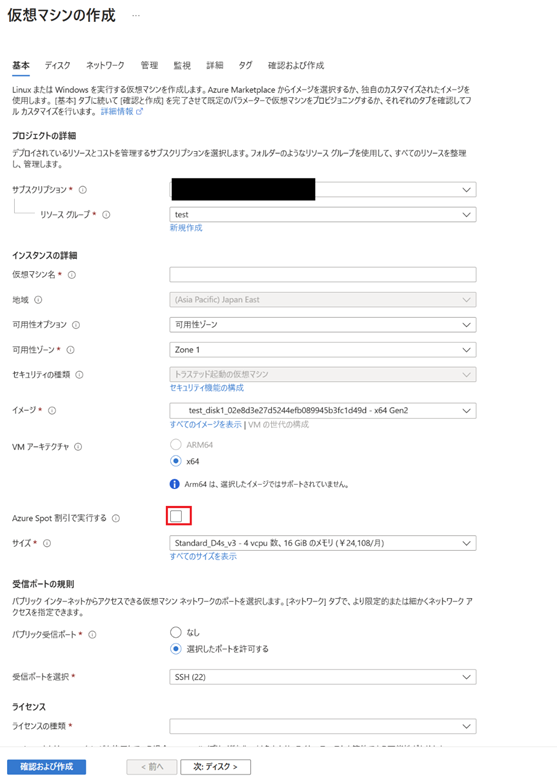

  -  接続先 VNET を変更したい場合 

   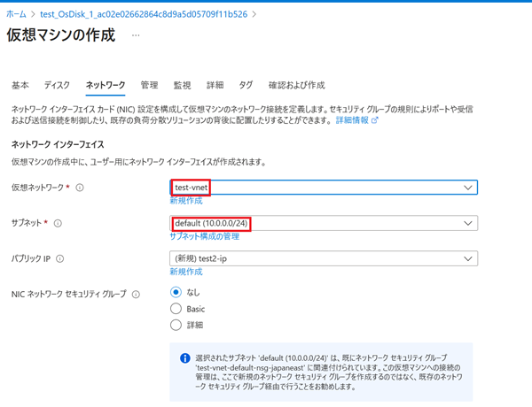

>[!NOTE]
>ネットワークについて、既存の NIC 接続は VM 作成後に行いますので、既存 NIC を使用する場合、この段階での “NIC ネットワーク セキュリティ グループ” の設定は不要です。  

 d.全ての設定が完了後、 [確認および作成] から[作成] をクリックします。  

 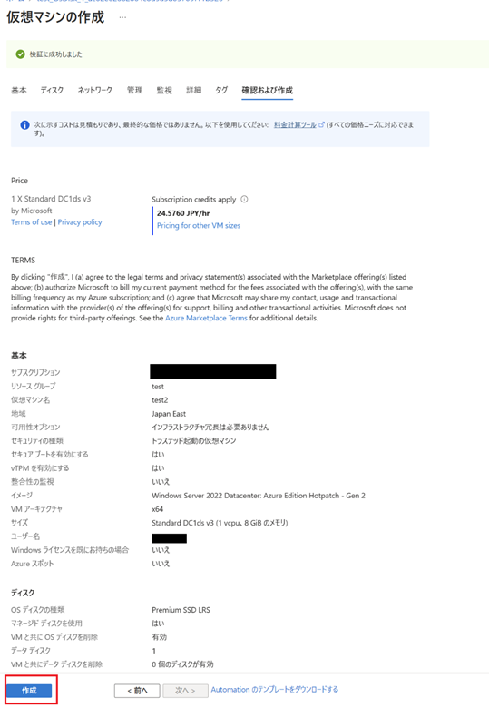

---

### オプション： NIC の付け替え

  Azure ポータルより VM 作成をする際には既存 NIC を指定できませんが、 VM 再作成後に後から NIC を付け替えることが可能です。
  VM に設定されているプライベート IP アドレスおよびパブリック IP アドレスを保持した形で再利用したい場合などは、以下の手順で既存の NIC を付け替えてください。

  a. 仮想マシンを作成後、既存の NIC を接続するため、VM を停止 (割り当て解除) します。

  b. VM 停止 (割り当て解除) 後、VM のページから [ネットワーク] - ネットワーク設定 - [ネットワーク インターフェイスのアタッチ] を選択し、削除した VM で使用していた NIC を接続します。 

  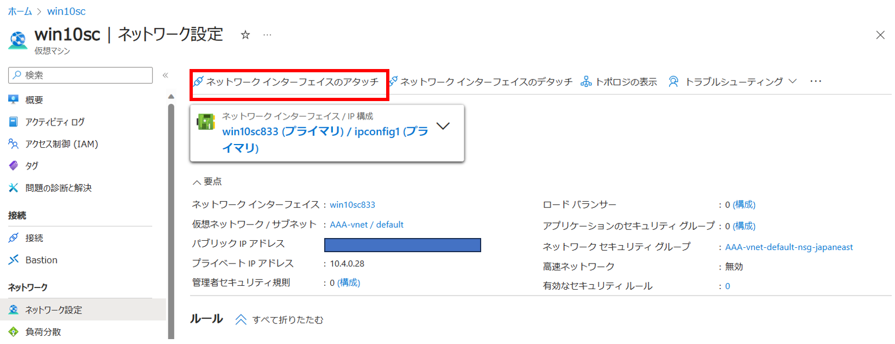

  

  c. 既存の NIC の接続完了後も、VM 作成時に作成された NIC がまだプライマリとなっている状態なので、[ネットワーク インターフェイスのデタッチ] を選択し、その NIC をデタッチします。 

  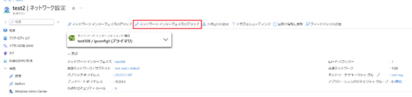

  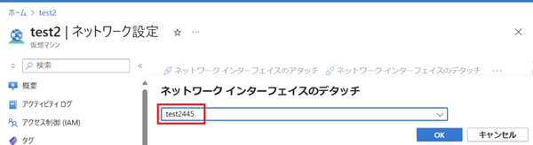

  NIC のデタッチを実施後、セカンダリとして接続した既存 NIC は自動的にプライマリとなります。 
  なお、デタッチした NIC については削除されても問題ありません。 

  d. VM を起動します。 

---

手順は以上となります。本記事が皆様のお役に立ちましたら幸いです。
